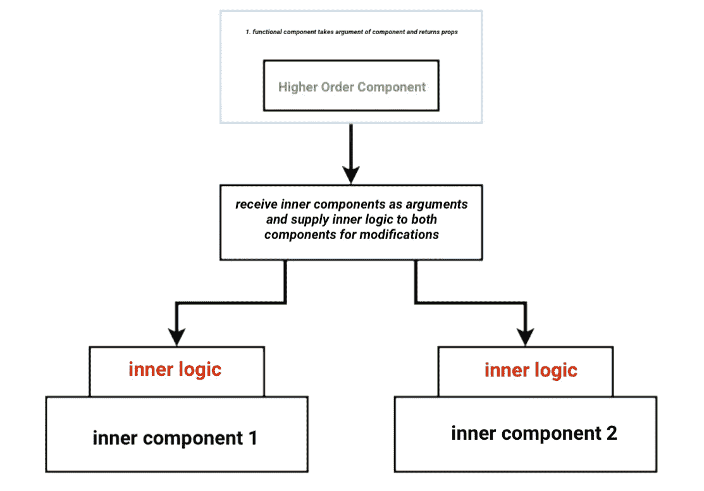
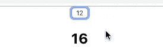
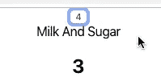

# 高阶组件平稳运行

> 原文：<https://betterprogramming.pub/smooth-sailing-with-higher-order-components-4c6263d45fd>

## 它们是什么，它们如何为你工作？


鲍比·伯奇在 [Unsplash](https://unsplash.com/s/photos/boat?utm_source=unsplash&utm_medium=referral&utm_content=creditCopyText) 上的照片

下面的文档提供了定义高阶组件的流畅概述和清晰示例，并展示了它们如何在 2020 年保持和增强 JavaScript 代码性能。

[现场视频](https://youtu.be/UcH2oLseKuc)和[源代码](https://github.com/01Clarian/Higher-Order-Components-Example)。

请注意:以下演示假设您对 React 有基本的了解，包括功能性组件与基于类的组件，以及命令提示符下的节点包管理器([NPM](https://www.npmjs.com/))(Mac 终端)。

# 定义高阶组件模式

*   理论定义:高阶组件，作为一个理论概念，在 React 中作为一种高级模式来重构组件逻辑，并在应用程序的代码中产生有益的结果。
*   实用定义:hoc 是*外部*功能组件，包裹*内部*组件以修改或增强内部组件。
*   用例:通过在多个组件中识别相似的代码逻辑，hoc 减少了逻辑开销，并删除了多余的 JavaScript 功能。

# 高阶模式和函数式编程



Clarian 的特殊类型输入

在 React 中，高阶组件是将一个*原始组件*作为其参数的组件，并提供一个内部具有可扩展逻辑的新组件。

许多第三方库实现了这种模式， [Redux](https://redux.js.org/) 的`connect()`就是一个流行的例子。

```
export default **connect**(mapStateToProps)(App);
```

`connect()`是一个特设函数，它包装了一个 React 组件(app)来提供对 Redux 存储的访问。这将修改 React 组件，以便它可以从 Redux 接收动态状态和调度操作。

在某种意义上，高阶组件有助于函数式编程方法，例如避免共享状态**。**

# 对比和评估

比较高阶函数和高阶分量，观察`Filter()`方法。

`Filter()`方法参数是一个回调函数，它测试数组中的每个元素并返回为真的元素。在下面的例子中，数组`colors` 包含各种字符串。

```
const colors = ['blue', 'white', 'green', 'black', 'yellow'];colors.filter(**functionArgument** => **functionArgument**[0] == "b");//(2) ["blue", "black"]
```

然后，filter 方法检查并只返回以字母“b”开头的字符串。通过将回调函数参数的第一个字符串值设置为等于“b”，高阶函数返回“蓝色”和“黑色”，从而成功完成其任务。

类似于高阶函数可以通过把其他函数作为参数并返回来操作其他函数，高阶组件可以通过把其他组件作为参数并传递道具来操作其他组件。

下一节评估一个 React 示例，以进一步阐明这种设计模式。

# 特殊反应示例

## *识别特设实施*

观察下面的应用程序，它由两个基本组件组成，一个点击计数器和一个悬停计数器。

在这个基本的应用程序示例中，点击计数器组件将递增按钮元素的事件，而悬停计数器组件将递增鼠标悬停事件的标题标签。



下面是点击计数器的代码文件，通过构造函数将状态动态设置为基于类的组件:

简而言之，count 的状态在构造函数中被设置并初始化为零。一个递增函数被设置为按钮元素中的一个`onClick`事件，它每点击一次就将先前的计数状态递增一。

“渲染析构状态”关闭并渲染 JSX，然后返回包含计数状态显示的按钮。

虽然在浏览器上测试时，这些简单明了的代码执行起来有预期的结果，但是 HOC 的焦点集中在组件的逻辑构建上(特别是这个例子中的状态)。

为了进一步检查`ClickCounter.jsx`中的逻辑，通过观察应用程序的第二个组件的文件代码`HoverCounter.jsx`来比较逻辑。

悬停计数器组件也在其构造函数中将计数状态初始化为零的数值。它还建立了一个递增函数，将计数器的先前状态递增 1，直到发生悬停事件`onMouseOver`。

同样，当在浏览器中测试时，该组件以预期的结果执行，并且应用程序相应地与点击计数器和悬停计数器一起运行。

当比较悬停计数器和点击计数器组件中的计数逻辑时，显而易见的是，不考虑触发更新状态函数的事件方法，增量状态逻辑在两个组件中几乎是相同的。

```
constructor() { super() this.state = { count: 0}}increment = () => { this.setState(prevState => { return {count: prevState.count + 1}})}
```

如下一个代码示例所示，在这个应用程序示例中引入一个更高阶的组件减少了整体代码逻辑，实现了进一步增长潜力的可扩展性，并建立了增强的整体功能执行控制。

# 特设框架和示例实现

既然已经确定了一个可能的特设模式实现，下面的代码文件`EnhanceComponent.js`、**、**将一个更高阶的组件框架引入到我们的应用程序中。

它还从/或计数器组件中取出复制的增量逻辑代码，如下所示。

回顾上面的代码，高阶组件以`EnhanceComponent`为名，因为它的目标是增强/修改点击和悬停组件。

`EnhanceComponent`的参数**，** origin 组件，适用于点击和悬停组件。接下来，它为一个基于类的组件设置状态，名为`ModComponent`(用于修改)。

```
... const **EnhanceComponent** = (**OrignComponent**) => {class **ModComponent** extends React.Component { ...
```

然后，`ModComponent`处理状态计数逻辑，并用从悬停和点击组件中看到和复制的增量函数设置状态。

最后，HOC `ModComponent`渲染原始组件，从`ModComponent`获得道具访问。

从理论上讲，现在无论特设包装了什么，都可以访问包含计数器增量逻辑的`ModComponent`状态。

注意代码中`OriginComponent`如何将道具`name`设置为字符串`‘milk and Sugar’`。

```
increment={this.increment} **name**='Milk And Sugar'
```

由于本文档的作者喜欢喝咖啡，所以提供了以下咖啡类比。

# 特设咖啡杯模拟和实施

通过在弦`milk and sugar`上设置一个道具`name`，观察以下与生活相关的类比和测试演示。

考虑点击组件和悬停组件各自表示在咖啡馆倒的一杯咖啡。想象一下，每个顾客都要糖，收银员不得不伸手到柜台后面拿糖罐给每个顾客分发糖。

由于逻辑在本质上是重复的，为了节省收银员重复倒糖这一单调任务的时间，咖啡馆为顾客设置了一张糖和牛奶的桌子。

然而，咖啡馆老板不会告诉收银员将糖倒入咖啡机中，因为这将使咖啡不再纯净，并给只想喝无糖咖啡的顾客带来麻烦。

从这个意义上说，糖和牛奶的桌子就像是每一杯咖啡的附属品。每一杯咖啡代表一个组件——悬停计数器组件和点击计数器组件。

这样，咖啡就保持了纯粹的功能和目的，仅仅是一杯咖啡，而收银员则负责收银工作。

牛奶和糖的桌子增强了选择喝咖啡的顾客的咖啡体验，因此创造了可扩展性和更纯粹和结构化的整体咖啡体验。

回到`ClickCounter.jsx` 文件，导入`EnhanceComponent`并将其包装在`ClickCounter`组件上，提供了对`‘milk and sugar’`字符串属性的访问。

```
import EnhanceComponent from './EnhanceComponent' ...export default **EnhanceComponent(ClickCounter);**
```

`EnhanceComponent`环绕`ClickCounter`，为其提供道具的通路。当将`{this.props.name}`应用到`ClickCounter`的渲染时，这在浏览器中反映出来。



`ClickCounter`成功接收浏览器中显示为`Milk and Sugar`的道具。

# 即席实现和重构

如下面的代码示例所示，为了最终实现特设模式，`ClickCounter`和`HoverCounter`组件都重构了状态，并重新连接它们的呈现以接收特设状态逻辑。

ClickCounter.jsx 已重构

HoverCounter.jsx 已重构

# 结论

`HoverCounter`和`ClickCounter`组件都根据各自的功能目的减少和缩小了它们的代码，遵循特设模式实现。

逻辑和状态增量现在由封装两个组件的特设`EnhanceComponent`处理。

类似于在咖啡杯类比中，如果咖啡馆将不同类型的咖啡添加到他们的菜单中，牛奶和糖将保留在桌子上，并且将在需要时被实现，从而使得咖啡杯纯净，并且系统结构可扩展用于增长。

在应用程序示例中，如果要用计数器逻辑用例添加更多的组件，由于有了特设模式，就可以处理这些组件，而不必一遍又一遍地重复那个逻辑。

逻辑在特设中维护，围绕特定目标的任何组件包装，坚持函数式编程纯路线图。

仅此而已。感谢检查这个例子和 HOCs 的解释。如果您有任何问题或意见，请随时在下面留下。

视频演示和完整的源代码示例可以在这篇文章的顶部找到，并且不要忘记查看 [React 文档](https://reactjs.org/docs/higher-order-components.htm)进行更深入的研究。