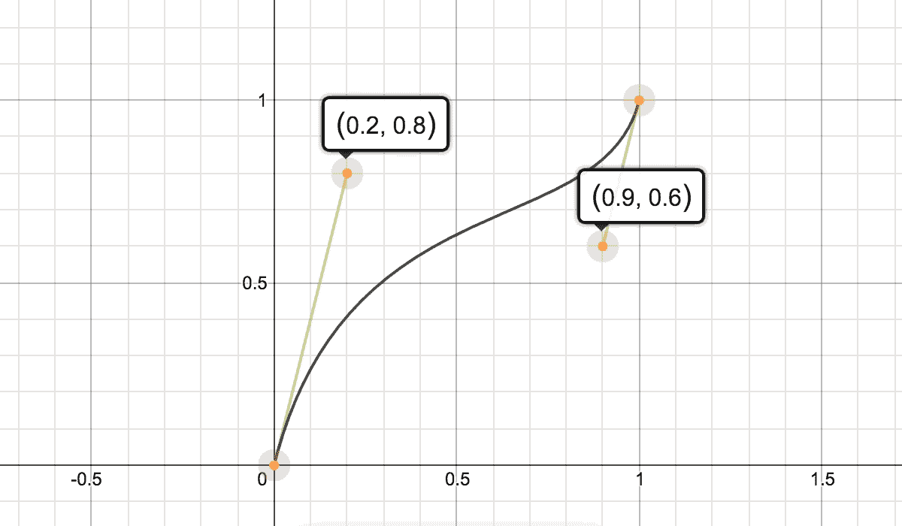

# 用 JavaScript 实现平滑滚动

> 原文：<https://betterprogramming.pub/smooth-scrolling-with-javascript-a4cd787e447f>

## 从头开始创建库的技术视角


照片由 [Damon Lam](https://unsplash.com/photos/5-ckoJTWhrc?utm_source=unsplash&utm_medium=referral&utm_content=creditCopyText) 在 [Unsplash](https://unsplash.com/search/photos/scroll?utm_source=unsplash&utm_medium=referral&utm_content=creditCopyText) 上拍摄(是卷轴。明白了吗？)

今天，我们将通过从头构建一个平滑滚动库来探索平滑滚动在 web 上是如何工作的，该库将具有以下特性:

*   零依赖性
*   带有三次贝塞尔曲线和缓动预设的动画——最有趣的部分！
*   能够在任何元素内部滚动，而不仅仅是`window`
*   指定滚动的方向
*   在`px`中指定滚动量(可选)
*   指定滚动的持续时间
*   回调以随时取消滚动事件

该库将公开一个函数，该函数将接受所需的不同输入参数，如要滚动的元素、滚动量等。作为一个物体的一部分。

```
function smoothScroll(scrollParams = {}) {
  const elementToScroll = scrollParams.element;
  ...
}
```

## **检测元素类型**

为了简单起见，让我们假设我们想要在元素内部从左向右滚动。第一项任务是找出元素的类型——是否是`window`。这是因为与其他 HTML 元素相比，`window`有不同的 DOM APIs 来计算宽度、高度和操作滚动位置。

```
function smoothScroll(scrollParams) {
  const elementToScroll = scrollParams.element;
  **const isWindow = elementToScroll === window;**
  ...
}
```

基于元素的类型，我们使用适当的属性，如下所示。

## **检测滚动量**

如果参数中没有指定滚动量，下一步是计算滚动量。否则，我们根据元素的宽度和它的初始滚动位置来计算它。

## 触发平滑滚动

现在，我们需要根据参数中提供的持续时间开始滚动元素。向`requestAnimationFrame`提供一个持续自执行的函数作为回调。`requestAnimationFrame`是一种调用函数的非阻塞方式，该函数在浏览器的每次重画循环之前执行动画。

在每次滴答，也就是每次调用回调函数时，该函数将计算需要滚动的量。这将取决于两个相互依赖的因素:

*   自开始以来经过的时间
*   指定的动画参数，它将决定滚动的速度

## **动画和定时功能**

在 CSS 中，我们可以通过以下方式定义一些属性的动画，如`background-color`和`opacity`:

*   缓动预设(`ease-in`、`ease-out`、`ease-in-out`等)。)
*   三次贝塞尔曲线点

实际上，这两种方法都使用了计时函数的概念。

计时函数是时间的函数，它定义了动画在给定持续时间内的速度变化，即其加速度。

关于定时功能 [**可以在这里**](https://tympanus.net/codrops/css_reference/timing-function_value/) 深入阅读。

不幸的是，没有现成的方法来定义滚动动画。所以，我们得自己装上电线！

在我们问题的上下文中，计时函数将把经过的时间和动画的总持续时间的比率作为输入。例如，如果指定的持续时间为 2s，并且已经过了 0.5s，则计时函数的输入将为 0.5 / 2 = 0.25。

返回值介于 0 和 1 之间，它定义了元素必须滚动到总滚动量的多少。例如，如果返回值为 0.50，总滚动量为 500 像素，这意味着元素必须滚动到 500 的 50%，即 250 像素。

让我们看看一些缓动预置的定时功能:

为了更清楚，让我们取一个预置，比如说`easeOutQuad`，我们想在 2s 内滚动 200px 的总量。以下是不同时间点的滚动位置:

`easeOutQuad`规定一个动画应该开始时很快，然后逐渐变慢，如上表所示。用户可以看到元素在第一秒从 0 到 150 像素滚动，然后在剩下的一秒只滚动 50 像素。

## 三次贝塞尔曲线

缓动预设非常具体，很难定义。例如，上面定义的`easeInOutQuint`有一个非常复杂的公式，但与三次贝塞尔曲线相比，它只能实现非常简单的动画。对于高级定制动画，我们需要三次贝塞尔曲线，它能够轻松定义复杂的加速度模式。



[图像来源](https://buildingvts.com/mathematical-intuition-behind-bezier-curves-2ea4e9645681)

动画的三次贝塞尔曲线是在 2D 平面中借助于称为控制点的 4 个点定义的，这 4 个点是 P0 (0，0)，P1，P2，P3(1，1)。X 轴指定经过的时间，Y 轴告诉我们动画的进度百分比(在我们的例子中，滚动了总滚动量的百分之几)。你可以(也应该！)点击阅读更多关于贝塞尔曲线[的信息。这里有一个包含交互式三次贝塞尔曲线实现的笔，可以感受一下它们是如何工作的。](https://www.smashingmagazine.com/2014/04/understanding-css-timing-functions/)

三次贝塞尔函数是一个数学公式，它将经过的时间百分比、P1 和 P2 控制点作为输入，并返回进度百分比。在我们的例子中，它将被翻译成如下代码:

现在，让我们定义一个函数，它将根据经过的时间返回动画进度的百分比。

## 滴答函数

让我们一步一步来理解发生了什么。

1.  `scrollOnNextTick`是第一次调用，包在`requestAnimationFrame`里面。`requestAnimationFrame`提供了自 1970 年以来经过的毫秒数作为默认参数，我们将它存储在`startTime`中，它也是`scrollOnNextTick`在每个时钟周期的参数。
2.  `runTime`是根据每个节拍计算的，它告诉我们从动画开始到现在已经过了多长时间。
3.  `getProgress`以`runTime`为参数，返回动画进度百分比(0 到 1 之间的值)，乘以需要滚动的总滚动量，得出我们在这个 tick 需要滚动的滚动量。
4.  基于初始滚动位置和该刻度的滚动量来计算和设置滚动位置。
5.  如果提供了`onRefUpdateCallback`，它将在每个节拍被调用。`requestAnimationFrame(scrollOnNextTick)`作为参数传递，通过将其作为参数传递给`cancelAnimationFrame`，可以用来取消滚动动画。
6.  如果`runTime`大于`duration`，则表示动画完成。如果提供了可选的回调函数`onAnimationCompleteCallback`，则调用该函数。

## 使用

如何使用`smoothScroll`功能的示例:

## 结束了！

最后一步是公开应用程序要使用的`smoothScroll`函数。为此，需要做的事情很少:

*   将`smoothScroll`导出为默认功能:

```
export default smoothScroll
```

*   将 ES6 编译成 ES5 以便在浏览器中使用，因为所有的浏览器都不能完全理解 ES6。为此，我们可以使用任何捆绑器(例如:Webpack)。
*   (可选)可以创建一个 npm 包，以便我们的库可由 npm 安装。

您可以通过以下链接查看完整的代码:

**GitHub:**https://github.com/tarun-dugar/easy-scroll
**NPM:**[https://www.npmjs.com/package/easy-scroll](https://www.npmjs.com/package/easy-scroll)