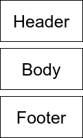

# 如何在玩笑中拍摄快照

> 原文：<https://betterprogramming.pub/snapshots-in-jest-9185540c16b2>

## 快照测试简介

克里斯蒂娜·埃尔南德斯在 [Unsplash](https://unsplash.com/s/photos/snapshot?utm_source=unsplash&utm_medium=referral&utm_content=creditCopyText) 上拍摄的照片

我在我参与的一个遗留项目中遇到了[快照测试](https://jestjs.io/docs/en/snapshot-testing)。老实说，我不喜欢这些文章，我的观点和大多数其他文章一样，只是对快照测试嗤之以鼻。

但后来我想:“如果他们这么坏，为什么 [Jest](https://jestjs.io/) 还保留这个功能？”于是，我开始思考他们，发现他们其实也没那么差。

实际上，如果使用正确，它们会非常方便。

# **什么是快照测试？**

如果您从未编写过任何测试，快照就是您可能认为的测试的样子。

首先，生成一个文本文件，其中包含代码的呈现部分，并保存它。然后，每次运行测试时，您的呈现组件都会与存储的蓝图进行比较。如果它们匹配，测试就成功了。

有了 Jest，就可以这么简单地完成:

嘣！没有断言。没有选择。几乎两行代码就可以完成您需要的所有测试！很好，对吧？

不对！这是开发者如此讨厌快照的主要原因。它们很容易做到，以至于许多懒惰的开发人员认为他们可以用它来测试一切。因此，测试很容易看起来像这样:

正如您所看到的，没有任何断言和糟糕的标题，就不可能知道这些测试实际上在测试什么。

当然，当测试失败时，您可以看到快照和当前版本之间的一些差异，但您并不真正知道这是否只是更改了样式或糟糕的功能，或者这个 bug 位于何处。

如果您使用一个庞大的父组件并对其进行所有测试，这就特别麻烦了。如果您更改了一个子组件，将会破坏所有其他使用父组件快照的测试。

此外，很多开发人员抱怨的一件事是 TDD。您不能编写测试，然后用快照测试来实现它们。这不是快照测试的基本过程。

因此，您可以看到快照是不好的，如果使用不当，可能会非常麻烦。

# 我们如何使用快照？

从上面的例子中，我们可以记下一些我们不应该对快照做的事情:

*   偷懒，所有测试都用。
*   如果我们不想写断言，就用它。
*   用单个快照测试我们的大范围应用程序。
*   使用快照测试大型父组件，同时测试子组件。
*   拿一个遗留应用程序，扔一些快照在那里，说你有测试。

仔细想想，它们似乎都不符合测试中的良好实践，尤其是在谈到单元测试时。然而，在一些用例中，使用断言可能非常棘手，但是快照可以轻松地进行测试:

*   检查组件的结构。
*   测试元素中的样式。
*   测试静态组件。

所以，让我们更详细地检查一下，如何实现这些测试用例。

# **检查一个组件的结构**

这是一个非常简单的用例，用经典断言进行测试可能非常具有挑战性。假设我们有三个组件，它们以正确的顺序显示至关重要:

在 React 中，它可能看起来像这样:

可能会有更多的标签，风格介于两者之间，但总的来说，这就是我们想要测试的。

这里值得注意的一点是，`Header`、`Body`和页脚组件将会有一些我们在测试中并不真正关心的内容，如果这些子组件中有任何变化，我们也不想中断测试。

因此，我们应该在制作快照之前模拟这些组件。这是它在我们的测试文件中的样子:

正如您所看到的，组件是用简单的字符串模拟的。如果您检查用 Jest 生成的快照文件，您会看到:

这样，您可以很容易地检查父组件的结构，而不会因为子组件的每次更改而破坏快照。

我通常还会尝试模仿传递到这些子组件中的所有道具，所以最终，快照只测试组件的结构。

您也可以使用[酶](https://airbnb.io/enzyme/) `ShallowWrapper.html()`来获取快照，但是，我总是得到一行未格式化的 HTML 字符串，这在修复快照差异时不是很用户友好。

# **测试元素中的样式**

有时候，你只是想确保组件中的样式和类是正确的，或者它们是否严重依赖于某个道具。

当然，用选择器和检查属性来测试它是可能的，但是，选择器可能会变得相当混乱和难以阅读。在这种情况下，检查和维护一些快照会容易得多。让我们看看这个例子:

在这个组件中，我们基于`props.red`改变了一些类和样式，还显示了一些静态文本内容。通过这样的测试:

您将获得如下快照:

正如你所看到的，它很容易维护，并且可以很快检查样式是否正确。

# **测试静态组件**

这很简单。你有一个组件，它只包含一个没有样式的静态 HTML 模板，并且你不希望它在将来被改变(某种图标、徽标、版权等)。).

有了两行代码，就可以确保不会被意外更改。你可能会问:“你为什么需要那个？”

嗯，你可以打开一个文件，不小心在里面写了一些字符，然后不经意地把它推到代码库中。(当然，这应该被代码审查发现，但不是每个人都这样做，如果他们这样做，像这样的小事情可能会被忽略。)

# **结论**

快照测试是一个非常好的仆人，但前提是使用得当。它们很容易做到，并且可以增加测试套件的价值。您可以使用它来检查代码的结构、组件的样式，或者确保某人没有提交对静态文件的更改。

您还可以使用快照来指导手动测试人员将您在一个组件中的更改应用到应用程序中的其他组件。

最后，您还可以让它们作为第三方库的安全措施，以检查它们是否没有在 changelog 中提及就更改了它们的 UI，这样您就可以再次告诉您的手动测试人员这个特性值得重新测试(即使它没有链接到任何标签)。

应该谨慎使用快照。如果在有限范围的组件上使用不当，它会在您的测试套件中制造麻烦。但是，如果你在使用它们之前想一想，并尽量使它们具有可读性(包括测试的标题和快照)。

最终，您应该始终尝试思考快照失败的原因。如果你总是使用自动更新只是为了让他们再次通过，那些测试的值是 0。

你对快照测试有什么看法？请在评论中告诉我！

干杯！