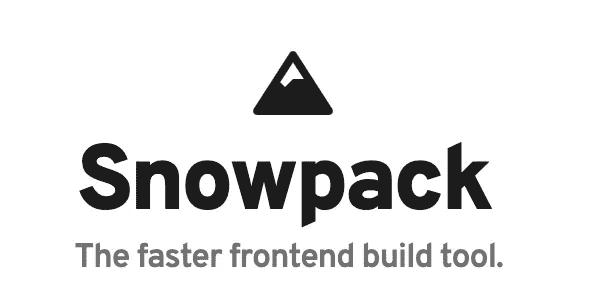
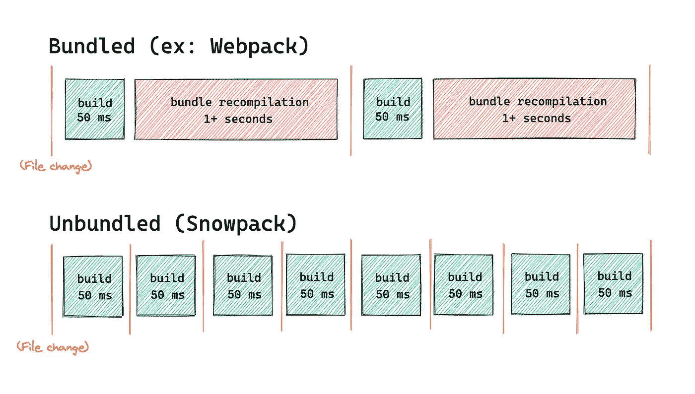
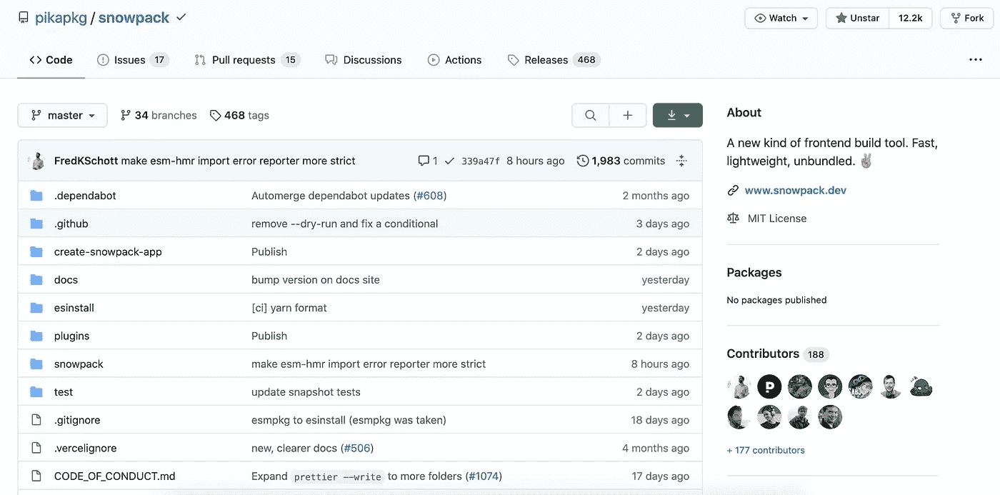
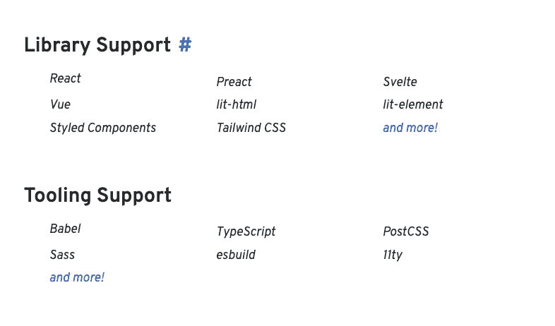
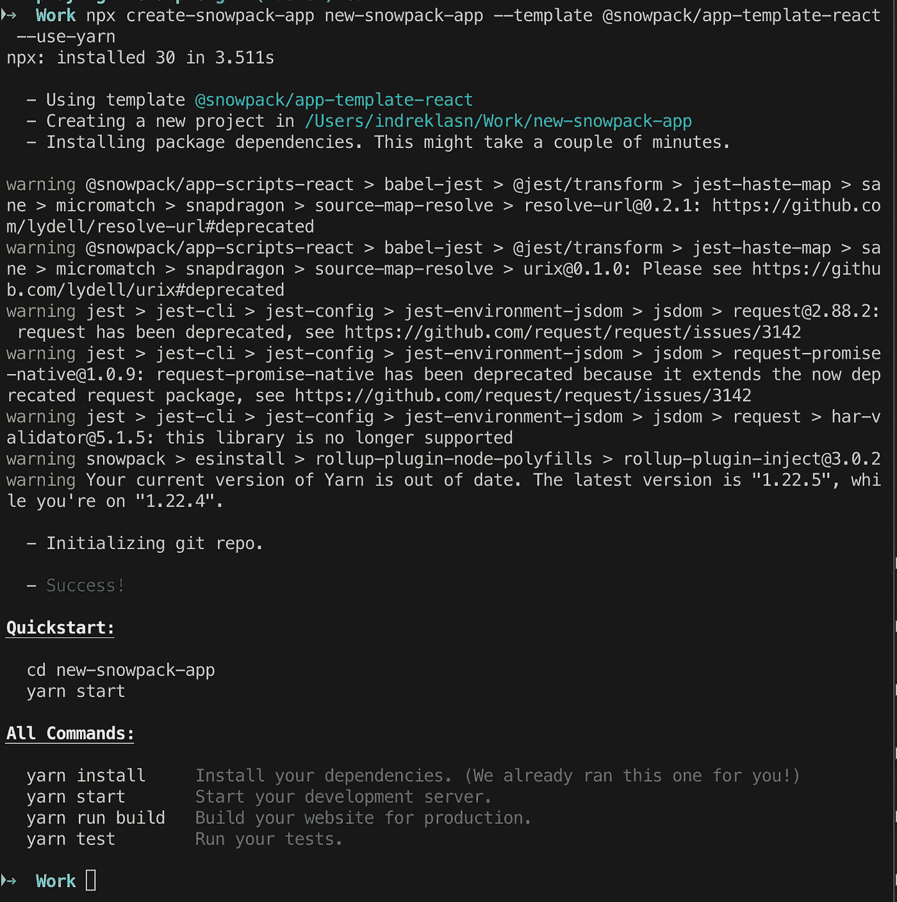
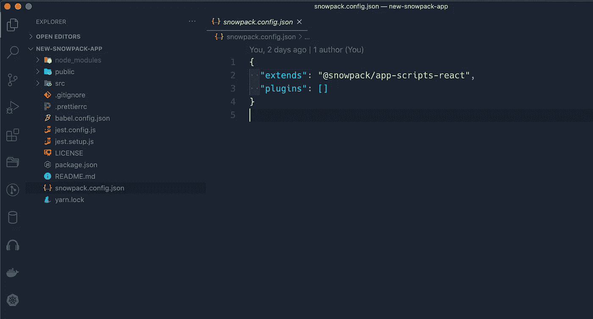
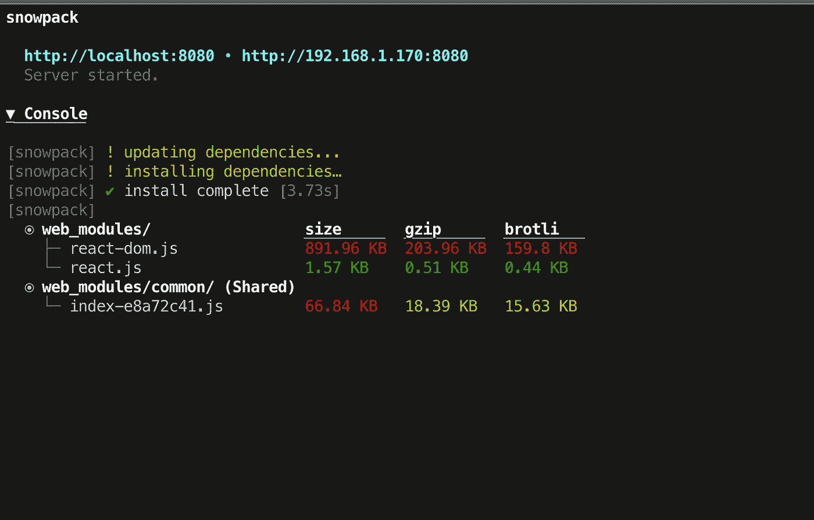
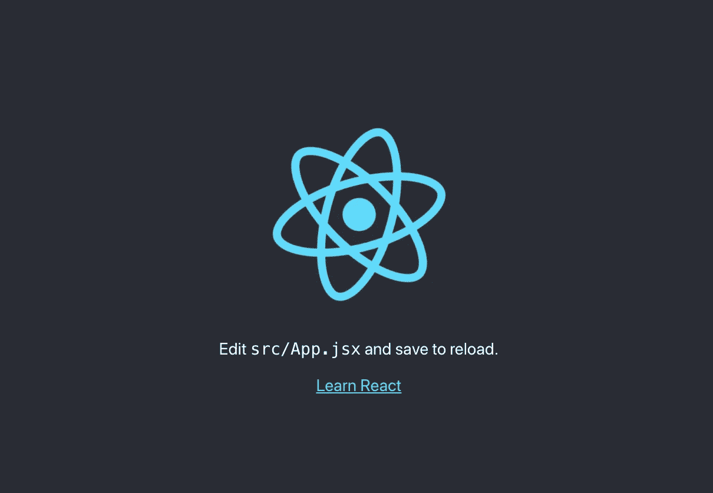
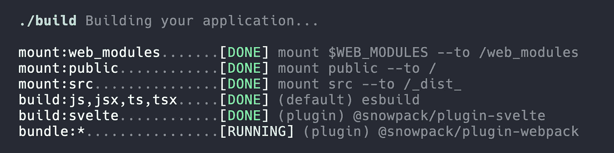

# Snowpack:一个现代的、轻量级的构建工具，用于更快的 Web 开发

> 原文：<https://betterprogramming.pub/snowpack-a-modern-lightweight-build-tool-for-faster-web-development-ec5c4bc77a3c>

## Snowpack 是 Webpack 或 Rollup 的替代构建工具

照片来自[积雪场](https://www.snowpack.dev/)。

> 每当你保存一个文件时，像 Webpack 或 package 这样的 JavaScript 构建工具需要重新构建和重新捆绑你的应用程序的整个块——根据 [*Snowpack.dev*](https://www.snowpack.dev/) 的

*递增重新绑定步骤在点击保存更改和查看浏览器中反映的结果之间增加了一个微小的延迟。*

*Snowpack 在开发过程中为您的应用程序提供服务。每个文件只需要构建一次，然后被永久缓存。*

**

*照片来自[雪堆](https://www.snowpack.dev/#unbundled-development)。*

> *当一个文件改变时，Snowpack 会重建这个文件。在每次变更时，浪费在重新捆绑上的时间非常少。取而代之的是浏览器中的即时更新。*
> 
> *Snowpack 的非捆绑开发支持与您用于生产的相同的捆绑版本。—根据 [Snowpack.dev](http://Snowpack.dev)*

*例如，当您为生产构建应用程序时，您可以通过 Webpack 或 Rollup 的官方 Snowpack 插件插入您喜欢的 bundler。*

**

*来源: [GitHub](https://github.com/pikapkg/snowpack#official-snowpack-plugins) 。*

> *Snowpack 让你两全其美。快速、非捆绑开发，在捆绑生产版本中具有优化的性能。—根据 [Snowpack.dev](http://Snowpack.dev)*

*简而言之，只有当您的应用程序准备好投入生产时，您才需要捆绑它。在开发过程中，您使用非捆绑版本。这就是积雪快速的原因。*

**

*来源: [GitHub](https://github.com/pikapkg/snowpack)*

*非捆绑开发在开发期间将每个单独的文件发送到浏览器。这使得 Snowpack 成为一个快速的构建工具和代码捆绑器。*

*然而，非捆绑文件仍然可以用您喜欢的工具构建，比如 TypeScript、Babel、Sass 等。，然后通过 ESM `import`和`export`语法在浏览器中独立加载。*

*每次你改变一个文件，Snowpack 只需要重建该文件。这就是积雪如此之快的原因。*

# *Snowpack 支持的库和工具*

*下面，您可以找到 Snowpack 支持和使用的库和工具:*

**

*来源:[积雪场](https://www.snowpack.dev/#library-support)*

# *创建 Snowpack 应用程序(CSA)*

*让我们试试 Snowpack，用新的构建工具来加速我们的新项目。Snowpack 提供了各种模板，我们可以用它们作为新项目的启动平台。*

*使用 Snowpack 和 React 启动新项目的脚本*

*如果你以前使用过 [create-react-app](https://github.com/facebook/create-react-app) 或其他 CLI 工具来创建新项目，你应该会感觉很舒服。*

*有关不同的初学者模板列表，请参见 [create-snowpack-app](https://github.com/pikapkg/snowpack/blob/master/create-snowpack-app) 页面。*

**

*成功创建了一个新的积雪场项目*

*如果一切按预期进行，您应该有一个新的目录，其中包含开始开发新的 React 项目所需的一切。*

# *配置文件*

*Snowpack 的行为可以通过 CLI 标志或自定义 Snowpack 配置文件进行配置。*

**

*我们的 React 应用程序使用了一个 snowpack.config.json 文件。*

**

*来源:[积雪场](https://www.snowpack.dev/#api-reference)*

*[参见 API 参考，了解所有支持选项的完整列表](https://www.snowpack.dev/#api-reference)。*

# *纱线运行开始*

*为了开始我们的项目，根据您喜欢的依赖管理器，继续运行`yarn start`或`npm start`。该命令将启动您的项目。*

**

*瞧啊。我们成功地让我们的项目运作起来了！让我们检查一下浏览器，看看是否一切正常。*

# *在浏览器中查看应用程序*

*React 和 Snowpack 应用程序的默认地址是 [http://localhost:8080/](http://localhost:8080/) 。打开浏览器并访问页面:*

**

*React 应用程序运行在 [http://localhost:8080/](http://localhost:8080/) 。*

*尝试对 React 应用程序进行更改。你应该看到变化是瞬间的，非常快。*

# *Snowpack 的构建管道*

> *当您准备好部署您的应用程序时，运行`snowpack build`命令来生成您站点的静态生产构建——通过 [*Snowpack.dev*](https://www.snowpack.dev/)*

**

*Snowpack 构建和捆绑您的应用程序*

> *构建和捆绑应用程序与您的开发设置紧密集成，因此可以保证您获得与开发过程中看到的代码几乎完全相同的副本。—据 [Snowpack.dev](http://Snowpack.dev)*
> 
> *`snowpack build`命令将使用与`dev`命令相同的非捆绑方法来构建您的站点。—据 [Snowpack.dev](http://Snowpack.dev)*

*这种方法适用于大多数项目，但是出于兼容性的原因，您可能仍然希望捆绑起来用于生产。*

*例如，您可能仍然需要支持遗留浏览器、代码缩减、代码分割、树抖动、死代码消除和其他性能优化。这些都可以通过捆绑在 Snowpack 中处理。*

*请参见[优化版本](https://www.snowpack.dev/#optimized-builds)部分，了解更多关于为您的生产版本连接捆绑或非捆绑优化插件的信息。*

# *排除任何问题*

*如果您有任何问题，请访问[故障排除页面](https://www.snowpack.dev/#troubleshooting)，该页面对您可能遇到的所有常见错误进行了修复。*

# *结论*

*感谢阅读。我希望这篇文章对你有用。编码快乐！*