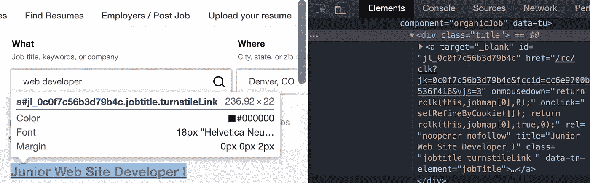
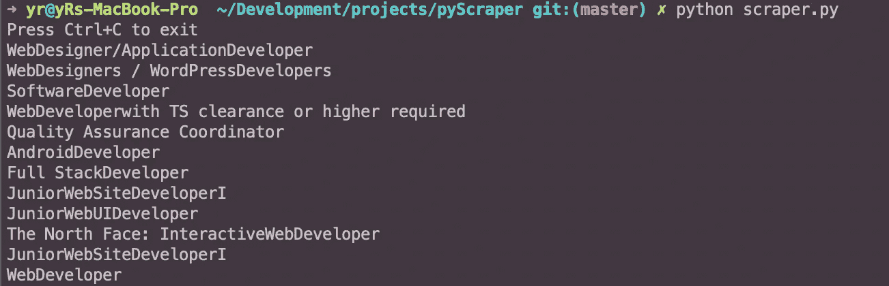

# 我写了一个 Python Web Scraper，它可以给我发送关于招聘信息的短信

> 原文：<https://betterprogramming.pub/so-i-wrote-a-py-web-scraper-that-sends-me-scpt-text-messages-about-job-postings-34ffef9a1128>

## 因为有时候你必须提高自己的水平才能被录用

首先，让我给你一些关于这个小 Python/AppleScript 二人组是如何产生的背景。

我是通过一个恶作剧认识 AppleScripts 的。一个朋友写了一个脚本，通过 iMessage 给我发短信。我承认——这很有趣。我对他是怎么写的很感兴趣，看了一眼他的代码，然后就忘了。然后，大约一周后，我和 FlatIron(我是那里的学生)的一名教师进行了一次有趣的谈话，内容是他如何在计划购买一辆卡车时，创建了一个 web scraper 来检查卡车的价格。我决定研究刮痧，亲自尝试一下，也许还可以顺便学习一些 Python。

我开始试图为复仇者联盟的结局剧透刮红迪网。然后，在休息时间浏览 Indeed.com 上的工作时，我有了一个想法。为什么不写一个 web scraper，当一个特定的子串出现在一个招聘信息的标题中时，它会给我发一条短信呢？我不知道“Junior”或“Jr”这两个词在开发人员的职位名称中出现的频率有多高，所以我认为尝试一下会是一件有趣的事情。

我不知道如何在 Python 文件中运行 AppleScript 文件——我甚至不知道 Python！然而，我很自豪地说，我能够让它工作——通过黑客攻击、谷歌搜索、使用 pip 和阅读文档。我学到了很多，但最重要的是*我走出了自己的舒适区*。

这里有一个关于我如何创建我的刮刀的快速教程。在页面底部有一个到该项目的 Github 资源库的链接。

# **快速设置**

如果你没有安装 Python，我建议你点击这里[。](https://realpython.com/installing-python/)
pip 随 Python 一起安装，但如果您需要安装它，请点击这里[。](https://pip.pypa.io/en/stable/installing/)

```
pip install beautifulsoup
pip install apscheduler
```

在终端中您想要创建两个脚本的目录下运行这些脚本。然后，我们将创建您需要的两个文件。

```
touch scrape.py
touch sentMessage.scpt
```

在您最喜欢的文本编辑器中打开这些，让我们开始吧！我们将首先从 python 文件开始，我们需要导入一些东西。

```
# scrape.pyimport os
import requests
```

我们导入的第一个模块是`os`。这使我们的 Python 脚本能够与运行它的操作系统交互——因为脚本是 AppleScript，它将*让* *到*与 OS X 交互。第二个模块导入`requests`是一个 Apache2 许可的 HTTP 库，它允许我们访问所有 HTTP 动词。这很有用，因为它可以自动向 URL 添加查询字符串和添加参数。接下来，我们将导入我们安装的 pip 包以及 Python 附带的一个名为 datetime 的包。

```
# scrape.pyfrom BeautifulSoup import BeautifulSoup
from apscheduler.schedulers.blocking import BlockingScheduler
from datetime import datetime
sch = BlockingScheduler()
```

我们使用`BeautifulSoup`从我们想要抓取的 HTML 页面中提取信息。`apscheduler`允许我们每隔 24 小时运行一次脚本，进行每日更新。`datetime`让我们在脚本执行期间访问当前的时间和日期。最后一行让我们通过 sch 变量访问`apscheduler`模块。

我们准备开始设置我们的铲运机！这是目前为止代码的样子:

现在我们编写`main()`函数，我们将使用`BlockingScheduler`来设置刮刀以我们选择的时间间隔运行。

```
# scrape.pydef main():return;
```

main 内部是我们设置正在抓取的页面、get 请求对 url 的响应以及通过响应进入的页面的 HTML 的地方。我刚去了 indeed.com，搜索“web developer ”,用丹佛，CO 作为我的过滤器。

```
url = 'https://www.indeed.com/jobs?q=web%20developer&l=Denver%2C%20CO&vjk=0c0f7c56b3d79b4c'
response = requests.get(url)
html = response.content
```

我们需要可读格式的 HTML(或者至少对于 Python 是可读的),以便对其进行排序并挑选出我们需要的数据。因此，让我们把它扔进 BeautifulSoup 并在 HTML 中搜索！

```
soup = BeautifulSoup(html)
matches = soup.findAll(name='div', attrs={'class': 'title'})
```



现在我们的 soup 变量保存了漂亮的 HTML，我们需要对它进行排序。正如你在上面的截图中看到的，使用 chrome dev tools 的 inspect 元素(`CMD + option + i`)，我能够确定职位发布的类名仅仅叫做‘title’。然后，我们用`soup.findAll`搜索 HTML，找到所有带有`name='div'`的 HTML 元素，以及一个值为 title: `attrs={'class': 'title'}).`的 class 元素属性

这是目前为止我们的代码在 Python 文件中的样子:

当这样做的时候，我做了很多控制台日志记录，但是我在 main 的底部添加了一个打印，所以如果你正在跟踪，你可以看到我们到目前为止所做的。

要查看输出，导航到您创建两个脚本文件的目录并键入`python scrape.py` —您应该会得到 indeed.com 首页上所有职位的列表。它看起来会像这样:



现在我们需要设置它，这样当有相关的工作发布时，我们就会收到一条短信！导航到 Python 脚本所在目录中的`sendMessage.scpt`文件，我们将从一些简单的 AppleScript 开始。

```
# sendMessage.scpton run {targetPhoneNumber, targetMessageToSend}end run
```

这个 on run 函数接受两个参数，一个电话号码和一条消息，当我们决定是否要从 py 脚本生成一条文本消息时，它将被包含在内(这就是为什么我们在 Python 文件的顶部放了`import 'os'`——这在后面会更有意义)。

现在，我们将告诉 OSx 应用程序“消息”，我们想向一个“服务类型”为 iMessage 的电话号码发送一条文本消息。

Messages 应用程序需要知道您发送消息的服务类型，所以我们告诉它`targetPhoneNumber`(传递到函数中的)服务是 im message。然后，我们将同样传递给函数的`targetMessageToSend,`设置为一个变量。最后，我们告诉 Messages 将消息发送到我们提供的电话号码。下面是我们的`sendMessage.scpt`看起来的样子——已经完成了！让我们回到 Python 脚本，告诉它何时发送文本消息。

还记得我们在漂亮的 HTML 上做了一个`.findAll`并得到了一个职位列表吗？我们现在需要做的就是对这个列表进行排序，看看是否有任何部分的职位和初级开发人员的职位相匹配。我们将在我们的主功能中执行这个逻辑。

我们用 for 循环迭代职称，看看字符串“Junior”或“Jr”是否存在。如果其中一个或两个都有，那么我们使用操作系统模块从 Python 脚本中执行终端操作。`os.system("osascript sendMessage.scpt YOUR_NUMBER_HERE ‘YOUR_MESSAGE_HERE' “)`用你的电话号码和你想发送的信息替换占位符(我用页面的原始网址替换了信息，这样我就可以直接通过短信打开它)。这些将是我们传递到 AppleScript 文件中的参数(如果您还记得的话)。然后，在每场比赛结束时，如果我们至少有一场比赛，我们就打破循环——以确保如果页面上有多场比赛，我们不会收到垃圾短信。

到目前为止，我们的刮锉是这样的:

最后要做的是为它的运行设置一个时间间隔。这就是`BlockingScheduler`和我们的 sch 变量派上用场的地方。对于主函数，在返回之后，我们添加这两行代码:

```
sch.add_job(main, 'interval', seconds=3)
print('Press Ctrl+{0} to exit'.format('Break' if os.name == 'nt' else 'C'))
```

第一行为调度程序添加一个作业，在`seconds=3`的`'interval'`上运行`main()`功能。3 秒仅用于测试目的-具有不同整数值的`hours=12`和`minutes=10`也是可接受的参数。我们有一个简单的 try/exception 语句来启动调度程序！

```
try:
    sch.start()
except (KeyboardInterrupt, SystemExit):
    pass
```

好吧……我知道，的确已经提供了类似这样的服务，可能还包括电子邮件！尽管如此，学习和构建这个小脚本还是很有趣的。作为一名开发人员，我的旅程才刚刚开始，但是，如果这段经历值得一提的话，我非常乐意继续下去！

这是我们完成的`scraper.py`文件。

就是这样！你现在可以在改变值后在你的终端中输入`python scraper.py`，并看到你的 scraper 给你发送文本。

如果你想改变你正在抓取的网页和你正在寻找的内容，BeautifulSoup 文档在这里[。](https://www.crummy.com/software/BeautifulSoup/bs4/doc/)逻辑都在那里，你可能需要比我做更多的排序。

再一次，我在做这件事的时候获得了很多乐趣。我希望这篇文章信息丰富，也许对其他人有用。

# 资源

*   这个作品的 [GitHub 项目](https://github.com/yeah-right/py-scraper-texter)