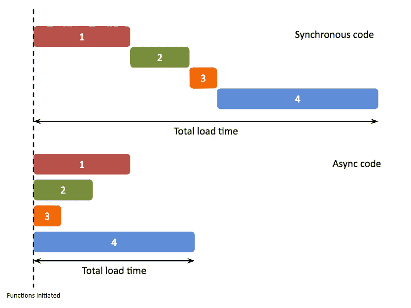
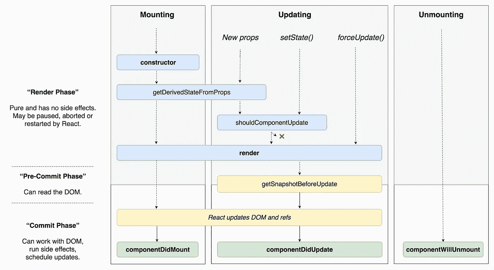

# 让我们谈谈反应

> 原文：<https://betterprogramming.pub/so-lets-talk-about-react-f91ea95152ad>

## 涵盖 React 历史、语法等内容的指南


Giammarco Boscaro 在 [Unsplash](https://unsplash.com/s/photos/history?utm_source=unsplash&utm_medium=referral&utm_content=creditCopyText) 上拍摄的照片

我从 17 岁开始做前端开发，但是我对 [React](https://reactjs.org/) 一无所知，直到我做了一些研究。现在，我实际上是一名经验丰富的 React 开发人员，将谈谈我使用 React.js 的经历。

如今，React 是最重要的 JavaScript 库之一，我们知道有很多 JavaScript 库和一个巨大的社区一直在改进 JavaScript 特性。像 jQuery 一样，React 在如何创建 UI 方面带来了惊人的变化，让我们可以更快地构建应用程序。

> "在困难和障碍消失之前，耐心和毅力有一种神奇的效果."—约翰·昆西·亚当斯

## 目录

```
1\. [Understanding React's history](https://medium.com/p/f91ea95152ad#0b80)
2\. [Some JavaScript concepts useful in React](https://medium.com/p/f91ea95152ad#846b)
3\. [React essentials](https://medium.com/p/f91ea95152ad#58fa)
4\. [Lifecycles in React](https://medium.com/p/f91ea95152ad#fea0)
5\. [Passing data to child components](https://medium.com/p/f91ea95152ad#c05f)
```

# 了解 React 的历史

由[Jordan walker](https://twitter.com/jordwalke?lang=es)创建并于 2013 年正式发布的 React 已经成为 JavaScript 中最重要的 UI 库之一。它被脸书、Instagram、网飞、Spotify、Medium 和 Twitter 使用。React 改变了我们构建 UI 界面的方式。

像其他库一样，React 使用模型-数据-控制器 [(MVC](https://www.youtube.com/watch?v=DUg2SWWK18I) )设计模式。这个后面会解释。

在了解前端开发的历史中，我们可以找到一个很好的答案，即为什么要创建 React。我们都开始使用 jQuery，这使得创建 UI 界面变得更加容易和快速。但是随着时间的推移，需求越来越大，仅仅使用像 jQuery 这样的技术很难满足需求。

在脸书内部，一些好的东西开始在沃克的脑海中酝酿——他有一个惊人的想法来创造一些可以使前端构建更容易和更快的东西。

React 混合了 JavaScript、CSS 和 HTML，成为了一场革命，改变了我们构建前端的方式。最终，JSX 诞生了——让阅读 React 代码变得更加容易。

# React 中一些有用的 JavaScript 概念

我记得当我 15 岁开始学习编程的时候。

了解 JavaScript 的基础知识可以帮助你快速理解一个新的框架或库，所以这些是你需要了解的关于 JavaScript 的一些主题:

*   同步和异步
*   `this` 关键字
*   三元运算符
*   解构

## 同步和异步

我们在 React 中一直使用的最重要的概念之一是异步性。一个很好的例子是`setState`、**、**，它们使用回调**、**来显示更新后的状态值。

如果我们看看 React 的内部，我们会发现 **nodejs** 。这说明了很多关于 React 的事情，因为最广为人知的概念是异步性。

异步有助于加载所有必要的数据——不管它有多大——因为我们可以同时加载大量不同的数据**,不管每个任务的进度如何。**

****

****同步****

**单线程进程包含以单个序列执行指令。换句话说，一次处理一个命令。**

****异步****

**不同步；也就是说，不是以预定的或规则的时间间隔发生的。术语异步通常用于描述数据可以间歇传输而不是稳定传输的通信。**

## **[对'**这个'**关键字](https://medium.com/better-programming/understanding-the-this-keyword-in-javascript-cb76d4c7c5e8)的解释**

**JavaScript `this`关键字引用了它所属的对象。所以用这个关键字，你可以引用一个类的当前属性，因为它引用了当前的对象实例。**

**因此，如您所见，我们引用了实际的`Hero` 类，获取了该类的实际属性，因为这个关键字引用了实际的实例。**

```
HeroIns.greet() will return an object like this:**Hero** {
   **name**: "Arthur Akward",
   **level**: 100
 }
```

## **[三元运算符](https://developer.mozilla.org/en-US/docs/Web/JavaScript/Reference/Operators/Conditional_Operator)**

**对于三元运算符，我们可以使用三种不同的运算符:(1)条件运算符后跟一个`?`；(2)然后，如果条件是`true`，我们将执行一个代码，后面跟一个`:`；(3)最后，如果条件是`false`，我们将得到要执行的表达式。**

**此外，您可以创建一个条件链，帮助您评估多个条件。**

## **[解构](https://medium.com/javascript-in-plain-english/the-elegance-of-react-1aa393a7d0f4)**

**在 ES6 中，我们有析构，这允许我们有一个短代码。如果你不知道析构是如何工作的，我们需要首先使用 Mozilla 的始终可靠的 [MDN 来搜索它，以理解它是如何工作的。](https://developer.mozilla.org/en-US/docs/Web/JavaScript/Reference/Operators/Destructuring_assignment)**

**通过析构，我们可以更容易地提取数组或对象内部的信息。**

**这将分别给出对象和数组中的值，
。**

```
/* Array Destructuring */blueDragon -> "Blue Dragon"
redDragon -> "Red Dragon"
yellowDragon -> "Yellow Dragon"/* Object Dragon */blue-> "Blue Dragon"
red -> "Red Dragon"
yellow -> "Yellow Dragon"
```

**我需要说的是，如果你想对一个对象使用析构，有必要使用对象的原始名称键。**

## **复试**

**回调是作为参数传递给另一个函数的函数，然后在外部函数中调用它来完成某种类型的例程或动作。**

**回调将在运行父函数之后被调用——这是因为你可以在 API 请求或类似的东西中看到这种函数。**

**为了更好地理解上面代码中发生的事情，我将以不同的方式向您展示:**

```
const processInputData = callback => {  
      var name = "Jhornan Colina";
      return callback(name);
};
processInputData(console.log(**name variable**));
```

# **反应要点**

**大多数人开始使用像 jQuery 这样的库，这是一种非常不同的反应。主要原因是因为很多人不知道如何开始反应。**

**现在我们有很多网站，需求可以变得巨大。像 React、Angular 或 Vue 这样的学习技术可以帮助你更轻松地工作。因此，在这一节中，我将尝试向您介绍在 React 中创建自己的应用程序所需的初始步骤。**

## **元素**

**与组件不同，元素只是 JSX 的一小部分，没有呈现方法。**

**像组件一样，您通常可以使用相同的元素或重用它，而无需重写其代码。**

**好了，在表格下面，我们可以看到一个简单的 JavaScript 对象，它将创建一个新的 HTML 元素，返回一个包含必要信息的对象。**

```
{   
  type: 'div',   
  props: { 
          children: 'Login',     
          id: 'login-btn'  
         } 
}
```

**但这是创建元素的第一种方式。您还可以使用语法糖更容易地创建元素。**

**这有一点不同，因为它将返回一个不同的对象和必要的信息。我会不带任何不必要的信息给你看对象。**

```
{
  type:"h1",
  props:{
       children:[
                  0:"Hello, "
                  1:"Jhornan colina"
                ]
        }}
```

## **成分**

**如果你已经听说过 React，也许你已经了解了组件。这是一种在网站的其他部分重用 HTML 的方法。**

**我将向您展示一个重用组件来创建大量标题的好例子，而不用一次又一次地编写相同的代码:**

**此外，您可以使用析构将属性传递给组件——这是传递数据的一种更容易、更简单的方式，无需编写大量代码。**

## **类别组件**

**今天，类组件可以帮助你在组件中拥有主要控制权——通过拥有不同的状态，你需要在构造函数中声明它，例如(我知道有一个插件可以在没有构造函数的情况下声明状态)。此外，我们现在可以更好地控制组件的生命周期。**

**组件有生命周期——深入了解生命周期——在类组件内部，我们有不同的方法来控制组件，取决于它当前的生命周期状态。我要谈谈最重要的生命周期:**

*   **用于渲染 JSX、门户、JSX 元素数组、片段和 JavaScript 对象的方法**
*   **`**constructor**`:React 组件的构造函数在组装前被调用。当实现一个`React.Component`子类的构造函数时，你应该在任何其他指令之前调用`super(props)`。**
*   **`**componentDidMount**`:这个方法在组件输出被渲染到 DOM 后运行。这意味着当组件被挂载时，方法中的所有内容都将被执行。**
*   **`**componentWillMount**`:该方法在组件最终安装时调用。**
*   **`**UNSAFE_componentWillUpdate**`:当组件接收到新状态和新属性时执行**
*   **`**componentDidUpdate**`:通常用于评估之前的状态是否与实际状态不同**
*   **`**shouldComponentUpdate**`:通过将当前状态与下一个状态或下一个属性进行比较，了解组件是否应该更新的方法**

## **了解“render”方法**

**就像一张图片一样，我们可以通过使用一个叫做`render()`的`ReactDom`方法在虚拟 DOM 中绘制组件，它允许您在虚拟 DOM 内部插入一个组件。**

```
import ReactDom from 'react-dom';
ReactDom.render(<component>,<selector>);
```

**render 方法需要两个参数:其中一个参数是要呈现的组件。第二个是容器选择器——换句话说，就是创建组件的地方。**

**如果你正在使用[Create React App CLI、](https://create-react-app.dev/docs/getting-started/) 你会注意到在`index.js`文件里面，有一些类似于 render 的方法。**

**从`index.js`会渲染出`App` 组件里面的一切。当然，从一个独特的`root` 组件或者类似的东西中加载所有东西是一个好习惯。**

## **状态组件**

**`state`允许您在组件中保存属性或信息。`state`是内在的——它不能变异，需要改变，回到一个新的状态。**

**所以类组件最重要的一个概念就是如何改变它的状态。为此，我们需要使用`this.setState`方法，它返回一个带有更新值的新状态。**

## **“setState”方法**

**实际上，在类组件或功能组件内部，您不能改变状态，因为这不是一个好的做法。它会产生[副作用](https://en.wikipedia.org/wiki/Side_effect_(computer_science))，造成很多麻烦。**

**`setState`方法允许您在不改变值的情况下改变类组件的状态。但是需要注意的是，这个方法使用了 async 概念，这意味着如果你需要获得当前值，你需要使用它的回调。(如果你对回调一无所知，回到回调部分。)**

**这是一个如何用`setState`使用回调的好例子。如您所见，我正试图从状态中获取当前数值。它会在第一个函数结束时给我一个值。**

# **React 中的生命周期**

**通过这些方法，您可以了解组件的当前状态。例如，如果您正在使用 API，并且您的数据尚未加载，那么您可以在组件获取数据时指定重新呈现。**

**首先，我们需要了解一个组件的基本生命周期，以及一个组件是如何挂载的。**

****

## ****安装周期****

*   **`**Constructor**`:在此步骤中，将加载状态、默认属性和可能创建的方法**
*   **`**componentDidMount**`:组件最终安装时**

## ****更新/安装周期****

*   ****React 更新 DOM 和 refs** :更新 DOM 和 refs 以挂载组件**
*   **`**getDerivedStateFromProps**`:这个方法在`render`方法之前被调用，当你的状态依赖于属性变化时使用**
*   **`**render**`:给部件上漆**

## ****更新周期****

*   **`**shouldComponentUpdate**`:告知组件是否真的需要渲染**
*   **`**getSnapshoptBeforeUpdate**`:在改变某些东西或渲染组件之前获取潜在的信息**
*   **`**componentDidUpdate**`:组件更新时会调用**

**点击了解更多关于这个话题的信息[。](https://programmingwithmosh.com/javascript/react-lifecycle-methods/)**

# ****向子组件传递数据****

**React 中有一个好的实践，叫做*表示和容器组件。*(不需要遵循这个模式。我将以它为例)将逻辑组件与转储组件分开。)**

**我们需要使用 props 将数据传递给我们的子组件。**

**因此，通过这个简短的算法，我们可以传递包含`h1`标签的文本。结果将是:**

****

**此外，我们像传递道具一样传递事件，这是非常有用的，因为我们可以在父组件中控制这些事件。**

****

**所以我添加了一个按钮来改变`h1`标签的文本。如你所见，你可以通过道具来传递事件。**

# **结论**

**感谢阅读。我希望你喜欢这篇文章！**