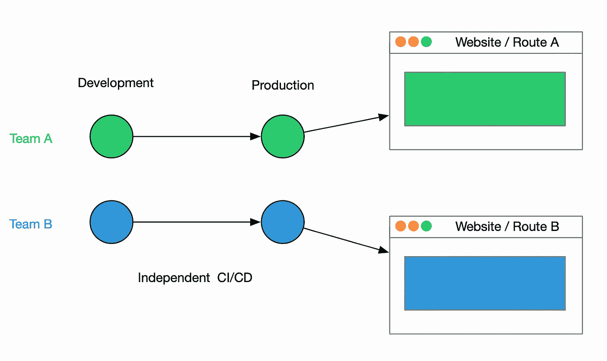
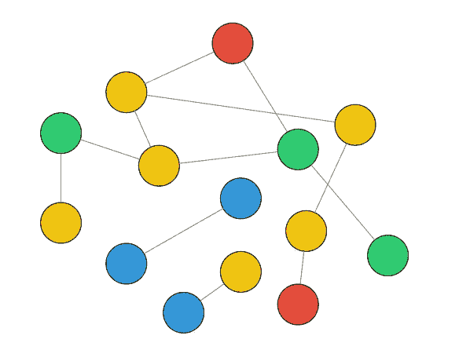
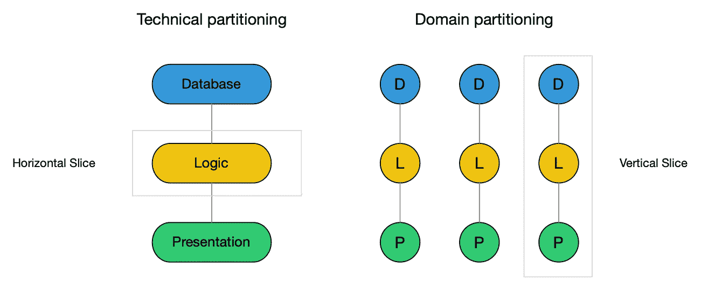
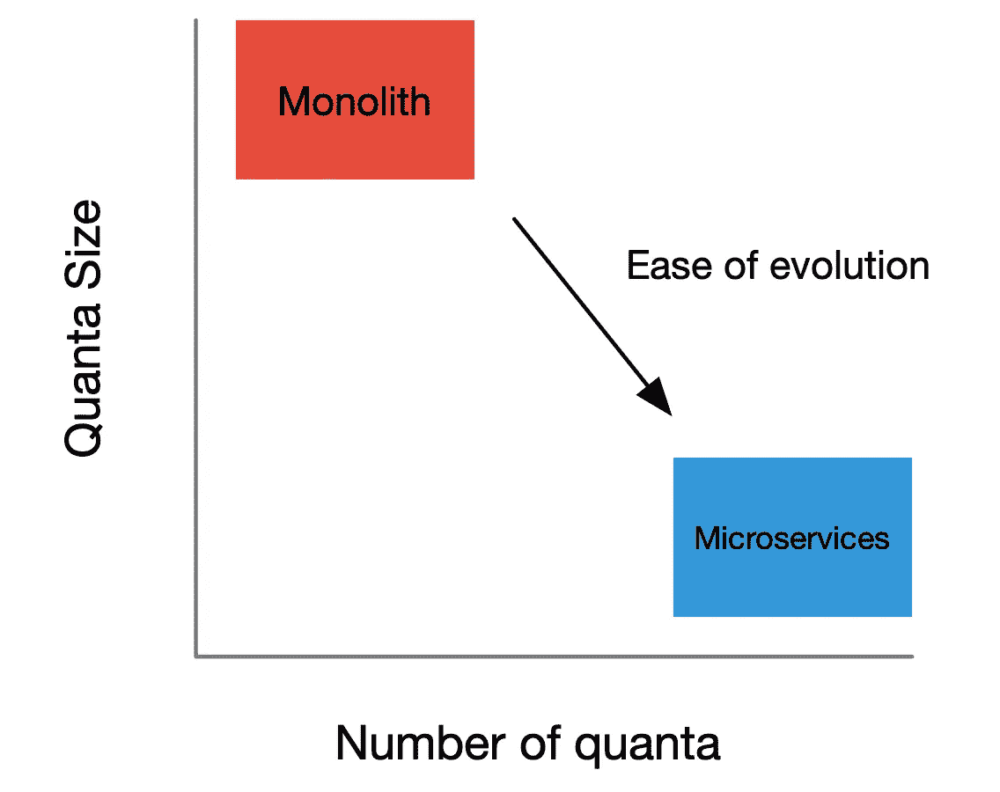
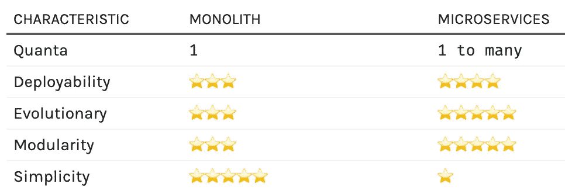
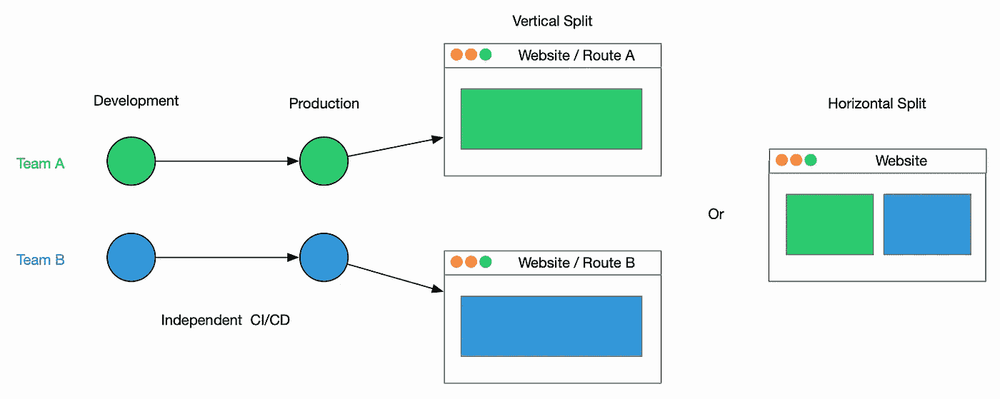
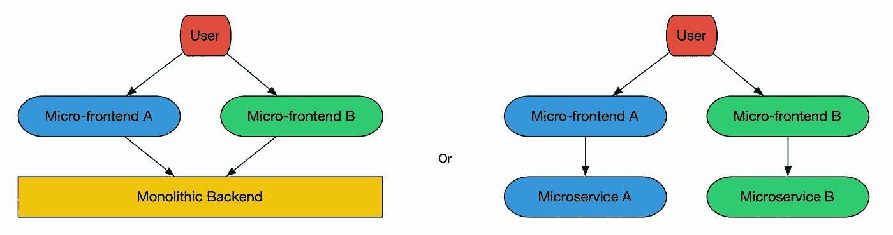

# 那么，微前端是怎么回事？

> 原文：<https://betterprogramming.pub/so-whats-the-deal-with-micro-frontends-7f799ef504dc>

## 微前端及其权衡的粗粒度视图


# 介绍

在软件工程中，您可以做出的最重要的技术决策之一是划分项目架构的方法。这个决定的后果是级联的，所以你必须得到这个权利！不幸的是，没有银弹解决方案，因为正确的决定取决于您的背景。一如既往，我们遵从软件架构的第一定律:

> 软件架构中的一切都是一种权衡。

使用微前端是一种越来越流行的划分前端应用程序的方法。在这篇文章中，我将定义它们并描述它们的利弊。对于那些有更多时间的人，我将从探索不同的分区风格开始，探究其中的原因。然后我分享了微前端的粗粒度概述。但首先，对于那些赶时间的人来说:

**TL；受微服务的启发，DR** 微前端将以前单一的代码库分解成可独立部署的部分，这些部分组成了一个更大的整体。独立部署前端可以改善预期的特性，如可伸缩性、敏捷性和可维护性。这些好处反映了微服务的好处，但也有类似的缺点:操作和治理的复杂性。示例包括代码重用、标准化 UI、管理微前端之间的交互以及部署配置的复杂性。



在我们继续之前，如果你喜欢这篇文章，请看我的简讯[这里](https://growthmindsetcoding.substack.com/)。

# 分割

在深入研究微前端之前，让我们首先探索其他分区方法

# 大泥球

一种方法是泥浆分区的大球(或缺乏):

> “一个大泥球结构杂乱，蔓延，松散，胶带，意大利面条代码丛林显示出明显的无节制增长和重复的权宜之计。”—布莱恩·福特和约瑟夫·约德



这种方法对于杂乱的尖峰和原型是非常好的，因为它有助于简单性和(初始)速度的特性。这对于长期使用来说并不理想，因为这种结构最终会降低灵活性和弹性。补充一点:一项被低估的技能是识别对你的特定环境重要的特征。偶尔，代码势利或业务压力会导致团队选择不正确的结构或技术，这些结构或技术不符合使项目成功所需的特征。

# 技术/领域划分

大多数应用程序都属于技术和领域分区应用程序的范围。



技术分区的应用程序被分割成技术层:持久层与表示层分离，等等。这种简单的结构允许技术层的优化和专业化。然而，这意味着业务逻辑在各层之间模糊不清，可能会降低敏捷性和弹性。由于康威定律，具有这种划分结构的组织通常有独立的数据库、后端和前端团队。在前端环境中，技术上分区的应用程序可以是结构化的:

```
📦 application
 ┣ 📂 state
 ┃ ┣ 📜 store.js
 ┃ ┣ 📜 reducers.js
 ┃ ┗ 📜 actions.js
 ┣ 📂 components
 ┃ ┣ 📜 header.js
 ┃ ┣ 📜 button.js
 ┃ ┗ 📜 footer.js
 ┗ 📂 api
   ┣ 📜 queries.js
   ┗ 📜 mutations.js
```

域分区的应用程序被分割成多个业务域。想想 [Spotify 模式](https://www.atlassian.com/agile/agile-at-scale/spotify)启发的跨职能团队，他们拥有端到端的产品。或者亚马逊的[“你建造它。你跑吧”](https://queue.acm.org/detail.cfm?id=1142065)走近。这有利于提高灵活性、可维护性和可伸缩性。在前端环境中，具有这种划分的应用程序是结构化的:

```
📦 application
 ┣ 📂 checkout
 ┃ ┣ 📜 state.js
 ┃ ┣ 📜 screen.js
 ┃ ┗ 📜 api.js
 ┗ 📂 catalog
   ┣ 📜 state.js
   ┣ 📜 screen.js
   ┗ 📜 api.js
```

# 单片/分布式

您选择特定分区方法的决定会对部署的可能性产生影响。技术分区架构只能是整体式的，而域分区架构可以是整体式的，也可以是分布式的。在软件工程中，独石是有争议的，但是永远要小心教条，要有权衡的心态。例如，shopify[采用了模块化的整体结构](https://shopify.engineering/deconstructing-monolith-designing-software-maximizes-developer-productivity)，这非常适合其特定的环境。

如果你偏爱花哨的术语，我们可以用“量子”这个术语:

> *一个*架构量子是一个具有高功能内聚性的可独立部署的组件

独石有一个量子(所有东西都部署在一起)，而且很大。模块化的单片也有一个量子。微服务有多个量程(许多部分可以独立部署)，而且每个量程都更小。



微服务流行的原因？他们是一个更进化的架构，因为他们有更多的小量子。然而，代价是随之而来的复杂性。部署、代码共享、可观察性和事务都是变得更加复杂的领域(尽管像 [Temporal](https://temporal.io/) 这样的工具正在使生活变得更加简单)，所以这总是一种权衡。



稍微偏离轨道一点，去中心化和集中化之间的权衡触及了一个更广泛的主题“高效数据处理的竞争方法”。自由市场经济以分散的方式处理信息。一致性是通过许多具有有限的本地知识的个人的平行和独立的行动而出现的。[根据 Yuval Noah Harari](/according to Yuval Noah Harari) 的说法，这种效率是苏联低效的中央集权经济落后于美国的原因。加密货币是对去中心化世界的又一次尝试，它从中央政府手中夺走了控制权，这自然引起了一些恐慌。

# 微前端

微前端是一种受微服务启发的新兴去中心化架构风格。这个想法是将单一的前端代码库分成由自治团队拥有的更小的部分。与模块化整体前端不同，这些应用程序随后被独立部署到生产环境中，在那里它们被组合成一个更大的整体。



一个具体的例子，见上图。团队 A 和团队 B 在完全独立的域上工作，然后独立地部署，并以垂直分割或水平分割的方式组合在一起。在垂直分割中，团队拥有一个业务领域(参见[领域驱动设计](https://docs.microsoft.com/en-us/archive/msdn-magazine/2009/february/best-practice-an-introduction-to-domain-driven-design))，而在水平分割中，团队拥有一个页面切片。

这种架构可以与各种后端架构一起使用，尽管它们特别适合微服务。如果与微服务一起使用，跨职能团队可以完全拥有业务领域。



# 对等

*   工具:团队可以为他们特定的用例选择最好的工具，重构时不用担心会给其他团队带来错误，并且可以轻松地重写应用程序。这有助于他们向“您构建它，您运行它”的工作模式转变，并且它允许增量升级。
*   部署:团队可以“照单部署”——每个应用程序都按照自己的节奏部署。不相关的变更不需要捆绑在一起，部署风险也降低了，从而提高了灵活性。

# 下降趋势

*   治理:治理跨多个团队的代码质量标准和一致性更加困难，因为整体的可观察性降低了。在一个页面上混合一系列相互竞争的技术、工具或框架的能力也可能导致**微前端混乱**从而导致**性能不佳和尺寸增大**。
*   操作性:管理微前端工具、管道、存储库和服务器需要更多的管理工作。协作和管理状态也更加复杂

# 结论

微前端是管理复杂前端代码库的一种极好的方式。这是自治团队使用的一种划分风格，它改善了可伸缩性和可进化性的特征。它们不具有简单性的特征，并且需要大量的治理和开发投资。如果您的微前端需要以特定的顺序部署，省点麻烦，坚持使用模块化的单片前端。

如果您的业务需要的特性与微前端提供的特性一致，并且您有操作方面的专业知识，那么就值得进一步探索这种方法。向微前端迁移也不是“大爆炸”式的努力，所以你总是可以组建一个 lighthouse 团队来开拓一个小领域作为第一步实验。

这篇文章是有意粗粒度地研究微前端的原理。如果您希望有一个更细粒度的视图，我建议查看以下资源:

*   [NX](https://nx.dev/module-federation/micro-frontend-architecture) :提供开箱即用微前端支持的工具
*   凯姆·杰克森神奇的[深入微前端](https://martinfowler.com/articles/micro-frontends.html)
*   微前端上的思想作品[作品](https://www.thoughtworks.com/radar/techniques/micro-frontends)
*   Hello Fresh 的[微前端实现](https://engineering.hellofresh.com/front-end-microservices-at-hellofresh-23978a611b87)
*   [AWS 上的微前端](https://aws.amazon.com/blogs/architecture/micro-frontend-architectures-on-aws/)
*   书:[搭建微前端](https://learning.oreilly.com/library/view/building-micro-frontends/9781492082989/)
*   书:[微前端在行动](https://www.manning.com/books/micro-frontends-in-action)