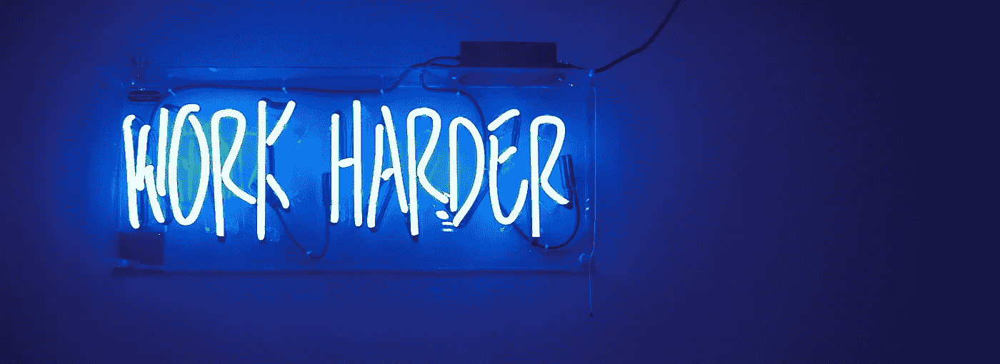
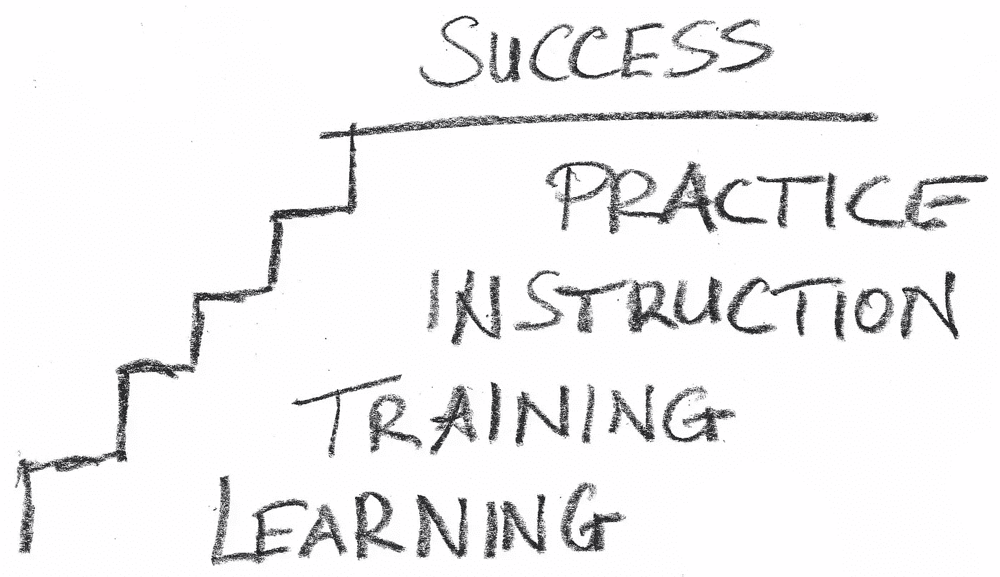

# 所以你得到了你的第一份编程工作——现在呢？

> 原文：<https://betterprogramming.pub/so-you-landed-your-first-programming-job-now-what-9e4555a4fe87>

## 开始你的第一份工作可能会让人害怕。你如何从现在的位置到达你想去的地方？一切都始于一点点努力。

图片由 [StartupStockPhotos](https://pixabay.com/users/StartupStockPhotos-690514/?utm_source=link-attribution&utm_medium=referral&utm_campaign=image&utm_content=593353) 来自 [Pixabay](https://pixabay.com/?utm_source=link-attribution&utm_medium=referral&utm_campaign=image&utm_content=593353)

大学毕业前一个月，我得到了第一份编程工作。在我看来，我很性感。我的大多数朋友还没有工作，有工作的都在实习。但是我有一份真正的工作。不用说，我觉得自己是世界之王。大学一毕业，我就已经知道了所有该知道的事情，这些事情都历历在目。然后我开始了。

我的头几周是一次令人羞愧的经历。我觉得自己对这份工作准备不足，就像*。当然，我知道如何编码，但做一名软件开发人员远不止这些。不仅仅是理论，链表，多维数组。它是关于人和你与那些人的互动。大学让我做好了成为一维员工的准备。但是为了达到我职业生涯的目标，我需要变得更加全面。*

但是什么叫全面发展呢？你是怎么做到的？你刚读完四年多的大学，还有什么要学的吗？如果你想在事业上取得成功，你必须渴望每天的个人和职业成长。

# 显示主动性

领导力大师约翰·麦克斯韦喜欢分享他侄子开始第一份工作的故事。约翰问他的侄子，“工作日什么时候开始？”

“上午 9 点，”侄子回答道。

“对你来说不是这样。你在 8:45 到达那里。工作日什么时候结束？”

侄子说:“下午 5 点”。

“不是给你的。你呆到 5:15。什么时候吃午饭？”

"午餐时间是从 12 点至 1 点."

“吃午饭的时间太长了。您从 12:15 到 12:45 吃午餐”

侄子表现出比他必须做的更努力工作的主动性。他早到一点，晚到一点，吃更少的午餐，但什么也没说。他的老板注意到当第一批人到达办公室时他在那里，当最后一批人离开时他也在那里。这使得他在工作的头几年就被提拔到了领导岗位。谈出人头地！

但是不仅仅是早出晚归导致了晋升。你的老板不会读心术。如果你想在事业上出人头地，就要明确你的意图。和你的老板谈谈你想从这份工作中得到什么。人们想帮助你。对老板来说，最大的收获就是看到员工的成功。不要害怕和他们交谈。

# 证明你的雄心

我是一个雄心勃勃的人。从我很小的时候起，我就有自己的宏伟蓝图。但是有野心是不会让你去你想去的地方的。*按照你的抱负行事* *会让你在同龄人中脱颖而出。*

你需要表明你是为公司着想。在你工作的早期，你带来了你的队友所没有的独特视角。你有一个局外人的观点。你可能会看到一个对你的团队来说似乎很正常的过程，但是作为一个局外人来看却毫无意义。或者也许你的团队重复一些你可以自动化的手动过程。大声说出来。有意识地让你的同事生活得更轻松。

图片来自 [Pixabay](https://pixabay.com/?utm_source=link-attribution&utm_medium=referral&utm_campaign=image&utm_content=1845901) 的[像素](https://pixabay.com/users/Pexels-2286921/?utm_source=link-attribution&utm_medium=referral&utm_campaign=image&utm_content=1845901)

在我职业生涯的早期，我注意到一个让我的公司和客户都头疼的问题。在我们的应用程序中，在环境之间移动配置需要开发人员的参与。他们将进入数据库并将配置保存到文本文件中。然后，它们连接到目标环境，加载文本文件的内容，并进行更新。

这是一个容易出现人为错误的问题，只有两三个人被允许去做，但是我们所有的客户都需要这个过程。所以我在业余时间写了一个程序，只需点击一下按钮就能处理它。该应用程序保证了流程的正确性，并使更多的人能够执行配置移动。开发人员不再是唯一能够做到这一点的人。

这款应用因其非凡的省时功能而受到高管们的关注。他们也很高兴它允许非技术人员执行一些曾经是开发任务的事情。随着我发现其他问题，我继续给这个应用程序添加功能，随着时间的推移，它成为了一个受支持的应用程序，分发给客户。

# 每天学习

你完成了学业，但这并不意味着你可以停止学习。你需要对学习感到兴奋。每天继续成长自己。不要满足于你现在所知道的。你应该努力学习你所能学到的一切，但我想把重点放在三个方面:

*   **了解业务—** 理解“为什么”是构建有用软件的关键。如果您了解业务，您可以构建客户需要的功能。抓住一切机会与产品负责人讨论业务。*理解用户期望发生的事情比理解编程理论更有力量。*
*   **了解你日常使用的技术—** 成为你日常使用的编程语言和设计模式的专家。如果你的应用程序有一个棱角分明的前端和一个 Java 后端，试着每天用它们做一些新的事情。了解 Angular 的下一个版本何时发布。探索 JVM 是如何工作的。编写一个测试应用程序来证明一个设计模式。随着时间的推移，一点点的积木将会带来更多的理解。当你证明了你的技术实力，你对技术决策的影响将会增加。让自己成为所在领域的领导者。
*   了解新的现代技术——作为一名开发人员，你需要确保与时俱进。你们公司还在用 C++开发吗？你仍然可以了解。净 5。你的公司建网站吗？尽你所能了解现代 web 开发的一切。体验云。今天的流行语是什么？尝试区块链、人工智能或机器学习。为自己做点事，培养适销对路的技能，即使这些技能不会带来立竿见影的效果。你不一定要成为专家，但是熟悉新趋势会让你的技能保持相关。

图片来自 [Pixabay](https://pixabay.com/?utm_source=link-attribution&utm_medium=referral&utm_campaign=image&utm_content=4168407) 的 [Gerd Altmann](https://pixabay.com/users/geralt-9301/?utm_source=link-attribution&utm_medium=referral&utm_campaign=image&utm_content=4168407)

不用自己学！找个导师。寻找那些跟随你想要走的职业道路的人。他们有你必然会有的问题的答案。他们知道你需要学习什么来实现你的目标。

> *“成功绝非偶然。这是努力工作、坚持不懈、学习、研究、牺牲，最重要的是，热爱你正在做的事情或学习做的事情。”* —贝利

找几个志同道合的朋友一起分享你的旅程。互相帮助学习。互发文章。一起谈论一种新的设计模式或者学习一种新的编程语言。这引出了我的最后一点。

# 社交化

个人成长不局限于新事物，是关于发展自己。如果你想成为一名领导者，你必须增强你的软技能。你需要和陌生人交谈时感到自在。随意谈论你的工作。

向团队以外的人伸出援手。了解什么对他们的团队有效。熟悉组织结构图。当你需要什么的时候，知道该联系谁。如果你知道该和谁交谈，你就不需要知道所有的事情。把自己当成一个人的指数。如果有人带着问题来找你，如果你不知道答案也没关系。你知道谁能为他们解答。

与你组织周围的人交往还有其他好处。如果每个人都知道你的技能，你将增加被推荐到新项目的机会。这是对你和你的技能的巨大褒奖。你的信心会增加，这将继续使你成为一个更好的开发人员。

除了职业上的好处，社交还有令人难以置信的个人好处。如果你把这份工作当成你的职业，你一定会交到一生的朋友。出去找他们。你是你留住的人的总和，所以你会让他们受益，他们也会让你受益。

# 最后的想法

成为一名优秀的程序员很容易，你可能已经是了，但是成为一名伟大的程序员需要努力。多走一步。发现问题并解决问题。成长自己。你不会一夜之间从副开发者变成 CTO，但你会每天都在进步。

我发现问题，与每个愿意和我交谈的人建立联系，并在工作中成为终生的朋友。当然，开始的时候很慢。当然，道路上有坎坷。但是我花时间去成长和学习，并且明确了我的意图。仅仅 5 年时间，我就从一名大学毕业的助理开发人员成为了首席软件工程师。如果你保持专注和动力，你也可以做到。

把工作当成自己的事业。这不是朝九晚五，这是你的生活。所以要在此基础上发展。在生活中成长，每天学习，做最好的自己。