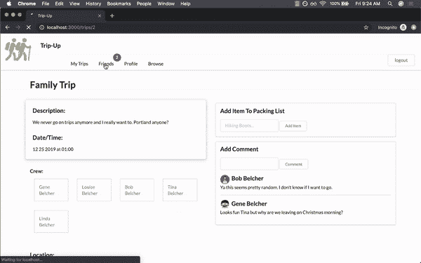

# 社交媒体——在轨道上

> 原文：<https://betterprogramming.pub/social-media-on-rails-e4b88f3d64e9>

## 潜入友谊的红宝石中


亚瑟·普林[拍摄的照片](https://unsplash.com/@barchpou?utm_source=medium&utm_medium=referral)

社交媒体改变了人们与网络应用的互动方式。

与其他用户联系和社交的能力使应用程序变得令人愉快、引人入胜和受欢迎——那么为什么不是所有的应用程序都采用这一特性呢？

虽然开发者会选择反对“友谊功能”的原因有很多，但其中一个主要因素是*难度*。

友谊关系的实现可能令人生畏，但是你可以用处理编程中任何其他问题的同样方式来处理这个挑战——通过熟悉它。

这些例子将使用带有活动记录关系的 Ruby on Rails，但是其他技术也可以使用类似的解决方案。

# 快速而强大的解决方案

在为最近的 Rails 项目工作时，我无意中发现了由 Sung Won Cho 和他的贡献团队创造的出色的 Ruby gem。

让我们开始和这颗宝石建立友谊关系吧。



1.  创建一个属性为`has_friendship`的`User`类。
2.  和所有宝石一样，将`gem “has_friendship”`添加到你的[宝石文件](https://bundler.io/gemfile.html)中，然后运行`bundle`。
3.  安装并运行提供的活动记录迁移。

```
$ rails has_friendship_engine:install:migrations
$ rails db:migrate
```

通过这个简单的设置，`“has_friendship”`已经建立了复杂的自引用连接表，并为您提供了许多优秀的方法来访问它们。

用户被分成四类，每一类都不同:

*   `requested_friends`
*   `pending_friends`
*   `blocked_friends`
*   `friends`

在使用这个 gem 的同时，我们还可以编程一个过滤方法来寻找所有零关联的用户。

```
def strangers
   users = []
   User.all.each do |user|
      if(self.friends_with?(user) != true && self != user &&       self.friends.include?(user) != true && self.pending_friends.include?(user) != true && self.requested_friends.include?(user) != true)
      users << user
      end
   end
   users
end
```

这使得调用`@user.strangers`并接收一组各方面都不相关的用户成为可能(并排除我们调用方法的用户实例)。

但是，如果您正在设计一个处理大量用户的应用程序，那么您可能希望设计更复杂的过滤方法来减少计算时间。

在这个激动人心的冒险中，我们的下一步是制作一个`FriendsController`，它可以为我们应用程序的当前用户动态地处理这些关系。

*   您的`index`动作可以显示所有当前用户`requested_friends`、`pending_friends`和`friends`。
*   你的`create`动作可能包括`@user.friend_request(User.find_by(id: params[:id]))`。
*   你的`destroy`动作可能包括`@user.remove_friend(User.find_by(id: params[:id]))`。

我添加了两个定制动作，`add`和`reject`，以便轻松运行`accept_request`和`decline_request`方法。

有了这些控制器动作，您就可以使用 Ruby on Rails 编写一个全功能的社交媒体平台了！

希望通过这个例子，您也看到了 Ruby gems 的惊人威力和开源软件的不可思议的价值。

# 更深层次的理解

与任何编程主题一样，当您跳下抽象层时，一切都会变得令人生畏。

然而，伴随着高复杂性而来的是巨大的回报，愿意深入抽象的程序员将会对他们的项目产生广泛的控制。

通过活动记录使社交媒体行为成为可能的主要因素是*自我参照关系。*

为了模拟我们用`“has_friendship”` gem 实现的一些行为，我们将创建两个迁移。

```
def change
   create_table :friendships do |t|
      t.references :friender, foreign_key: false
      t.references :friended, foreign_key: false
enddef change
   create_table :friend_requests do |t|
      t.references :requester, foreign_key: false
      t.references :requested, foreign_key: false
end
```

为简单起见，我将`foreign_key`设置为`false`。如果你希望建立正确的外键关系，请看[这个堆栈溢出帖子的顶部答案。](https://stackoverflow.com/questions/50614670/activerecordstatementinvalid-sqlite3sqlexception-no-such-table)

然后我们可以创建两个相应的模型。

```
class Friendship < ApplicationRecord
  belongs_to :friender, class_name: 'User'
  belongs_to :friended, class_name: 'User'
endclass FriendRequest < ApplicationRecord
  belongs_to :requester, class_name: 'User'
  belongs_to :requested, class_name: 'User'
end
```

在这些模型中，您让活动记录知道标签，比如`:requester`和`:requested`，都引用用户 id。

建立了这种关系后，我们就有了初始设置的最后一步。

```
class User < ApplicationRecord
   has_many :friended_users, foreign_key: :friended_id, class_name: 'Friendship'
   has_many :frienders, through: :friended_usershas_many :friender_users, foreign_key: :friender_id, class_name: 'Friendship'
   has_many :friendeds, through: :friender_usershas_many :requested_users, foreign_key: :requested_id, class_name: 'FriendRequest'
   has_many :requesters, through: :requested_usershas_many :requester_users, foreign_key: :requester_id, class_name: 'FriendRequest'
   has_many :requesteds, through: :requester_usersend
```

在这个例子中，我使用了一个荒谬的命名方案来强调与连接表保持一致的重要性。

不要觉得有义务完全复制这种语法，但是由于连接表中不正确的命名而导致的错误是常见的。

随着我们的代码变得越来越密集，让我们仔细检查我们的理解:

1.  我们有两个连接表:`friendships`、**、**、**、`friend_requests`。**
2.  这些表使用外键来建立关系，但是我们告诉它们在所有情况下都要寻找`user_ids`。
3.  当一个用户发起关系时，与另一个用户的对立关系被创建。

示例:

```
ted = User.create(name: "Ted")
amy = User.create(name: "Amy")ted.requesteds << amy
                           *ActiveRecord magic* amy.requesters.first.name
#=> "Ted"
```

一旦正确设置了这两种关系，您就可以使用 sweet 活动记录方法，例如:

```
Friendship.new(friender: ted, friended: amy)
#=> <Friendship id: 1, friender_id: 1, friended_id: 2>
```

恭喜你！如果您能够运行这两个代码块，那么您已经成功地创建了两个自引用连接表来处理朋友请求和友谊。

现在就看你了，程序员，使用这些工具来获得强大的好处。起初，处理朋友接纳和拒绝的逻辑可能很棘手，但你不是第一个经历这种斗争的人。

这里有两个示例方法:`friend_request`和`accept_request`。

```
...in User modeldef friend_request(user)
   FriendRequest.create(requester: self, requested: user)
enddef accept_request(user)
   FriendRequest.find_by(requester: self, requested: user).destroy
   Friendship.create(friender: self, friended: user)
end
```

就这样，您在 Rails 项目中建立了一个完全可定制的社交媒体平台。

毫无疑问，为 Rails 项目建立社交媒体关系有更高级的方法(像这样的[)但是理解自引用连接表总是至关重要的。](https://github.com/aasm/aasm)

社交媒体已经成为人类互动的核心元素。

希望您已经了解了我们这个社会时代数据库管理背后的一些错综复杂的东西，并且您可以应用这些知识来开发有助于将人们聚集在一起的应用程序。