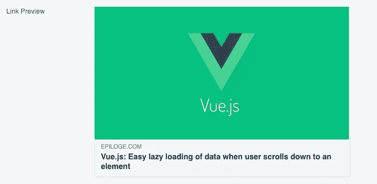

# 使用 React 和 Vue 进行社交分享，无需预渲染或 SSR

> 原文：<https://betterprogramming.pub/social-sharing-with-react-and-vue-without-pre-rendering-or-ssr-13f24cafa07c>

## 向爬虫发送带有相关元标签的简化 HTML 文件

由[帕特里克·托马索](https://unsplash.com/@impatrickt?utm_source=medium&utm_medium=referral)在 [Unsplash](https://unsplash.com?utm_source=medium&utm_medium=referral) 上拍摄的照片

你刚刚构建了你的 Vue.js 或 React.js 应用程序，包括一个不错的 API，部署它，并希望你的用户在脸书、Twitter 等上共享一个 URL。？哎呀，如果你认为流行的社交媒体网站使用的爬虫可以抓取你的 JavaScript 构建的单页面应用程序，你会失望的。

不幸的是，他们不能。Googlebot 是唯一不会停在你的`index.html`文件上的主要爬虫。截至 2020 年初，所有其他爬虫都不会执行您的 JavaScript，最终会出现一个“空白页面”，只有共享的链接。

来自脸书网址检查器的截图，加载主图片、标题和链接…脸书只能从一个 SPA 抓取信息，如果你在一个静态 HTML 文件中提供相关的元标签

# 预渲染和 SSR 不是解决这个问题的唯一解决方案

## 服务器端渲染

一旦你谷歌一下这个问题，你会发现大多数博主和教程建议的解决方案是 [Next.js](https://nextjs.org/) 和 [Nuxt.js](https://nuxtjs.org/) 等框架和服务器端渲染(SSR)。

SSR 是一种技术，每当用户或爬虫/机器人访问您的后端以请求特定的 URL 时，您的应用程序的所有 URL 都会呈现在您的服务器上。

您的后端不是发送引用您的 JavaScript 包和 CSS 的`index.html`,而是发送一个通过运行虚拟浏览器动态创建的呈现的静态 HTML。

爬虫在这一点上停止，因为它只是想从一个单一的 URL 获得信息。普通用户将看到静态 HTML，然后他们的浏览器加载你的应用程序，从那时起，使用你的网站的 JavaScript 运行版本。

听起来很容易？嗯，可以，特别是对于在 Next.js 或 Nuxt.js 中从头构建的轻量级应用程序和网站。对于更复杂的应用程序或最初在此类框架外构建的应用程序，您可能会遇到各种实现 SSR 的问题。

## 预渲染或动态渲染

因此，您可能会考虑通常用于解决该问题的其他选项:预渲染或动态渲染。对于您使用的所有静态页面，在部署应用程序之前预先渲染它们是一个非常简单的解决方案。

因为这些页面不会改变，除非您手动改变并重新部署，所以您可以在每次部署时预先呈现它们，就像在服务器端呈现一样。

不幸的是，在社交媒体网站上分享内容的用户通常不会分享简单的静态页面，如您的条款和条件或您的登录页面。

用户希望分享他们发现的内容——一篇博文、一篇文章或任何其他有趣的东西，让其他人知道他们发现了这些内容。如果这些页面是用户内容，它们的 URL 必然是动态创建的。这意味着无论何时部署应用程序，预渲染都不是一个可行的解决方案。

用户生成的动态内容的答案是预渲染的一种变体——动态渲染。第三方网站如 [prerender.io](http://www.prerender.io) 允许你预渲染 10，000 个网址，并动态添加新创建的网址。

这些第三方网站还会定期抓取所有这些网址，查看是否有更新。与 SSR 相比，这并不是一个完美的解决方案(因为预先呈现的内容不可避免地会比页面的当前状态落后几天)，但对于大多数 SPAs 来说，它很容易设置，并且运行良好，可以毫无问题地进行社交共享。

作为一个额外的奖励，你可以让搜索引擎抓取器指向这些预先呈现的页面——特别是搜索引擎，如 Bing 或 Yandex，它们不像 Google，不执行 JavaScript 来索引网站。

# 不涉及 SSR 框架或预渲染/动态渲染的第三种解决方案

当我搜索这个主题来实现我们的第一次迭代 [Epiloge](http://www.epiloge.com) 时，我遇到了一个关于堆栈溢出的参考，它几乎是说:“只要给社交媒体爬虫他们想要的东西——元标签信息。”

我很好奇这可能是一个更简单的解决问题的方法。然而，它既有缺点也有好处。

如果你不担心谷歌之外的搜索引擎，只希望在脸书和 Twitter 等大型社交媒体网站上进行社交分享，这个解决方案可能适合你。

它几乎是一个简化的服务器端渲染解决方案，不需要 Next.js 或 Nuxt.js。您创建的 HTML 页面带有一个`<head>`标签、一个简化的主体以及社交共享爬虫可以读取的所有必需的元标签。

# 在节点后端实现第三种解决方案

我们使用 Node.js 和 Express 作为 Epiloge 的后端服务器。如果您没有使用 Node.js，您应该仍然能够使用下面描述的原则。它们可以直接集成到任何后端。

## 1.从后端为您的 index.html 提供服务，以使该解决方案发挥作用

如果您已经部署了 Vue.js、React.js 或其他 SPA，并由用户直接从云平台(如亚马逊 S3)访问，而不需要用户首先访问您的后端，这里介绍的解决方案将不起作用。

你需要所有访问你的网站的流量，在我们的例子中，我们的域名[www.epiloge.com](http://www.epiloge.com)，首先到达你的 Node.js 服务器。通过这种方式，您可以检查爬虫的用户代理输入流量，同时将您的`index.html`作为静态文件提供给所有其他用户。

上面的代码很容易解释。插入一个新的快速路由，称之为类似于`nonSPArouter`的东西，只处理爬虫攻击你的服务器。您可以检查最常见的爬虫的用户代理。

在上面的例子中，我只包括了脸书和 Twitter，但你可以添加更多，如 LinkedInbot、Quora、Pinterest、Slackbot、Whatsapp、Telegram 等。

## 2.对于静态页面，对页面进行硬编码，并使用您喜欢的模板引擎提供服务

我们使用 Jade 作为模板引擎。在我们的 Node.js 服务器文件中，我们用`npm install jade`安装 Jade，并将`app.set(‘view engine’, ‘jade’)` 添加到`server.js`文件中。

这就是集成 Jade 并让它作为模板引擎工作所需的全部内容。在你的后端结构中的`/views`下创建一个`bot.jade`文件，你就可以提供静态 HTML 文件了。

## 3.对于动态页面，您需要首先从数据库中获取数据，然后将其包含在用 Jade 呈现的 HTML 中

对于我们的应用程序，我们希望社交分享特别适用于人们在 Epiloge 上分享的项目、论文和文章的 URL。

要做到这一点，我们首先需要获取标题、正文中包含的文本的开头以及相关的封面图片(如果有的话),以便在我们的`bot.jade`模板文件中设置 meta 标签。

Jade 模板引擎将呈现填充了我们从数据库中获得的信息的模板。然后，它会将呈现的静态 HTML 发送给爬虫，爬虫可以从其内容中解析任何社交共享所需的信息。

就这样，不需要对你的网站做进一步的编码或修改(图片由 [Yerlin Matu](https://unsplash.com/@yerlinmatu?utm_source=medium&utm_medium=referral) 在 [Unsplash](https://unsplash.com?utm_source=medium&utm_medium=referral) 上拍摄)

# 我们已经完成了

就是这样，不需要很多代码，也不需要任何第三方框架、插件或服务，我们就可以让社交分享网站从分享的 URL 访问数据。诀窍是简单地传递一个带有元标签的基本 HTML 文件，他们可以从中抓取信息。

这种解决方案适合并推荐给你构建和部署的每个应用吗？

大概不会。如果你有一个更复杂的应用程序，将社交分享和所有搜索引擎的搜索引擎索引作为成功的关键部分，你可能应该看看 Nuxt.js 或 Next.js 这样的框架。

如果你只有几百个或者最多几万个动态 URL，又不想用 SSR…那就看看动态渲染吧。

哦，顺便说一下，d [动态渲染](https://developers.google.com/search/docs/guides/dynamic-rendering)实际上是谷歌特别认可的，所以不要担心你不被允许这样做，你可以。

如果您已经构建了一个 Vue.js 或 React.js，不想投入大量时间和精力将 SSR 集成到您的后端，不想为动态渲染而烦恼，或者需要爬虫随时访问当前数据，这第三个解决方案可能适合您。