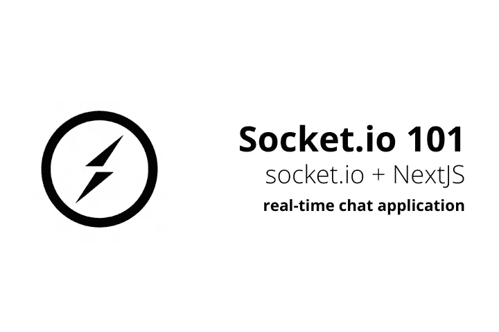
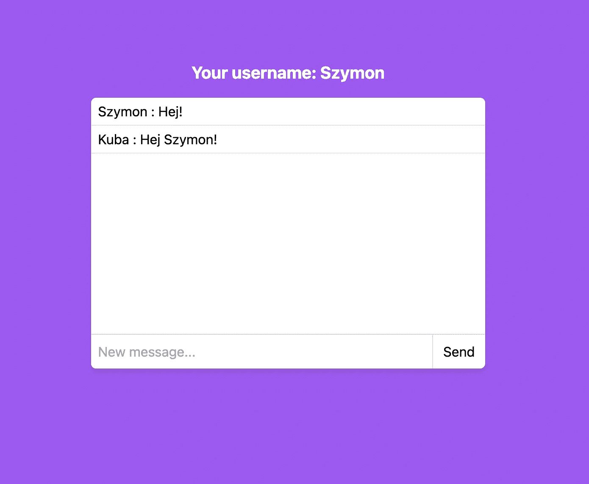
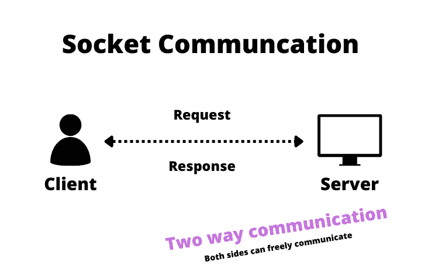

# 使用 Socket.io 和 NextJS 构建一个实时聊天应用程序

> 原文：<https://betterprogramming.pub/socket-io-and-nextjs-build-real-time-chat-application-part-1-976555ecba>

## 套接字如何工作，可以用它们做什么，以及如何用 NextJS 实现这些功能

socket.io 101

总有更多的东西可以添加到您的应用程序中。也许你已经创建了一个漂亮的仪表板，但是你不希望你的用户每次有新的东西时都刷新站点。

也许您想在新邮件出现时发送通知。也许你一直想创建一个像 agar.io 这样的多人实时游戏。

可能性是无穷的。但是对于不同类型的努力，你需要不同的工具。在本文中，我将带您完成构建这样一个实时聊天应用程序的必要步骤:

我们今天要建造什么

如果你更喜欢使用代码，这里有一个 Github 项目。

# **什么是插座？**

除非您是 Linux 程序员，否则了解套接字下的所有理论并没有太大的价值，所以我们不要一头扎进兔子洞。我在这里给你你需要的一切，这样你就可以开始创建很酷的应用程序。Sooooo..什么是插座？

套接字是两个设备之间的通信端点。这是一个定义。在我看来，理解套接字真正带给我们什么的最简单的方法是将其与非套接字通信进行比较。

## **客户端-服务器(单向)通信**

客户端-服务器通信表示

在现代网络中，互联网上的大多数通信都是客户端-服务器类型的——大多数 API 和网站都是以这种方式工作的。客户机-服务器通信的真正含义是客户机必须询问服务器才能得到答案。服务器无法初始化通信，因此服务器无法真正通知用户任何事件。

## 套接字(双向)通信

套接字通信表示

在套接字通信中，一旦建立了通信，双方就可以自由地互相发送消息。建立通信后，无需初始化通信。现在，服务器可以通知用户例如新消息，并且用户可以对其做出反应。这种情况下的通信是基于事件的。

## Socket.io 架构

为了建立双向通信，我们需要一个服务器和一个客户端。因为我们使用 NextJS，所以我们的服务器端将被放在 NextJS API 文件夹中，而客户端将被编码到需要它的每个页面中。所以总的来说，我们将有一个服务器(如果流量很大，有可能有多个服务器)和每个客户端一个连接。让我们从服务器端开始。

## **套接字服务器代码**

在 API 文件夹中创建一个`socket.tsx`文件。因为 NextJS API 文件夹充当服务器，所以我们需要在这里设置一个。我们通过检查`res`套接字属性来检查套接字连接是否已经建立。基本上，我们希望为整个应用程序创建一个服务器实例。如您所见，我们首先检查 server.io 属性是否存在，如果存在，这意味着我们已经有了一个服务器。如果没有，我们创建一个新的，然后，我们分配 emit 处理程序，我将在下一步向您展示。

值得注意的是，虽然我们可以用几乎任何名字创建事件，但也有一些特殊的。“联系”就是其中之一。其他的例如:“连接错误”、“断开”等。您可以在文档中查看完整列表[。](https://socket.io/docs/v4/emit-cheatsheet/#reserved-events)

在 connection 上设置不同的事件处理程序是正确的做法，因为我们必须确保套接字存在，并且回调函数仅在套接字创建后被调用。

虽然您可以在`onConnection`函数中创建所有的事件处理程序，但是我们会考虑到干净的架构来做这件事。因为我们只有一个不会改变太多的事件，但是如果你有很多这样的事件，这将允许你很好地组织它们，并按不同的功能对它们进行分组。消息处理程序如下所示:

如您所见，惯例是首先在顶部定义处理程序，然后将它们分配给正确的事件。这段代码意味着，如果客户端发送`createdMessage`事件，它将由一个名字类似的 functio️n.处理

说到服务器端就这些了。现在让我们关注客户端。

# **客户端 App 代码**

所有的客户端代码都放在一个文件中:`index.tsx`。我们创建一个全局套接字变量，这样它就不会每次都被重写，然后我们创建一个消息类型并设置一些`useState`值。到目前为止一切顺利。在`useEffect`中，我们运行一个`socketInitializer`函数。因为我们使用 NextJS API 作为服务器，所以我们必须获取(`/api/socket`)端点，该端点将触发我们在上一步中创建的逻辑。这是必要的，因为为了从客户端连接到服务器，我们首先需要确保服务器存在。

之后，我们分配一个 io 实例，将其分配给一个套接字，并创建一个事件监听器。

# **发射事件**

因为我们已经创建了一个套接字服务器、客户端以及事件处理程序，所以让我们在用户想要发送消息时发出一个事件。如果您想要通知通信管道的第二端，您需要调用 emit 方法，其中第一个参数是事件的名称，所有后面的参数都是回调函数的参数。您可以拥有任意多个这样的函数，只要记住在函数声明中指定它们。

在这个特定的场景中，我们还将消息添加到我们在聊天中显示的消息数组中。这样做的原因是，当我们可以立即保存它时，首先将它发送到服务器，然后再将其发送回客户端是没有多大意义的。这就把我们带到了下一个话题:

# **不同类型的发射**

因为使用 socket.io 有很多不同的可能性，所以发送事件也有很多不同的方式。您可以`emit`将它发送给除发送它的客户之外的所有客户(就像上面的例子一样)，您可以`broadcast` 将它包括发送它的客户，或者您可以只发送给一个房间(是的，您可以在那里有房间)。你肯定知道你能使用什么，socket.io 在他们的文档中有一个极好的备忘单。

# **前端**

本教程的最后一部分是定义前端，这非常简单。我们只需遍历 messages 数组，显示所有消息，如果用户按下 send 按钮或 enter 键，就会发送一条消息，顺便说一下，您可以通过这样做来实现:

总的来说，前端代码如下所示:

# 摘要

如你所见`socket.io`并不可怕，而且超级强大。它允许你建立交互式实时仪表盘，多人游戏，等等。简而言之，它允许你建立更有活力的网站。

如果你想深入了解，你可以订阅我的时事通讯，阅读本系列的下一部分，或者直接阅读[文档](https://socket.io/)。

请随时在 [Twitter](https://twitter.com/szymon_kolber) 上关注我。

而这里有一个 [Github 回购](https://github.com/kolberszymon/socket-chat-app)。

祝你有愉快的一天。