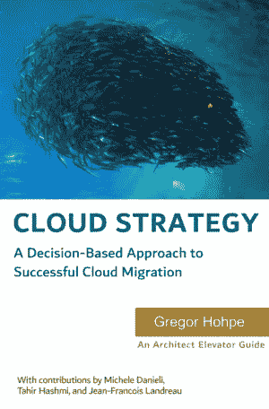
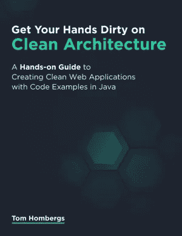
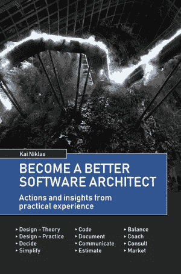
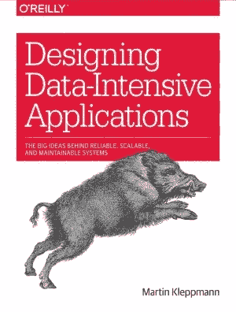
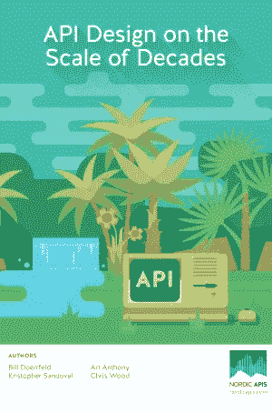

# 2021 年我最好的软件架构书籍

> 原文：<https://betterprogramming.pub/software-architecture-my-best-books-in-2021-bc9ac9bf42af>

## 还有四条建议

汤姆·赫曼斯在 [Unsplash](https://unsplash.com?utm_source=medium&utm_medium=referral) 上的照片

软件架构是设计软件组件和它们之间的交互的活动。软件处于不断的进化中，架构师负责指导这种进化并维护整个系统的完整性。

下面的书是我最喜欢的 5 本软件架构书。在这个领域有很多有价值的书，但是让我们从这些开始吧。

# 1.云战略— Gregor Hohpe

云策略是旨在设计云迁移策略的架构师的必备要素，但不仅限于此。它涵盖了迁移到云的技术和人力组织。

对我来说，这是任何架构师初学者，甚至是设计云应用的专家的必读之作。

# 2.让你的手弄脏干净的建筑——汤姆·霍姆伯格

如果你是一名 Java 开发人员，并且你需要通过应用六角形架构来创建一个 web 应用程序，这本书就是为你准备的。

顾名思义，这本书专注于提供干净架构模式的实现解决方案。

# 3.成为更好的软件架构师——Kai Niklas

如果你在问自己软件架构是否适合你，或者需要具备哪些技能，我认为这本书可以提供很多见解。这本书解释了需要具备的硬技能和软技能，以及它们之间的相关性。

这本书也可以帮助软件架构师理解和组织他们的日常工作。我很喜欢读这本书，并且认为它也可以被那些只想了解软件架构过程的人所阅读。

# 4.设计数据密集型应用——Martin Kleppmann

如果数据处理对你很重要，这本书一定在你的书架上。这本书描述了设计面向数据的应用程序的最佳实践和模式。

您可以找到对基本概念的有价值的解释，如可伸缩性、数据模型、存储…以及分布式数据设计和处理的模式。

# 5.数十年规模的 API 设计——Bill doerfeld

如果你的目标是设计一个 REST API，管理 API 版本，微服务，API 安全，OpenAPI 概念，…这本书会帮助你。

除了 API 设计，这本书还介绍了微服务、API 设计反模式、API 管理技术和汽车行业的例子。

# 外卖食品

除了这 5 本书，我强烈推荐以下几本:

*   干净的建筑——罗伯特·马丁
*   站点可靠性工程——贝齐·拜尔、克里斯·琼斯、詹妮弗·佩托夫和尼尔·理查德·墨菲
*   一个架构师知道的关于 IT 转型的 37 件事— Gregor Hohpe
*   微服务:模式和应用——卢卡斯·克劳斯