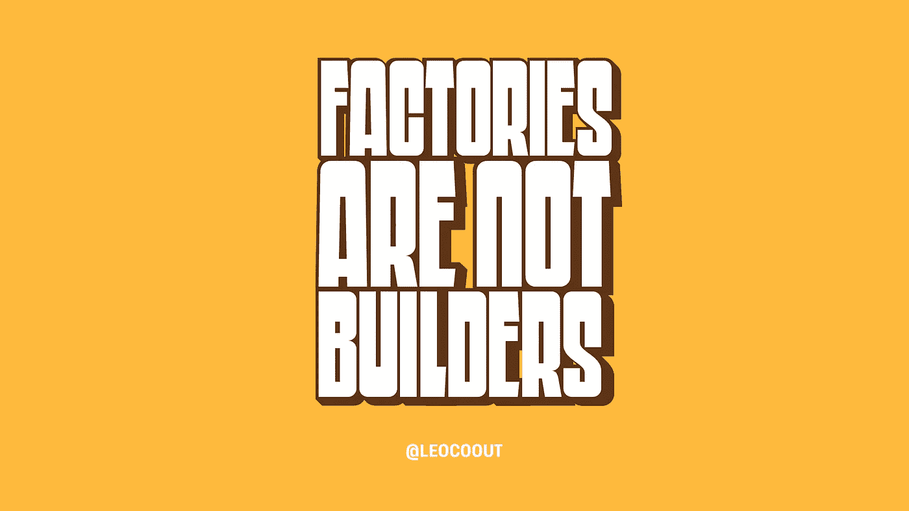
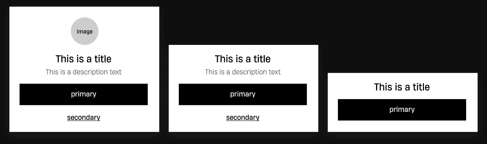

# 软件设计模式:工厂不是建设者

> 原文：<https://betterprogramming.pub/software-design-patterns-factories-are-not-builders-dc4c1297de8f>

## 工厂设计模式和构建器设计模式的区别

当你需要软件工程中常见问题的典型指南时，设计模式是有用的，了解它们的存在将帮助你找到最适合你的问题的解决方案。

我见过工厂像构建者一样被实现，反之亦然，这样的实现会导致混乱，并阻止我们使用它们的全部功能。我希望这篇文章能帮助您找到这两种模式之间的区别以及它们的常见实现。

# 问题

有时我们必须构建需要显示某种信息的组件，它会根据给定的信息量进行调整。

为了给你一个常见问题的基本示例，我设计了这种底部表单组件，根据所提供的内容有不同类型的“样式”。

该图显示了简单底部表单组件的三种样式

# 第一个解决方案:工厂方法模式

[*工厂方法*](https://refactoring.guru/pt-br/design-patterns/factory-method/swift/example) 模式是一个创造性的设计模式，负责为对象初始化提供一个简单的接口，不需要暴露任何具体的类。基本上，是一个负责初始化其他对象的对象。

作为另一个例子，你可以为这个对象使用一个包含多个样式的`switch`，比如`.small`、`.medium`和`.large`

我们知道，根据项目规模的大小，这种转换会变得非常复杂，所以如果发生这种情况，您可以为您的样式创建更多包含隔离逻辑的工厂。例如，您可以将`.large`逻辑提取到`LargeBottomSheetFactory`。

# 第二个解决方案:构建器模式

[*Builder*](https://refactoring.guru/pt-br/design-patterns/builder/swift/example)*模式是一种创造性的设计模式，在 Java 之类的语言中比 Swift 更常见。其主要思想是，它允许我们一步一步地构建产品，使用方法按照我们想要的方式设置对象，并在最后使用一个方法来构建它，而不暴露对象的创建/配置和属性。*

*如您所见，除了`build()`之外的所有方法都返回`Self`(也就是构建器本身)。这样做使我们能够创建一个“链式”构建器实现。构建器背后的思想是，组件的构建取决于您传递给构建器的信息量。*

*构建器模式也允许我们创建`Director`类。这些类基本上是依赖于构建器的对象，并为其他对象提供了一个简化的接口来构建产品，而无需直接使用构建器，正如您在下面的示例中所看到的。*

# *我应该使用哪一个？*

*如果您想要创建一个具有许多可能配置的对象，但不需要在构建它时拥有所有信息，那么您可以使用生成器设计模式。这种模式提供了一个简单的接口来隐藏复杂的对象任务，允许我们私有化许多公共属性，并减少了保持可变状态的需要。*

*当您需要封装初始化某个对象的逻辑时，您也可以选择使用工厂设计模式。这种模式保证您可以简化跨代码创建对象的方式，避免将创建委托给子类，并避免代码重复，因为您不需要一次又一次地传递它的所有依赖项。你们都集中在一个地方，工厂。*

# *结论*

*这两种模式都是创造性的设计模式，为我们提供了具有灵活性和可伸缩性的对象初始化机制，不需要直接访问对象属性或初始化器，但是正如您所看到的，它们是不一样的。当然，没有“最好的”，所以你会选择那些最适合你的问题的。*

*现在，您应该能够正确地识别和应用这些模式。*

# *参考*

*   *[工厂方法——重构大师](https://refactoring.guru/pt-br/design-patterns/factory-method/swift/example)*
*   *[构建者模式——重构大师](https://refactoring.guru/pt-br/design-patterns/builder/swift/example)*
*   *[通过教程书设计模式](https://www.raywenderlich.com/books/design-patterns-by-tutorials/v3.0)*
*   *[Sundell-Builder 模式的 Swift](https://www.swiftbysundell.com/articles/using-the-builder-pattern-in-swift/)*