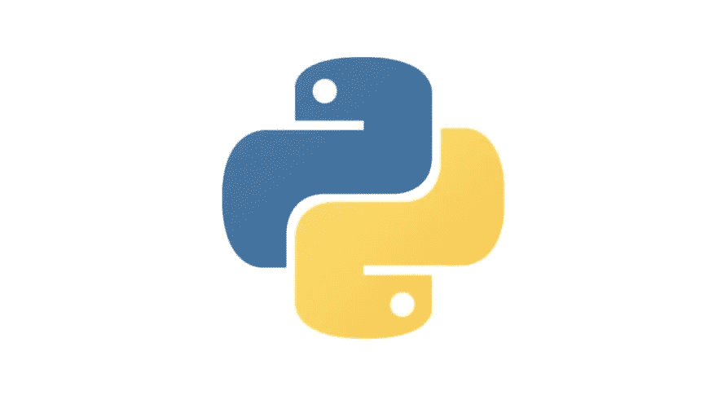
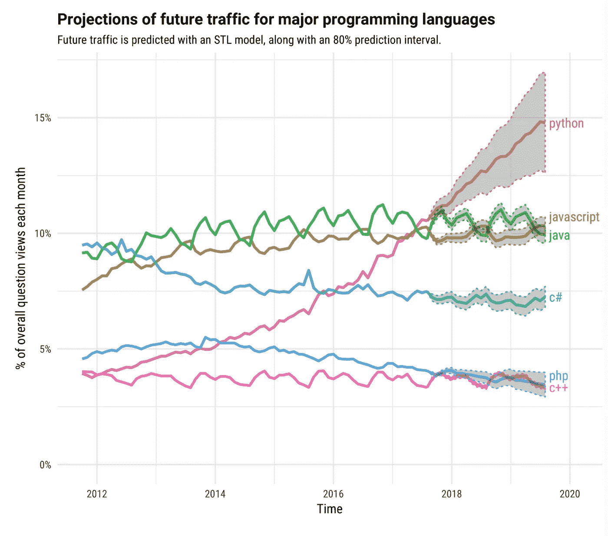
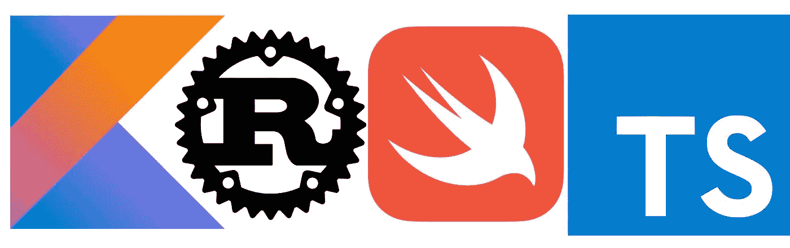
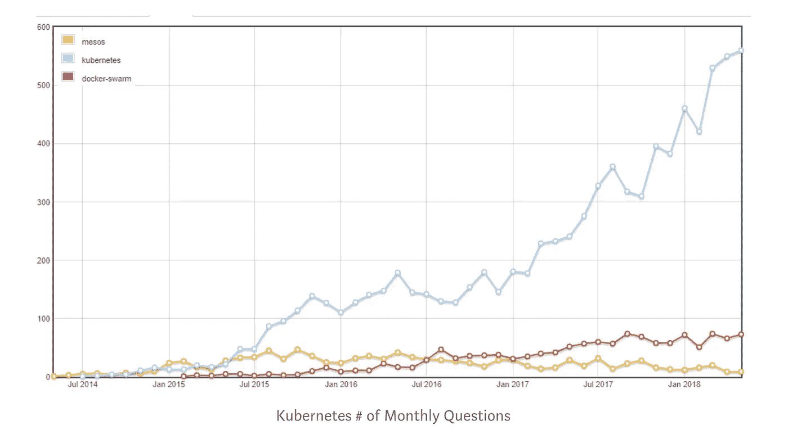
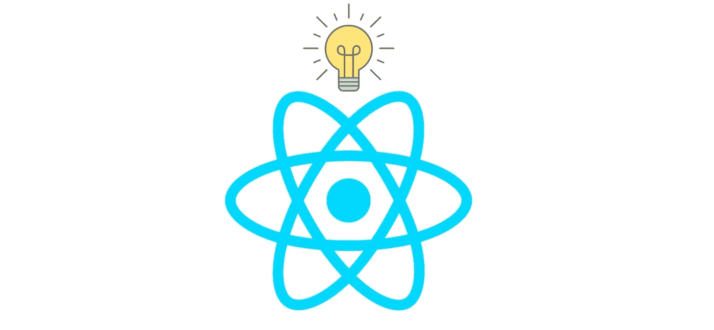
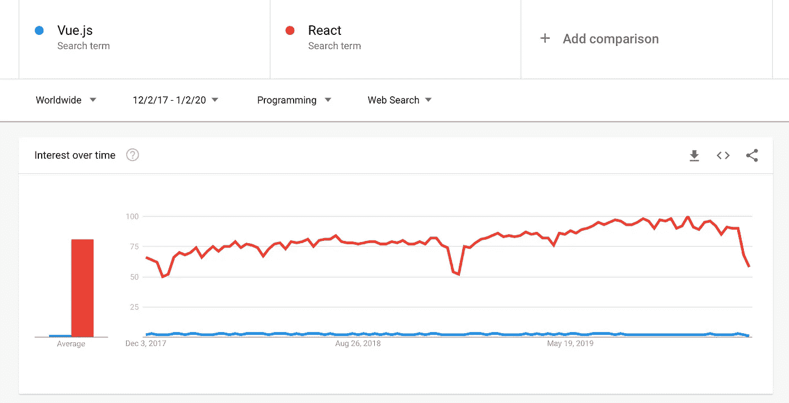
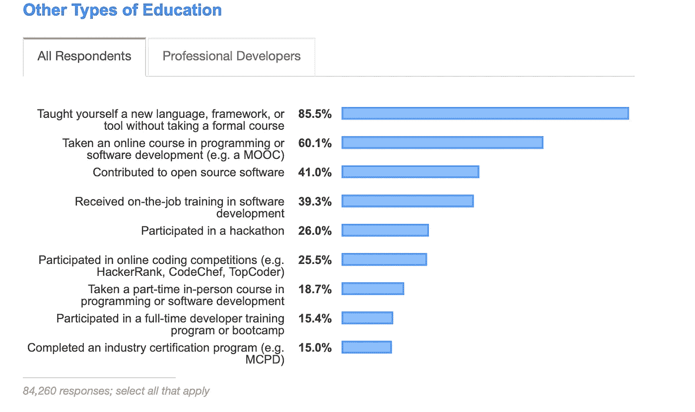

# 2020 年及以后的软件开发趋势

> 原文：<https://betterprogramming.pub/software-developer-trends-of-2020-and-beyond-d1b955bc46b8>

## 我们预测未来几年的 8 个重要趋势

哈帕尔·辛格在 [Unsplash](https://unsplash.com/s/photos/icons?utm_source=unsplash&utm_medium=referral&utm_content=creditCopyText) 上的照片

新的十年即将来临，随之而来的是我们将在技术领域看到的变化和趋势。软件开发已经变得越来越不可或缺，几乎渗透到了世界的每一个角落，所以软件开发的发展和变化对我们的生活有着巨大的影响。虽然我们不能总是准确预测科技的未来，但我们预计一些趋势将持续到新的十年。

让我们讨论一下我们预计在 2020 年及以后会看到的八个软件发展趋势

# 1.人工智能将继续占据主导地位

虽然人工智能已经存在多年，但它每年都在继续增长和增强，成为世界上许多技术的基础。开发者预测，随着越来越多的行业在其基础设施中采用人工智能，人工智能将继续占据主导地位。

2020 年的最大趋势表明，医疗保健、教育、旅游行业和社交媒体将使用人工智能进行个性化体验、援助和预测服务。人工智能将成为整个行业的新竞争优势，改变我们对人类参与和资源的思考方式。深度学习框架 Tensorflow 2.0 预计将主导市场。

# 2.Python 预计将随着人工智能和人工智能的发展而崛起

从 ML 研究到视频游戏开发，再到 web 开发，Python 一直被证明是一种流行且深受喜爱的语言。由于人工智能和人工智能的发展正在上升，预计 Python 将继续稳步增长和流行，特别是令人印象深刻的创新，包括人工智能驱动的聊天机器人。

虽然“发展最快”的语言的概念可能很难确定，但数据表明 Python 可能会独占鳌头。Python 不仅被用于各种流行的领域和工作，而且它的进入门槛很低，并有一个由最新一代开发人员培养的支持社区。

*图片来源:* [*堆栈溢出*](https://stackoverflow.blog/2017/09/06/incredible-growth-python/)

# 3.5G 可能是为开发者打开大门的下一件大事

*图片来源:*[*The Verge*](https://www.theverge.com/2017/2/8/14550116/5g-3gpp-logo-specification-cellular-standard)

2020 年 5G 进入市场。这种令人兴奋的更快的网络给开发者带来了新的问题。尽管存在缺点和争议，5G 有可能彻底改变手持设备，并为开发人员打开分布式技术的大门。它为开发人员提供了开发更强大的应用程序和增强现实功能的机会。总体而言，5G 预计将改变世界——从为智能城市供电，到改善交通系统，再到增加网络扩展容量。

当然，5G 的处理能力也带来了开发者必须解决的问题——例如最近对天气预测技术的[担忧](https://www.sciencemag.org/news/2019/08/forecasters-fear-5g-wireless-technology-will-muck-weather-predictions)或对覆盖不良的[抱怨](https://thewirecutter.com/blog/dont-buy-a-5g-phone-yet/)。不管前面有什么挑战，这项技术是有前途的，值得投资。

# 4.边缘和云计算的使用预计会增加

伴随 5G 而来的是[边缘计算](https://www.theverge.com/circuitbreaker/2018/5/7/17327584/edge-computing-cloud-google-microsoft-apple-amazon)的潜力:一个分散的计算基础设施。边缘计算的高度分布式模型(有时称为雾计算)可能有助于克服云计算的缺点。这些发展可能是计算和工业的未来。事实证明，云计算对公司基础设施至关重要，随着网络安全问题的持续存在，各行各业的大公司都在将云计算作为解决方案。

最重要的是，到 2020 年底，[全球公共云服务收入](https://www.gartner.com/en/newsroom/press-releases/2019-11-13-gartner-forecasts-worldwide-public-cloud-revenue-to-grow-17-percent-in-2020)预计将从 2278 亿美元增长到 2664 亿美元。据预测，作为云计算能力的升级，边缘计算正在兴起。事实上，[全球边缘计算市场](https://www.statista.com/statistics/948744/worldwide-edge-computing-market-size/)预计将从 2018 年的 14.7 亿美元增长到 2025 年的 268.4 亿美元。

# 5.预测将会突破的语言:Rust、TypeScript、Kotlin 和 Swift

在过去的十年中，数百种编程语言被创造出来。这种从过去的单一语言的转变使开发人员能够使用专门的语言工作，这些语言更加关注开发人员的人机工程学和硬件的现代化开发。编程语言的多样性增强了开发者的能力，[强化了行业](https://stackoverflow.blog/2015/07/29/why-are-there-so-many-programming-languages/)，并将我们的注意力转向解决人类问题。 [StackOverflow research](https://insights.stackoverflow.com/survey/2019#most-loved-dreaded-and-wanted) 指出，2020 年将崛起的四大现代编程语言是 Rust、TypeScript、Kotilin 和 Swift，Rust 在过去的四年中连续位居第四。

# 6.Kubernetes 作为战胜 Mesos 和 Docker 群的胜利者出现

随着云计算的兴起，容器化应用也随之兴起。在这方面，Kubernetes 已经成为明显的赢家。随着云技术继续与我们的世界融合，Kubernetes 将成为各地开发人员的重要工具。研究表明，Kubernetes 的受欢迎程度持续上升。[开发者预测](https://opensource.com/article/20/1/kubernetes-2020)到 2020 年，我们将会看到这种流行应用的最佳实践和标准化的兴起。

# 7.Web 框架:React 继续发光

React 对 web 开发产生了巨大的影响，带来了对所有开发人员都有用的易用性和创新性。在过去的一年中，它已经成为最具统治地位的 JavaScript web 框架，统计数据表明这种情况将会持续数年。尽管其他框架，比如 Vue，提供了它们自己独特的功能，但是由于其灵活性和健壮性，许多人更喜欢使用 React。而且，由于 React 得到了脸书的支持，它作为 web 开发的标准只会在业界继续上升。看看这些谷歌趋势，看看自 2017 年以来，React 在全球范围内的利益有多远。

*图片来源:* [*谷歌趋势*](https://trends.google.com/trends/explore?cat=31&date=2017-12-02%202020-01-02&q=Vue.js,React)

# 8.软件开发进入门槛降低:自学成才的程序员在增加

尽管科技行业有着普遍的看法，但软件开发的供需之间还是存在差距。随着全球大学学费的上涨，越来越少的人转向昂贵的计算机科学学位。未来几年，软件开发人员的准入门槛预计会降低，为自学成才的开发人员腾出空间。此外，一些开发人员预测，在不需要持有 CS 学位的程序员的情况下，企业创新的 [LCNC 开发](https://blog.axway.com/amplify/mobile-app-dev/low-code-no-code-development)(低代码、无代码开发)将会增加。

在线学习平台是行业转变的原因之一。Educative 为所有级别的开发人员提供大学水平的课程，以提高他们的编码技能，并以低成本、无压力地学习新语言。2020 年的目标是让世界各地的人们能够在没有大学经济负担的情况下加入发展的世界。

