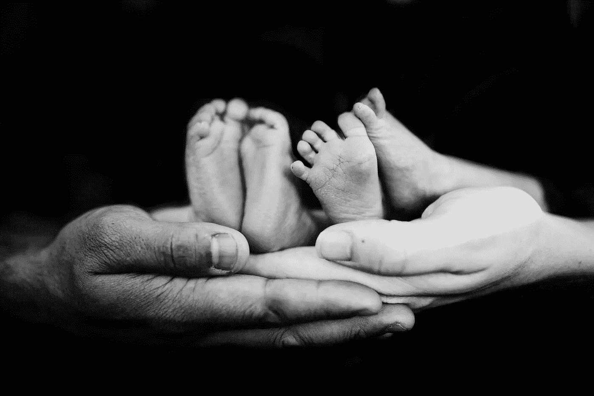
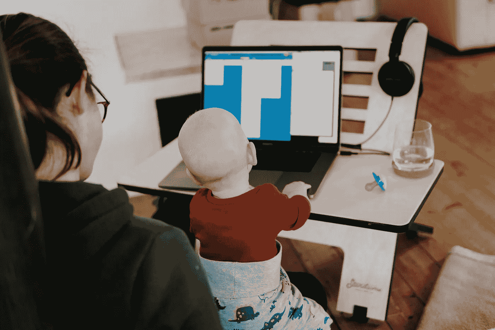
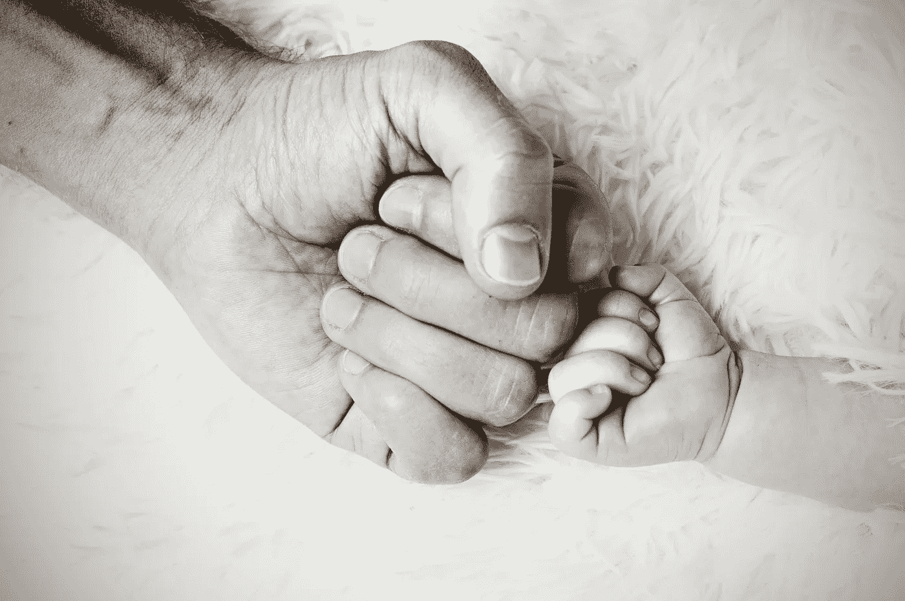

# 软件开发和父亲身份

> 原文：<https://betterprogramming.pub/software-development-and-fatherhood-ee742c6e232e>

## 在全球疫情期间，我是如何抚养双胞胎和建造东西的

法伦·迈克尔在 [Unsplash](https://unsplash.com/s/photos/twins?utm_source=unsplash&utm_medium=referral&utm_content=creditCopyText) 上的照片

去年 9 月 1 日凌晨，我和妻子迎来了我们的宝宝，一对双胞胎男孩和女孩。在怀孕 38 周时，他们准时到达，如果你计算一下，你会注意到这些不是被禁闭的婴儿——他们是在新冠肺炎开始改变一切之前怀上的。

在撰写本报告时，他们刚刚六个月大。从那以后，我们的生活发生了转变——一切都变得天翻地覆！有了孩子是我们一生中最美好的事情，但如果我不指出这种奇迹般的生活节奏变化伴随着一系列预期和意外的挑战，那将是我的失职。

继续读下去，听听我对软件开发人员在全球疫情期间成为双胞胎父母的体验。

# 背景

由于这是一个完全个人的帐户，这里有一点关于我自己。我是一名软件工程师。更准确地说，我认为自己是一个问题解决者。我喜欢玩游戏，主要是(但不仅仅是)数字游戏。对我来说，游戏是有趣的解决问题的练习，并且很早就为我的软件开发职业做好了准备。我和妻子在 2015 年搬到了加拿大。您需要或可能想了解的关于我的其他信息包括:

*   我爱我的家人和朋友——我爱的人永远是我的第一要务。
*   我真的很喜欢我的工作——对我来说，编程可以在适当的时候放松，没有什么比追踪和修复一个难以捉摸的 bug 更令人满意的了。
*   我是一个职业驱动型的人，总是希望在我所做的事情上做得更好，无论是硬技能还是软技能。
*   我喜欢安静的环境，就像我妻子一样。
*   我们是一个宠物友好型家庭:我们收集的宠物包括一只柯基犬、一只兔子、一只大胡子龙和 18 只狼蛛。

好了，背景介绍完毕，让我们开始故事吧。

# 介绍

那么什么是*就像在疫情里抚养双胞胎一样？一句话，这是我经历过的最有收获、最辛苦、最充实、最疲惫、最有益健康、最可怕的事情。这是一种权衡、不断优先化和重新优先化的平衡行为，以及突然和惊人地意识到“计划”这个概念已经从你的个人字典中消失了，取而代之的只是“看即兴创作”*

# *变得擅长上下文切换*

**

*在 [Unsplash](/s/photos/multitasking?utm_source=unsplash&utm_medium=referral&utm_content=creditCopyText) 上[站着的工作生活方式](https://unsplash.com/@standsome?utm_source=unsplash&utm_medium=referral&utm_content=creditCopyText)的照片*

*疫情带来了广泛的在家工作(WFH)安排的开始，同样的事情也发生在我身上。虽然这无疑是一个巨大的祝福，但它也面临着一系列挑战。像任何解决问题的活动一样，编程需要专注——思考一条逻辑，获得正确的语言语法，探索边缘情况，等等。进入心流状态后，我的效率最高。*

*然而，婴儿也有需求。当需求出现时，甚至在他们自己意识到他们需要某样东西之前，就需要被满足。而且有他们两个，一个人总是无法管理，所以我在那里帮忙是很好的。这只是意味着我的工作经常被打断，所以精通多任务处理以便在我离开电脑的时候不会失去思路是很重要的。这听起来可能是一件小事，但这是我经历中最大的挑战之一。*

*我经常遇到的一个相关但略有不同的问题是，抚养孩子和供养孩子会带来一系列全新的约束和风险因素。婴儿什么时候需要看哪个医生，他们需要吃多少和睡多少，如何在不同的时间表上兼顾两个孩子，保持清洁和适合年龄的瓶子，瓶子部件，瓶子加热器，瓶子清洁器——这只是众所周知的冰山一角。*

*这一切都在意料之中——我们对此没有失望。我没有想到的是所有这些会占用的顶部空间。在工作中保持正轨并产生预期的结果比以往任何时候都需要更多的注意力，因为一百件其他事情，没有一件是不重要的，一直在争夺我注意力的最大份额。*

# *安全与支持*

**

*在 [Unsplash](/s/photos/support?utm_source=unsplash&utm_medium=referral&utm_content=creditCopyText) 上[黑克明特尔](https://unsplash.com/@erstbelichtung?utm_source=unsplash&utm_medium=referral&utm_content=creditCopyText)拍摄的照片*

*还记得我说过的权衡吗？嗯，我不需要告诉你生活在封闭和社会距离中的现实。如果我必须指出疫情对我们有双胞胎婴儿的家庭的最大影响，那就是，你只能选择一个，而不是保持安全并从家人和朋友那里获得帮助。对我们来说，选择很简单，但也不容易:安全第一。*

*我们唯一能经常见面的人是我妻子的父母。由于担心病毒，与其他家庭成员甚至密友的探视要么极其罕见和短暂，要么根本不存在。再加上寒冷的天气(低于零下 20 摄氏度)，这样做的结果是，充其量，我们感到孤立，孩子们很快在家里感到无聊。更糟糕的是，在最需要的时候，疲惫和睡眠不足却没有缓解。世界各地的父母都知道，随着时间的推移，事情会变得更容易，他们也是如此，但选择安全而不是支持的挑战将继续存在，因为日托、找保姆和让孩子接触尽可能多的事情变得越来越重要。*

# *让它工作*

**

*吉尔·Á·阿尔瓦雷斯在 [Unsplash](/s/photos/achievement?utm_source=unsplash&utm_medium=referral&utm_content=creditCopyText) 上的照片*

*尽管生孩子会带来很多挑战，但我相信它给了我变得更好的机会——一个更好、更有同情心、更有同情心的人，以及一名更好的软件工程师。这并不是说事情变得容易了，而是我对不断变化的环境的适应能力大大提高了。尽管不得不在工作和帮助照顾孩子之间取得平衡，我的表现并没有下降。如果有的话，我认为它实际上增加了，因为我能够很快重新集中注意力。它还帮助我在实现新功能时避免了狭隘的观点。考虑一套更完整的替代方法、用例以及边缘案例，将会使任何一项工作更加深思熟虑，从而变得更好。*

*不管抚养孩子带来的工作和问题，我很高兴成为一名父亲，并希望尽我所能正确抚养这些小家伙，给他们最好的生活开端。毅力和决心可以克服挑战，对我们来说，生孩子的回报是不可估量的。我期待着为我的孩子们解决所有的问题——并且和他们一起解决——宇宙可能会抛给我们的问题！*