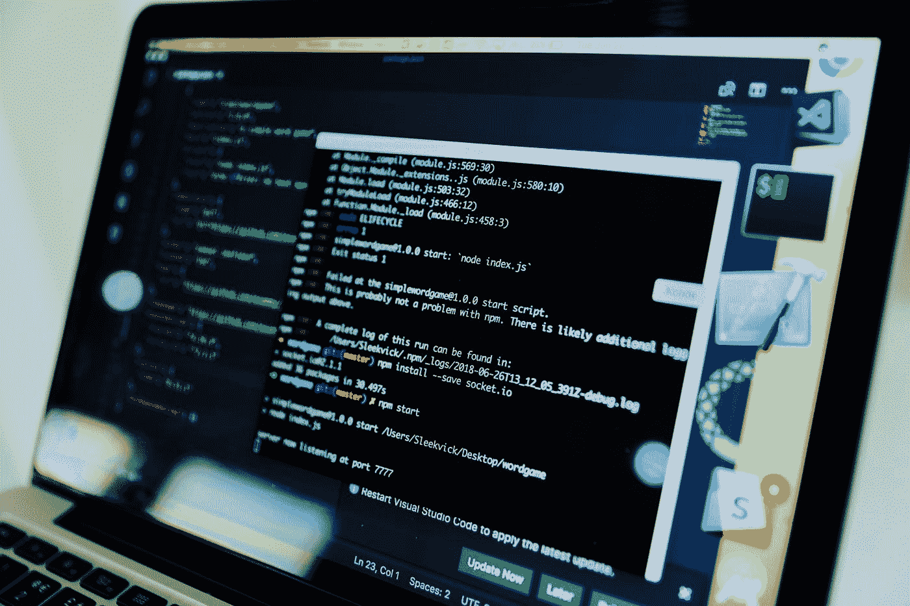

# 《谷歌的软件工程》:这是我从这本书中学到的三个重要观点

> 原文：<https://betterprogramming.pub/software-engineering-at-google-heres-three-crucial-insights-i-learned-from-this-book-9306ba0c3264>

## 在现实世界中设计软件的技巧

照片由 [Desola Lanre-Ologun](https://unsplash.com/es/@disruptxn?utm_source=medium&utm_medium=referral) 在 [Unsplash](https://unsplash.com?utm_source=medium&utm_medium=referral) 拍摄

从大学项目或小型软件应用程序转移到大规模软件工程应用程序有时会令人望而生畏。有些东西你只能通过痛苦的尝试和生产中的错误来学习。幸运的是，有一些关于生产软件工程的好书。我最近在读《谷歌的软件工程》，我想分享一下这本书里一些有用的见解。开始了。

# 复杂性

软件工程师通常忽视或低估的一个非常重要的事情是软件系统在未来将达到的高度复杂性。

当然，如果您正在构建一个只使用几个月甚至一年的项目，这是没有问题的。然而，如果你正在建造一个可以使用 10 年、20 年甚至 30 年的东西，这就成了一个问题。尤其是如果你想让你的软件被数百万甚至数十亿人使用，在设计、架构和构建系统时，有一些非常重要的概念你必须牢记在心。

这些概念可能很难掌握，尤其是从向业务涉众证明它们的角度来看，因为它们有些无形，并且不会产生直接的业务价值。

它们的商业价值有些延迟，只有在未来才能实现。一个高质量的项目经理将能够意识到花费额外的时间和资源来与这些概念保持一致的价值。

# 可维护性

最初的概念之一是系统的可维护性。Hyrum 法则强调了有效软件和可维护软件之间的区别:

“有了足够数量的 API 用户，你在合同中承诺什么并不重要:你系统的所有可观察到的行为都将依赖于某人。”

清单上的下一个也很重要。

# 规模和效率

拥有一个在高低尺度下都能以相同方式运行的系统并不是一件小事！一个特定的新角色正在被广泛寻找，它被称为站点可靠性工程师。

你会对大型科技公司中的工程师数量感到惊讶，他们的工作仅仅是为了适应未来更高的负载而改变系统的基础设施和后端。从技术上来说，这些工程师不会构建新的 API 端点或外部客户会使用的花哨功能。

然而，他们正在构建的东西使其他团队能够轻松地构建那些特性。构建高效的分布式系统是一个相对较新的领域，除非你在大的技术领域，否则没有必要。因此，这种事情的在线资源不仅仅是简单地构建一个基本的应用程序或一些标准功能。

例如，在很多情况下，技术领导根本不知道如何决定何时将一个整体分解成一个分布式系统。这并不像你会谷歌一个这样的问题，并立即采取措施来解决这个问题。

然而，你会找到一些指引你前进的方向。但是之后你开始问一些更不明确的问题，比如你如何划分整体构件？

哪些团队将处理哪些部分？在这样的任务上花费的时间值得吗？它会改变团队工作的流程吗？

回答这些问题可能需要时间进行研究，向有经验的专业人士咨询，并在多个团队甚至部门之间达成共识。这是你在做小规模的副业项目时永远不用处理的事情之一。

# 感谢阅读

我希望您喜欢这个关于软件工程在生产中带来的一些挑战的快速讨论。我将会发布越来越多的这些想法。其中一些想法受到了这本书的启发(你可以在这里查看这本书)，但大部分的分类来自我在科技公司工作的经历。

*敬请关注。*