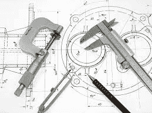
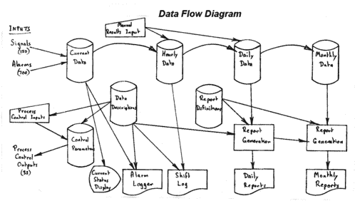
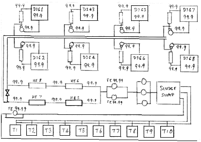

# 1980 年的软件工程

> 原文：<https://betterprogramming.pub/software-engineering-in-1980-5c61e3fc3da7>

## 如果说我 50 年的 IT 职业生涯有什么“收获”的话，那就是在每种情况下总是使用正确的工具


照片由[弗兰克·奥凯](https://unsplash.com/@frankokay?utm_source=medium&utm_medium=referral)在 [Unsplash](https://unsplash.com?utm_source=medium&utm_medium=referral)

我的父亲是一名木匠/建筑工人，澳大利亚人对锤子有一个相当古老的贬义表达——它被称为“美国佬螺丝刀”,在那里甚至连螺丝钉都被当作钉子。

即使有更好的工具，对每项工作都使用单一的工具也是一个典型的例子。(“Yankee”品牌工具可以追溯到 WW1 时代，通常是一种螺丝刀类型的工具，具有可互换的钻头，并且通常具有推拉棘轮作用)。



【dreamstime.com 图片，免版税

# 一些回顾

1966 年，我在一所学校的科学学生营地学习了第一门编程课程,在第一年，我获得了普通科学学位，包括编程、数值方法和数据分析。我三年级的主修科目是计算机科学(1969)，包括 5 或 6 种不同的语言，从汇编语言到函数语言再到面向对象语言([simula 67](https://en.wikipedia.org/wiki/Simula)—ALGOL 60 的模拟扩展预处理器)。任务/项目的范围从日常工作到带有透视绘图的 3D 建模，再到数字电路模拟。辅修科目是物理和纯数学。

然后我花了一年的空档时间在一个生化实验室自动化系统上工作。

我回到大学，在一台小型计算机上进行数据库管理的研究生研究，然后用它来研究演绎逻辑处理。

虽然我的计算机方向是技术性的，但我可以看到我最好的未来是在商业世界，所以我参加了暑期学校的会计入门课程(我成为了我参与的一个慈善组织的财务主管，后来又成为了我所在教堂的财务主管)。

# 驯服老虎——模糊的需求还是最终用户的灵活性？

我想关注的项目是 1980 年的一个全市范围的污水厂重建项目。一个主承包商在处理土木工程，一个电子分包商在构建控制系统——尽管他们有微处理器经验，但他们将系统计算机管理系统分包给了我的雇主。

# 从实时到数据处理

当我到达时，我发现几名工程师正在项目的边缘闲荡。但是我可以立即看到项目设计需要一个按时间顺序的功能分解(在那个阶段是工作的正确工具)。是的，有实时数据采集和过程控制以及实时图形状态显示。但除此之外，实时并不是一个因素—有报警日志、轮班(8 小时)报告、包含手动数据输入的每日和每月报告(通常是化学分析结果)。所以我想出了下面这个数据流图。



# 可灵活配置的数据字典

工厂系统将有 700 个二进制报警信号和 150 个数字值输入(模数转换)。这些都没有被确定，但完全可以通过电子开关面板进行配置。需要手动输入数据，但同样没有定义细节。同样，规定了报告的时间，但没有具体说明报告的数量或报告的数据。报告内容和布局必须是“最终用户可配置的”。

# 灵活的数据管理—自我描述元数据

我的公司最近刚刚接受了 PRIDE 数据字典方法论的培训(很久以前了，我在互联网上找不到它的踪迹)。所以我决定围绕数据字典建立一个数据管理子系统。数据元素通过其来源(输入类型和数字，或手动输入)、屏幕和报告标签(短和长)、存储数据类型和输出格式进行定义。文件记录被定义为一组数据元素，报告也被类似地定义为一组元素以及一个预定义数据操作算法(平均值、均值等)的索引。

开发了通用表格驱动数据输入程序，该程序将文件/记录定义映射到屏幕上。因此，这为测试结果类型数据和过程控制参数的手动数据输入提供了功能。类似地，通用报告生成器从其基表中检索数据项，应用任何汇总算法，并构建报告行。一个明显的(？)步骤是定义描述应用程序数据字典记录的元数据表。因此，系统表和报告配置是从“引导”构建的。

类似地，过程控制也是表格驱动的。这 32 个输出信号源自编码在过程控制记录中的输入信号，以及通过通用数据维护程序输入和维护的手动参数控制值。使用通用的参数驱动的过程控制反馈算法——8 个污泥消化池中的每一个都有 4 个过程控制输出，例如，污泥消化池中的温度必须保持在一个狭窄的范围内，以保持厌氧菌存活，并且控制热交换温度。类似地，循环泵流量根据消化池中污泥的液位进行调节。

# 图形显示(仪表板)标记语言

有三个实时图形显示的一些细节要求，但该要求还需要一个“用户可配置的显示设计，供未来使用”。工程公司已经选择了 RAMTEK 图形显示终端，它使用“标记”语言来绘制图形设计(这比 HTML 早了 13 年)。该标记作为 ASCII 数据流被发送到终端。例如:-

```
[COLOR RED][RECT <x-value>,<y-value>,<width value>,<height value>]
```

所有的`<values>`都是以像素为单位。(如果我没有正确记住您的语法，请原谅我 RAMTEK)。因此，事实上，在图纸上画出所需的布局并对所需的绘图顺序进行编码是非常合理的。但是我们需要的图形必须“实时”显示动态数据。将会有仪表读数、红/黄/绿信号、指示“开/关”的开关/截止阀、方向可变的箭头等。—想想“仪表板”。

我的解决方案是用三个简单的构造来扩展 RAMTEK 语言。

*   首先，可以用引用内存数据流中的值的命名变量来替换值。变量有两种类型，布尔型(开/关)和整数型，分别表示为“Bnnn”和“Innn”。
*   其次，标签可以分配给任何语句，例如 Lnnn:。
*   第三，用简单的布尔和逻辑操作符定义了一个简单的变量测试构造，if 测试“真”将“执行”指向一个指定的标签(例如，[IF B123 ON L456])。

用今天的说法，这就是所谓的“模板化”(例如 PHP c.1995)。实现是我们自己的解释程序，它处理一个模板文件，用变量的实时值替换变量，执行测试和分支，并连续输出一串绘图命令到终端。模板文件的结尾简单地循环回到开头。所以“实时”屏幕刷新是由这个解释循环的执行速度决定的。

这三个展览是:-

1.  液压流量——流量、储罐液位、泵状态；
2.  污泥消化池监控——流量、温度、循环泵运行和储罐液位；



**(为手绘图表道歉——这是我在这个项目中留下的全部)**

3.发电监控(由来自污泥消化池的甲烷提供动力)反馈到城市电网——断路器状态、电压、工厂内的用电量、开关状态。

# 标准、政策、程序、模板、库、数据字典和工具

我认为所有这些都是 SDLC 各个阶段的“工具”。其中许多现在可以在结构化管理方法中找到，如 [PRINCE2](https://en.wikipedia.org/wiki/PRINCE2) 。在 ide 和定制软件架构中，现在可以使用其他更接近技术端的技术。

但是最好的软件工程师的关键技能是创建特定于应用程序的工具和具有自己语法的语言。在这个项目中，数据字典和通用数据输入和报告工具，以及标记语言模板，举例说明了在这种工具变得商业化之前的早期所必需的工具开发。

# 技术脚注

该系统是在 RSX11M 实时操作系统下的 PDP-11 上开发的。RSX11 共享内存分区被用作电厂输入数据的堆芯容器，然后进行平均并以一定间隔写入每小时日志。

使用了带有一些系统编程扩展的 Pascal 编程语言。仅支持串行和直接访问文件。

这个项目是在 1980 年，在个人电脑和文字处理器出现之前，所以文档都是手写和手绘的图表。

软件开发完成 6 个月后我离开了。该系统的设计需要控制系统电子分包商与电厂人员一起进行广泛的配置。我相信主承包商遇到了财务困难，所以最终的实施有很长一段时间的延误。

```
**Want to Connect?**I have a blog, “[A Software Engineering Retrospective](https://gbisretrospective.blogspot.com/)” which recounts some more interesting projects in my career.
```