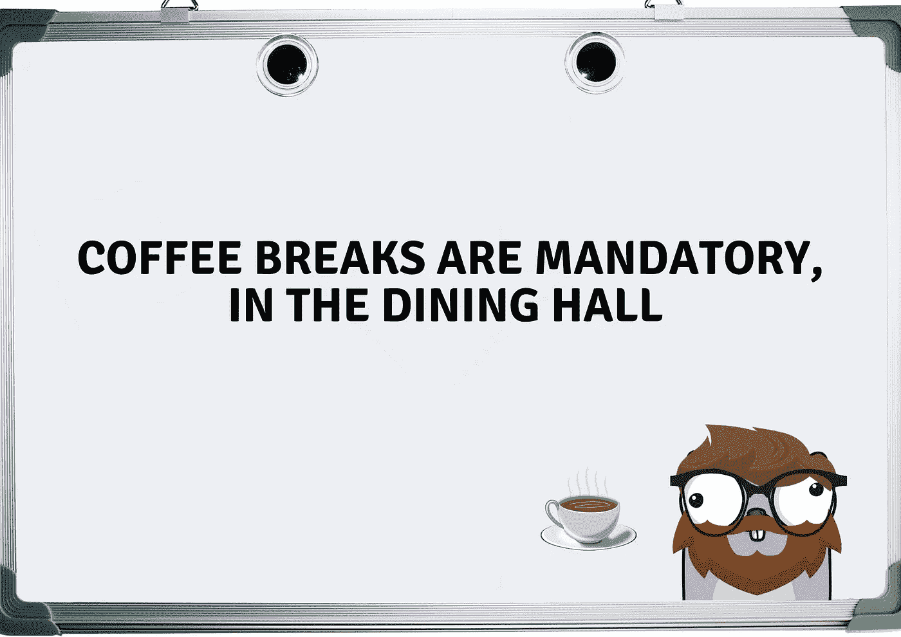

# 软件工程是一种生活方式，而不是一份工作

> 原文：<https://betterprogramming.pub/software-engineering-is-a-lifestyle-not-a-job-16a8b360bd1e>

## 当听到人们抱怨他们的工作时，我突然意识到。他们都不是软件开发人员

经理发来消息，要求他的工程师到咖啡室来

近年来我学到的一件事是，软件工程不是你得到的一份工作，而是你成为的某种东西。

下班后的深夜，我经常发现自己在技术或软件开发中编码或研究新的主题和领域。

我没有报酬，我的工作也没有告诉我这样做，我这样做是出于好奇和真正的兴趣。最棒的是，我在网上接触了很多其他的开发者。我们讨论话题，有时甚至在研究领域进行合作。

我们是唯一这样做的吗？不，看看那些由开发人员在业余时间维护的开源项目。Neeraj Kashyap 在 2020 年写道，他们对 [GitHub](https://github.com/) 进行了分析，发现有 23298697 个用户拥有公共存储库，总共有 128411417 个存储库。当然，有些库是公司的，但也有许多是私人的，他们利用业余时间编写代码。

Reddit、Slack 或 Discord 上也有一个活跃的社区。

我的配偶是护士。你知道有多少次我发现我的配偶在工作时间之外无偿地研究护理相关的课题吗？公平地说，我想这是 11 年来的第二次。

我已经做了大约七年的软件工程师。我注意到的一件事是，对我和我的许多同事来说，这不仅仅是一份工作。我经常拿我的工作情况和我可爱的配偶做比较。如前所述，她是一名护士，我甚至数不清她生气回家的次数，因为有人就她的工作讨论过谁必须多上一个小时的班。

很难不笑出来——额外的一个小时，看看我目前的工作场所，这不算什么。如果我们不得不强迫某人呆到很晚，如果最后每个人都留下来，我不会感到惊讶，因为我们都非常喜欢这样。

相反，我们实施了每月 40 小时额外工作时间的硬性限制，因为我们希望人们的生活不仅仅是工作。我不知道这条规则改变了什么，我想只是人们不再计算他们的工作时间了。

我记得我的第一份软件开发工作，当你走进办公室时，走廊上挂着一个很大的白板。一个特别的句子被大写并突出显示:

> "在餐厅，喝咖啡的时间是强制性的."
> 
> —愤怒的经理

不可能错过它，我记得笑着，想着

“是啊，就像任何人都会错过它”——年轻天真的开发者

我的背景是在工厂干了几年苦工，我会告诉你，休息时间是神圣的。你没有错过一秒钟，如果可能的话，你延长它。

我记得我甚至问过经理，为什么强制性的休息时间通知？他咯咯地笑着，回答了一些隐晦的话，

"让我们希望你比你的同事更善于参加。"

同一个经理每天都有一套例行公事，当我告诉我的许多朋友时，他们都不相信。需要我说他们都不是软件工程师吗？

他走过每个人的办公室，敲了敲门，说:

“该喝咖啡了。现在就来！”

并不是说他在咖啡室里很孤独，或者说，他确实有点孤独。很难说服工程师们休息一下。每个人都如此专注于自己的工作，解决摆在我们面前的问题。

# 通过忠诚和参与，而不是武力或压力

作为一名软件工程师，这些年来给我印象最深的是，人们并没有那么努力工作，因为他们是被迫的。相反，他们似乎都对这门手艺有着真正的兴趣。我遇到的大多数开发人员都喜欢这种交易。我不责怪他们——创造力，解决问题的能力，要解决的难题。

不管是早上、白天、晚上还是晚上，都没有关系。我在 Slack 上收到问题、想法等消息。我们没有人会因为在奇怪的时间被联系而感到烦恼，相反，我们似乎都分享着一份让我们乐在其中的约定。

我并不是说没有紧张的时刻和期限，但这并不是工程师前进的动力。他们坚持下去，因为他们对技术、挑战和看到进步的真正兴趣有着强烈的兴趣。

# 雇主希望在工作时间之外参与进来

就业市场默默地期望我们像软件工程师一样生活，而不是像软件工程师一样工作。我见过很多求职面试，甚至雇主似乎也希望我们像工程师一样生活。在求职面试中，下面这个问题并不少见:

你有什么在业余时间做的项目想展示吗？

这很有趣，因为当我第一次看到这个问题时，我没有反应。感觉很自然。而且被采访的人往往都有作品集或者 GitHub 账号可以炫耀，这也印证了我的想法，在业余时间期待参与是很自然的。不过，如果这是其他任何工作的面试，那可能就一点意义都没有了。

这让我想知道，有多少护士被问及家庭项目？

# 我们是赢家还是输家？

即使我们中的许多人对我们所做的工作有很大的抱负，我们中的大多数人仍然是失败者。我的配偶是一个有正确想法的人，她按时工作并得到报酬。然后她过自己的生活，而我和我的同事们日以继夜地工作，有些人甚至为别人的公司工作，为了什么？

这不是钱的问题。我拒绝了能给我双倍薪水的工作机会。我们都同意，金钱是有趣的，但它不是一切。我们必须记住让每天的工作令人愉快和兴奋的重要性。

对我来说，周一早上醒来，对这一周感到兴奋，比金钱更有价值。我们有冲刺目标要完成，还有其他里程碑要追逐。

作为一名软件工程师，我将能够回顾过去，享受我的生活。

我的结论是，你以软件工程师的身份生活，而不是以软件工程师的身份工作。

# 想联系作者？

感谢您的阅读，请随时通过 [Linkedin](https://www.linkedin.com/in/percy-bolmer-bb223b122/) 联系我。