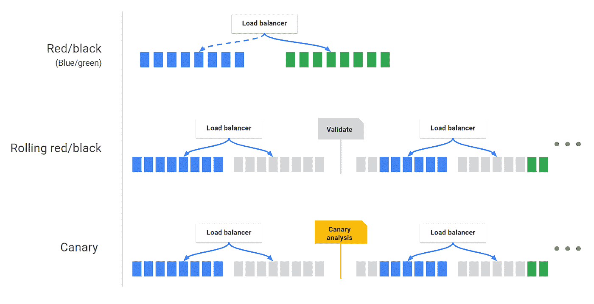
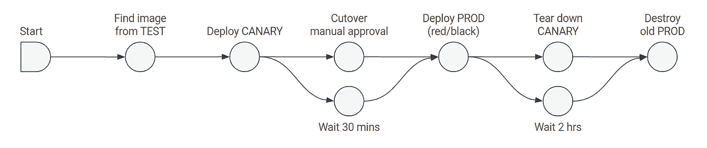

# 软件工程师也需要了解 DevOps 从 CI/CD 开始

> 原文：<https://betterprogramming.pub/software-engineers-need-to-know-devops-too-and-it-starts-with-ci-cd-ad0b5140da3e>

## 看看部署工具和策略

桑德罗·卡塔琳娜在 [Unsplash](https://unsplash.com?utm_source=medium&utm_medium=referral) 上的照片。

DevOps 现在很火。似乎每个软件工程的招聘都需要 DevOps 的经验和专业知识，不管实际的职位名称是什么。

当一家科技公司将其整体拆分为微服务时，它的每个工程团队现在从头到尾都拥有自己的应用部分。软件工程师不再只是构建应用程序。他们还负责回购维护、建立持续集成、配置构建管道以及部署他们的应用程序。

在这个跨职能团队和微服务架构的世界中，开发运维技能变得越来越重要，这要从理解 CI/CD(持续集成、持续交付和持续部署)开始。

在这篇文章中，我们将讨论 CI/CD 的最佳实践，以及像[军械库](https://www.armory.io/)这样的平台如何帮助管理其中的一些复杂性。

# 持续集成

根据 Atlassian 的说法，[持续集成(CI)](https://www.atlassian.com/continuous-delivery/continuous-integration) 是“将来自多个贡献者的代码变更自动集成到单个软件项目中的实践”

由于多个开发人员每天都在将代码合并到主分支中，因此有必要进行自动检查，以确保代码始终处于良好的工作状态。这意味着在合并新代码之前，应该运行代码格式化程序、代码链接程序和单元测试。CI 管道有助于自动运行每个所需的工作，防止糟糕的代码被合并到主分支中，而不是依赖开发人员记住在本地使用这些工具。

好的 CI 管道应该是快速的。这意味着尽可能并行运行管道作业，并拥有快速测试套件。

好的 CI 管道也要可靠。如果构建被破坏，工程师应该立即修复它，因为构建失败会阻止所有打开的合并请求被合并。如果一个测试是易变的，它应该被暂时禁用并尽快修复。

在运行任何格式化程序、linters 和单元测试之后，应该在 CI 管道的开头附近构建一次应用程序。这样，构建工件就可以在管道后续阶段的任何地方使用了。然后，构建工件可以部署在容器化的环境中，并用作代码评审人员的评审应用程序，以便在需要时快速验证更改。

当 CI 管道为代码回购成功建立时，开发人员可以每天(甚至每天几次)提交到主分支。不再有长期运行的特性分支，它们存在数月，等待着最终被合并的那一天！

遵循这些 CI 实践有助于保持主分支中的所有东西始终干净并处于可部署的状态，这将我们引向 CI/CD 首字母缩略词的后半部分。

# 持续交付和持续部署(CD)

简单地说，让我们来谈谈“持续交付”和“持续部署”之间的[差异。](https://www.atlassian.com/continuous-delivery/principles/continuous-integration-vs-delivery-vs-deployment)“持续交付是作为持续集成的一部分生成构建工件的自然结果。这个构建工件是可以部署到环境中的应用程序的工作副本。这意味着您可以随时部署到生产环境中！作为一个工程组织，您可以决定是否每天、每周、每两周等等进行部署。在连续交付中，尽管您随时准备好部署您的应用程序，但仍然需要有人启动该流程来开始部署。

然而，连续*部署*比连续交付更进了一步，因为合并到主分支的每个变更将立即开始部署过程，而不需要任何进一步的人工交互。这是令人兴奋的，因为开发人员可以在他们合并代码后的几分钟内在生产中看到他们的代码(当然，假设部署没有被任何失败的自动检查所阻止，这些检查会阻止新的构建被发布到生产环境中)！

无论您的组织选择连续交付还是连续部署，这两种实践的意图是相同的:尽可能快和频繁地向您的客户交付价值。不再有大的季度发布！这就是敏捷的意义所在。

持续交付最重要的事情之一是，应用程序应该能够通过单击一个按钮来部署。换句话说，部署过程应该是自动化的。如果不遵循这一实践，并且在部署过程中有多个复杂的步骤必须由人工执行，那么部署过程就更容易出错。毕竟我们是人，人都会犯错。

持续交付和持续部署的另一个关键原则是，您应该使用应用程序可以运行的多级环境。例如，您可能有一个开发环境、一个登台环境和一个生产环境。在部署过程中，构建工件可以从一个环境提升到下一个环境。这些不同环境中的基础设施应该尽可能相似，这样一旦应用程序投入生产，您就不会遇到重大意外。

# 部署策略

[部署策略](https://cloud.google.com/architecture/application-deployment-and-testing-strategies)各不相同，但一些常用的技术有金丝雀部署、蓝/绿部署和蓝/绿滚动部署。

在**金丝雀部署**中，你首先向一小部分用户发布新版本的应用。一旦您对这些用户的更改感到满意，您就可以向其他用户发布这些更改。这被认为是发布代码的一种谨慎的方式，因为您最初不会一次对所有人应用这些更改。

在**蓝/绿部署**中，您使用两个生产级环境。一个环境正在生产中积极使用，包含应用程序的当前版本。第二个环境处于备用状态，没有流量路由到它。您将应用程序的新版本部署到备用环境，然后将所有流量路由到该环境，使其成为新的生产环境。旧的生产环境不再接收流量，成为备用环境。这使得部署新版本和在需要时回滚版本变得非常容易，因为这两个过程都像重定向用户流量一样简单。

当您的应用程序有多个实例都在同一个环境中运行时，可以使用**滚动蓝/绿部署**。例如，如果您在生产中使用了六个节点，则将第一个节点换成运行应用程序新版本的另一个节点。现在，您有五个节点运行旧版本的应用程序，一个节点运行新版本的应用程序。然后你再做一次，使比率变成四旧二新。在又更换了四个节点之后，现在您的所有六个节点都在运行应用程序的新版本。

部署的滚动性有利也有弊。部署的风险较小，因为您不会一次部署所有内容，但它也需要更多时间来完成完整的发布，因为它是一次完成一个节点。

*各种部署策略(来源:*[*【https://spinnaker.io/concepts/】)*](https://spinnaker.io/concepts/))

# 工具如何帮助 CI/CD

现在我们已经了解了 CI/CD 的最佳实践，我们可以使用哪些工具来帮助我们呢？对于 CI 来说，有很多好的开源选项，比如 Travis CI T1 或 T2 circle CI T3。你甚至可以使用 GitHub 的内置功能(用 [GitHub Actions](https://docs.github.com/en/actions) )或者 GitLab(用 [GitLab CI](https://docs.gitlab.com/ee/ci/) )。这些工具中的大多数专用于 CI/CD 的 CI 部分，但也包括 CD 的一些功能。使用这些 CI 工具，您可以创建管道来运行 linters，并对每个新的合并请求进行测试。

说到 CD，最流行的帮助自动化部署的开源工具之一是 [Spinnaker](https://spinnaker.io/) 。Spinnaker 最初是由网飞内部开发的，之后才发布给更广泛的开发人员社区。Spinnaker 最棒的一点是它支持几乎所有云提供商的灵活性，从 AWS 到 Azure 再到 GCP。Spinnaker 可以与您选择的 CI 工具集成，并使用您选择的部署策略部署您的应用程序(我已经提到过它很灵活，对吧？).

使用 Spinnaker 部署 canary 的示例管道可能看起来有点像这样:

金丝雀部署战略管道(来源:[https://spinnaker.io/concepts/)](https://spinnaker.io/concepts/))

在这个工作流中，我们看到构建工件被部署到一个小型的服务器组集群中，用于初始的 canary 部署。在 canary 部署中的功能更改经过人工审查和批准后，通过部署一个新的生产集群并使用负载平衡器将流量定向到这个新组，蓝/绿部署(或网飞称之为红/黑部署)就完成了。然后，canary 群集被拆除，在每个人都认为新的 prod 群集运行良好之后，旧的 prod 群集也被销毁。

[Armory](https://www.armory.io/armory-spinnaker/) 是一个平台，它通过提供 Spinnaker 的企业级产品来实现更好的[可见性、开发人员授权和弹性](https://www.armory.io/armory-enterprise-spinnaker/)，从而将这一理念向前推进了一步。Armory 的仪表盘、日志记录和实时指标有助于开发人员更好地了解他们的应用部署。通过将大部分复杂性抽象到一个漂亮的 GUI 中，只需点击一个按钮就可以执行部署和回滚。这使得那些没有多少 DevOps 经验的开发者也能从头到尾拥有自己的应用。

为了增加您的信心， [Armory 的策略引擎](https://www.armory.io/armory-enterprise-spinnaker/policy-engine/)允许您配置护栏，以确保每次部署都遵循您公司的最佳实践和商定的规则。

# 结论

那么，我们学到了什么？首先，开发人员需要熟悉 CI/CD 最佳实践。第二，工程组织需要为他们的开发人员提供正确的工具来帮助提高生产力和减少错误。正如我们所看到的，用于 CD 的最好的工具之一是 Spinnaker，现在被 Armory 增强了。

通过合作实现这些 DevOps 原则，工程团队将对他们的代码有更大的信心，并将能够更快地向他们的客户交付价值。