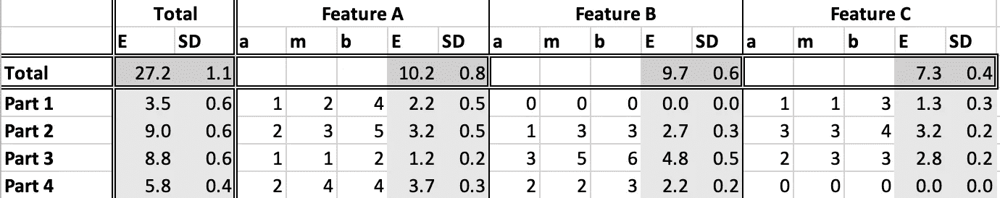
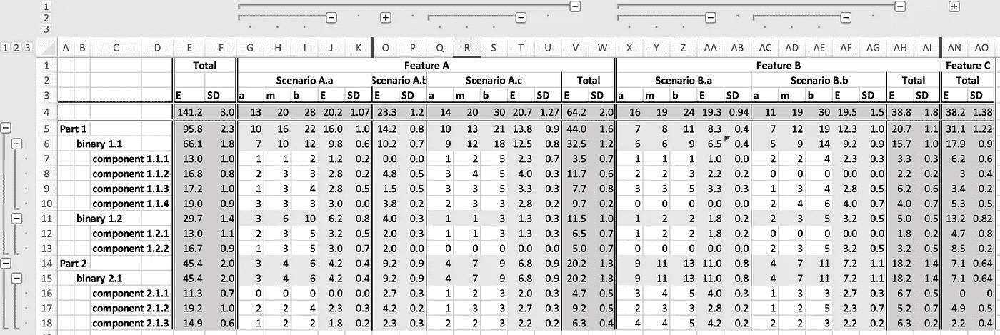
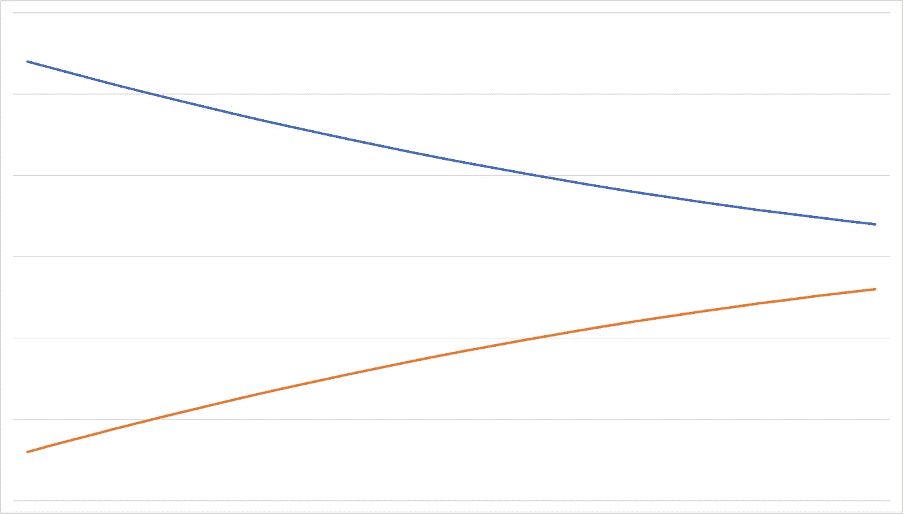

# 软件评估:二维方法

> 原文：<https://betterprogramming.pub/software-estimation-a-two-dimensional-approach-ff23d6c9113a>

## 经典的 WBS 对于提供软件评估帮助不大。它需要第二个维度才能起作用

维吉尔·卡亚萨在 [Unsplash](https://unsplash.com?utm_source=medium&utm_medium=referral) 上的照片

我写软件已经 40 年了，我注意到的一件事是，我们仍然没有一个水晶球！不幸的是，对于每个项目经理来说，我们仍然看不到未来。我们仍然不知道，确切地说，编写“软件”需要多长时间。

即使在人类已经编写了大约 70 年的软件之后，它仍然经常被认为是一个问题。经常(也许不公平地)被指责为项目逾期和超出预算的原因。

> 我认为糟糕的需求分析和管理实际上是项目失败的最大原因。然而，这是另一篇文章的主题！

# 没有水晶球

人们不喜欢开放式成本。我不想去买每周的食品杂货，也不想看不到我要买的东西的价格。我想看看我能得到什么，以及要花多少钱。我不想在不知道要花多少钱的情况下在餐馆点餐，想象一下吧！

> 你好，先生，你想点什么？你好，服务员先生，是的，谢谢你，我想要牛排和薯条，外加沙拉。好的，先生，那很快就好。多少钱？哦，别担心，先生，我们会在你吃完后告诉你的。

软件也是一样，人们不喜欢开放式成本。客户、经理、产品所有者、负责预算的人都想提前知道工程师制造产品的成本。所以我们提供了一个估计。

问题是，当编写软件时，我们不仅仅是购买现成的现成的东西。如果我们必须编写(创建、发明)软件，那么我们就是在构建新的东西。以前没有建造的东西。

当我们创造新的东西时，总会有未知。未知意味着我们不知道需要多长时间。一个有经验的工程师可以根据以前建造类似东西的经验提供一个估计。但总有很多未知。影响构建时间(成本)的许多不可预见的事情。

*   很容易估计你知道什么。
*   你知道什么你不知道，这很难估计。(已知未知)
*   你不知道你不知道的事情是很难估计的。(未知的未知)[ [维基百科](https://en.wikipedia.org/wiki/Software_development_effort_estimation#Psychological_issues) ]

有许多种不可预见的问题:

*   **要求**。写得不好的需求和在项目过程中改变或增加的需求可能是问题的主要原因。
*   **人**。人们生病，尤其是具有专业知识的关键人物，人们离开团队，离开公司，只是被重新分配到不同的项目。
*   **技术**。不按预期工作的技术。意外的性能问题。在项目生命周期中发生变化或过时的技术。
*   **等**。

减轻这些问题的最好方法是预料到意外的事情会发生，并在估计中加入一些偶然性。

# 如何估计

我读过的关于这个话题的最好的书之一是弗雷德·布鲁克斯写的《神话中的人月》。我希望在我的职业生涯中早点读到它。作者很好地解释了如何估算以及为什么很难。本书涵盖的每个软件工程师都应该了解的一点是:

*   简单地写一个程序，
*   构建一个产品(足够可靠的东西来销售)，以及
*   一个产品是一个系统(许多相互作用的程序)。

初学者的本能是估计编写一个程序所花的时间，而他们通常是在构建一个系统产品。根据 Brooks 的说法，这种努力通常相差 9 倍，我同意这种说法。

为了帮助适应估计中的未知量，一种常用的非常有效的技术是三点估计。估计器提供了最坏情况、最好情况以及某件事情需要多长时间的可能值。最好和最差之间的差距越大，未知就越多。

另一种常见的方法是预先猜测完成工作所需的所有任务。您不是为整个工作(整个项目)提供一个评估，而是将工作分解成更小的任务，并分别评估每个更小的任务。对整个任务的估计是所有较小估计的总和。更容易为较小的任务提供更准确的估计。

然而，尝试这种方法突出了一个更详细的问题，任务是什么？有些任务是显而易见的:编写构建脚本、生成文档、实现用户界面。但是其他的更难提前预测，即使你确定了任务，也不总是容易知道任务有多大。例如，用户界面有多大？我知道我需要一个，但我不知道里面需要什么的细节，因此我不知道需要多长时间。

敏捷/scrum 方法通过询问团队来处理这个问题。用户故事或特征被识别。产品负责人优先考虑它们应该被实现的顺序，并且基于被实现的特性，团队决定什么任务是必要的。承担任务的人在开始之前会给出任务的评估。

敏捷方法在某些情况下工作得很好，但是它不能提供许多客户所要求和期望的预先估计。

当考虑任务时，经验显然是有帮助的，而且有些任务几乎总是存在。所以列出并重用它们是个好主意。但是特定于项目的任务总是必要的，并且在没有研究特定于项目的细节的情况下是不可能预测的。

# 经典的工作分解结构(WBS)

工作分解结构是一种常见的技术，用于将项目的细节分解成更小的部分，并对更小的部分进行评估。组成各部分的估计，以给出总体预测。

> “项目团队为完成项目目标和创建所需的可交付成果而执行的总工作范围的层次分解。”[ [项目管理知识体系](https://en.wikipedia.org/wiki/Project_Management_Body_of_Knowledge)

WBS 传统上是一种系统工程工具，它的变体是一种非常广泛使用的技术，用于分解项目任务，以便:

*   估计项目的总成本
*   在团队之间分配工作
*   衡量进展
*   等等

> WBS 是围绕项目的主要产品(或计划的结果)组织的，而不是围绕生产产品所需的工作(计划的行动)。由于计划的结果是项目期望的结果，它们形成了一组相对稳定的类别，在这些类别中可以收集实现这些结果所需的计划行动的成本。[ [维基百科](https://en.wikipedia.org/wiki/Work_breakdown_structure#Overview) ]

这个定义指出了为什么 WBS 在涉及到软件时经常是无益的或误导的一个原因。软件开发的最终产品或成果通常是二进制文件、可执行文件或库。构建过程的输出。可能是编译器的输出以及其他相关的资源文件和文档。但是这些结果/产品并不直接与软件需求相关。除了可能有一个(可能是未写的需求)说需要有一个可交付成果。

此外，软件需求通常集中在行为而不是结构上。WBS 关注的是要交付的结构和部分，而不是行为。软件(或系统)行为倾向于分散在各个部分。

# 评估网格

那么，如何提供一个估计值呢？WBS 方法通常不考虑软件/系统的行为。敏捷方法不能提供足够早的总体评估。我们该怎么办？我们如何提供让客户满意的可靠的预先评估？

对于这个难题，我的答案是采用二维方法进行估算。

总的来说，软件是一个多维复杂的怪兽。有效的软件架构技术通常采用多种观点来设计软件和处理不同的维度。那么，为什么不使用多个维度来提供一个估计值呢？

一个维度涵盖行为，另一个维度涵盖结构。通过创建一个二维网格(Excel 在这里非常方便),并在网格中的每个相关单元格提供一个 [3 点估计值](https://en.wikipedia.org/wiki/Three-point_estimation),可以提供总体估计值。

2D 估计

应为每个特征/零件点提供最小(a)、最可能(m)和最大(b)估计值，其中存在与零件相关的特征相关的行为。如果特征对零件没有影响，那么该特征/零件点的估计值将为 0。

估算值(E)和标准偏差(SD)使用三点估算的常用公式进行计算，并且可以在两个轴上提供总数，因此您可以获得每个特性或每个部分的估算值，以及整个项目的总数。

随着项目的进展，来自体系结构、分析、设计的更多细节可以用来帮助评估的细节。

更详细的 2D 估计

每个维度的细分当然可以是你喜欢的任何东西。我倾向于将特性分解成场景，在上面的图片中，部件被分解成二进制和组件。但是，无论您以何种方式分解每个维度，都适用相同的方法:

*   为网格中的每个相关单元格提供 3 点估计值
*   在有用的地方创建总计

# 其他有用的建议

另外两件重要的事情，我发现非常有帮助，那就是持续评估和学习如何维护你的评估。

## 连续估计

评估的一个非常重要的方面是记住，随着项目的进展，未知变得已知，不确定性变得更加确定。对于估算，这意味着在项目进行到一半或接近尾声时提供的估算比项目开始时提供的估算更有可能准确。

如果在开始时考虑到足够的偶然性，并且 3 点估计是现实的，那么随着项目的进展，估计应该变得更加可靠，并且需要较少的方差来覆盖未知。

最小和最大估计值与时间的关系

所以，不要在项目开始时做一次评估，然后就再也不做评估了。根据最新信息定期重新评估，并向客户提供更新的评估。

## 为你的估计辩护

有时候真的很压抑。你花了很长时间凝视你和你的团队经验的水晶球。你想出一个你觉得你可以支持并实现的估计。然后有人过来说“不，这个数字太大了，给我一个小一点的估计”。

出现这种情况的原因通常很简单——没有足够的预算或没有足够的时间使用给定的资源。技术评估与业务限制不匹配。经常发生，不用担心！

错误在于简单地减少数字。也许有一些地方你高估了，但同样也可能有一些地方你低估了，在项目生命周期中这些会互相抵消。

> 不要因为有人说估价太高就简单地降低估价。如果你这样做了，项目 90%的时间会超出预算或延期。

如果时间是一个问题，也就是说，要在截止日期前完成工作，有时额外的工作人员可以提供帮助。然而，重要的是确定可以并行做什么。增加更多的资源并不总是有帮助的。许多任务有一个重要的顺序，不能并行完成。

> 不管车上有多少人，从伦敦开车到曼彻斯特都需要同样长的时间。或者生一个孩子需要 9 个月，你不能让两个女人工作，却要花 4.5 个月！

据我所知，有两个很好选择有助于明智地减少估算:

1.  询问是否有时间或预算来做一些前期风险降低工作，这将使您能够消除一些未知因素。这有时可以减少 3 点估计的最大值，尽管也可能增加一些最小值。
2.  最后问一下应该切什么？从客户或其他利益相关者处了解哪些功能可以简化或删减以满足预算。

因为有人说预算太大而削减预算几乎总是一个严重的错误。如果你估算了一些东西，而你被要求减少估算，推回去，问你应该削减什么工作？并且得到书面的答案！确保所有风险承担者都同意项目范围的变更。

# 摘要

如果你正在读这篇文章，我希望这些想法能有所帮助。我真的希望看到软件评估被认为是一个问题较少的问题。

软件评估是必要的，但是准确的软件评估是很难创建的。各种技术和经验可以改进估计。经典的 WBS 并不理想，因为它是一维的，并且确实考虑了系统的行为。

更好的方法是将结构和行为都考虑在内的 2D 估计。但是，总有未知和不可预见的情况。

没有水晶球！