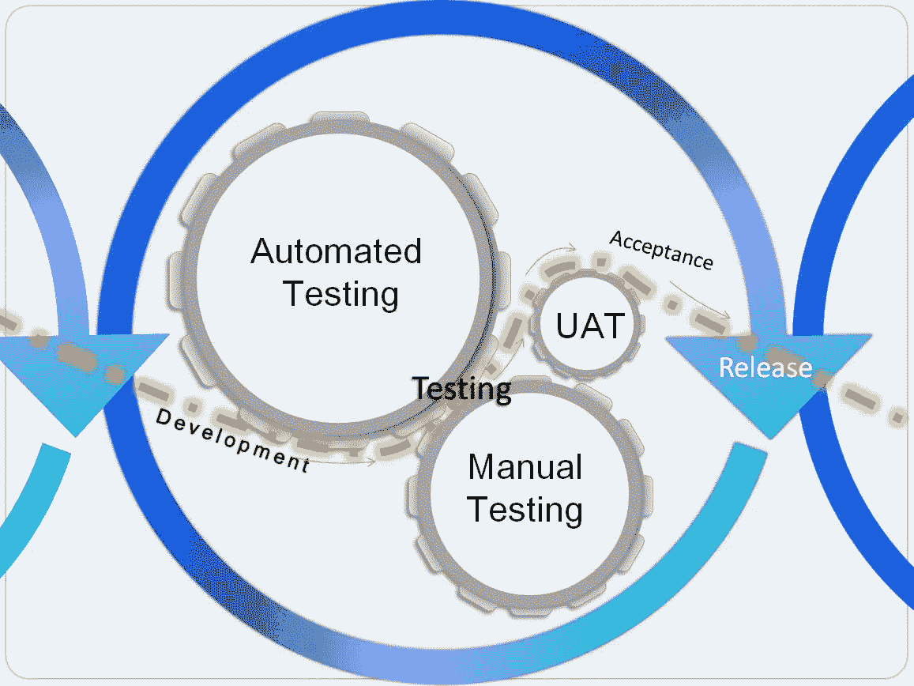
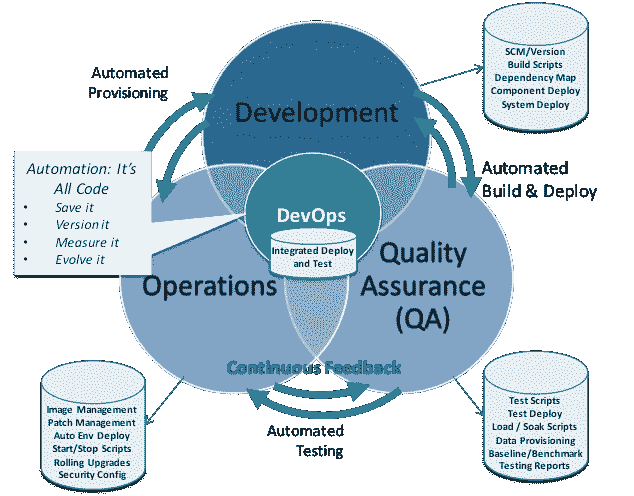
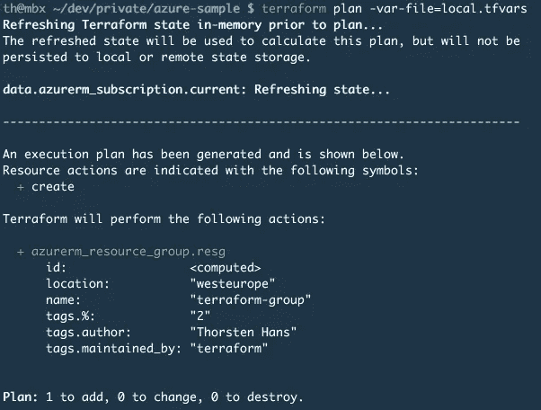

# 软件质量保证与现代软件开发

> 原文：<https://betterprogramming.pub/software-quality-assurances-and-modern-software-development-3c3aa0015bd7>

## 在一天多次部署的世界中，软件质量处于什么位置？

[Zan](https://unsplash.com/@zanilic?utm_source=unsplash&utm_medium=referral&utm_content=creditCopyText) 在 [Unsplash](https://unsplash.com/s/photos/software?utm_source=unsplash&utm_medium=referral&utm_content=creditCopyText) 上的照片

作为一名 [DevOps 架构师](https://medium.com/better-programming/what-exactly-is-a-devops-architect-a27e5a5c728b)，我工作中最棒的一个方面是我对 CI/CD 管道无数应用程序的洞察力，这些应用程序使用了你能想到的每一种技术。

就在我休[陪产假](https://medium.com/devops-dudes/what-parenting-and-devops-have-in-common-af74663e6b60)之前，我参与了一个新的应用程序，该应用程序使用微服务架构针对 AWS 云进行了重新编写和重新架构。他们问的第一个问题是“*SQA 在这个新世界中处于什么位置？”。*

这是一个很好的问题，因为这个行业似乎存在两个极端。一方面，有[使命召唤:战区](https://www.essentiallysports.com/call-of-duty-warzone-and-modern-warfare-face-backlash-over-recurring-issue-esports-news-activision-infinity-ward-2020/)似乎在发布前没有进行一次质量检查就部署了新的更新，让全世界的游戏玩家都非常头疼。相比之下，有些团队已经阻止了 SQA 手动部署和测试前端应用程序的持续交付实践。

在这篇文章中，我希望找到快乐的媒介，并提供以前没有讨论过的软件质量保证的观点。

# SQA 过去做了什么？

[来源](https://cdn.softwaretestinghelp.com/wp-content/qa/uploads/2018/11/what-is-SQA-2.jpg)

软件质量保证(SQA)是一个传统的团队单位，隶属于一个组织的软件开发分支，在发布之前完成软件产品的端到端测试。

一个最著名的例子是流行电影《外婆的男孩》。这部电影的主角是一名电子游戏测试员，他被赶出家门后，被迫搬去和他的祖母住在一起。这部电影于 2006 年上映，比我开始从事 it 工作早了 4 年。这部电影讲述了一个天才开发人员编写令人难以置信的视频游戏，以及一个庞大的测试团队，他们玩不同级别的游戏，并就他们发现的漏洞撰写报告。这与它在现实生活中的工作方式相差不远。

在这个最新的项目中，SQA 团队为开发者提供了巨大的价值。他们是唯一真正对应用程序进行端到端测试的人。他们表演:

*   集成测试
*   端到端测试
*   性能试验
*   508 符合性测试
*   浏览器支持测试
*   API 合同测试
*   数据弹性测试
*   高可用性测试
*   灾难恢复测试
*   渗透测试
*   安全/漏洞测试

那可是一大堆测试啊！当然，这些测试中有一些是手工完成的，但是很大一部分是自动化的。

最大的问题之一是需要在稳定的环境下进行测试，而开发人员可能会不断开发新的特性，并通过开发和 QA 环境部署它们。如果部署发生在测试过程中，它可能会也可能不会中断测试，但是在任何一种情况下，它都会使结果无效，因为代码发生了更改。

对于编写单元和组件测试的开发人员来说，这可能是令人沮丧的，因为这些测试在拉请求被批准和合并之前就运行并通过了。他们*觉得有必要减少部署*,并创建整个堆栈的清单，将每个微服务绑定到一个版本，以便 SQA 对其进行测试。

我认为这是一个*反模式*——我们不应该需要用清单来版本化我们的整个堆栈来解决测试问题。

# SQA 和敏捷的失败

[来源](https://onfiretechnology.com/images/Method3.jpg)

SQA 基本上已经脱离了敏捷、开发运维以及持续交付的世界。相反，组织选择让开发人员自己编写测试，确保这些测试在 CI 期间通过，如果通过，那么就可以进行部署。这是一个很好的实践，并且符合“左移”原则，使开发人员能够对他们编写的代码有更多的控制。然而，这个模型完全忽略了测试金字塔的两个重要组成部分:

*   集成测试
*   端到端测试

回到祖母的男孩的例子，这表现为在没有验证新代码是否能与现有代码一起工作的情况下发布代码。

更糟糕的是，当使用微服务架构时，到底是什么决定了端到端测试的需求？当微服务需要独立构建和部署时，端到端测试如何以及在哪里发挥作用？

这些都是很好的问题，所以请允许我提供一些不同的方法来解决它们。

# 在敏捷世界中部署高质量的代码

[来源](https://techbeacon.com/sites/default/files/picture1_1.png)

这里显然需要一个令人满意的媒介:我们可以在某个地方运行集成和端到端测试，以确保软件质量，同时保持敏捷，快速部署代码，减少文书工作。我们还需要确保我们所做的一切都是自动化的，将导致大多数生产中断的人为错误排除在外。

这里有三个策略可以做到这一点。

## 短暂的环境

这个应用程序的当前架构的第一个问题是，他们已经静态地定义了一个`DEV`和`QA`环境，*，即使它们在云中*。我没有必要责怪他们，因为定义一套环境来提升代码是企业软件开发的基本原则。

然而，这些静态环境导致了我所描述的问题——需要协调部署和跟踪代码在哪里。

团队已经很好地用 Terraform 代码描述了他们的基础设施，但是他们是在考虑静态环境的情况下完成的。

解决办法？输入使用标准 GIT 分支定义的 GitOps 和环境。那么这实际上看起来像什么呢？

如果您正在使用 GITFLOW，那么标准化部署的命名和标记约定并将其绑定到环境中是理想的。这里有一个例子:

[来源](https://phil.tech/images/article_images/2015-11-20-deploying-with-git-flow-tags-and-circleci/fancy-diagram.jpg)

第二:从您的基础设施代码中提取环境变量，并在 CI 过程中传递它们，这是基于您的分支/标记开始的，如下所示:

[来源](https://thorsten-hans.com/assets/images/posts/2019/terraform-guide-3.png)

# 连续监视

一个已经投入生产的云应用程序将监控作为事后的想法。在无服务器应用程序中，您要监控什么？相对于微服务，我们如何知道我们的应用是否停机？

转变传统 SQA 团队的一个新方法是将他们嵌入到运营中，以确定关键的监控指标和对它们的适当响应。无论如何，他们正在测试端到端的应用程序，因此他们应该能够建议运营团队监控哪些内容，哪些内容被认为是不好的。

此外，许多组织可能看不到在产品发布之前进行大规模测试的价值。没关系，如果我们可以监控我们无论如何都要测试的东西，那么我们就可以实现自动化来更快地回滚更改。

# 部署策略

[来源](https://miro.medium.com/proxy/1*pO0q7GaK5qSOc59WRGSOcQ.png)

如前所述，QA 和开发人员经常在对好的测试结果的需求和是否应该将补丁持续部署到预生产环境上的问题上发生冲突。然而，我们知道当我们部署到生产环境时，可能会有用户在我们应用程序的不同部分。永远不会有“稳定状态”，所以我们可以从 SQA 的角度拥抱混乱，并将我们的焦点转移到持续测试上。

与其将应用视为每个微服务的固定版本并进行验证，不如让我们持续运行我们的测试，并确保像生产一样监控 QA 环境。有了这些，我们就可以引入过程控制，确保任何代码更改都必须通过三个 QA 测试周期。根据代码变更的组件，我们可以设置验收标准，以确保通过某些测试。

例如，我的前端正在创建一个新的搜索内容的屏幕。对我的 angular 项目的更改必须通过三个 508 自动化测试周期，外加一个针对所有受支持浏览器的浏览器测试，然后代码才能被合并到 master 并部署。

这给部署带来了有趣的变化。您不再是对单一版本进行单一套件的测试，现在您使用信心/风险等级来进行部署。

与此同时，我们可以实现 canary 部署策略，随着时间的推移向用户子集引入变更。如果我们在 SQA 使用这种部署策略，就像我们在生产中使用的方式一样，那么我们要等到通过测试的百分比达到一定程度后再决定部署。

# 结论

SQA 和专门的软件测试人员是瀑布式软件开发的遗迹。像大型机开发人员一样，未来可能不会有太多对这些专注的个人的需求。这并没有降低我们软件的集成和端到端测试的重要性或必要性，它只是将责任转移到了哪里。

SQA 资源为我们构建的应用提供了宝贵的见解。作为一个行业，我们应该在我们的开发和运营团队中使用它们，并将它们的测试集成到我们的 CI/CD 管道中，以确保我们始终部署高质量的无错误软件。

感谢阅读！