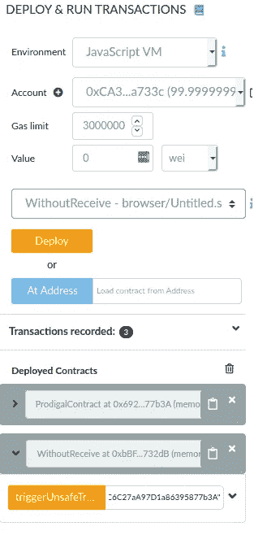
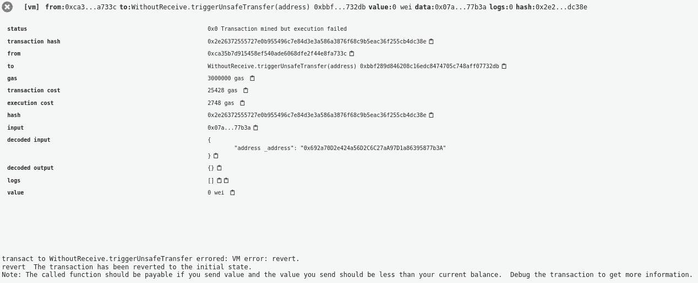

# 坚实度 0.6:你可能发送以太不正确

> 原文：<https://betterprogramming.pub/solidity-0-6-you-might-be-sending-ether-all-wrong-1e119e1ffc27>

## 以太坊货币转移的类型安全入门


由 [Clifford 摄影](https://unsplash.com/@cliffordgatewood?utm_source=unsplash&utm_medium=referral&utm_content=creditCopyText)拍摄于 [Unsplash](https://unsplash.com/s/photos/ethereum?utm_source=unsplash&utm_medium=referral&utm_content=creditCopyText)

Solidity 0.6 最近已经发布，为智能合约的资金转移处理方式带来了一些语法上的变化。

不幸的是，这一基本功能仍然是 type- *un* safe，编译器无法保证传输的接收者实际上能够接受它。

编译器和类型系统的主要目的之一是确保不允许带有给定错误的程序运行。相反，Solidity 的编译器传递了一个会让用户赔钱的错误。

尽管 Solidity 0.5 引入了类型`address payable`和新引入的`receive`功能，但资金转移的类型安全性多年来并没有改善。

在这篇文章中，我会给你一个虚构的例子，强调在 Solidity 0.5 和 0.6 中实现的问题和对策。

# 一点术语

*智能合同*是使用区块链平台来执行某些操作的应用程序，例如在不依赖可信第三方实体的情况下交换信息或金钱。

智能契约非常像面向对象编程范式中的一个类，因此，它有一个状态并公开一组函数。调用函数是“激活”智能合约的唯一方式，通常发生在事务的上下文中。


图片来自[维基百科](https://upload.wikimedia.org/wikipedia/commons/thumb/9/98/Solidity_logo.svg/2000px-Solidity_logo.svg.png)

为以太坊生态系统实现此类应用的最著名的语言是 *Solidity* 。

它是静态类型和面向契约的，后者意味着它的语法(受到 JavaScript 和 C++的强烈影响)帮助程序员定义智能契约，就像他们在定义一个类一样。

最后但同样重要的是，智能合约不是以太坊中唯一的账户类型。

事实上，与它们一起的是所谓的*外部拥有的账户* (EOA)，可以被认为是人类通过调用合同上的函数来开始交易。

以太坊中的账户(EOA 和智能合约)通过一个*地址*唯一标识，该地址是一个 20 字节长的十六进制字符序列。地址可用于向账户汇款或调用合同上的功能。

# 问题是

正如我们刚刚看到的，以太坊中的智能合约使用它们的地址来引用。在 Solidity 中，`address` es 本质上是作为无类型指针来实现的，并以两种主要方式使用:

*   检索部署在区块链上的协定的实例，并随后调用其函数。
*   向账户汇款(无论是 EOA 还是智能合约)。

虽然灵活，但这些使用模式很容易变得有害。使用非类型化指针会使推理代码变得更加困难，从而导致难以调试的细微错误。

此外，Solidity 的编译器在这里没有提供任何帮助:当涉及到`address` es 时，几乎不执行静态或动态检查。

这可能会在汇款过程中造成特别的麻烦。当合同收到款项时，会调用一个特定的函数(所谓的*回退函数*直到 Solidity 0.6)。

如果接收契约没有定义这样的函数，那么传输将失败，并引发一个异常。

然而，miner 节点仍然保留与其使用的气体相对应的乙醚量，实际上是从发出失败交易的帐户中取钱。

更糟糕的是，这可能导致资金无限期锁定在合同余额中。

# Solidity 0.5 的新特性是什么

为了帮助缓解这个问题，Solidity 0.5 引入了一种新的类型，`address payable`，来表示可以安全接收资金的合同的地址。

从那个版本开始，转移以太的内置功能已经从`address`转移到`address payable`。

此外，前者的实例不能直接转换成后者的实例，即使通过类型`uint160`进行强制转换仍然是可能的:

```
address payable payableAddress = address(uint160(nonPayableAddress))
```

虽然这种区分有效地澄清了不是每个地址都有资格收到钱，但它也造成了关于这个话题的更多混乱。

首先，编译器不会检查由`address payable`指向的契约是否定义了回退函数。

其次，一个函数的调用者，实际上被称为`msg.sender`，总是*给定类型`address payable`。`msg.sender`是每个函数调用中的隐式变量集，包含调用函数的帐户地址。*

在 Solidity 0.5 之前，它的类型只是`address`，但从那以后就变成了`address payable`。这是一个严重的问题，因为使用`msg.sender`作为资金转移的接收者是常见的做法，编译器只是假设适合作为目标。

# Solidity 0.6 的新特性

如果你认为 Solidity 的最新版本增加了一些秩序，你最好再想想。该版本提供了两个关于电汇的关键功能:

*   由于内置函数`payable(x)`，从`address`到`address payable`的转换变得更加容易，其中`x`是一个`address`。
*   通常被称为“回退功能”的未命名功能已被拆分为使用`fallback`关键字定义的新回退功能和使用`receive`关键字定义的接收以太功能。

当一个合同被发送资金时，`receive`被调用，如果定义的话。否则，会尝试调用`fallback`，但是，如果它没有被定义或者没有被标记为`payable`(Solidity 中使用的一个关键字，用于显式声明一个函数可以接收乙醚)，事务将会恢复。

尽管如此，这种新的区别仅用于区分以前回退功能的两种主要用途:

*   `receive`现在打算作为资金转移的结果参与进来。
*   `fallback`在没有其他函数匹配调用数据时被调用。

您可能会想，这并没有增加任何额外的类型安全性。

以前的回退功能只是换了个名字，被拆分了，但是仍然不能保证一个合同可能收钱。因此，以太仍然可能被浪费，将钱发送给没有`receive`或`payable`或`fallback`的合同。

# 行动中的不安全类型

两份合同足以说明 Solidity 资金转移的不安全性:

```
pragma solidity 0.6.1;contract ProdigalContract {
    constructor () payable public {}

    function drainBalance() public {
        msg.sender.transfer(address(this).balance);
    }

    receive() external payable {}
}contract WithoutReceive {
    constructor () public {}

    function triggerUnsafeTransfer(address _address) public {
        ProdigalContract(payable(_address)).drainBalance();
    }
}
```

可以在 [Remix](https://remix.ethereum.org/) 中复制粘贴上述代码，用最新发布的 Solidity 编译器(编写时为 0.6.1+commit.e6f7d5a4)进行测试。

`ProdigalContract`表示持有一些钱并公开一个函数`drainBalance()`的契约，该函数反过来简单地将其所有余额转移给该函数的调用者。

它的构造函数被标记为`payable`，这样`ProdigalContract`实例可以用非空余额初始化。尽管这个契约并不代表真实世界的用例，但关键思想是它在`msg.sender`上调用`transfer()`(即函数的调用者)。

请记住，从实度 0.5 开始，`transfer()`只在`address payable`上定义，请注意`msg.sender`是如何被*隐式假定为*的。这正是漏洞所在。

还要注意空的`receive`，它允许`ProdigalContract`的实例接收以太。

另一方面，`WithoutReceive`只是公开了一个函数`triggerUnsafeTransfer()`，通过调用`ProdigalContract`的`drainBalance()`来触发不安全的资金转移。

您可能已经注意到了使用`payable(_address))`将`address`转换为`address payable`。我们将在本文的后面详细讨论这一点。

# 测试合同

要了解这些合同的行为，您必须采取以下步骤:



1.  使用 Remix 编译它们。
2.  部署`ProdigalContract`和`WithoutReceive`的实例。
3.  复制`ProdigalContract`实例的地址(通过点击灰色框中的复制图标)并粘贴到橙色按钮`“triggerUnsafeTransfer”`旁边(确保将地址放在双引号中)。
4.  点击`triggerUnsafeTransfer`。

页面底部是事务日志。运行函数`triggerUnsafeTransfer()`后，您将看到交易失败，并显示类似下图的错误信息:



这意味着 Solidity 的运行时试图运行该函数，但失败了。这是因为`ProdigalContract`试图给`WithoutReceive`汇款，但是转账没有成功，因为后一个合同没有定义`receive`也没有定义`payable` `fallback`。

即使事务将被正确地回滚，启动它的帐户将丢失相当于矿工消耗的汽油量的乙醚。在这个例子中，这个数字很低，但是在真实的用例中，这个数字可能会更高。

这里的主要问题是，Solidity 的编译器没有试图将对`drainBalance()`的调用标记为不正确，因为它没有关于该函数的主体将做什么的任何有价值的信息。

仔细看看，这个问题依赖于这样一个事实:对`msg.sender`的使用没有进行类型检查，因此，在运行时可能会出现类型错误，导致事务失败。

# 与“外部世界”的融合

最后一点，在函数`triggerUnsafeTransfer`中，我们必须使用`payable(_address)`从一个简单的`address`中检索一个`ProdigalContract`的实例。

如果我们只写了`ProdigalContract(_address)`，编译器会给我们一个错误:

```
Type Error: Explicit type conversion not allowed from non-payable “address” to “contract ProdigalContract”, which has a payable fallback function.
```

发生这种情况是因为编译器检测到`ProdigalContract`定义了`receive`，并强迫程序员使用`payable address` es 而不是“普通的”`address` es 来引用它。

事实上，下面的函数也可以使用(`_address`是参数表中给定的类型`address payable`):

```
function triggerUnsafeTransfer(address payable _address) public {
    ProdigalContract(_testAddress).drainBalance();
}
```

这告诉我们，当使用简单的`address`而不是`payable`时，编译器能够以某种方式检测到，但是，从上一节我们看到的情况来看，当涉及到资金转移时，它不会强制执行这种区分。

更糟糕的是，当使用`payable()`将`address`转换为`payable address`时，它不执行任何类型检查，即使它们是两种完全不同的类型。

这种显式强制转换已经在 Solidity 0.6 中添加，但它抛弃了 Solidity 0.5 在类型安全方面取得的所有(微小)进展。

# 一个可能的解决方案

解决这个问题并不容易。Solidity 中的编译模型使得编译器很难精确地知道我们在应用程序中使用的契约的实际接口。

此外，地址通常作为参数出现在函数调用中，这使得问题更加复杂。

我认为这个问题不能只从内部解决。然而，后者能做的是给`address` es 赋予类型，使契约的界面更丰富，更容易交互。

例如，`address<C>`类型的值可能被保证(由编译器本身)引用契约`C`的一个实例。这有助于程序员准确地知道在上面做什么是安全的。

`address payable`就是这样一个例子。如果它的约束得到适当的保证，它可以是引用与`receive`或`payable` `fallback`的合同的所有地址的类型。

另一个例子可以通过查看函数`triggerUnsafeContract()`来完成。因为我们使用传入地址来检索`ProdigalContract`的实例，所以参数`_address`的类型可以是`address<ProdigalContract>`，而不仅仅是`address`。

然后，外部库应该检查它们提供给智能契约的地址是否满足这些约束。这在编译时可能很难做到，但在将事务发送到目标智能合约之前，可以在运行时完成。

这是一个完全不同的问题，需要一篇专门的文章来更详细地探讨它。如果你很好奇，可以在这里找到更多信息: [Solidity 0.5:当类型化不代表类型安全](https://arxiv.org/pdf/1907.02952)。

# 结论

尽管 Solidity 声称是类型安全的，但本文中的例子表明编译器仍然无法实施与类型`address`和`address payable`相关的约束。

此外，`address`和`address payable`之间的区别，以及`receive`和`fallback`之间的区别，应该有助于程序员写出更好、更容易理解的代码。

然而，这些构造的语义有时是混乱的，并不是微不足道的，可能会导致难以发现和修复的错误。

# 参考资料和进一步阅读

*   坚实度 0.5 [突破变化](https://solidity.readthedocs.io/en/v0.5.0/050-breaking-changes.html)。
*   实度 0.6 [破变](https://solidity.readthedocs.io/en/v0.6.1/060-breaking-changes.html)。
*   坚固性 0.5: [当被类型化并不意味着类型安全](https://arxiv.org/pdf/1907.02952)。