# 将可靠性合同部署到具有价格反馈的 NFT 市场

> 原文：<https://betterprogramming.pub/solidity-contracts-for-an-nft-marketplace-5a706bb94486>

## 用图表和代码示例解释


我们将一步一步地检查合同，在每一步中，我们将首先查看一个从较高层次解释流程的图表，然后，我们将查看代码。

在文章的最后，我们将使用 Remix IDE 和 Metamask 将合同部署到 Polygon Testnet，并创建+上传一个 NFT 到市场。

这里可以看到完整的代码[。](https://gist.github.com/pguso/802890442a9aa2f1d3d6d76bb3f0a91d)

# 什么是 NFT？

> *NFT(不可替代)*多少意味着它是独一无二的，不能被别的东西替代。例如，一个比特币是可替代的——用一个比特币换另一个比特币，你会得到完全一样的东西。然而，独一无二的交易卡是不可替代的。如果你把它换成另一张卡，你会得到完全不同的东西。

通常用于艺术或项目在元宇宙，但它可以是任何数字或真实的。例如，NFT 可以是现实世界中的房屋的参考，并且所有权是公开可追踪的。

让我们开始看看创建和销售 NFT 的流程。为了理解 solidity 代码，你需要对 Solidity 有一个基本的了解，或者如果你不完全理解，你可以检查 [solidity 文档](https://docs.soliditylang.org/en/v0.8.0/)。

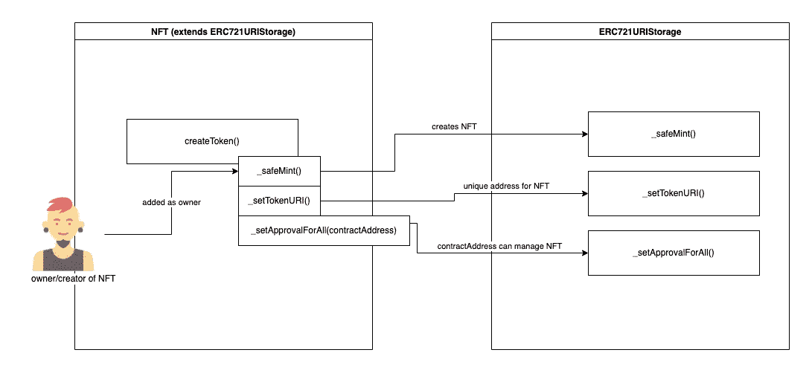

NFT -> createToken()

首先，NFT 必须在可以在市场或其他地方交易之前被创建。

在上图中，您可以看到`**createToken()**`方法调用了`ERC721URIStorage`契约的三个方法，该契约是 OpenZeppelin 契约回购[中经过良好测试和维护的契约之一。`createToken()`方法将接收`tokenURI`作为参数，例如从 URI 到 IPFS:](https://github.com/OpenZeppelin/openzeppelin-contracts)

```
[https://ipfs.io/ipfs/Qme7ss3ARVgxv6rXqVPiikMJ8u2NLgmgszg13pYrDKEoiu](https://ipfs.io/ipfs/Qme7ss3ARVgxv6rXqVPiikMJ8u2NLgmgszg13pYrDKEoiu)
```

在`_safeMint()`方法中，将生成 NFT，并将发送者设置为所有者。之后，`_setTokenURI()`方法会将上面的 IPFS URI 设置为令牌 URI。

在`_setApprovalForAll()`方法中，市场合同将获得津贴，为业主管理 NFT。这意味着市场合同将被允许出售 NFT，并在收到买方付款后转让所有权。至少它将返回 newItemId，从 1 开始，并随着每个新的 NFT 而递增。

```
function **createToken**(string memory tokenURI) public returns (uint) {
    _tokenIds.increment();
    uint256 newItemId = _tokenIds.current();

    _safeMint(msg.sender, newItemId);
    _setTokenURI(newItemId, tokenURI);
    setApprovalForAll(contractAddress, true);
    return newItemId;
}
```

接下来，我们需要将创建的 NFT 添加到市场中。

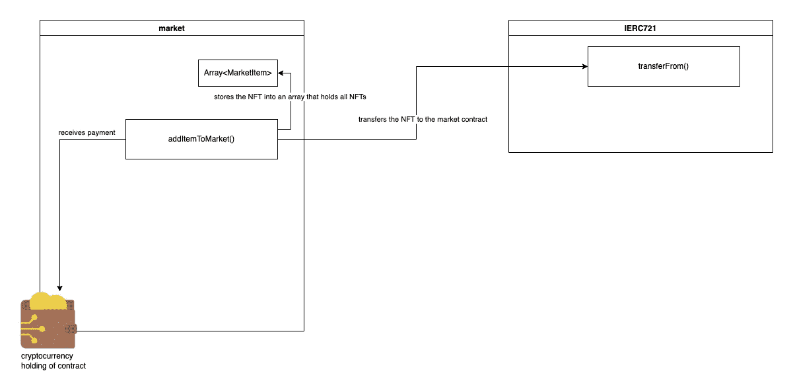

NFTMarket -> addItemToMarket()

在两次需求检查之后，我们将创建一个新的`MarketItem`并将其推送到一个包含 marketplace 的所有 NFT 的数组中，然后 NFT 被传输到 marketplace，之后，我们发出一个包含新 MarketItem 细节的事件。

```
function **addItemToMarket**(
    address nftContract,
    uint256 tokenId,
    uint256 price
) public payable nonReentrant {
    require(price > 0, "Price must be at least 1 wei");
    require(msg.value == listingPrice, "Price must be equal to listing price");

    _itemIds.increment();
    uint256 itemId = _itemIds.current();

    idToMarketItem[itemId] =  MarketItem(
        itemId,
        nftContract,
        tokenId,
        payable(msg.sender),
        payable(address(0)),
        price
    );

    IERC721(nftContract).safeTransferFrom(msg.sender, address(this), tokenId);

    emit MarketItemCreated(
        itemId,
        nftContract,
        tokenId,
        msg.sender,
        address(0),
        price
    );
}
```

接下来，我们需要收到一份未售出的 NFT 的清单，买家可以查看并购买。

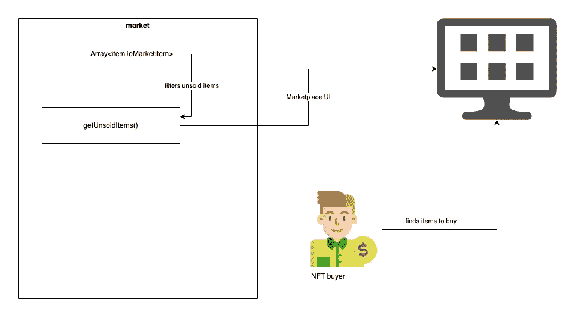

NFTMarket -> getUnsoldItems()

我们读取市场拥有的所有 NFT 的计数，迭代商品，并检查市场契约是否是当前所有者，如果是，则将其添加到商品数组，并在最后返回所有未售出的商品。

```
function **getUnsoldItems**() public view returns (MarketItem[] memory) {
    uint itemCount = _itemIds.current();
    uint unsoldItemCount = _itemIds.current() - _itemsSold.current();
    uint currentIndex = 0;

    MarketItem[] memory items = new MarketItem[](unsoldItemCount);
    for (uint i = 0; i < itemCount; i++) {
        if (idToMarketItem[i + 1].owner == address(0)) {
            uint currentId = i + 1;
            MarketItem memory currentItem = idToMarketItem[currentId];
            items[currentIndex] = currentItem;
            currentIndex += 1;
        }
    }

    return items;
}
```

至少我们想卖掉物品，把所有权转让给买家。

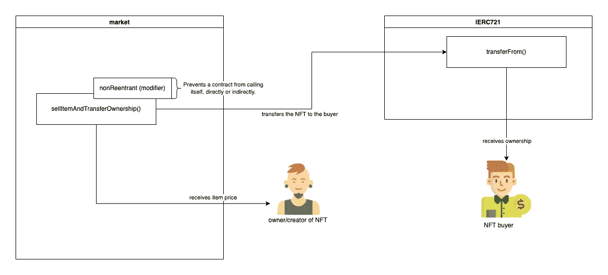

NFT market-> sellItemAndTransferOwnership()

`sellItemAndTransferOwnership()`方法有一个修饰符，它将直接或间接地阻止契约调用它自己。我们要求发送者需要支付确切的要价。我们将 NFT 从市场转移给买家，并将支付的金额发送给 NFT 的所有者。

```
function **sellItemAndTransferOwnership**(
    address nftContract,
    uint256 itemId
) public payable nonReentrant {
    uint price = idToMarketItem[itemId].price;
    uint tokenId = idToMarketItem[itemId].tokenId;
    require(msg.value == price, "Please submit the asking price in order to complete the purchase");

    idToMarketItem[itemId].seller.transfer(msg.value);
    IERC721(nftContract).transferFrom(address(this), msg.sender, tokenId);
    idToMarketItem[itemId].owner = payable(msg.sender);
    _itemsSold.increment();
    payable(owner).transfer(listingPrice);
}
```

这是主要的过程。

我们有额外的方法通过给定的 id 用`getMarketItemById()`获取市场项目的细节，并通过所有者/创建者用`getItemsByOwner()`显示 NFTs。

一个有趣的帮助方法是`getLatestPrice()`,你可以在市场契约上调用它。它继承自 PriceConsumerV3 协定。这里我们将地址`0xd0D5e3DB44DE05E9F294BB0a3bEEaF030DE24Ada`传递给`AggregatorV3Interface`这个地址是多边形测试网(孟买)上 MATIC 的美元价格。

如果您将这些合同部署到另一个网络和/或想要使用不同的价格源，您可以查看 [chainlink 文档](https://docs.chain.link/docs/reference-contracts/)以获取您需要添加到`AggregatorV3Interface`的地址。

下面是一个伪代码示例，说明如何计算 NFTs 的价格并显示当前的美元价值:

```
const latestPrice = NFTMarket.getLatestPrice()
const priceInUsd = (item.price/(10**18)) * (latestPrice/10**8)
```

在部署这些合同时，您首先需要部署市场合同，然后在部署 NFT 合同时，将市场合同地址传递给它。

这是一个(几乎)完整的流程图。

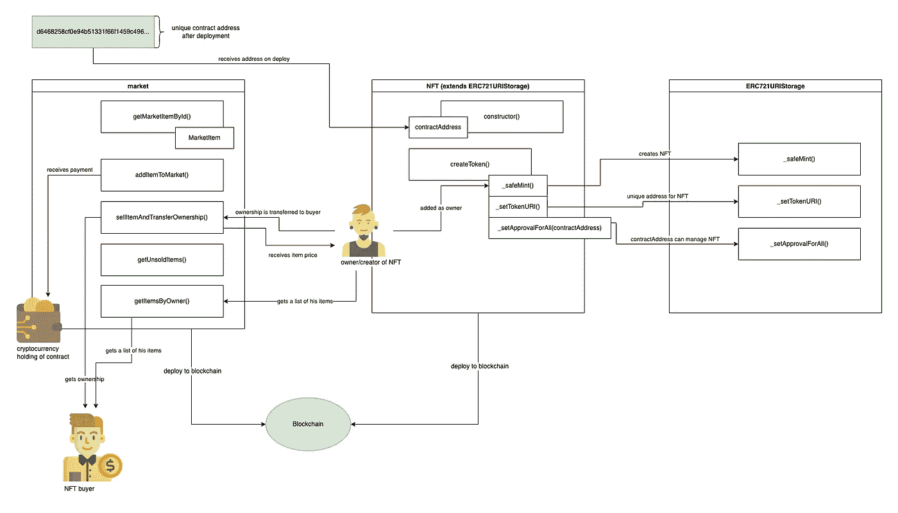

完整的可视化流程(为简单起见，未包括所有细节)

现在我们想通过 Remix IDE 部署我们的契约并运行一些方法。你可以从[这里](https://gist.github.com/pguso/802890442a9aa2f1d3d6d76bb3f0a91d)得到完整的代码。

打开[混音 IDE](https://remix.ethereum.org/) 。

1.  在`contracts > Market.sol`下新建一个文件。
2.  将[这里](https://gist.github.com/pguso/802890442a9aa2f1d3d6d76bb3f0a91d)的完整代码粘贴到新文件中。

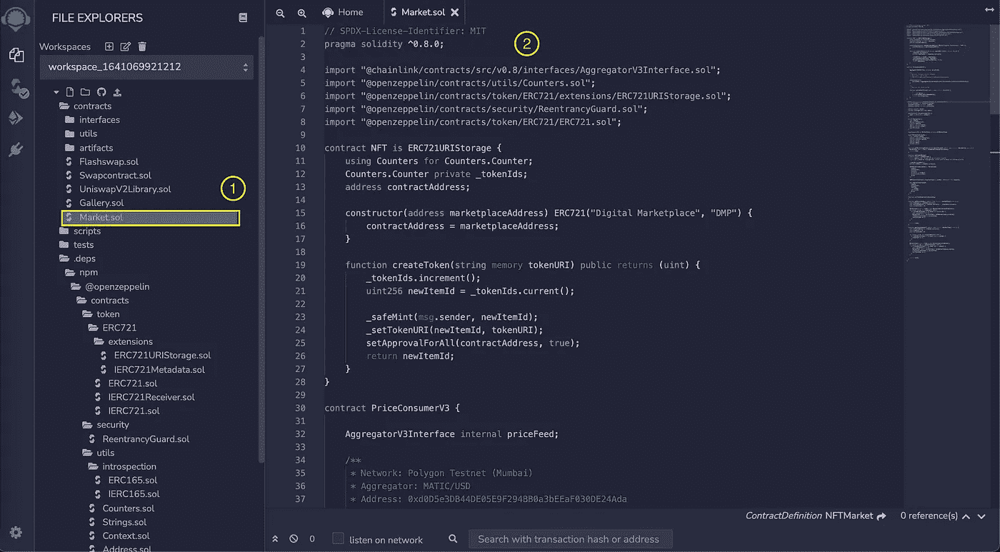

现在我们想整理我们的合同。

1.  切换到编译选项卡。
2.  选择版本 0.8.0 和
3.  点击`Compile Market.sol`。

如果一切顺利，您将在编译选项卡上看到一个绿色的成功图标。

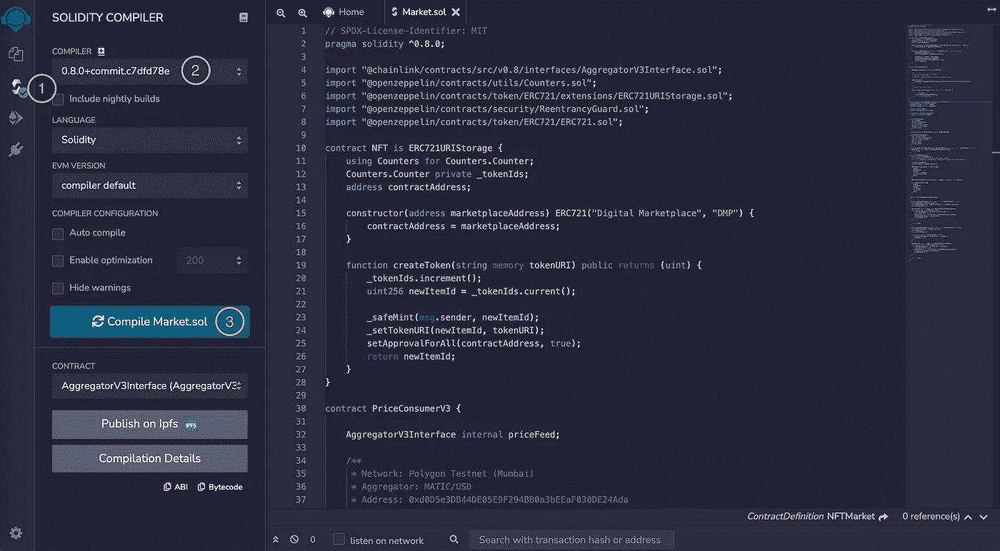

我使用 Chrome 和 Metamask 扩展进行部署。你可以在这里下载并安装 Metamask [。然后，打开元掩码，按照给出的步骤设置元掩码。](https://metamask.io/download/)

请将多边形 Mumbai-Testnet 添加到元掩码。

你可以检查多边形[文档](https://docs.polygon.technology/docs/develop/metamask/config-polygon-on-metamask/)或者遵循下面的两个步骤。

打开元蒙版并:

1.  打开网络列表
2.  点击添加网络。忽略我的网络列表，我已经配置了几个。

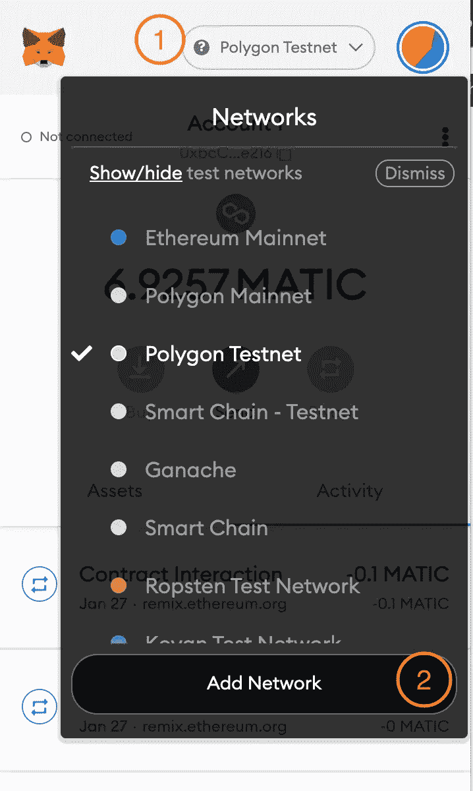

浏览器中会打开一个新选项卡来添加网络。

1.  添加一个网络名，我选择多边形 Testnet。
2.  2.添加新的 RPC URL[https://rpc-mumbai.maticvigil.com/](https://rpc-mumbai.maticvigil.com/)。
3.  3.将链 ID 设置为 80001(请忽略我的错误消息，我已经配置了网络)。
4.  可以选择添加货币符号 MATIC。

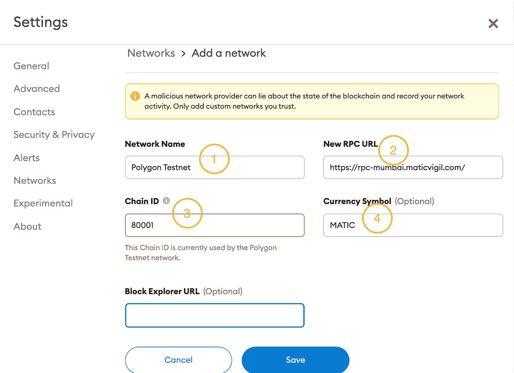

现在，您需要为部署费用获取一些测试脚本。你可以在这里得到它们。只需将您的帐户地址粘贴为钱包地址，提交后您将收到 MATIC 进行测试，它没有任何实际价值。

现在我们部署我们的合同。

1.  切换到“部署和运行事务”选项卡。
2.  选择注入的 Web3。
3.  从下拉列表中选择`NFTMarket`合同。
4.  点击部署。

将弹出 Metamask 并要求您确认部署，请单击确认。几分钟后，您将在已部署的合同下看到一个条目。

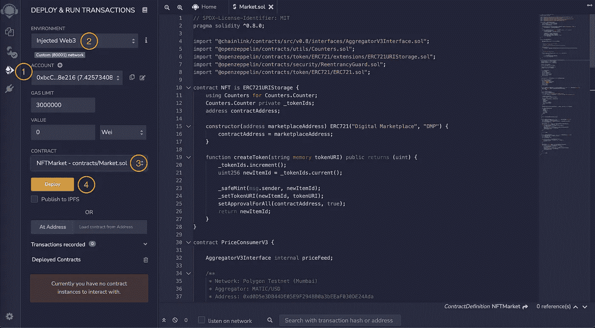

接下来，我们部署 NFT 合同。

1.  从下拉列表中选择 NFT 合同。
2.  将地址复制到市场合同中。
3.  通过复制的地址输入。
4.  点击部署。Metamask 将再次要求确认。

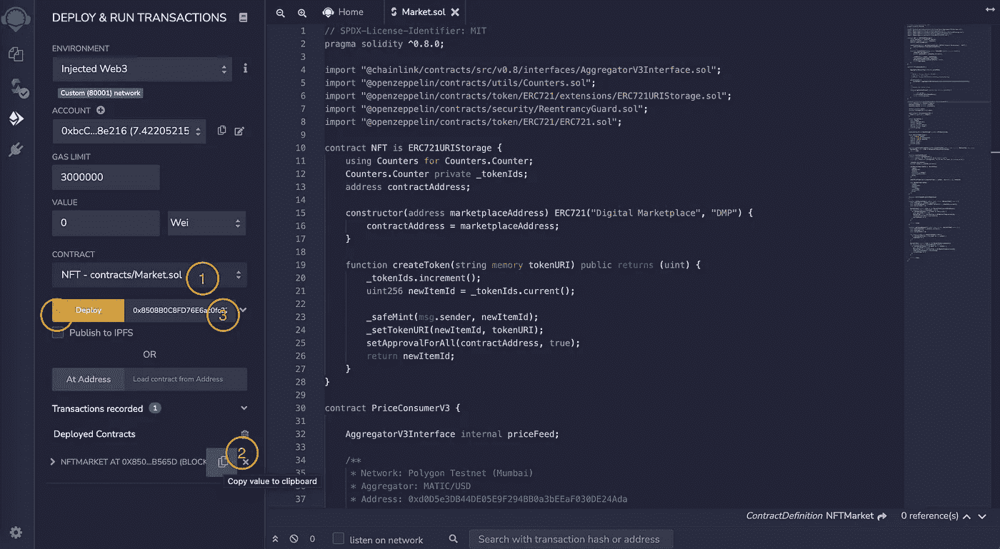

恭喜你，你已经部署好了与区块链互动的一切，来运营你的 NFT 市场。

现在我们想运行我们之前理论上经历过的方法。

1.  打开 NFT 合同。
2.  在字段中粘贴一个 IPFS 地址，例如`[https://ipfs.io/ipfs/Qme7ss3ARVgxv6rXqVPiikMJ8u2NLgmgszg13pYrDKEoiu](https://ipfs.io/ipfs/Qme7ss3ARVgxv6rXqVPiikMJ8u2NLgmgszg13pYrDKEoiu)`。
3.  点击`createToken`运行该方法。元掩码将再次弹出，因为我们将向区块链写入一些内容。橙色按钮将在区块链上生成一项交易，并收取一定费用。

如果你把 1 放入 NFT 合同面板底部的`tokenURI`字段，你可以检查是否一切正常，你将收到同样的 IPFS·URI。

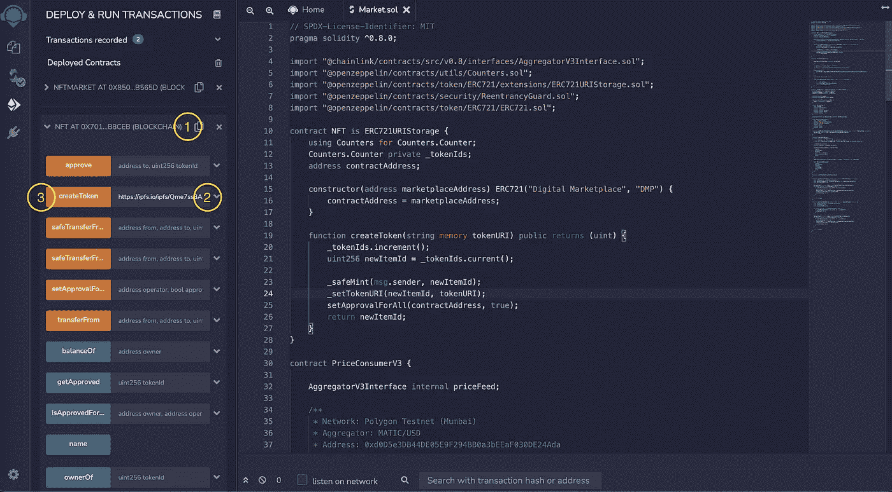

现在我们将 NFT 加入市场。

1.  将`100000000000000000 Wei`粘贴到 0.1 MATIC 的值字段中，这是你为上市向市场合约支付的费用。你可以在这里找到一个单位转换器。
2.  打开`addItemToMarket`方法。
3.  将地址粘贴到您的 NFT 合同上。
4.  为我们要上传到市场的令牌 id 加 1。
5.  添加您想要为 NFT 设置的价格，为了简单起见，我只粘贴了上面的`100000000000000000 Wei`。

这个按钮上的红色表示这个方法被标记为 payable，您需要发送(在这个例子中是一些 MATIC)给这些方法。

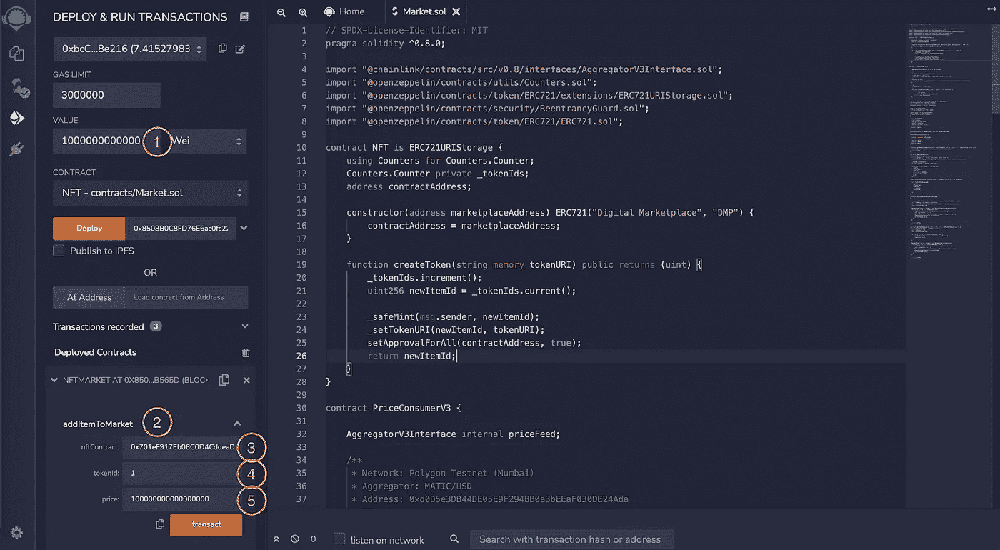

感谢您的阅读。如有疑问，欢迎写评论。