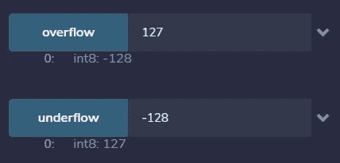
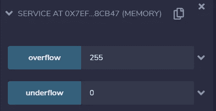
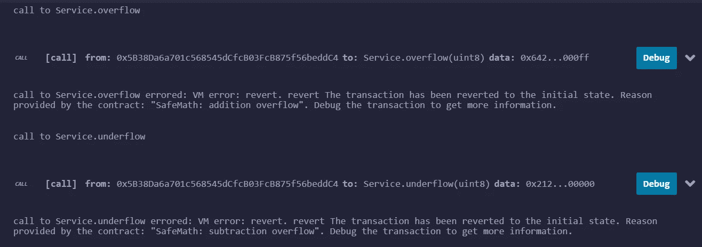

# 可靠性:我们真的需要更安全的数学吗？

> 原文：<https://betterprogramming.pub/solidity-do-we-really-need-a-safer-math-733ea7a9ea44>

## 看看 OpenZeppelin 的安全数学库

在 [Unsplash](https://unsplash.com?utm_source=medium&utm_medium=referral) 上 [Michael Dziedzic](https://unsplash.com/@lazycreekimages?utm_source=medium&utm_medium=referral) 拍摄的照片。

在可靠性方面，在其他语言中，你认为理所当然的东西有很多不同的替代品。[字符串](https://medium.com/better-programming/solidity-playing-with-strings-aca62d118ae5)和数学就是两个例子。

> “实度中的算术运算在溢出时换行。这很容易导致错误，因为程序员通常认为溢出会引起错误，这是高级编程语言中的标准行为。“SafeMath”通过在操作溢出时恢复事务来恢复这种直觉。
> 
> 使用这个库代替未检查的操作消除了一整类的错误，所以建议总是使用它。”— [OpenZeppelin 文档](https://docs.openzeppelin.com/contracts/3.x/api/math)

“实性运算在溢出时换行”指的是与数字在计算机中的表示方式，尤其是实性中的表示方式相关的特定事物。

在下面的智能契约中，我实现了一个简单的方法来测试下溢和上溢(像往常一样，就在 [Remix](https://remix.ethereum.org/) 中):

编译完成后，您将能够调用两个方法——通过适当的输入——来显示本地数字表示的弱点:

请注意我是如何使用`int8`作为方法的输入和输出类型的。这将允许我快速描述实现。

你在上图中看到的就是“溢出时实性操作换行”这句话的意思。现在，想象一下，如果我们摆弄的`uint8`代表一些珍贵资产的数量。这仅仅意味着你的系统在大多数情况下都可以很好地工作(增量和减量远离表示的极限),但是会显著地失败，产生不一致的状态。

在这一点上，很明显*我们确实需要一个更安全的数学方法——*即使是在最简单的智能合约中。

现在让我们看看前面的例子是如何使用 [SafeMath](https://docs.openzeppelin.com/contracts/2.x/api/math#safemath) 进行增量/减量的。

SafeMath 由 OpenZeppelin 为`uint256`提供。这意味着它永远不会溢出我们使用`uint8`的例子。例如，如果您传递一个 255，您应该溢出，但是它不会，因为它将在 SafeMath 中表示为一个`uint256`。

为了清楚起见，我“开发”了一个`uint8` SafeMath 版本，只是简单地将原来 SafeMath 中的`uint256`替换为`uint8`。我把它命名为 SafeMath8:

您可以在 Remix 中直接使用它，并导入它，如下例所示:

您可能注意到了，我们要求 Solidity 将 SafeMath8 中定义的方法“附加”到`uint8`。这样，我们就可以调用方法`sub()`和`add()`，它们代表了两个无符号整数相减和相加的新的、更安全的方法。

下图显示了通过调用带有参数的两个方法来获取上溢/下溢的结果:

通过调用这些方法，除了控制台中显示的两个调用结果之外，您不会得到任何其他结果:

这两种方法都会失败，并以人类可读的形式返回正确的错误消息。

# 结论

SafeMath(和 SafeMath8)是构建安全智能合约的基础。考虑到你通常会处理价值数百枚*法币*的资产，这一点尤为重要。