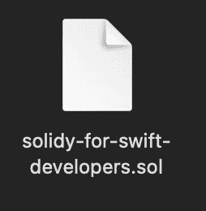

# Swift 开发人员的可靠性:文件结构和功能

> 原文：<https://betterprogramming.pub/solidity-for-swift-developers-file-structure-and-functions-997fd6f8f8e7>

## 开始使用 Swift 的可靠性


[行政](https://unsplash.com/@executium)在 [Unsplash](https://unsplash.com/?utm_source=medium&utm_medium=referral) 上拍照。

Solidity 是一种面向对象的语言，用于编写可以部署在区块链上的智能合约，例如以太坊。语法类似于 Javascript，但另一方面，语义更接近 C++。我们将从 Swift 开发人员的角度深入探讨 Solidity 语言结构和功能。

# 杂注和 sfile 扩展

在我们进入 Solidity 语言结构之前，我们需要知道一个`pragma`关键字是什么，它的意思是什么。

与 Objective-C `#pragma`和 Swift `MARK`不同，Solidity 中的‘pragma’关键字描述了编译器应该使用的版本。请记住，它指示编译器检查版本是否匹配。它不打开或关闭任何语言功能。

例如，如果我们想要告诉 Solidity 编译器我们想要使用 0.8.x 版本，我们可以这样启动源文件:

```
pragma solidity ^0.8.0;
```

我们还可以使用更大或更小的操作来描述版本间隔，这可能很方便。

还有其他使用`pragma`关键字的方法，但这次我们不会深入探讨。

Solidity 源文件以`.sol`扩展名保存。



# 一切都始于一份合同

Solidity 语言中的合同类似于 Swift 中的类。契约包含状态变量、函数、函数修饰符、事件、错误、结构和枚举。这次我们只研究函数结构。

像类一样，我们需要给它命名并打开，用大括号结束。

```
contract HelloSwiftFromSolidity {}
```

# 状态变量

状态变量是在`contract`中声明的变量。请注意，这些信息在部署后会存储在区块链合同存储中。我们不需要担心 getters 和 setters。Solidity 编译器为我们生成。

```
contract HelloSwiftFromSolidity {
  string hello;
}
```

您现在可以注意到，每个执行行都应该以分号`;`结尾。对于 Swift 语言来说，情况并非如此。

# 功能

函数可以在`contract`内外声明，类似 Swift。他们可以执行一段代码。

```
contract HelloSwiftFromSolidity {
  // visibility = public because access from outside
  string public hello = "Hello Swift"; // visibility = public because access from outside
  // view = just view the data
  function helloSwift() public view returns(string memory) {
      return hello;
  }
}
```

发生了很多事，让我们把它分解一下。如果我们想从外部访问状态变量，我们需要将可见性类型设置为`public`，并对函数进行同样的操作。在我们的例子中，函数返回一些东西，我们可以将它标记为`view`。它返回一个存储在内存中的字符串，并在执行完成后被删除。

可以存储函数变量和返回数据的地方有:

*   `memory` -变量的生存期被限制在函数范围内，不会保存在任何地方；
*   `storage` -数据存储在区块链上的智能合约存储器中；
*   `calldata` -数据存储在函数被调用的地方之外，我们将讨论更多的细节以及将来如何使用它。

# 功能类型

Solidity 中的函数可以执行指令，查看数据。当我们查看数据时，它可以是`view`或`pure`。这两者的区别在于纯函数既不修改也不读取状态变量。

```
function helloWorld() public pure returns(string memory) {
  return "Hello World";
}
```

在上面的代码中，我们既不读取也不更改区块链上的任何内容，只是返回一些数据。

# TL；速度三角形定位法(dead reckoning)

Solidity 是一种编写可以在区块链部署的智能合同的语言。目前最流行的是以太坊。从 Swift 开发人员的角度来看，语言在语法上非常相似，但在语义上非常不同。首先，每个执行行都应该以分号结尾。在可靠性方面，与 Swift 类等价的是可以包含状态变量、函数和其他结构的契约。

# 链接

*   [实体源文件的布局](https://docs.soliditylang.org/en/v0.8.10/layout-of-source-files.html)
*   [合同的结构](https://docs.soliditylang.org/en/v0.8.10/structure-of-a-contract.html)
*   [以太坊开发者资源](https://ethereum.org/en/developers/)