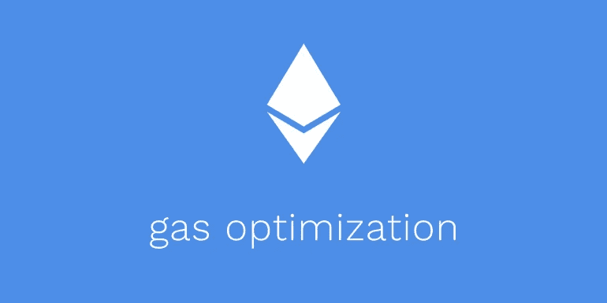

# 固体气体优化技巧

> 原文：<https://betterprogramming.pub/solidity-gas-optimizations-and-tricks-2bcee0f9f1f2>

## 优化以太坊区块链费用的深入指南



作者图片

这篇文章是关于可靠性的高级气体优化。在这里你可以找到所有 gas 优化代码的最佳实践！我经常根据我的要点更新这篇文章[。不要羞于开始。](https://gist.github.com/grGred/9bab8b9bad0cd42fc23d4e31e7347144)

固体气是在以太坊区块链进行交易所需的费用。gas 的目的是限制系统将执行的事务数量。这限制了计算永远运行和垃圾网络。

# 将 Pragma 升级到最新的 Solidity 编译器版本

使用新的编译器版本和优化器免费提供气体优化和额外的安全检查！

版本`0.8.*`相对于`<0.8.0`的优势在于:

*   Safemath 默认来自`0.8.0`(可能比一些基于库的 safemath 更高效)。
*   [来自`0.8.2`的低级内嵌器](https://blog.soliditylang.org/2021/03/02/saving-gas-with-simple-inliner/)，导致更便宜的运行时气体。当契约具有小功能时尤其相关。例如，OpenZeppelin 库通常有许多小的辅助函数，如果它们没有被内联，它们会额外花费 20 到 40 gas，因为函数调用需要两个额外的跳转指令和额外的堆栈操作。
*   [打包结构中的优化器改进](https://blog.soliditylang.org/2021/03/23/solidity-0.8.3-release-announcement/#optimizer-improvements):在`0.8.3`之前，存储打包结构，在某些情况下，他们使用了额外的存储读取操作。在 [EIP-2929](https://eips.ethereum.org/EIPS/eip-2929) 之后，如果插槽已经是冷的，这意味着不必要的堆栈操作和额外的部署时间成本。然而，如果插槽已经是热的，这意味着除了相同的不必要的堆叠操作和额外的部署时间成本之外，还有 100 gas 的额外成本。
*   [自定义错误](https://blog.soliditylang.org/2021/04/21/custom-errors)来自`0.8.4`，导致部署和运行时成本降低。注意:运行时开销仅在满足恢复条件时才相关。简而言之，用自定义错误替换恢复字符串。
*   坚固性`0.8.10`有一个有用的变化，即[降低了期望返回值的外部调用](https://blog.soliditylang.org/2021/11/09/solidity-0.8.10-release-announcement/)的气体成本。如果需要返回数据，代码生成器将跳过外部协定的存在性检查。在这种情况下，如果合同不存在，ABI 解码器将恢复。`0.8.10`还使能纯 Yul 模式的新 EVM 码发生器。
*   [Yul 优化器中改进的内联试探法](https://blog.soliditylang.org/2022/06/15/solidity-0.8.15-release-announcement/)。在 Solidity 版本`0.8.15`之前，编译器在决定是否内联一个函数时非常保守。这是必要的，因为内联很容易增加堆栈压力，导致可怕的`Stack too deep`错误。在`0.8.15`中，内联的必要条件被放宽了。基准测试表明，这一变化显著减小了字节码的大小(这会影响部署成本)，而对运行时 gas 使用的影响较小。
*   [溢出更高效地检查乘法运算](https://blog.soliditylang.org/2022/09/08/solidity-0.8.17-release-announcement/)Solidity v 0 . 8 . 17 . Yul 优化器:在调用有条件地终止外部 EVM 调用的 Yul 函数之前，防止不正确地移除存储写入；将零长度操作的起始偏移量简化为零。代码生成器:更有效的乘法溢出检查。

# For 循环改进

## 缓存 for 循环中的长度

在循环的每次迭代中读取数组长度在堆栈中需要 6 个 gas(三个用于`mload`，三个用于放置`memory_offset`)。在堆栈中缓存数组长度可以在每次迭代中节省大约 3 gas。我建议在 for 循环之前将数组的长度存储在一个变量中。

数组 arr 和以下循环的示例:

```
for (uint i = 0; i < length; i++) {
    // do something that doesn't change the value of i
}
```

在上面的例子中，solidity 编译器将总是在每次迭代中读取数组的长度。

1.  如果是存储阵列，这是一个额外的`sload`操作(除了第一次以外，每次迭代都有 100 个额外的 gas ( [EIP-2929](https://eips.ethereum.org/EIPS/eip-2929) ))，
2.  如果是一个`memory`数组，这是一个额外的`mload`操作(除了第一次，每次迭代有 3 个额外的 gas)，
3.  如果是一个`calldata`数组，这是一个额外的`calldataload`操作(除了第一次，每次迭代有 3 个额外的 gas)这些额外的开销可以通过缓存数组长度(在堆栈中)来避免:

```
uint length = arr.length;
for (uint i = 0; i < length; i++) {
    // do something that doesn't change arr.length
}
```

在上面的例子中，`sload`或`mload`或`calldataload`操作只被调用一次，随后被廉价的`dupN`指令所替代。即使`mload`、`calldataload`和`dupN`具有相同的气体成本，但是`mload`和`calldataload`需要额外的`dupN`来将偏移量放入堆栈，即额外的 3 个气体。

如果它是一个存储阵列，或者如果它的循环很长，那么这种优化就特别重要。

## 可以不检查 for 循环的 post 条件中的增量

在 Solidity 0.8+中，有一个默认的无符号整数溢出检查。可以在 for 循环中取消对它的检查，在每次迭代中节省一些时间，但是要以牺牲一些代码可读性为代价，因为这个取消检查[不能内联](https://github.com/ethereum/solidity/issues/10695)。

下面是一个循环的例子:

```
for (uint i = 0; i < length; i++) {
    // do something that doesn't change the value of i
}
```

在本例中，for 循环的 post 条件，即`i++`涉及检查算术，这不是必需的。这是因为 I 的值总是严格小于`length <= 2**256 - 1`。因此，`i`的理论最大值进入 for 循环体`is 2**256 - 2`。这意味着 for 循环中的`i++`永远不会溢出。无论如何，溢出检查是由编译器执行的。

不幸的是，Solidity optimizer 不够智能，无法检测到这一点并取消检查。您应该使用以下代码手动执行此操作:

```
for (uint i = 0; i < length; i = unchecked_inc(i)) {
    // do something that doesn't change the value of i
}function unchecked_inc(uint i) returns (uint) {
    unchecked {
        return i + 1;
    }
}
```

或者使用以下内容:

```
for (uint i = 0; i < length;) {
    // do something that doesn't change the value of i
    unchecked { i++; }
}
```

注意对`unchecked_inc`的调用是内联的，这一点很重要。这仅适用于从`0.8.2`开始的坚固性版本。

节约汽油:粗略地说，每次循环迭代可以节约 30-40 汽油。对于冗长的循环，这一点非常重要！(这仅在使用默认的可靠性检查算法时才相关。)

## `++i`与`i++`或`i += 1`相比，消耗的汽油更少

与无符号整数的`i++`或 `i += 1`相比，`++i` 消耗更少的 gas，因为预增量更便宜(每次迭代大约 5 gas)。即使启用了优化器，这种说法也是正确的。

例:`i++`递增`i`，返回`i`的初始值，如下图:

```
uint i = 1; 
i++; // == 1 but i == 2
```

但是`++i`返回实际增加的值。

```
uint i = 1; 
++i; // == 2 and i == 2 too, so no need for a temporary variable
```

在第一种情况下，编译器必须创建一个临时变量(当使用时)来返回`1`而不是`2`。

## 不需要用默认值显式初始化变量

如果一个变量没有被设置/初始化，它被假定为具有默认值(0 代表 uint，false 代表 bool，address(0)代表 address，等等。).用默认值显式初始化它是一种反模式，而且浪费时间。例如:`for (uint256 i = 0; i < numIterations; ++i) {`应替换为:`for (uint256 i; i < numIterations; ++i) {`

## 不要删除 for 循环中`i`变量的初始化

我看到很多项目中，开发人员错误地认为在 for 循环之外移除`i`变量可以节省时间。在下面的片段中，您可以看到这是错误的:

## 总而言之，最佳气体优化回路将是:

```
uint length = arr.length;
for (uint i; i < length;) {
    unchecked { ++i; }
}
```

# 对函数参数使用 calldata 而不是内存

在某些情况下，将函数参数放在`calldata`中比放在`memory`中更好。当参数在外部函数上为只读时，数据位置应为`calldata`。

这里有一个例子:

在上面的例子中，动态数组 arr 有存储位置`memory`。当函数被外部调用时，数组值保存在`calldata`中，并在 ABI 解码期间复制到`memory`(使用操作码`calldataload`和`mstore`)。在 for 循环期间，`arr[i]`使用`mload`访问`memory`中的值。然而，对于上面的例子，这是低效的。请考虑下面的代码片段:

在上面的代码片段中，使用`calldataload`直接从`calldata`读取值，而不是通过`memory`。也就是说，没有携带该值的中间`memory`操作。

节省汽油:在前一个例子中，ABI 解码从在 for 循环中将值从`calldata`复制到`memory`开始。每次迭代将花费至少 60 个气体。在后一个例子中，这是完全可以避免的。这还将减少指令的数量，从而减少合同的部署时间成本。

简而言之，如果函数参数是只读的，就用`calldata`代替`memory`。

请注意，在旧的 Solidity 版本中，将一些函数参数从`memory`更改为`calldata`可能会导致“未实现的特性错误”这可以通过使用更新的(`0.8.*` ) Solidity 编译器来避免。

# 尽可能将状态变量改为不可变的

[Solidity 0.6.5](https://blog.soliditylang.org/2020/04/06/solidity-0.6.5-release-announcement/) 引入了不可变作为主要特性。它允许在构造时设置契约级变量，这些变量存储在代码中而不是存储中。

这里有一个例子:

```
contract C {
    /// The owner is set during contruction time, and never changed afterwards.
    address public owner = msg.sender;
}
```

在上面的例子中，每次调用函数`owner()`都使用一个`sload`从存储器中读取数据。在 [EIP-2929](https://eips.ethereum.org/EIPS/eip-2929) 之后，这需要 2100 气体冷却或 100 气体加热。但是，下面的代码片段更省气:

```
contract C {
    /// The owner is set during contruction time, and never changed afterwards.
    address public immutable owner = msg.sender;
}
```

在上面的例子中，所有者状态变量的每个存储读取由指令`push32`值代替，其中该值在契约构造时间期间设置。不像上一个例子，这个只需要 3 块钱。

# 将 keccak 变量的常量更改为不可变

常量 keccak 变量的使用导致了额外的散列(以及 gas)。这导致每当使用该变量时就执行 keccak 操作，相对于只存储输出散列来说，增加了 gas 成本。更改为`immutable` 将仅对合同部署执行哈希运算，这将节省汽油。您应该使用`immutables`直到引用的问题被实现，然后您只需在部署时为计算支付 gas 成本。

这里有一个例子:

正如你在编译器版本`0.8.15`上看到的，优化器运行 200 次时，不变量更便宜，可以节省 20%的汽油。对于其他变量，`constants`等于`immutables`。

参见:([以太坊/solidity#9232(评论)](https://github.com/ethereum/solidity/issues/9232#issuecomment-646131646)，[低效哈希常数](https://github.com/seen-haus/seen-contracts/issues/29))。

# 考虑使用短的还原字符串

让我们考虑下面的 require 语句:

```
// condition is boolean
// str is a string
require(condition, str)
```

字符串 str 被分割成 32 字节大小的块，然后使用`mstore`存储在`memory`中，然后`memory`偏移量被提供给`revert(offset, length)`。对于短于 32 字节的块，以及低优化运行值(通常甚至是默认值 200)，solidity 编译器用`shl(value, short-value))`代替`push32` val，其中 val 是字符串的 32 字节十六进制表示，在最低有效位上填充 0。其中短值没有任何 0 填充。

这节省了部署代码中的总字节数，从而节省了部署时间成本，代价是在运行时增加了 6 个 gas。这意味着较短的恢复字符串节省了合同的部署时间成本。请注意，这种节省与-optimize-runs 的高值无关，因为 Solidity 编译器不会用等价的`shl(..., ...)`替换`push32`值。

回头看，字符串的每个 32 字节块都需要一个额外的`mstore`。即`mstore`、`memory`扩展成本以及堆栈操作的额外成本。请注意，这个运行时开销仅在满足恢复条件时才相关。

总的来说，较短的还原字符串可以节省部署时间和运行时成本。

请注意，如果您的合同已经允许至少使用 Solidity `0.8.4`，那么请考虑使用[自定义错误](https://blog.soliditylang.org/2021/04/21/custom-errors)。这更加节省气体，同时允许开发者使用 [NatSpec](https://docs.soliditylang.org/en/latest/natspec-format.html) 详细描述错误。这种方法的一个缺点是一些工具可能对此没有适当的支持。

# 将克隆用于廉价的合同部署

这里有一个例子:

```
function _executeTransfer(address _owner, uint256 _idx) internal {
         (bytes32 salt, ) = precompute(_owner, _idx);
         new FlashEscrow{salt: salt}( //gas: deployment can cost less through clones
             nftAddress,
             _encodeFlashEscrowPayload(_idx)
         );
     }
```

有一种方法可以在使用克隆的部署上节省大量的气体: [OpenZeppelin video](https://www.youtube.com/watch?v=3Mw-pMmJ7TA) 这是一个被 Porter Finance 采用的解决方案。他们意识到使用克隆进行部署要便宜 10 倍。我建议在工厂合同中采用类似的模式。

参见:[波特-财务/v1-核心#15(注释)](https://github.com/porter-finance/v1-core/issues/15#issuecomment-1035639516) [波特-财务/v1-核心#34](https://github.com/porter-finance/v1-core/pull/34)

# 使用修饰符而不是函数来节省汽油

具有修改量和内部查看功能的两个合同的实例:

差异:

```
Deploy Modifier.sol
108727
Deploy Inlined.sol
110473
Modifier.foo
21532
Inlined.foo
21556
```

启用了`0.8.9`编译器和优化。正如你所看到的，用修改器部署更便宜，可以节省 30 点汽油。但有时修饰符会增加契约的代码量。

# 在修饰符中使用内部视图函数来保存字节码

建议将修饰符 require 语句移到`internal virtual function`中。这减少了使用修饰符的已编译契约的大小。当修饰符被多次使用时，将 require 放在内部函数中会减小契约的大小。`private`和`internal`功能的调配气成本没有区别。

随着坚实度`0.8.14`和优化打开(200):

参见:[优化可拥有和可停用修改量的大小影响#3347](https://github.com/OpenZeppelin/openzeppelin-contracts/pull/3347/) [减少](https://github.com/OpenZeppelin/openzeppelin-contracts/pull/3223) `[onlyOwner](https://github.com/OpenZeppelin/openzeppelin-contracts/pull/3223)` [修改量](https://github.com/OpenZeppelin/openzeppelin-contracts/pull/3223)的合同大小和部署气。

# `>=`比`>`便宜

非严格不等式(`>=`)比严格不等式(`>`)便宜。这是由于一些补充检查(`ISZERO`，3 气体)。

节省汽油:不严格的不平等将为你节省 15-20 英镑的汽油。

# `> 0`有时比`!= 0`便宜

对于启用了优化器的 require 语句中的无符号整数，`!= 0`比`> 0`消耗更少的 gas。但是`> 0`比`!=`便宜，因为它启用了优化器，并且在 require 语句之外。[https://twitter.com/gzeon/status/1485428085885640706](https://twitter.com/gzeon/status/1485428085885640706)

禁用优化器的示例:

启用优化器的示例:

节省汽油:它将为你节省大约 10 块汽油。

```
To sum up on 0.8.15:
    Without optimizer:
        In require:
            `> 0` equals to `!= 0`
        Outside require:
            `> 0` more expensive than `!= 0` 
    With optimizer:
        In require:
            `> 0` more expensive than `!= 0`
        Outside require:
            `> 0` cheaper than `!= 0`
```

参见:[https://twitter.com/gzeon/status/1485428085885640706](https://twitter.com/gzeon/status/1485428085885640706)

# 如果可能，使用右/左移代替除法/乘法

通过将 log2(x)向右/向左移位，可以计算除以任何 2 的幂的数 x 的除法/乘法。虽然`DIV`操作码使用 5 种气体，但`SHR`操作码仅使用 3 种气体。此外，Solidity 的除法运算还包括一个防止被 0 除的功能，通过移位可以绕过该功能。

# 使用双 Require 代替运算符&&

节省汽油:使用双`require`可以在优化器开启的情况下节省大约 10 点汽油。

# 使用自定义错误而不是还原字符串来节省时间

我之前已经提到过了，我强烈推荐使用这个。来自 Solidity `0.8.4`的自定义错误比 revert strings 更便宜(满足 revert 条件时更便宜的部署成本和运行时成本)来源:[https://blog.soliditylang.org/2021/04/21/custom-errors/](https://blog.soliditylang.org/2021/04/21/custom-errors/):从 [Solidity](https://github.com/ethereum/solidity/releases/tag/v0.8.4) `[v0.8.4](https://github.com/ethereum/solidity/releases/tag/v0.8.4)`开始，有一种方便又气的方式，通过使用自定义错误向用户解释为什么一个操作失败了。

到目前为止，您已经可以使用字符串来提供关于故障的更多信息(例如 `revert("Insufficient funds.");`)，但是它们相当昂贵，尤其是当涉及到部署成本时，并且很难在其中使用动态信息。自定义错误是使用 error 语句定义的，可以在契约内部和外部使用(包括接口和库)。

# 对于变量和功能，公共/外部/内部/私有之间的气体成本没有差异

出于安全考虑还是严格定义函数可见性比较好，但不会影响用气。但这将影响这些功能部署天然气成本。`internal`和`private`功能在调配气成本上没有区别。

`Public`变量与`internal`和`private`变量的成本相同:

顺便说一下，可变的能见度影响部署的气体。`public`变量的成本比`private`或`internal`高，但`private`和`internal`的调配气成本没有区别。

# 在内存中缓存存储变量以节省汽油

每当你不止一次从`storage`中读取数据时，在`memory`中缓存变量的气体成本更低:a `SLOAD`花费 100 气体，而`MLOAD`和`MSTORE`花费 3 气体。

节省汽油:至少 97 汽油。

# 小心不要将整个结构复制到内存中

有时候，在`memory`里用`storage`比抄`struct`更好。这里有一个例子:

这里，`memory`中的一个副本的成本是 3 `SLOADs`和 3 `MSTORES`。两个变量通过 MLOAD ( `position.owner`和`position.unlockAt`)只读取一次，一个读取两次(`position.lockAmount`)。最好把`memory`关键字换成`storage`，只复制`memory`中的`position.lockAmount`。

# 通过保存存储变量的引用来帮助优化器

为了帮助优化器，声明一个`storage`类型的变量并使用它，而不是在映射或数组中重复获取引用。效果可能相当显著。

```
function borrow(
   Position storage position = positions[_nftIndex];
```

# 使用带有大量前导零的地址

如果你有两个地址——0x 000000 a 4323…和 0x0000000000f38210。由于前导零，您可以将它们打包到同一个存储槽中，然后在使用它们时只需预先添加必要数量的零。这可以为您节省存储空间，例如检查合同的所有者。

# 写入现有的存储插槽比使用新的要便宜

EIP——2200 年用汽油改变了很多，现在如果你持有 1 魏的代币，使用代币比持有 0 元更便宜。这里有很多东西要解开，所以只要谷歌 EIP 2200，如果你想学习，但一般来说，如果你需要使用存储插槽，不要清空它，如果你打算以后再装满它。

# 固体包装结构

[在这里构造包装物品](https://dev.to/javier123454321/solidity-gas-optimizations-pt-3-packing-structs-23f4)。

一个基本的优化，但重要的是要知道，结构应该组织，使他们按顺序增加到 256 位大小的倍数。因此，请使用以下内容:

```
Struct {
    uint112 
    uint112 
    uint256 
}
```

而不是:

```
Struct {
    uint112 
    uint256 
    uint112
}
```

契约中变量的顺序也是如此。遵循优化的顺序，为部署节省汽油。因此，请使用以下内容:

```
contract Test {
    uint256 // 2 storage slots
    address // address is 20 bytes and bool is 1 byte are packed in one slot
    bool
}
```

而不是:

```
contract Test {
    address // 3 storage slots
    uint256 
    bool
}
```

# 使用 Gasleft()测量已用气体，而不是检查交易气体成本，以便找到气体优化

在审计 gas 优化改进的代码时，使用[安全帽 gas reporter](https://www.npmjs.com/package/hardhat-gas-reporter) 非常方便。它将显示每个单元测试的气体使用量。但是，如果您没有时间初始化一个新项目并为您的函数编写测试，或者您想要检查一个关于 gas 优化的神话，您就不应该查看事务的 gas 成本。不要忘记在 Solidity 中，[函数名和它们在契约中的顺序](https://medium.com/joyso/solidity-how-does-function-name-affect-gas-consumption-in-smart-contract-47d270d8ac92)取不同的气体量。

这里有一个例子:

```
contract Test {
    function a() public { // 125 gas
    }

    function b() public { // 147 gas
    }
}
```

这就是为什么您应该将事务的主体包装为:

不要忘记在相同的条件下测试这两种功能。记住提示“写入现有的存储插槽比使用新的便宜。”