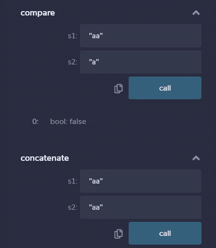
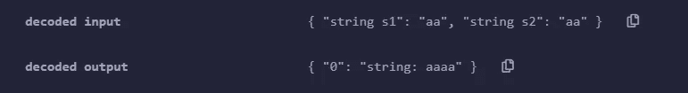

# 坚实:玩弄琴弦

> 原文：<https://betterprogramming.pub/solidity-playing-with-strings-aca62d118ae5>

## 开始使用可靠性


由[马蒂姆·布拉兹](https://unsplash.com/@martimbraz?utm_source=medium&utm_medium=referral)在 [Unsplash](https://unsplash.com?utm_source=medium&utm_medium=referral) 上拍摄的照片。

字符串代表了每一种编程语言的核心，因为你知道，计算机经常与人交互。因此，处理字符串是任何语言中最先开发的功能之一。此外，第一个测试传统上是[打印字符串](https://en.wikipedia.org/wiki/%22Hello,_World!%22_program)“Hello，world！”

[扎实](https://solidity.readthedocs.io/en/v0.7.1/)也不例外。它有对字符串的本地支持，但它们的使用仍然不像在 JavaScript、Python 或 Java 等高级语言中那样完整。例如，开箱即用，Solidity 不提供比较或连接字符串的本地方式。然而，文档为两个依赖于`abi.encodePacked()`(我们将在后面讨论)比较两个字符串的函数提供了一个有效的解决方案:

```
keccak256(abi.encodePacked(s1)) == keccak256(abi.encodePacked(s2)) 
```

要连接两个字符串:

```
abi.encodePacked(s1, s2)
```

为了更好地理解这两个简单函数的内部机制，像往常一样，我们将使用一个简单的玩具实现:

像往常一样，使用 [Remix](https://remix.ethereum.org/) 就可以舒服地玩了。编译完成后，您将能够直接从接口调用这两个方法:



调用方法的接口。

调用这两个方法将签署一个包含对传递参数的方法的调用的事务。执行字符串串联后，事务的输出显示在控制台窗口中(要完整显示结果，请记住单击右侧的小箭头):



“连接”方法的执行。

这两个简单实现的核心是函数`abi.encodePacked()`，它执行作为参数传递的变量的紧密打包。在下图中(取自[文档](https://solidity.readthedocs.io/en/v0.4.24/abi-spec.html#non-standard-packed-mode)，您可以看到每个参数的位是如何在输出中简单地连接起来的:


传递给 encodePacked 的参数实际上是如何打包的示例。

这种编码中有趣的一点是*天生模糊*，所以没有办法解码。在下面的代码中，我们简单地通过比较两组不同字符串的编码来测试这种模糊性。通过就地打包，两次调用将返回精确的字节序列，因为两次调用都将返回字符串`"aab"`，而不考虑输入字符串的不同长度:

由于其气体效率，通过使用`keccak256()`来比较编码的结果在可靠性方面是一种常见的方法。

# 结论

基本的字符串操作不是由 Solidity 本身提供的，而是通过对一些本机和有效使用的非常标准化的使用提供的。

还有更复杂的字符串[操作](https://github.com/willitscale/solidity-util) [库](https://github.com/Arachnid/solidity-stringutils)可用。甚至还有一个 JSON 解析器库。

我个人的建议是这种操控尽量低。给用户的消息、复杂的 JSON 操作等。应该远离区块链。区块链应该被视为一个专门的后端，其性能依赖于所涉及的每个变量的表示。

# 参考

1.  [坚固性 7.1 文档](https://solidity.readthedocs.io/en/v0.4.24/abi-spec.html#non-standard-packed-mode)
2.  [String&slice utility library for Solidity](https://github.com/Arachnid/solidity-stringutils)
3.  [坚固性标准实用程序](https://github.com/willitscale/solidity-util)