# 坚实度教程:关于 Calldata 的所有内容

> 原文：<https://betterprogramming.pub/solidity-tutorial-all-about-calldata-aebbe998a5fc>

## 理解 Solidity 中以太坊交易的“数据”字段

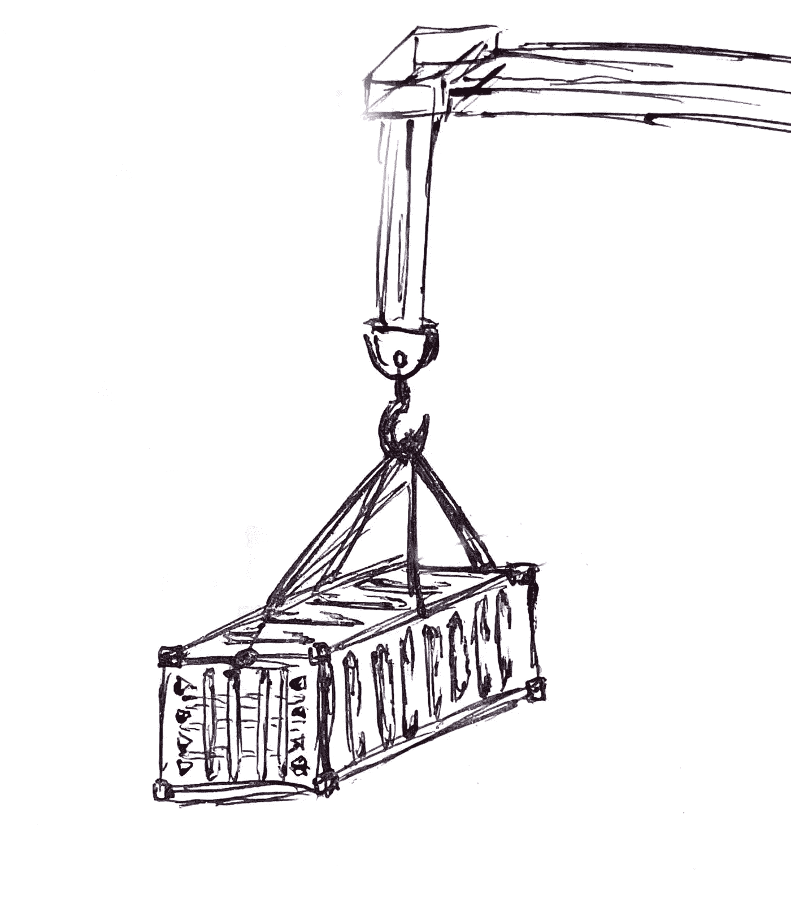

鸣谢:作者

> 这是[](/solidity-tutorial-all-about-data-locations-dabd33212471)**子系列的第三部分。**

*今天，我们将学习`calldata`的特性，以及为什么应该优先于其他数据位置，如`memory`。我们将使用来自 [Gnosis](https://gnosis.io/) safe 契约的代码示例来理解与`calldata`相关的三个 EVM 操作码。*

```
*Table of ContentsIntroduction
[Layout of calldata](#c451)
[Basics of calldata](#8b66)
[Accessing calldata in Solidity](#3266)
[Calldata opcodes With Assembly](#a041)
[Creating calldata for Low-level Calls](#c9a6)
[Extracting Bytes Calldata Slices](#2eea)
[calldata in Internal Functions](#a299)
[calldata in Constructor](#ce8d)*
```

# *介绍*

*如果你熟悉 web3.js 或 ethers.js，你可能看过作为参数传递给`.send({ ... })`或`.sendTransaction({ ... })`的`data`字段。*

*这就是 calldata(简而言之)，或者“沿着消息调用发送的数据”(无论我们是指一个`staticcall`，一个契约调用，还是一个改变任何形式的状态的实际事务——区块链状态还是契约状态，在这里都无关紧要)。*

*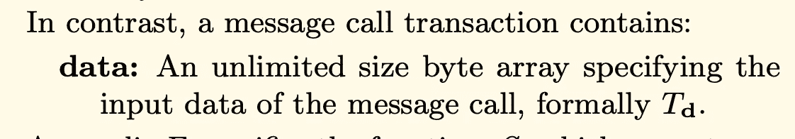*

*黄皮书对 calldata 有什么看法？(第 21 页，第 4.2 节>交易>数据)。*

*calldata 是 EVM 中的一个特殊数据位置。它指的是在两个地址之间的任何消息调用事务中发送的原始十六进制字节。对于 EVM，calldata 中包含的任何数据都由地址(无论是 EOA 还是智能合同)作为输入给出，以执行外部调用。*

*当调用协定(从 EOA 或另一个协定)时，calldata 是包含被调用函数的初始输入参数(=自变量)的数据位置。这里存储了`public`或`external`功能的参数。*

*看看其他编程语言，EVM 中的 calldata 可与:*

*   *C++中的动态内存(添加参考)。*
*   *C#中的堆内存(添加引用)。*

# *呼叫数据的布局*

*Calldata 由字节组成，以与内存相同的方式连续排列。这与存储或堆栈等其他数据位置的布局相反，后者由字(32 字节长)组成。*

*在 EVM 中，调用数据是一个字节可寻址空间，类似于 EVM 存储器。各种类型的变量在 calldata 中的布局方式与它们在内存中的布局方式非常相似。*

*对于读取，calldata 的行为方式与内存相同:一次可以加载 32 个字节(`mload` vs `calldataload`)。但是，它对内存的行为有所不同，因为您不能写入内存。*

*calldata 是任何基于 EVM 的区块链都非常特定的数据位置，具有一些布局特异性:*

*   *前 4 个字节对应于函数签名的选择器。*
*   *剩余的字节对应于函数的输入参数。每个输入参数的长度总是 32 个字节。如果其类型小于 32 字节，则该参数被填充。*

***注意**:根据输入参数的类型，输入参数被填充在右边或左边(例如，`uintN`或`address`被填充在左边，而`bytesN`被填充在右边)。*

# *呼叫数据基础*

*Calldata 经常与`memory`混淆，或者被理解为“内存中的特定位置”。Calldata 不同于 memory，因为它是一个独立的数据位置。要理解它与`memory`的区别，我们必须理解它的目的，但主要是它来自哪里。*

*要理解`calldata`与`memory`的区别，一个很好的问题是问“谁在 calldata 中创建数据？”vs“谁在内存中创建数据？”(“创建”和“分配”这两个词在这里可以互换使用)。*

*以太坊栈交易所的这个[精彩回答](https://ethereum.stackexchange.com/a/74443)有助于明确区分。*

> *“思考(T7 和 T8 之间的)区别以及如何使用它们的一个好方法是，`calldata`由调用者分配，而`memory`由被调用者分配。”—作者*

*这句话很有力量，总结的很好。让我们把它放在上下文中。从 EOA 或另一个合同`Source`调用合同`Target`时。*

*   *调用者(=无论是 EOA 还是`Source`契约)是创建要发送给`Target`契约的数据的人。该数据在 calldata 中分配，并通过消息调用发送到目标。*
*   *被调用者(=合同`Target`)使用 calldata 并使用内存做进一步的处理。正在处理的数据既可以从 calldata 加载，也可以从它自己的存储中加载。*

*现在让我们看看 calldata 的主要特性。calldata 是保存事务或调用的数据参数的数据位置。*

*   *不可修改(只读)=您不能修改或更改呼叫数据中的数据。它不能被覆盖。*
*   *几乎无限的大小=几乎无限的大小，没有固定的边界。*
*   *非常便宜且高效=读取+在调用中分配字节数据非常便宜且高效。*
*   *非持久性(事务完成后)*
*   *具体到交易和合同调用。*

## *呼叫数据不可修改*

*让我们从了解`calldata`在坚固性方面最重要的特征之一开始*

> *"存储在 calldata 中的数据是不可变的."—作者*

*当谈到 Solidity 中的呼叫数据时，这是需要理解的最重要的概念之一。*

*在他非常深入的文章 [*“数据在实体中的表示*](https://ethdebug.github.io/solidity-data-representation/)*”*中，哈里·奥特曼陈述了一个关于复杂句子背后的 calldata 的重要事实:*

> *"[……]因此我们会说“calldata 不能直接包含值类型”之类的话，只是因为 Solidity 不允许声明值类型的 calldata 变量(calldata 中的原始值总是会在使用前复制到堆栈中)。显然，该值仍然存在于 calldata 中，但由于没有变量指向那里，所以这不是我们所关心的。”*

*对我们来说重要的部分在括号之间:“calldata 中的原始值在使用之前总是被复制到堆栈中。”*

*从这句话中，我们可以推断出三件事:*

1.  *calldata 是不可变的:我们不能修改驻留在其中的数据。*

*结果是*

*2.calldata 是只读的*

*3.当从 calldata 读取值时，值被复制到堆栈上。*

*calldata 是不可变的这一事实也导致了我们只能通过 Solidity 中的引用，使用`calldata`关键字来访问 calldata。*

*任何用`calldata`指定为数据位置的复杂类型变量都是只读的。无法修改该变量。如果变量作为函数参数传递或在函数体中定义，这一点适用。*

*让我们通过下面的 Solidity 代码片段来看看它的实际应用。如果你在 Remix 中粘贴这段代码，Solidity 编译器会抱怨被指定为`calldata`的`input`变量，不允许你编辑它们。*

*Calldata 的大小几乎没有限制。*

*Calldata 比内存有一个额外的好处:它的大小。*

*内存有最大大小限制。它最多可以容纳 2 ** 64 字节(= uint 64 的最大值)。*

*相比之下，calldata 的大小实际上是无限的。这在黄皮书中都有描述，也可以从 geth 客户机源代码中的类型推断出来。*

**

*黄皮书对 calldata 有什么看法？(第 21 页，第 4.2 节>交易>数据)。*

*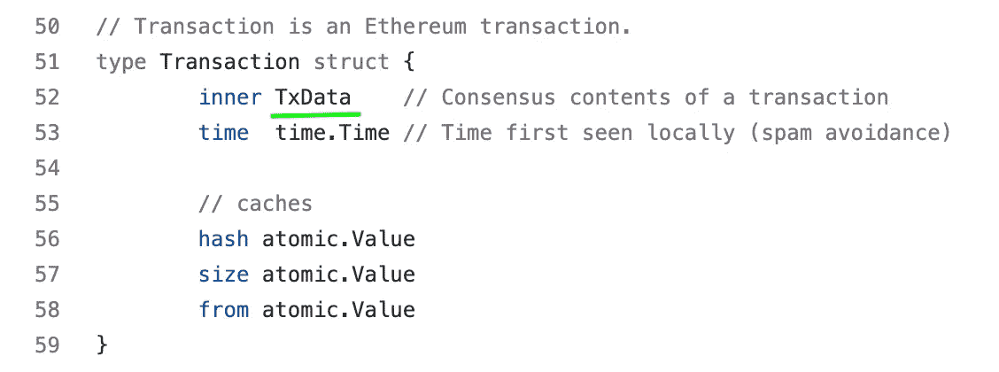*

*[source: geth 客户端源代码(Github)—core/types/transaction . go，第 50–59 行](https://github.com/ethereum/go-ethereum/blob/5f70f9fd37b14c6c8021cd277f9d620dbef7583b/core/types/transaction.go#L50-L59)*

*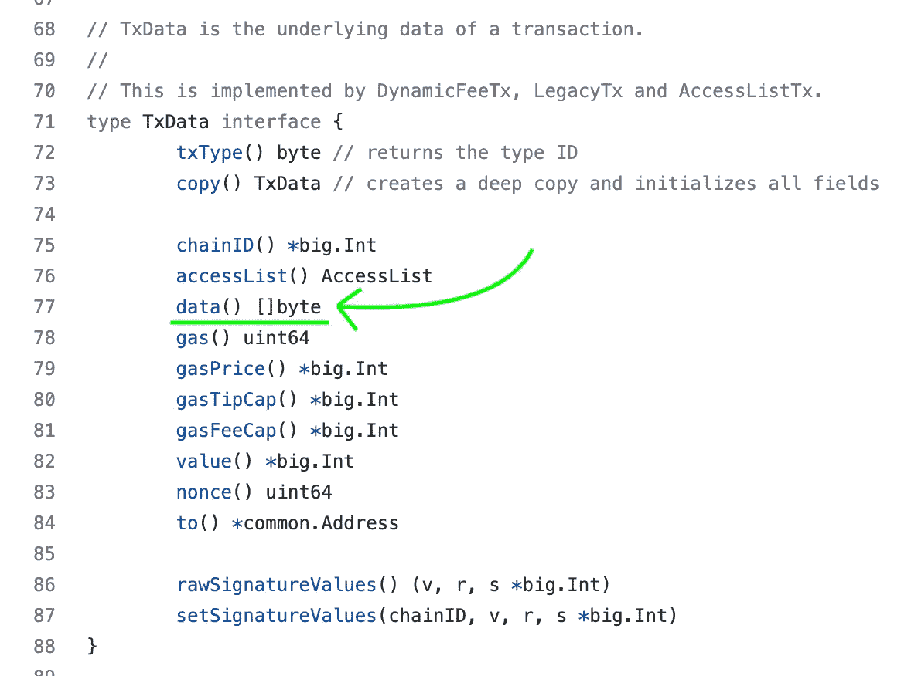*

*[source: geth 客户端源代码(Github)—core/types/transaction . go，第 77 行](https://github.com/ethereum/go-ethereum/blob/5f70f9fd37b14c6c8021cd277f9d620dbef7583b/core/types/transaction.go#L77)*

*这意味着，在某种程度上，“calldata 可以根据需要保存任意多的字节。”然而，从技术上来说，调用数据和内存一样，也会受到阻塞气体限制的约束。*

*然而，在 calldata 中分配更多字节的成本总是与内存成线性关系，而随着内存大小的增加，这种关系成平方关系。我们将在下一小节中看到这种差异。*

## *Calldata 非常便宜而且省油*

*尽管 calldata 是只读的，并且不能写入，但它仍然有成本。但与其他数据位置相比，这一成本在汽油方面相对便宜。*

*calldata 的每个字节都有一个开销:*

*   *4 气为 0 字节`0x00`*
*   *16 gas 为非零字节。*

*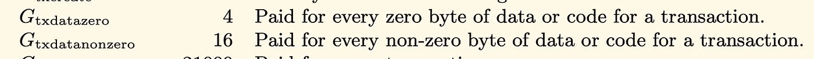*

*[资料来源:以太坊黄皮书，附录 G，费用表(柏林版，第 27 页)](https://ethereum.github.io/yellowpaper/paper.pdf)*

> ***注**:非零字节气费变更为 [EIP 2028 —交易数据气费下调](https://eips.ethereum.org/EIPS/eip-2028)。降低 calldata 的气体成本的目的是提高链上的可伸缩性。由于呼叫数据更便宜，每个事务可以容纳更多的呼叫数据字节，一般来说，单个块可以容纳更多的数据(《EIP》的作者称之为“呼叫数据的更高带宽”)。*
> 
> *EIP 2028 鼓励第 2 层可扩展性解决方案。就像洋葱的各层一样，高消耗的操作(存储读/写+计算)被移到外层(离链),并引入数据传输。这采用证明系统/欺诈证明的形式(在单个证明 tx 中批量处理多个交易)，或者通过 calldata 将数据放在主链上。*
> 
> *保持调谐！我们将在本文后面的第 2 层环境中研究 calldata:)*

*类似地，操作码`CALLDATALOAD`从 calldata 读取一个 32 字节的字只需要 3 个 gas，方法是将它从 calldata 加载到堆栈上。*

*相比之下，使用`MLOAD`操作码从内存读取的成本取决于内存的当前大小和[内存扩展成本](https://www.evm.codes/about)。*

## *Calldata 特定于外部调用，例如 Gnosis*

**

*图片来源:[cryptoouf.com](https://cryptoouf.com/reviews/gnosis)*

*如上所述，`calldata`通常指来自外部交易(eoa)或合同调用的数据。它只特定于消息调用，而不特定于契约创建事务(我们将在下面的“构造函数中的调用数据”一节中看到这种差异)*

*让我们使用一个流行项目的可靠性代码的例子:来自[address[]](https://medium.com/u/e7281ad70ea#L76)的[数组。这些用数据位置`calldata`指定，因为该功能被定义为`external`。](https://github.com/safe-global/safe-contracts/blob/186a21a74b327f17fc41217a927dea7064f74604/contracts/GnosisSafe.sol#L76)*

**

*[来源:gnosis safe . sol(Github.com)](https://github.com/safe-global/safe-contracts/blob/186a21a74b327f17fc41217a927dea7064f74604/contracts/GnosisSafe.sol#L76)*

# *在 Solidity 中访问呼叫数据*

*让我们看一下黄皮书。被定义为执行环境的呼叫数据包含以下字段:*

*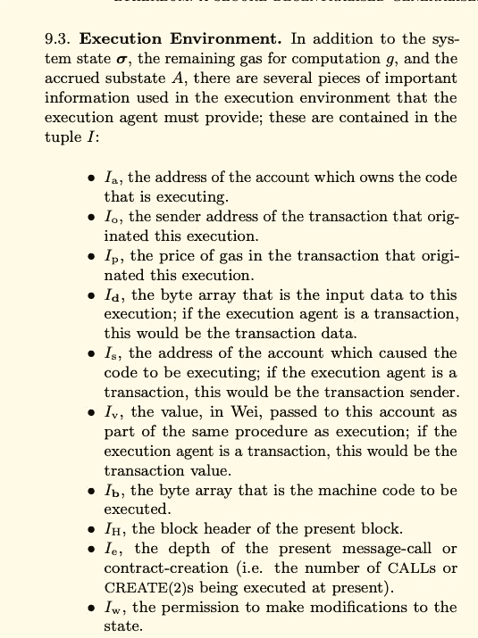*

*[资料来源:以太坊黄皮书，第 13 页，第 9.3 节](https://ethereum.github.io/yellowpaper/paper.pdf)*

*此类字段可通过全局变量`msg.`在 Solidity 中访问。此全局变量允许访问呼叫数据中的不同信息，包括以下内容:*

*   *`msg.sender` =发起消息呼叫的地址。*
*   *`msg.value` =在调用或事务中发送的值。*
*   *`msg.sig` =函数标识符(函数签名的 keccak256 散列的前 4 个字节)。这相当于访问 calldata 的前 4 个字节。(展示一个例子)*
*   *需要解释*
*   *`gasleft()` =交易中剩余的可用气体量。*

> *在 0.6.4 版本的 Solidity 中，数据位置 calldata 仅适用于外部函数调用的参数。
> 从 Solidity 0.6.4 开始，calldata 作为一个数据位置也可以为公共、内部或私有函数的参数指定。*
> 
> *gasleft()以前被称为 msg.gas，但在 0.5.0 中被删除了*

## *消息.信号*

*calldata 的前 4 个字节引用函数选择器。它是被调用函数的选择器。*

*它可以通过取函数签名的 keccak256 散列的前 4 个字节来获得。例如，对于以下功能:*

```
*function withdraw(uint256a amount) external {}*
```

*函数签名可以派生为函数名，参数类型放在括号中。*

```
*withdraw(uint256)*
```

*散列函数签名将导致以下结果:*

```
*keccak256("withdraw(uint256)") = 0x2e1a7d4d13322e7b96f9a57413e1525c250fb7a9021cf91d1540d5b69f16a49f*
```

*功能选择器仅对应前 4 个字节，为`0x2e1a7d4d`。*

*如果函数包含多个参数，则要哈希的函数签名中的参数类型必须是用逗号“，”分隔的参数，不能有空格。例如，ERC20 中流行的`transfer`函数。*

```
*// function definition
function transfer(address to, uint256 amount) public returns (bool)// signature
transfer(address,uint256)// keccak256("transfer(address,uint256)")
0xa9059cbb2ab09eb219583f4a59a5d0623ade346d962bcd4e46b11da047c9049bselector = 0xa9059cbb*
```

*最后，当函数参数是复杂或动态类型并指定数据位置时，函数签名从不包括数据位置。例如，ERC721 中包含第四个参数`bytes memory data`的常用`safeTransferFrom`函数。*

```
*// function definition
function safeTransferFrom(
    address from,        
    address to,        
    uint256 tokenId,        
    bytes memory data    
) public// signature
safeTransferFrom(address,address,uint256,bytes)// keccak256("safeTransferFrom(address,address,uint256,bytes)")
0xb88d4fde60196325a28bb7f99a2582e0b46de55b18761e960c14ad7a32099465selector = 0xb88d4fde*
```

*EVM 使用 calldata 的选择器来标识在一次调用中必须执行哪个函数。*

*因此，您可以使用全局成员`msg.sig`访问函数选择器。*

*您还可以使用 calldata 切片进行如下提取。*

```
*bytes4 selector = msg.data[4:]*
```

> ***注:** `*msg.sig*` 用于施工人员*
> 
> *在构造函数中，当创建代码运行时，没有 4 字节的偏移量。这是因为在构造函数中，calldata 是空的(特殊变量`*msg.sig*`被填充以包含 4 个零字节)。我们将在下面看到更多的细节。*

## *消息.数据*

*全局`msg.data`让您可以访问整个调用数据，包括函数选择器。*

*calldata 由我们之前看到的函数选择器(4 个字节)和传递给函数的其余参数(如果给定的话)组成。*

*在 calldata 的上下文中，这些参数通常被称为输入数据。*

*需要记住的一点是，输入数据参数的长度是 32 字节。任何需要传递给函数的参数都可以添加到 32 字节的片段中。*

*这些被称为“字”,跟随在交易输入数据的签名散列之后。*

# *调用程序集中的数据操作码*

*EVM 提供了三个主要的操作码来与 calldata 交互。*

*   *`CALLDATALOAD` =允许从作为参数给出的特定偏移量开始，从 calldata 加载一个 32 字节的字。*
*   *`CALLDATASIZE` =返回 calldata 中包含的字节数*
*   *`CALLDATACOPY` =将给定数量的字节从 calldata 中的源复制到内存中的指定目的地。*

*Solidity 提供了这些操作码的内联汇编版本。*

*为了更好地理解它们，让我们重新使用 Gnosis 安全契约中的一个例子。`GnosisSafeProxy.sol`(一个通用代理契约)是一个用来理解作为数据位置的`calldata`的例子。*

*通过在构造函数中指定实现地址，将一个`GnosisSafeProxy`链接到部署上的实现契约。*

*这个单例代理只包含一个函数:`fallback()`函数。对契约的任何调用都在这个函数中结束。然后，`fallback()`函数将获取调用数据，并通过`delegatecall`将其发送给实现契约(由变量`singleton`定义)。因为它是一个`delegatecall`，函数的逻辑将在代理契约的上下文中运行(执行`delegatecall`)，并且代理契约的存储/状态将被更新。*

*`delegatecall`对存储器中的数据进行操作。因此，为了使回退功能起作用，必须首先将所有调用数据复制到内存中。*

> *关于代理调用如何工作的更多细节，请参见文章[“关于地址的一切”](https://jeancvllr.medium.com/solidity-tutorial-all-about-addresses-ffcdf7efc4e7)*

**

*[来源:Github 上的 GnosisSafeProxy.sol 契约](https://github.com/safe-global/safe-contracts/blob/da66b45ec87d2fb6da7dfd837b29eacdb9a604c5/contracts/proxies/GnosisSafeProxy.sol)*

*这个代码片段中的`fallback()`函数使用了与 calldata 相关的三个操作码。*

## *调用数据加载*

*`calldataload`操作码将 32 字节的事务数据加载到堆栈上。它只需要一个参数，如下所示:*

```
*calldataload(startingOffset)*
```

*   *开始加载的 calldata 中的`startingOffset` (= index)。*

*然后，它将从 calldata 中的指定偏移量开始将 32 个字节加载到堆栈上。*

*在 Gnosis 示例中，`calldataload`从 calldata 的开头(偏移量 0)开始加载 32 个字节。然后，它比较 calldata 的前 4 个字节是否对应于函数签名`masterCopy()`的散列。*

*通过用一些零`0000...`填充文字`0xa619486e`来进行比较，使其长度达到 32 个字节。两个值(文字十六进制字符串和从 calldata 加载的内容)通过相等操作码`eq()`进行比较。*

*如果匹配(calldata 是`masterCopy()`的函数选择器)，则不进行约定调用。`masterCopy()`函数将返回实现契约的地址。因此，为了避免进行合同调用(这会造成不必要的开销和浪费)，我们返回变量`_singleton`(包含实现地址)。*

## *调用数据副本*

*`calldatacopy`在内存中复制一定数量字节的交易数据。`calldata`操作码有三个参数:*

```
*calldatacopy(
    memoryDestinationOffset, 
    calldataStartOffset, 
    nbOfBytes
)*
```

*   *内存中的`memoryDestinationOffset`，结果将被复制到那里。*
*   *调用数据中开始复制的`calldataStartOffset`。*
*   *要复制的`nbOfBytes`。*

*在 gnosis 示例中，这个操作码在 fallback 函数中用于将所有的 calldata 复制到一个内存指针(=发送到契约的所有数据有效负载)。将所有有效载荷复制到内存后，由下一行的`delegatecall`消耗。*

*`GnosisSafeProxy`契约如何加载整个调用数据？如果您查看`calldatacopy`操作码的第三个参数，您会看到用于该参数的值本身就是一个操作码。*

## *calldatasize*

*`calldatasize`操作码返回事务数据的字节大小。它在栈顶输出结果。这不需要任何争论。*

```
*calldatasize()*
```

*正如上一节所解释的，它用于将整个 calldata 加载到内存中，以便它可以被`delegatecall`操作码使用。*

# *为低级别呼叫创建呼叫数据*

*我们了解到，tx/message 调用的数据字段中包含的内容使智能合约能够知道要执行和运行哪部分代码。我们命名为`calldata`的这个数据字段是一个字节序列，包含要调用的函数的 bytes4 函数选择器+它的参数。我总是将整个 calldata(字节 4 选择器+函数参数)命名为有效负载(不是恶意软件术语)。*

> *有效载荷是[发送数据](https://en.wikipedia.org/wiki/Data_transmission)的一部分，即实际的预期消息。[头](https://en.wikipedia.org/wiki/Header_(computing))和[元数据](https://en.wikipedia.org/wiki/Metadata)仅被发送以启用有效载荷传送。(维基百科)。*

*当通过`address(target_contract).call(calldataPayload)`进行外部低级调用时，有多种方法来构建将在 tx/msg 调用中传递的 calldata。*

*我们将在下面看到所有可用的选项来构建这样的呼叫数据作为一个`bytes`值，这样它就可以通过一个低层`.call()`发送。这将包括新推出的`abi.encodeCall(...)`。*

*想象一下这个示例场景:a `CallerContract`与 a `DeployedContract`交互。`CallerContract`旨在调用`DeployedContract`中的`add(uint256)`函数。*

## *将数据作为文字字符串调用*

*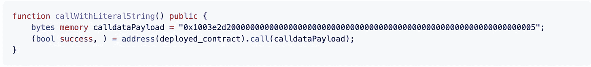*

*[来源:Github，calldata.md 上关于坚固性的一切](https://github.com/CJ42/All-About-Solidity/blob/master/articles/data-locations/Calldata.md)*

## *以十六进制“…”字符串形式调用数据*

*这与前面的例子有细微的区别。*

*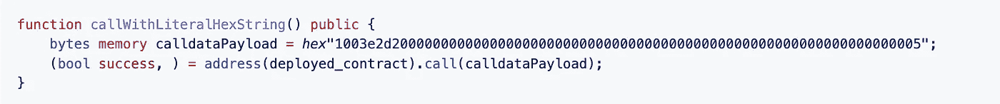*

*[来源:Github，calldata.md](https://github.com/CJ42/All-About-Solidity/blob/master/articles/data-locations/Calldata.md) 上关于可靠性的一切*

## *通过使用 keccak256 手动创建字节 4 选择器来调用数据*

*下面，我们根据 ABI 指定的规则手动计算函数选择器。我们执行以下操作:*

1.  *哈希函数签名`keccak256` +只保留前 4 个字节。*
2.  *在末尾追加函数调用的参数。*

*对于附加/连接，我们使用`abi.encodePacked(...)`按照 ABI 规范将任何实体类型转换为低级字节表示。(`bytes.concat(...)`不允许我们这样做，因为它只能接受固定大小的字节)。*

**

*[来源:Github，calldata.md](https://github.com/CJ42/All-About-Solidity/blob/master/articles/data-locations/Calldata.md) 上关于可靠性的一切*

## *使用`abi.encodeWithSignature`调用数据*

*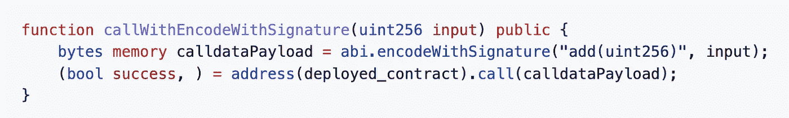*

*[来源:Github，calldata.md 上关于坚固性的一切](https://github.com/CJ42/All-About-Solidity/blob/master/articles/data-locations/Calldata.md)*

## *使用`abi.encodeWithSelector + bytes4 value`调用数据*

*在这个例子中，函数选择器被手动写成一个`bytes4`文本。*

*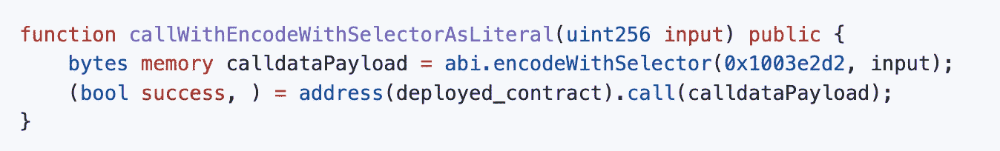*

*[来源:Github，calldata.md 上关于坚固性的一切](https://github.com/CJ42/All-About-Solidity/blob/master/articles/data-locations/Calldata.md)*

*您还可以通过以下方式生成字节 4 选择器:*

```
*bytes4(keccak256("add(uint256)"))*
```

## *使用`abi.encodeWithSelector + functionName.selector`调用数据*

*手动计算或生成函数选择器可能很棘手，而且容易出错。事实上，例如，提供给`abi.encodeWithSignature(...)`的字符串中的一个错别字可能会生成错误的选择器。*

*这个例子是我最喜欢的例子之一，我强烈推荐它。您可以使用内置实体成员`.selector`从函数中提取选择器。合同的每个功能都有这个特性(包括`contract`和`interface`)。*

**

*[来源:Github，calldata.md 上关于坚固性的一切](https://github.com/CJ42/All-About-Solidity/blob/master/articles/data-locations/Calldata.md)*

## *使用`abi.encodeCall`调用数据*

*这个新语法是在 Solidity 0.8.11 中引入的。它将类型安全检查添加到提供的参数中。唯一的区别是我们脱离了函数选择器的概念，而是使用了函数指针。*

*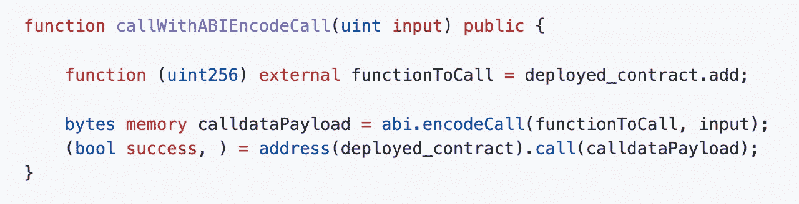*

*[来源:Github，calldata.md](https://github.com/CJ42/All-About-Solidity/blob/master/articles/data-locations/Calldata.md) 上关于可靠性的一切*

# *从呼叫数据中提取切片*

> *语法`*data[start:end]*`只适用于指向`*calldata*`的`*bytes*`变量，不适用于`*memory*`。*

*我们了解到 calldata 是一个连续的`bytes`字符串。您可以使用呼叫数据切片提取 Solidity 中的一部分呼叫数据。Solidity 的 [0.6.0 主版本提供了这个特性。](https://blog.soliditylang.org/2020/05/26/array-slices/)*

*呼叫数据切片使您能够获取呼叫数据的切片。返回的切片类型为`bytes`。它通过指定以下内容来工作:*

*   *开始切片的偏移量。*
*   *帮助确定切片结束位置的偏移量。*

*冒号`:`分隔开始和结束。您也可以发出开始或结束。省略开始将默认从偏移量 0 开始切片。省略 end 默认切片到 calldata 中的最后一个字节。*

*在两种情况下切片是可以使用和有用的。*

*案例 1:直接从整个 calldata 切片— `msg.data`。*

```
*msg.data[start:end]*
```

*案例 2:用数据位置 calldata 对 a `bytes`进行切片。*

```
*function example(bytes calldata input) public {
    bytes calldata secondThirdBytes = input[1:3];
}*
```

*让我们用一些例子来说明。*

## *提取函数选择器*

*可以通过对 calldata 的前 4 个字节进行切片来提取函数的签名。这相当于`msg.sig`(除了`msg.sig`会自动强制转换到前 4 个字节。下面，我们通过显式转换进行转换)。*

```
*bytes4 selector = msg.data[:4];*
```

> ***注意:**从`bytes`转换到`bytesN`是[从 Solidity 0.8.5 开始可用。](https://github.com/ethereum/solidity/releases/tag/v0.8.5)*

## *提取字节片*

*以`bytes`数据`0xcafecafebeefbeeff00df00d`为例。*

*您可以使用开始和结束提取呼叫数据的不同部分，如下所示:*

**

*[来源:Github 上关于可靠性的所有内容，calldata.md](https://github.com/CJ42/All-About-Solidity/blob/master/articles/data-locations/Calldata.md)*

# *调用内部函数中的数据*

*在 Twitter 上与一些 Solidity 开发者讨论时，我被要求解释以下内容:*

**“为什么不能将一个* `*memory*` *变量传递给一个以* `*calldata*` *为参数的内部函数？”**

*"但是为什么你可以反过来做呢:把一个 calldata 变量传递给一个内部函数，这个函数把内存作为一个参数？"*

*让我们用图片来展示答案。为什么下面的代码会编译？*

*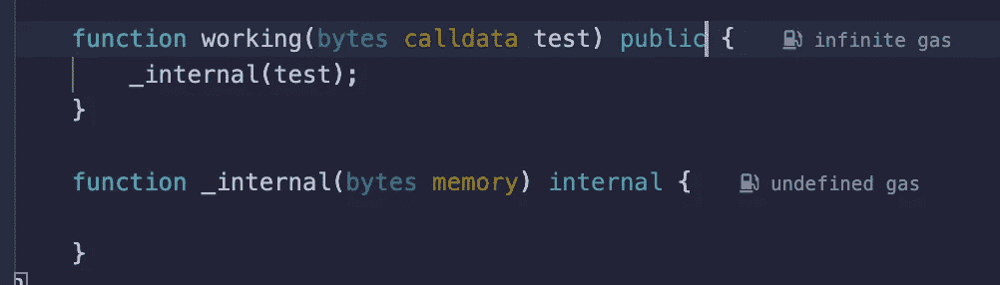*

*鸣谢:作者*

*而这两个代码片段不会编译并返回错误？*

*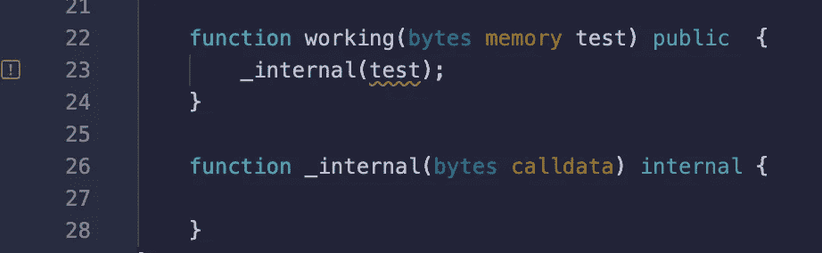*

*鸣谢:作者*

*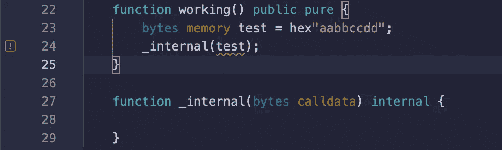*

*鸣谢:作者*

*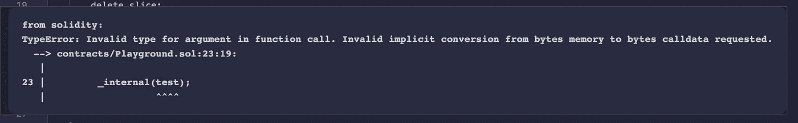*

*鸣谢:作者*

*答案在于`calldata`和`memory`的特性。正如我们已经看到的，calldata 是只读的。相反，内存是一个可读可写的数据位置。*

*让我们回到第一个编译的例子。在本例中，EVM 可以将变量从 calldata 移动到内存中。我们可以将这个流程表示如下:*

*EVM 能够做到这一点:`calldata` → ✅ `memory`*

*当一个`calldata`引用被传递给一个接受`memory`作为函数参数的内部函数时，EVM 可以通过两种方式将这个值从 calldata 移动到内存中:*

1.  *使用操作码`calldataload`(将值从 calldata 加载到 stacl)，然后使用`mstore`(将加载的值写入内存)。*
2.  *使用操作码`calldatacopy`在单个步骤中将值从 calldata 直接移动到内存中。*

> ***注:**实际上，值并不是从真正意义上的 calldata 中*“移动”出来的。它们是相当抄袭的。操作码`*calldataload*`和`*calldatacopy*`都创建副本。calldata 中的数据是不可变的，只制作其副本。**

****

**鸣谢:作者**

**另一方面，所示的两个代码示例没有编译，因为 EVM 不能在另一个方向移动值(从内存到 calldata)。**

**EVM 无法做到这一点:`calldata` ❌ ← `memory`**

**正如我们所看到的，calldata 是只读的，没有与写入 calldata 相关联的操作码(只有要读取的操作码)。**

****

**鸣谢:作者**

**这使我们看到 calldata 是一个单向的数据位置:来自 calldata 的值只能被加载。因此，来自 calldata 的值总是:**

1.  **使用`calldataload`或`calldatacopy`加载(=复制)到堆栈中。**
2.  **然后加载/复制的值被移入`storage`、`memory`或`code`(对于构造函数中的`immutable`)。**

# **调用 C 语言中的数据`onstructor`**

**有一种特殊情况，calldata 的行为有所不同。构造函数就是这种情况。**

**在构造函数的上下文中，数据位置`calldata`不能作为函数参数。**

**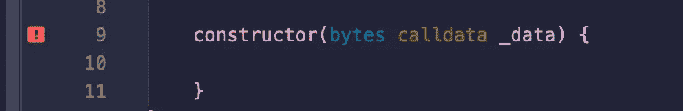**

**鸣谢:作者**

**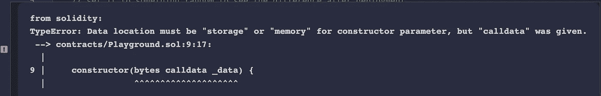**

**鸣谢:作者**

**原因是，当部署协定并且构造函数运行时，calldata 总是为空。在部署事务期间，合同创建代码不会进入`data`字段(=调用数据)。相反，合同创建代码进入交易的`init`字段。**

**这在黄皮书中有描述(见下面截图)。`**data**` 字段用于消息调用，只能对存储了一些代码的地址进行调用(也称为智能契约)。当构造函数运行时，地址是已知的，但是没有字节码存储在被部署的契约的地址下。**

**因此，在构造函数上下文中的 calldata 中没有 4 字节的偏移量(`bytes4`函数选择器)。特殊变量`msg.sig`被填充以包含 4 个零字节**

**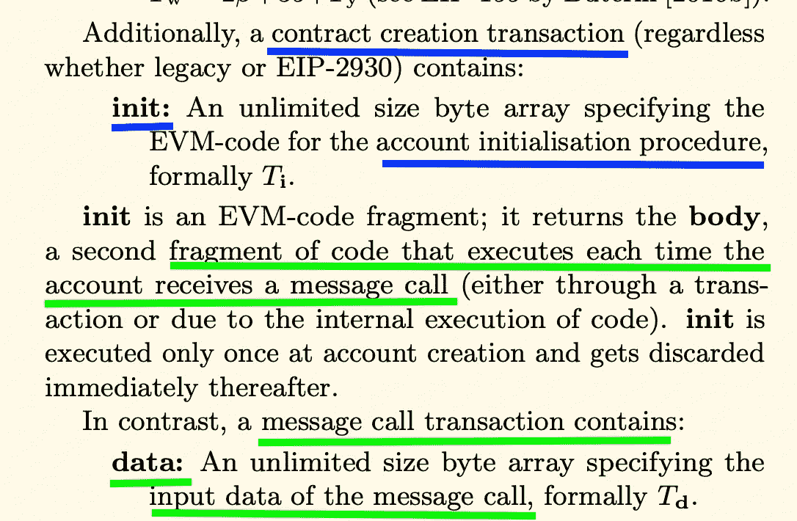**

**[资料来源:以太坊黄皮书，柏林版，第 5 页](https://ethereum.github.io/yellowpaper/paper.pdf)**

**我们可以在下面的截图中看到这种行为:**

**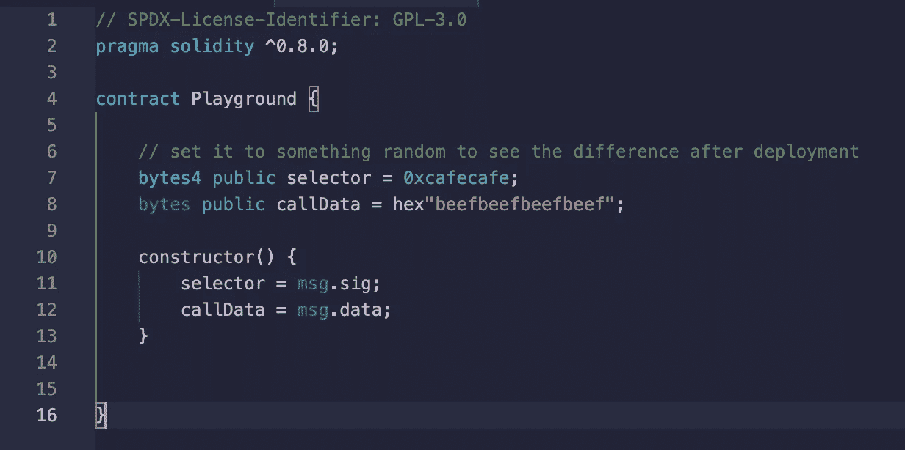**

**鸣谢:作者**

**在部署时，我们将来自 calldata 的值分配给状态变量。这就是我们所获得的。**

**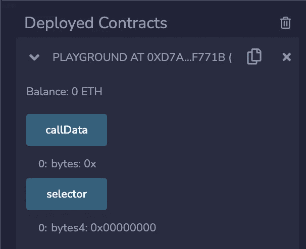**

**鸣谢:作者**

# **参考**

**[](https://github.com/safe-global/safe-contracts/blob/da66b45ec87d2fb6da7dfd837b29eacdb9a604c5/contracts/proxies/GnosisSafeProxy.sol) [## safe-contracts/gnosis safe proxy . sol at da 66 b 45 EC 87 D2 FB 6 da 7 DFD 837 b 29 ea CDB 9 a 604 c 5…

### 此文件包含双向 Unicode 文本，其解释或编译可能与下面显示的不同…

github.com](https://github.com/safe-global/safe-contracts/blob/da66b45ec87d2fb6da7dfd837b29eacdb9a604c5/contracts/proxies/GnosisSafeProxy.sol) [](https://ethereum.org/en/developers/tutorials/short-abi/#:~:text=A%20byte%20of%20calldata%20costs,on%20L2%20is%2022100%20gas) [## 呼叫数据优化的简短 ABIs | ethereum.org

### april 波默兰兹 2022 年 4 月 1 日 15 分钟阅读这篇文章，你会了解到乐观的累积，成本…

ethereum.org](https://ethereum.org/en/developers/tutorials/short-abi/#:~:text=A%20byte%20of%20calldata%20costs,on%20L2%20is%2022100%20gas)  [## EIP-2028 年:交易数据天然气成本降低

### 我们建议将 call data(gtxdata 非零)的 gas 成本从当前的每字节 68 gas 降低到每字节 16 gas

eips.ethereum.org](https://eips.ethereum.org/EIPS/eip-2028)  [## 固体中的数据表示

### 适用于代码调试器和其他调试相关实用程序的编写人员。作者哈里·奥特曼[@haltman-at]发表…

ethdebug.github.io](https://ethdebug.github.io/solidity-data-representation/) [](https://medium.com/@devrann.simsek/solidity-msg-sender-9072c1561966) [## 可靠性—消息发送者

### 在这一章中，我们将学习 Solidity 中的 Msg.sender。

medium.com](https://medium.com/@devrann.simsek/solidity-msg-sender-9072c1561966) [](https://ethereum.stackexchange.com/questions/74442/when-should-i-use-calldata-and-when-should-i-use-memory) [## 什么时候应该使用 calldata，什么时候应该使用内存？

### memory 和 calldata(以及 storage)是定义存储变量的数据区域的关键字。要回答…

ethereum.stackexchange.com](https://ethereum.stackexchange.com/questions/74442/when-should-i-use-calldata-and-when-should-i-use-memory)**