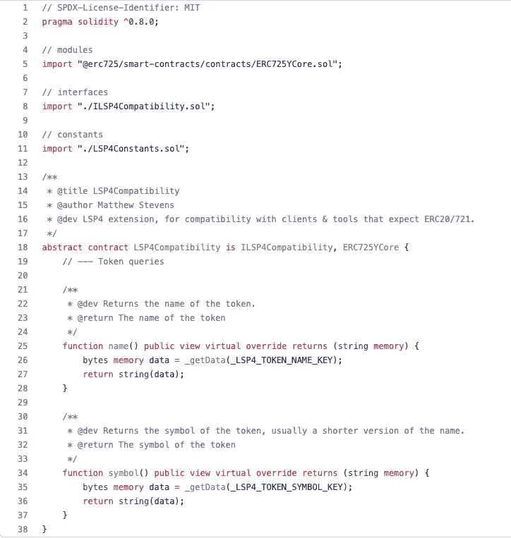

# 实体教程:关于类型转换的所有内容

> 原文：<https://betterprogramming.pub/solidity-tutorial-all-about-conversion-661130eb8bec>

## 实性的隐式与显式转换，以及理解类型间转换的例子。


由[杰米·坦普尔顿](https://unsplash.com/@jamietempleton)在 Unsplash 上拍摄的照片

今天的文章相当有深度，技术性和细节性！我们探索不同类型之间的转换。

我们这篇文章的主要目的是让你理解*“在可靠性方面，隐式转换和显式转换的区别是什么”*。

然后，我们将讨论类型之间的每种可能的转换，仍然使用一些代码示例。所以，拿起咖啡或茶(或一杯威士忌)，让我们开始吧！

# 目录

*   隐式与显式—定义
*   坚实度的隐式与显式转换
*   无符号整数之间的转换`uintN`
*   `bytesN`(*eg:*`*bytes4*`*<->*`*bytes16*`*)*之间的转换
*   从`uintM`到`bytesN`的转换
*   从`bytesN`到`uintM`的转换
*   从`bytes`到`string`的转换
*   表格摘要— `uintM` ← → `bytesN`
*   `bytesN`的文字赋值
*   小数和十六进制文字赋值`uintN`
*   从`bytes`到`bytesN`的转换
*   转换为`address`类型
*   `address`和`address payable`之间的转换
*   `Contract`和`address`类型之间的转换
*   参考

# 隐式与显式—定义

在深入探讨*Solidity 中的隐式 vs 显式转换*之前，我们先来了解一下人类语言中的区别。

[Lexico.com](https://www.lexico.com/)给出了隐性和显性的如下定义。

> [含蓄](https://www.lexico.com/definition/implicit) =暗示某事，但不直接表达。
> 
> 明确的；清楚的；清楚的；清楚的。

当一件事很明确的时候，它是非常清楚的。没有模糊的理解或歧义

当某事是隐含的，它是隐含的。有些东西是从措辞上理解的，它不是直接陈述或清楚描述的。

让我们用一个例子来说明。爱丽丝是鲍勃的雇员。如果她得不到加薪，她打算表达她离开公司的决定。她可以这样表达:

> 含蓄地:*“如果我没有得到更多的赏识，我会检讨我的选择。”*
> 
> 明确地说:“如果我得不到加薪，我会离开。”

# 坚实度的隐式与显式转换

所有编程语言都支持某种类型的转换。

坚固性也允许类型转换。Solidity 中的类型转换可以在三种主要情况下发生:

*   通过变量赋值。
*   向函数传递参数时。
*   应用运算符时。

类型转换可以隐式完成(=编译器自动派生类型)，也可以通过对编译器显式完成(=告诉编译器要转换到哪种类型)。

让我们详细看看 Solidity 编译器的隐式和显式转换的基本规则。

## [隐式转换](https://docs.soliditylang.org/en/v0.8.13/types.html?highlight=Implicit%20conversion#implicit-conversions)

在以下情况下，Solidity 允许两种数据类型之间的隐式转换:

*   语义上有意义*(什么意思？)*
*   在此过程中不会丢失任何信息。

*示例:*

*   `uint8`到`uint16` = ✅
*   `int120`到`int256` = ✅
*   `int8`到`uint256` = ❌ ( *因为* `*uint256*` *不能保存可能来自* `*int8*` *的负值)。*

从上面的最后一个例子可以看出，当一些信息可能丢失时，Solidity 编译器不允许隐式转换。

使用最后一个例子来说明，如果`int8`的值是`-5`，编译器将不得不放弃求反，以便将其转换为允许的`uint256`数。这种转换会导致数据中的信息丢失，Solidity 编译器足够聪明，能够知道这一点并向您发出警告。

但是，如果你*“不同意编译器”*，或者你想*“强制一些转换”，*你总是可以通过显式告诉编译器该怎么做。

## 显式转换

> 如果编译器不允许隐式转换，但您知道自己在做什么，显式类型转换有时是可能的。

显式转换可以通过*强制转换*或类似构造函数的语法来完成。

```
uint256 a = 12345;
bytes32 b = bytes32(a);
```

然而，显式转换可能有风险，如 Solidity 文档中所述。

> 这可能会导致意想不到的行为，并允许您绕过编译器的一些安全功能，所以一定要测试结果是否是您想要的和期望的！

## 定义摘要

这里用两句话总结一下*隐式* *vs 显式*在坚固性上的转换。

在 Solidity 中从类型`A`转换到类型`B`时，数据中的一些信息可能会在转换过程中丢失。

*   使用隐式转换:您可能没有意识到(潜在的)信息正在丢失。

如果某些信息确实丢失了，编译器将拒绝编译并抛出一个错误❌

*   使用显式转换:您完全知道一些信息可能会丢失。

由于*你对编译器*是显式的，它将允许你编译，并允许(潜在的)信息✅损失

# 无符号整数之间的转换`uintN`

Solidity 中的无符号整数以不同的比特大小存在于 8 比特序列中。例如:`uint8`、`uint16`、`uint24`、`uint32`、…直到`uint256`。

为了便于理解，让我们定义一个**高型**和**低型**的编号:

*   **更大的类型号:**更接近最低位范围`uint8`的数字。
*   **更小的类型号:**更接近最高位范围`uint256`的数字。

无符号整数的转换可以双向进行。

## 转换成更大的类型

在这个场景中，您正在将一个数字转换成一个比初始类型更大的新类型。

*例如:* `uint64`到`uint128`

当将无符号整数转换为更大的类型时，**出现左填充**，意味着零(= 0 位)被添加到左边。

```
uint16 a = 0x1234;
uint32 b = uint32(a); // b = 0x00001234
```

## 转换成较小的类型

在这种情况下，您要将一个数字转换为比初始类型更小的新类型。

*例如:* `uint256`到`uint128`

当将无符号整数转换为较小的类型时，**高阶位(最左边的位)最终被丢弃。**

*示例:*

```
uint32 a = 0x12345678;
uint16 b = uint16(a); // b = 0x5678
```

这相当于对我们要转换的数字取模，转换新位范围的较高数字。

让我们举以下例子:

```
uint32 a = 100000;
uint16 public b = uint16(a); //b = a % 65536
uint8 public c = uint8(a); //c = a % 256
```

在上面的例子中:

*   `uint16 b`可以通过做`a % 65536 = 34,464`来计算
*   `uint8 c`可以通过做`a % 256 = 160`来计算

# bytesN ( *例如:bytes4 < - > bytes16)* 之间的转换

Solidity 允许在不同固定大小的字节之间转换。存在几种情况。这些将在下面介绍。

## 转换到较小的字节范围

当显式转换为更小的字节范围时，最右边的字节被丢弃(=第*“高位字节”)。*

```
bytes2 a = 0x1234;
bytes1 b = bytes1(a); // b = 0x12
```

这基本上意味着 Solidity 从右边截断，直到字节长度等于类型转换中指定的新字节长度。

## 转换到更高的字节范围

当转换为更大的字节时，会在右侧添加零填充。

```
bytes2 a = 0x1234;
bytes4 b = bytes4(a); // b = 0x12340000
```

# 从 uintM 到 bytesN 的转换

下面是转换两个值`a`和`b`的规则。让我们使用下面的模板来更好地理解未来可能的转换。

> `uintM a`，其中`M` =介于`uint8 ... uint256`之间的 8 位范围
> 
> `bytesN b,`其中`N` =介于`bytes1 ... bytes32`之间的 1 字节范围

## 隐式转换

`uintM`和`bytesN`相互之间不能隐式转换❌

```
uint32 a = 0xcafecafe;
bytes4 b = a; // TypeError// TypeError: Type uint32 is not implicitly convertible to expected type bytes4. bytes4 c = 0xbeefbeef;
uint32 d = c; // TypeError// TypeError: Type bytes4 is not implicitly convertible to expected type uint32.
```

## 显式转换

只要`uintM`和`bytesN`具有相同的大小(位数`M`等于字节数`N` ) ✅，就允许显式转换

例如:M 位= N 字节

```
uint32 a = 0xcafecafe;
bytes4 b = bytes4(a); // OKbytes4 c = 0xbeefbeef;
uint32 d = uint32(c); // OK
```

例如:M 位> N 字节

```
uint32 a = 0xcafecafe;
bytes3 b = bytes3(a); // TypeError// TypeError: Explicit type conversion not allowed from "uint32" to "bytes3".
```

例如:M 位< N-bytes

```
uint32 a = 0xcafecafe;
bytes5 b = bytes5(a); // TypeError// TypeError: Explicit type conversion not allowed from "uint32" to "bytes5".
```

# Conversion from bytesN to uintM

Same rules as before but in the other order.

Explicit conversion is allowed as long as the 【 and 【 are of the same size (number of bits 【 is equivalent to the number of bytes 【 )✅

e.g: N-bytes = M-bits

```
bytes4 a = 0xbeefbeef;
uint32 b = uint32(a);
```

e.g: N-bytes > M 位

```
bytes4 a = 0xbeefbeef;
uint24 b = uint24(a); // TypeError// TypeError: Explicit type conversion not allowed from "bytes4" to "uint24".
```

例如:N 字节< M 比特

```
bytes4 a = 0xbeefbeef;
uint40 b = uint40(a); // TypeError// TypeError: Explicit type conversion not allowed from "bytes4" to "uint40".
```

# 表格摘要— uintM ← →字节数 n:

下表总结了`uintN`和`bytesN`之间的等效性。只要记住`uintM`的数字是位数，`bytesN`的数字是字节数，一个字节`N` = 8 位`M`。

字节← →坚固性的单位表等效

# 字节的十六进制文字赋值

## 隐式赋值

任何十六进制文字都可以隐式地赋给一个`bytesN`,只要该文字的字节数与类型中提到的相同。

```
bytes4 a = 0xcafecafe;bytes4 b = 0xcafe; // TypeError: Type [...] not implicitly convertible to expected type bytes4.bytes4 c = 0xcafecafecafe; // TypeError: Type [...] is not implicitly convertible to expected type bytes4.
```

# 小数和十六进制文字赋值 uintN

## 隐式转换

小数或十六进制数字文字可以隐式转换为任何`uintN`，但必须遵循以下两条规则之一:

*   `uintN`和✅的字面数字一样大
*   `uintN`比✅的字面数字还要大

总之，规则是整数类型(=位的范围)必须足够大，以表示+ hold 值而不截断。

以下是 Solidity 文档中的示例:

```
uint8 a = 12; // no error
uint32 b = 1234; // no error
uint16 c = 0x123456; // error, as truncation required to 0x3456
```

## 显式转换

坚实度 0.8.0 之前。可以显式地将任何十进制或十六进制文字转换为任何整数类型(无论位数范围如何)。请参见下面的示例。

```
// this would compile up to solc 0.7.6
uint8 a = uint8(300); // a = 44
```

这种显式转换的结果相当于计算 300 的模，如`300 % 256 = 44`。

由于 Solidity 0.8.0，上面的代码将导致错误:

```
TypeError: Explicit type conversion not allowed from "int_const 300" to "uint8".
```

从 0.8.0 开始，这种文字的显式转换与隐式转换一样严格。这意味着只有当文字符合结果范围时才允许它们。

# 从字节到字节的转换

*   ❌不允许隐式转换
*   从 Solidity 0.8.5 开始，允许显式转换🙌 🙂

下面是一个例子:

```
bytes memory data = new bytes(5);
bytes2 firstTwoBytes = bytes2(data);
```

# 字节和字符串之间的转换

*   隐式转换不允许❌在任一侧(`bytes`到`string`，或`string`到`bytes`)
*   ✅允许显式转换

```
string memory a = "All About Solidity";
bytes memory b = bytes(a);bytes memory c = new bytes(5);
string memory d = string(c);
```

下面是一个使用这种显式转换类型将原始的`bytes`转换为`string`的契约的实际例子:来自`[@lukso/lsp-smart-contracts](https://www.npmjs.com/package/@lukso/lsp-smart-contracts)`的`[LSP4Compatibility.sol](https://github.com/lukso-network/lsp-smart-contracts/blob/b9f2315954a0ebc9b0ba2255ee6de33b93997f7c/contracts/LSP4DigitalAssetMetadata/LSP4Compatibility.sol)`契约。

[LSP4 是元数据标准](https://docs.lukso.tech/standards/nft-2.0/LSP4-Digital-Asset-Metadata)，用于描述 [ERC725Y 键值](https://medium.com/u/2376b006b57f#erc725y---generic-key-value-store)存储中的特定“数据键”下。

这些键在下面的代码片段中被称为`_LSP4_TOKEN_NAME_KEY`和`_LSP4_TOKEN_SYMBOL_KEY`。



来源:[Github-lukso-network/LSP-smart-contracts，LSP4Compatibility.sol，第 21–37 行](https://github.com/lukso-network/lsp-smart-contracts/blob/b9f2315954a0ebc9b0ba2255ee6de33b93997f7c/contracts/LSP4DigitalAssetMetadata/LSP4Compatibility.sol)

上面的代码来自`LSP4Compatibility.sol` 合同。该合同支持创建向后兼容的 LSP7 令牌和 LSP8 NFTs，这意味着任何 ERC20 和 ERC721 令牌都可以像使用常规 ERC20 / ERC721 令牌一样与之交互。(唯一不同的是 [LSP7 和 LSP8 有更好的内置安全性+更可扩展的元数据！](https://docs.lukso.tech/standards/nft-2.0/introduction#how-tokens--nft-20-are-different)😉)

让我们回到`bytes`到`string`的转换。在上面的代码片段中，函数`name()`和`symbol()`从底层的 ERC725Y 键值存储中检索数据，所有数据都存储为原始数据`bytes`。

为了支持向后兼容，这些字节被显式转换为`string`(就像*转换一样)。*这种显式转换导致这两个函数类似于 ERC20 / 721 标准中的函数，而名称和符号实际上并不存储在变量下，而是存储在通过 [ERC725Y](https://github.com/ERC725Alliance/ERC725/blob/main/docs/ERC-725.md#erc725y) 🗄获得的键值存储抽象下

# 转换为地址类型

## 从十六进制文字到地址的转换

下面是将十六进制文字转换为地址的规则，要么通过赋值隐式地*转换为地址，要么通过类型转换*显式地*转换为地址，如`address(0x…)`。*

隐式转换

如果满足以下两个要求，任何十六进制文字都可以隐式转换为`address`类型:

规则 1:必须有正确的大小:20 字节长。

```
// not long enough
address vanityAddress = 0xfccfdadf3acefddcdebdefad8d0e7cbb96eeee;// TypeError: Type int_const 5637...(38 digits omitted)...7022 is not implicitly convertible to expected type address.
```

规则 2:必须有有效的校验和

```
// invalid checksum
address vanityAddress = 0xfccfdadf3acefddcdebdefad8d0e7cbb96eeeebf;// SyntaxError: This looks like an address but has an invalid checksum. Correct checksummed address: "0xFCCfDadf3acEFDdcdeBdefaD8d0e7Cbb96eeEeBf". If this is not used as an address, please prepend '00'. For more information please see https://docs.soliditylang.org/en/develop/types.html#address-literals
```

正如你从上面看到的，Solidity 编译器会返回一个错误，但也会返回一个带有有效校验和的地址文字。

最终的代码片段将成功编译，因为它遵循 2 条规则:

```
address vanityAddress = 0xFCCfDadf3acEFDdcdeBdefaD8d0e7Cbb96eeEeBf;
```

显式转换

您可以将任何十六进制文字显式转换为地址，如下所示。只要文字小于或等于 20 个字节，这是允许的。

如果十六进制文字小于 20 个字节，它将左零填充地址+校验和它。

```
address example1 = address(0xcafecafe)
// 0x00000000000000000000000000000000CaFECAfEaddress example2 = address(0xca11ab1e00beef010101)
// 0x00000000000000000000ca11AB1e00BEEF010101
```

如果十六进制文本正好是 20 字节长，则该文本必须具有有效的校验和。否则，Solidity 编译器将返回一个错误，并返回有效的校验和文本。

```
address example = address(0xcafecafecafecafecafecafecafecafecafecafe);// SyntaxError: This looks like an address but has an invalid checksum. Correct checksummed address: "0xCAfEcAfeCAfECaFeCaFecaFecaFECafECafeCaFe". If this is not used as an address, please prepend '00'. For more information please see [https://docs.soliditylang.org/en/develop/types.html#address-literals](https://docs.soliditylang.org/en/develop/types.html#address-literals)
```

## 从 uint160 到地址的转换

*   不允许从`uint160`到`address` ❌的隐式转换
*   允许从`uint160`到`address` ✅的显式转换

```
uint160 someNumber = 5_689_454_112;address convertedAddress = address(someNumber);
```

> 注意:在 Solidity 0.8.0 之前(直到 Solidity 0.7.6)，可以显式地将任何整数类型`uintN`转换为`address`(通过转换)。从 Solidity 0.8.0 开始，只允许用`uint160`进行显式转换。

## 从地址到 uint160 的转换

*   不允许从`address`到`uint160` ❌的隐式转换
*   允许从`address`到`uint160` ✅的显式转换

这似乎是一个奇怪的例子，并不常见(*据我所知，我从未见过这样的实现)。下面的代码给出了一个说明性的例子*

```
function addressToUint160() public view returns (uint160) {

    address from = msg.sender;
    uint160 result = uint160(from);
    return result;}// example with msg.sender = 0x5B38Da6a701c568545dCfcB03FcB875f56beddC4
// result = 520786028573371803640530888255888666801131675076
```

# 地址和应付地址之间的转换

一个`address from`可以通过`payable(from)`显式地转换成`address payable`

```
address payable from = msg.sender;// TypeError: Type address is not implicitly convertible to expected type address payable. address payable from = payable(msg.sender);
```

这与我们前面的例子特别相关，因为任何到`address`类型的显式转换(使用`address(…)`)总是返回一个不可支付的`address`类型。

因此，任何地址文字、`bytes20`或`uint160`值都可以显式转换为`address payable`，如下所示:

```
// conversion from Address Literal to address payableaddress to = 0x5B38Da6a701c568545dCfcB03FcB875f56beddC4;
address payable payableTo = payable(to);// conversion from bytes20 to address payablebytes20 from = bytes20(0x5B38Da6a701c568545dCfcB03FcB875f56beddC4);
address payable payableFrom = payable(address(from)); // conversion from uint160 to address payableuint160 u = 12345;
address payable converted = payable(address(u));
```

# 合同和地址类型之间的转换

从`address`到`Contract`类型的显式转换可以完成。

让我们以 Solidity 文档中的以下示例为例:

```
address creator = TokenCreator(msg.sender);
```

通过这种显式转换，我们在这里假设 msg 发送方(=调用契约)的类型是`TokenCreator`。但是，除了使用 ERC165 标准接口检测(假设这里的`msg.sender`实现了这个标准)之外，没有真正的方法来验证这一点。

# 参考

*   [Solidity v0.8.0 重大变更— Solidity 0.8.13 文档](https://docs.soliditylang.org/en/v0.8.13/080-breaking-changes.html#new-restrictions)
*   [类型—坚固性 0.8.13 文件](https://docs.soliditylang.org/en/v0.8.13/types.html?highlight=Implicit%20conversion#conversions-between-elementary-types)
*   [坚固性——转换](https://www.tutorialspoint.com/solidity/solidity_conversions.htm#:~:text=Solidity%20compiler%20allows%20implicit%20conversion,value%20not%20allowed%20in%20uint256)
*   [实型转换](https://learning-dcs-bbn.netlify.app/part%2005-module%2001-lesson%2002_new%20introduction%20to%20solidity%20and%20creating%20a%20token/06.%20type%20conversion%20in%20solidity)
*   [可靠性变量——存储、类型转换和访问私有变量](https://medium.com/coinmonks/solidity-variables-storage-type-conversions-and-accessing-private-variables-c59b4484c183)
*   [稳固性—转换—稳固性，稳固性教程—我发现 Bug](http://www.ifindbug.com/doc/id-16974/name-Solidity%20-%20Conversions.html)
*   [可靠性变量——存储、类型转换和访问私有变量](https://medium.com/coinmonks/solidity-variables-storage-type-conversions-and-accessing-private-variables-c59b4484c183)