# 坚实度教程:关于数据位置的所有内容

> 原文：<https://betterprogramming.pub/solidity-tutorial-all-about-data-locations-dabd33212471>

## 深入了解存储、内存和呼叫数据

Ant Rozetski 在 Unsplash 上拍摄的照片

> 这是一篇冗长、详细、深入的阅读。但是不要害怕。坐下来喝杯咖啡或你最喜欢的饮料。一切都会好的。
> 
> 请参见下面的“目录”部分，跳转到您感兴趣的部分。

今天，我们探索一个新的和基本的部分:数据位置。具有挑战性的话题。非常低级，因为它涉及以太坊虚拟机(EVM)的架构。

但是通过类比，我们总能更好地理解复杂的编程概念、架构、智能合约和一般的区块链。

在本文中，如果 EVM 是一个“巨大的工业工厂”，我们将通过查看它来了解每个数据位置(不要担心，您将在下面看到，我希望我能帮助您理解)。

然后，我们将进入 Solidity 代码，学习引用类型的每个数据位置的规则和行为。所有这些都由您可能知道的流行项目的绘图、架构图、代码片段和源代码示例来支持。

> 该子文章系列分为多个部分:
> 
> [-第一部分:所有关于存储](https://jeancvllr.medium.com/all-about-solidity-data-locations-part-i-storage-e50604bfc1ad)
> [-第二部分:所有关于内存](https://jeancvllr.medium.com/solidity-tutorial-all-about-memory-1e1696d71ee4)
> [-第三部分:所有关于 Calldata](/solidity-tutorial-all-about-calldata-aebbe998a5fc)
> [-第四部分:所有关于堆栈](/solidity-tutorial-all-about-stack-c1ec6070fe60)
> [-第五部分:所有关于代码](https://jeancvllr.medium.com/solidity-tutorial-all-about-code-10889b88632f)

# 目录

*   介绍
*   为什么要了解 Solidity 中的 EVM 数据位置？
*   数据位置→概述
*   数据位置→规则
*   函数参数的规则
*   函数体的规则
*   数据位置→行为
*   映射的(边缘)情形
*   结论
*   参考

# 介绍

作为一个对事业充满热情的人，一个工业炉的建造者和改革者，我的父亲决定送我去工厂工作。

非常大的！熔化和制造钢铁和铝的工厂(Arcelor Mittal 和 Constellium)。

你需要一辆车往返于工厂的不同区域，比如钢铁厂和轧钢厂。

[这是取自 StackExchange](https://ethereum.stackexchange.com/questions/268/ethereum-block-architecture) 的以太坊和 EVM 建筑的代表图

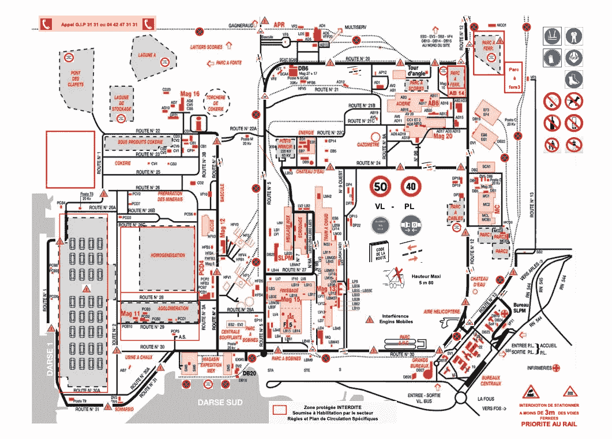

就像 EVM 建筑的示意图一样，安赛乐米塔尔工厂的道路平面图一开始是很难理解的！

我还记得的是我第一次进入包含轧机的[机库时的反应(看视频链接！).](https://www.youtube.com/watch?v=kiyIaKynqsU)工业炉巨大无比，从一头走到另一头需要几分钟！

机库里挤满了其他建筑工人、瓦工、电工、四处移动和行驶的叉车，以及用巨大的机械臂控制机器将东西搬进搬出熔炉的人。

像我父亲一样，我是一个不同类型的建设者，人们在 web3 中称之为“建设者”。但是当我回头看这座工厂时，我发现它的内部和 EVM 的内部有很多相似之处。

材料被储存在许多不同的地方，从架子上拿下来，放进炉子和其他随机的机器里。它们会被融化、加工或处理。

## EVM 是一个工业工厂

由[帕特里克·亨利](https://unsplash.com/@worldsbetweenlines)在 Unsplash 上拍摄的照片

在我之前的文章[“关于 ABI 的一切”](https://coinsbench.com/solidity-tutorial-all-about-abi-46da8b517e7)中，我提到:“聪明的合同是非常放松的小生命。”

但是一旦智能合约被调用，它们就会变得非常活跃！它们的底层逻辑作为字节码运行并被执行。多亏了 EVM。

EVM 从不放松。它在每台运行软件客户端的机器上不断重复运行。这是为了更新区块链的状态并使每个人保持同步。

大的工业工厂也是一样。它一周 7 天，一天 24 小时不停地运转。门口总是有人，夜班工人在机库里整理东西，卡车进进出出，机器和熔炉在熔化、燃烧和加工更多的材料，

当您调用智能合约时，EVM 运行并执行字节码中的指令集(=操作码)。这些操作码中的一些指令 EVM 从/向不同的位置读取和写入数据。EVM 需要这些多个数据位置来正确完成工作。

在工厂中，工序和材料可以在多个地方找到。

*   叉车从位于工厂专用存储区的高大货架上抓取材料调色板。(又名**存储**)
*   操作员从控制室控制机器和机器人，将无法通过炉门的大块钢/铝破碎成小块。(又名**内存**)
*   待加工的材料通过运输工具(卡车或船只)运送，装在密封的容器中，在容器中你只能知道/看到内容，但不能触摸。(又名**呼叫数据**)
*   多亏了传送带，更多的材料在工厂里被加工和运输。(又名**栈**)
*   最后，工厂有自己的道路交通规则。里面全是路标！(又名**代码**)

你明白了，就像一个工厂，EVM 使用许多不同的区域来计算和处理工作。

> EVM 就像一个工业工厂。

# 为什么要理解 Solidity 中的 Evm 数据位置？

学习每个数据位置如何工作涉及到学习多种东西，比如`storage`、`memory`和`calldata`的结构和布局，或者“什么可以存储在哪里”

但最重要的是，它教会了你与它们相关的(气体)成本，以及我所说的可变性/安全性权衡。

作为一名 Solidity 开发人员，对 EVM 中的数据位置以及如何充分利用它们的良好理解将使您能够:

1.  提高智能合同的性能。
2.  最小化其执行成本(调用其公共或内部函数时使用的 gas)。
3.  加强安全性并防止潜在的错误。

# 数据位置→概述

本文旨在对这些不同的数据位置给出一个很好的概述，在这些位置可以写入和读取数据。我们将看到一些位置是只读的，不能被写入，而另一些位置是可变的，存储在其中的值可以被编辑。

EVM 处理五个主要数据位置:

*   储存；储备
*   记忆
*   呼叫数据
*   堆
*   密码

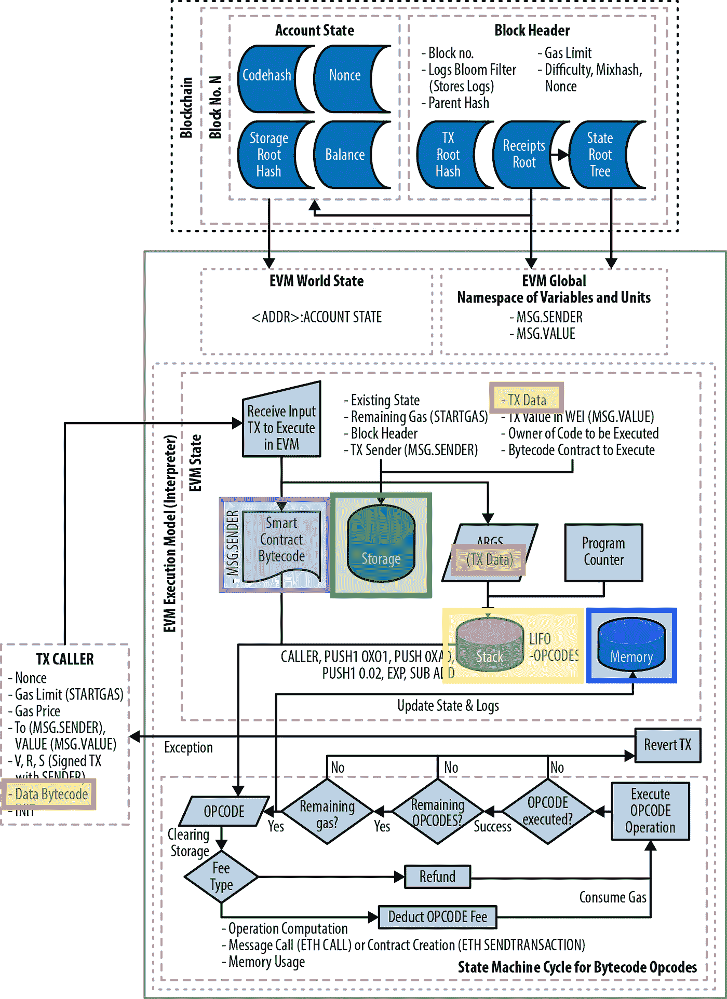

EVM 可用数据位置概述(来源:[Andreas Antonopoulos 和 Gavin Wood](https://github.com/ethereumbook/ethereumbook/blob/develop/13evm.asciidoc) 的《掌握以太坊》)。

主要 EVM 数据位置的基础知识也在[以太坊黄皮书的“9)执行模型>基础知识”一节中有详细说明](https://ethereum.github.io/yellowpaper/paper.pdf)

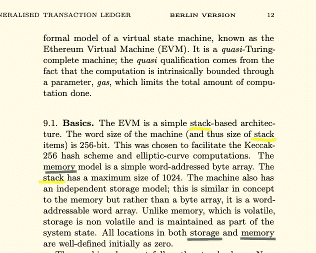

## 储存；储备

智能合同仓库相当于工业机库上的货架单元(来源:Unsplash 上的[海燕](https://unsplash.com/@petrebels)

在以太坊中，特定地址的每个智能契约都有自己的`storage`，由一个键值存储组成，将 256 位字映射到 256 位字。存储中的数据在函数调用和事务之间保持不变。

存储是所有契约状态变量驻留的地方。每个合同都有自己的存储空间。存储在存储器中的变量在函数调用之间保持不变。然而，这种存储使用起来相当昂贵。

因为存储指的是约定存储，所以它指的是永久存储在区块链上的数据。

您可以对约定存储进行读写。在低级，用于这样做的 EVM 操作码是`SSTORE`和`SLOAD`。

## 记忆

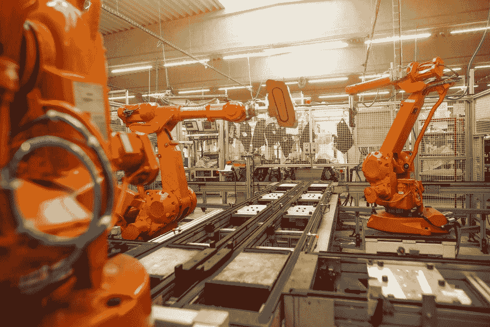

(来源:[西蒙·卡杜拉](http://Simon Kadula)在 Unsplash 上)

EVM `memory`用于保存临时值，在外部函数调用之间被擦除。不过，用起来比较便宜。

在 EVM 中，记忆是易变的，并且特定于特定合同的上下文(环境)。这意味着当执行上下文从一个合同变为另一个合同时，白板/便笺簿被清除。每次调用新消息时，都会获得一个新清除的内存实例。

因此，内存变量是临时的。它们在对其他契约的外部函数调用之间被擦除。

你可以读写 EVM 存储器。在低级，可用于从/向存储器读取和写入的 EVM 操作码是`MLOAD`、`MSTORE`和`MSTORE8`。

某些 EVM 操作码，如`CALL`、`DELEGATECALL`或`STATICCALL`，从 EVM 存储器中消耗它们的参数。

## 呼叫数据

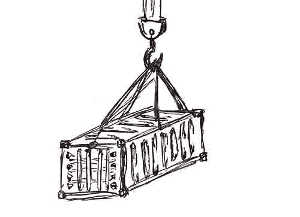

calldata 相当于从船或卡车中取出的容器。这些容器装有送到工厂进行加工的材料。Calldata 是只读的。

`calldata`是存放事务数据或外部函数调用参数的地方。这是一个只读数据位置。你不能写它。

calldata 的行为很像内存，是一个字节可寻址的空间。您必须为要读取的字节数指定一个精确的字节偏移量。

在低层，可用于读取 calldata 的 EVM 操作码有`CALLDATALOAD`、`CALLDATASIZE`和`CALLDATACOPY`。

## 堆

(来源:Unsplash 上的 [Arno Senoner](https://unsplash.com/@arnosenoner)

堆栈用于保存小的局部变量。它几乎可以免费使用(使用非常少量的气体)，但体积有限，只能容纳有限数量的物品。

堆栈是函数内部创建的大部分局部变量所在的地方。它是 EVM 的重要组成部分。

在低层，可用于操作堆栈的 EVM 操作码是`PUSH`、`POP`、`SWAP`和`DUP`指令。大多数其他 EVM 操作码从堆栈中使用它(通过将它们从堆栈中取出)并将结果推回到堆栈中。

## 密码

(来源:[瓦尔德马尔·布兰特](https://unsplash.com/@waldemarbrandt67w)在 Unsplash 上)

代码指的是合同字节码。你只能从合同字节码中读取，不能写入。这通常是你可以在 Solidity 中找到定义为`constant`的变量的地方。大多数 EVM 操作码从堆栈中消耗它们的参数。

字节码包含许多关于契约的信息和逻辑，包括调度程序和契约元数据。

在低层，可以用来从智能合约的代码中读取的 EVM 操作码是`CODESIZE`和`CODECOPY`。操作码`EXTERNALCODESIZE`和`EXTERNALCODECOPY`。

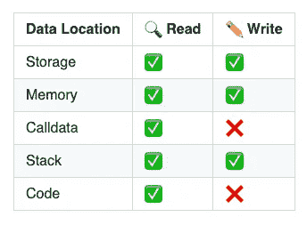

来源:[https://github . com/CJ42/All-About-Solidity/blob/Data-locations/articles/Data-locations . MD](https://github.com/CJ42/All-About-Solidity/blob/data-locations/articles/Data-Locations.md)

# 数据位置—规则

## 变量的默认位置

Solidity 语言定义了一些缺省规则，根据定义变量的位置，缺省情况下变量应该位于什么位置。

*   变量定义为`constant` =合同代码(=字节码)。

这些变量是不可变的，一旦部署了契约，就不能更改。它们是只读的，可以内联。

*   默认情况下，状态变量(在函数外部声明)=在存储中。

这些被称为状态变量，因为它们是契约状态的一部分，也是世界状态的一部分。这些变量被永久写入区块链。

*   堆栈中的局部变量(在函数体内声明)。

值类型的变量(例如，`uint256`、`bytes8`、`address`)驻留在堆栈中。

大多数情况下，您不需要使用数据位置关键字(storage、memory 或 calldata)，因为 Solidity 通过上面解释的默认规则来处理位置。

但是，有时您确实需要使用这些关键字并指定数据位置，也就是说，当处理复杂类型的变量(如函数内部的 struct 和 arrays)时。

## 参考类型

对于数组(固定或动态大小的数组，如`uint256[]`)、`bytes`、`string`、struct 和 mappings，您必须显式地提供存储值的数据区域。这可以是`storage`、`memory`或`calldata`。

通过使用这些关键字之一，您创建了一个`reference`类型的变量。这种类型必须比值类型更小心处理。

下一个自然会出现的问题是:

> 什么时候使用关键字**存储**、**内存、**和**调用数据**？

> 在 Solidity 0.5.0 之前，当变量作为函数参数传递时，可以不指定复杂类型变量(*如动态大小数组*)的数据位置。

**您可以在哪里指定数据位置？**

只能在函数中的三个位置指定引用变量的数据位置:

*   a)对于参数(=函数定义)
*   b)对于函数(=函数体)内部的局部变量
*   c)返回值总是在内存中(=函数定义)。

# 函数参数的规则

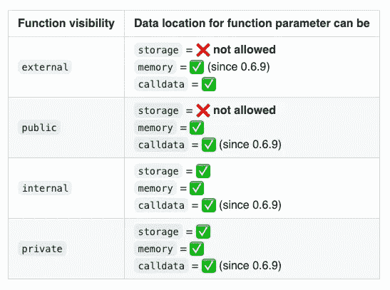

来源:[https://github . com/CJ42/All-About-Solidity/blob/Data-locations/articles/Data-locations . MD # Data-location-rules-for-function-parameters](https://github.com/CJ42/All-About-Solidity/blob/data-locations/articles/Data-Locations.md#data-location-rules-for-function-parameters)

当`storage`用作函数参数的引用时，它是指向契约存储的指针。

同样适用于`memory`和`calldata`。此类关键字创建指向 EVM 存储器中某个位置的指针，或者来自事务的输入数据字段(= calldata)。

# 函数体的规则

在函数内部，可以指定所有三个数据位置，而不管函数的可见性如何。

但是，引用类型之间的赋值被绑定到特定的规则。(这里是它变得复杂和“轻微的舌头扭曲！”).

*   `storage`引用:总是可以直接从契约存储器(=状态变量)或通过另一个`storage`引用分配一些值，但不能分配给它们`memory`或`calldata`引用
*   `memory`引用:可以赋任何东西(直接状态变量，或者`storage`、`memory`或`calldata`引用)。这总是会创建一个副本。
*   `calldata`引用:可直接(= tx/消息调用输入)或通过另一个`calldata`引用从调用数据中分配一些值，但不能分配给它们一个`storage`或`memory`引用

更简单地说:

> For memory =我们总是可以复制内存中的任何数据(无论是来自契约的存储还是调用数据)。
> 
> 对于 storage 和 calldata =我们只能分配来自指定数据位置的值(直接或通过相同类型的引用)。

让我们来看看一些真实而实用的可靠性示例:

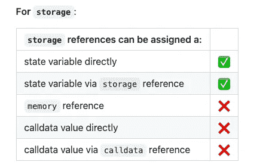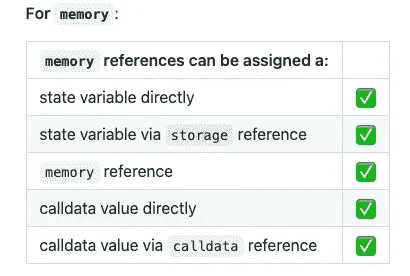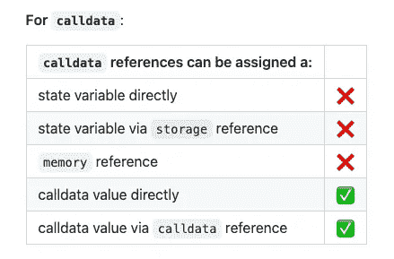

[你可以在这里找到一份作为可靠性合同的摘要。](https://github.com/CJ42/All-About-Solidity/blob/master/articles/data-locations/DataLocationsReferences.sol)

## **内存←状态变量**

当我们将一个状态变量赋给一个`memory`引用的变量时，我们基本上是将数据从存储器复制到内存。

=我们正在写入内存=分配了新的内存。

这意味着对变量的任何修改都不会向下传播到协定存储(=协定状态)。

=不会覆盖合同存储。

在上面的例子中，运行函数后，状态变量`someData`没有改变。

## 状态变量←内存

这是上一个“内存←状态变量”的反例。这个例子可以在 Solidity 文档部分找到。

## 存储指针

当一个`storage`变量在一个函数中被创建时，它基本上作为一个存储指针。存储指针只是引用存储中已经分配的数据。

您可以重新分配存储指针，使其指向存储中的其他位置。

=引用存储中的一些现有值=不创建新存储

但是，我们可以通过直接给查找变量分配一个新值来覆盖契约存储。看一下这个例子:

如果您随后查询第一个索引`someData`，您将获得`1`。

## **内存←存储指针**

当我们将一个`storage`引用的数据赋给一个`memory`引用的变量时，我们是在从存储→内存复制数据。

=我们正在写入内存=分配了新的内存。

这相当于我们之前讨论的第一种情况“内存←状态变量”,通过存储引用增加了“中间的附加路径”。存储引用将解析为状态变量，然后被复制到内存中。下面是一个建立在前面代码片段基础上的基本示例。

这里的`copyFromRef`是整个数组`someData`的副本。通过存储引用`storageRef`将数组复制到内存中。

同样在这种情况下，由于我们已经从存储拷贝到内存，所以我们是在操作数据的拷贝，而不是驻留在存储中的实际数据。因此，对`copyFromRef`的任何修改都不会传播回合同存储器，也不会修改合同状态。

为了说明这一点，请将以下合同复制成 Remix 和:

1.  运行功能`test()`。
2.  读取索引`1`处的`someData`数组。

您将看到在运行该函数后，`someData[1]`处的值仍然是`2`，并且`12345`没有传播回合同存储器。

**调用数据参考**

calldata 引用的行为方式与`storage`引用相同。它只能作为对事务数据的引用，或者对使用`calldata`关键字提供的复杂类型的函数参数的引用。

简而言之，calldata 类型的变量总是创建一个引用。

唯一的主要区别是不能修改作为`calldata`引用的变量，因为 calldata 是只读的。

这与`storage`参考相反。当您给一个`storage`引用分配一个新值时，这个变化会传播回契约状态。

# 数据位置—行为

> [本节取材于](https://medium.com/coinmonks/ethereum-solidity-memory-vs-storage-which-to-use-in-local-functions-72b593c3703a)[https://docs . solidy lang . org/en/v 0 . 8 . 15/types . html # data-location](https://medium.com/u/5d668b546d10#data-location)
> 
> 然而，在某些场景中，使用`memory`而不是`calldata`可以提高可组合性
> 
> 最后，请注意，不在函数中使用正确的数据位置会导致潜在的错误和漏洞。现实世界的一个例子是对 Cover 协议的无限薄荷攻击。
> 
> 请看一下来自 Cover protocol 的`Blacksmith.sol`契约的代码片段。
> 
> 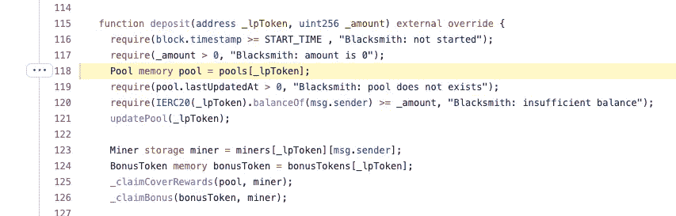
> 
> 对池变量的任何更改都是在内存中进行的，不会传播回约定存储。
> 
> > 关于这个 bug 的更多细节，请看 Mudti Gupta 的博文:[https://mudit . blog/cover-protocol-hack-analysis-tokens-minted-exploit/](https://mudit.blog/cover-protocol-hack-analysis-tokens-minted-exploit/)
> 
> # 参考
> 
>  [## 固体中的数据表示
> 
> ### 适用于代码调试器和其他调试相关实用程序的编写人员。作者哈里·奥特曼[@haltman-at]发表…
> 
> ethdebug.github.io](https://ethdebug.github.io/solidity-data-representation/)  [## 以太坊稳固性:内存与存储&在本地函数中使用哪一个
> 
> ### “存储”和“内存”数据位置关键字之间的区别。
> 
> medium.com](https://medium.com/coinmonks/ethereum-solidity-memory-vs-storage-which-to-use-in-local-functions-72b593c3703a)  [## 以太坊深度，第 2 部分- OpenZeppelin 博客
> 
> ### 感谢你对这篇文章感兴趣！我们正在进行品牌重塑，所以如果有些名字…
> 
> blog.openzeppelin.com](https://blog.openzeppelin.com/ethereum-in-depth-part-2-6339cf6bddb9/)  [## 类型-坚固性 0.8.15 文件
> 
> ### Solidity 是一种静态类型语言，这意味着每个变量(状态和局部)的类型都需要…
> 
> docs.soliditylang.org](https://docs.soliditylang.org/en/v0.8.15/types.html#data-location)  [## 主 CJ42 处的全可靠性/数据位置. MD/全可靠性
> 
> ### 你会发现这个话题可能是最具挑战性的。下表是每个数据位置的概述…
> 
> github.com](https://github.com/CJ42/All-About-Solidity/blob/master/articles/Data-Locations.md)  [## EVM 电码
> 
> ### 以太坊虚拟机(或 EVM)是一种基于堆栈的计算机。这意味着所有指令都带参数…
> 
> www.evm.codes](https://www.evm.codes/about)  [## EVM 深度挖掘:通向影子超级编码员🥷的道路💻-第一部分
> 
> ### 基本原则思维是我们经常听到的一个术语。它侧重于深入理解的基本概念，一个…
> 
> noxx.substack.com](https://noxx.substack.com/p/evm-deep-dives-the-path-to-shadowy?s=r) 
> 
> [https://mudit . blog/cover-protocol-hack-analysis-tokens-minted-exploit/](https://mudit.blog/cover-protocol-hack-analysis-tokens-minted-exploit/)