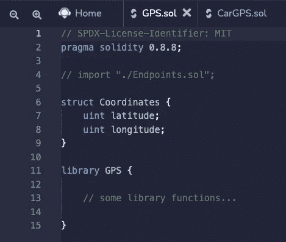
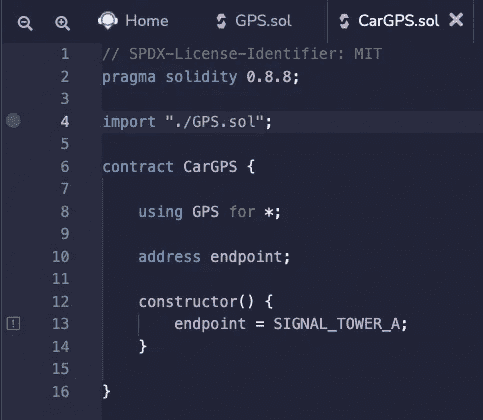
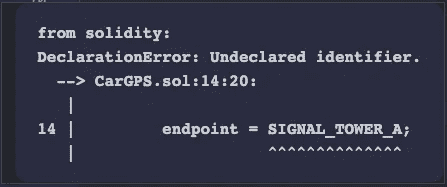
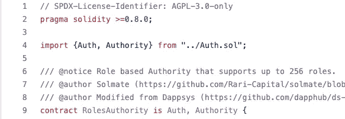

# 坚实度教程:关于导入的所有内容

> 原文：<https://betterprogramming.pub/solidity-tutorial-all-about-imports-c65110e41f3a>

## 深入分析具有可靠性的重要陈述


照片由[蒂姆·施密德鲍尔](https://unsplash.com/@timschmidbauer?utm_source=medium&utm_medium=referral)在 [Unsplash](https://unsplash.com?utm_source=medium&utm_medium=referral) 上拍摄

# 目录

```
Modules and Code Modularity.Solidity Imports.Types of Solidity Import Syntax.
* Global Import
* Specific ImportsImport Aliases.
* Global Alias
* Alias SpecificWhich import syntax to use?What can you import from a Solidity file?Solidity Import Syntax Cheatsheet
```

# 模块和代码模块化

在深入 Solidity 中的 Import 语句之前，我们先来了解一下模块化编程。模块的概念非常古老。44 年前，随着编程语言 Modula-2 和 Pascal 的出现，它首次出现。

模块背后的想法是将代码分解成可重用的组件。您将功能分组到一个模块文件中，并将它们暴露给其他文件，以便这些其他文件可以使用它们。

模块系统通过将有意义的变量和函数组合在一个文件中来帮助组织你的代码。

让我们以 Javascript (ES6)中的模块为例。在 ES6 中，模块是导出一个或多个值(对象、函数或变量)的文件。然后，任何其他 Javascript 模块都可以通过导入它来使用这个文件提供的功能(Copes， *2018* )。

# 坚固性进口

Solidity 中导入文件的思路与上面描述的模块概念非常相似。它通过以下方式帮助模块化您的智能合同:

*   创建其他文件可以导入的可重用片段。
*   更容易理解和消化你的项目的整个 Solidity 代码库。
*   通过关注更小的文件，使使用*【实体模块】*更容易(在调试时有用)。

您可以将变量(如文件级定义的`constant`、`enum`、`struct`)和其他实体对象(如`contract`、`interface`或`library`)分组并定义到一个文件中。只有一次。然后您可以导入它们，并使用`import` 语法在其他实体文件中使用它们。

与 Javascript 或 [C++](https://en.cppreference.com/w/cpp/language/modules) 等其他编程语言的唯一区别是，你不需要用`export` 关键字直接(显式)定义这些变量或 Solidity 对象。

> **注意:**注意，Solidity 不支持默认导出。

让我们来看看 Solidity 中的一个`import`语句，它受到了 t [he ES6 导入语法](https://developer.mozilla.org/en-US/docs/Web/JavaScript/Reference/Statements/import)的启发，并且与 Python 导入语法也非常相似(`from X import *` )。

```
import “./MySolidityFile.sol”;
```

上面的代码片段展示了大多数开源 Solidity 项目中经典且最广泛使用的导入语法。在这里，`*“./MySolidityFile.sol”*` 是指向我们要导入的文件的路径。这个路径是相对于的**，意思是基于我们从** (=当前文件)导入的位置的**。**

# 实体导入语法的类型

## 全球进口

下面的语句将导入在`“./MySolidityFile.sol”`中找到的所有 ***实体对象***

```
import “./MySolidityFile.sol”;
```

我使用术语*“实体对象”*来描述任何`contract`、`library`、`interface`或其他`constant`或你可以在文件级定义的变量(`struct`、`enum`等)。)

> *注意:这相当于 ES6 中的* `*import * from “./MySolidityFile.sol”*` *，但是 Solidity 不允许这种语法。*

当 Solidity 编译器遇到这个语句时，会发生两件事。

1.  在`“./MySolidityFile*.sol”*` 中定义的所有全局符号(我称之为"*实体对象"*)被导入到当前的全局范围中。
2.  所有导入到`“./MySolidityFile*.sol”*` 内的全局符号也被导入到当前的全局范围内。

这和 ES6 很不一样！在 ES6 中，当你导入一个模块时，你导入的是这个模块中定义的东西，*不是这个模块中导入的所有东西。*

我们举个简单的例子来了解一下。

文件`“*GPS.sol”*` 中的第一行导入了在`*“Endpoints.sol”*` *中定义的三个`address`常量。*文件`“*CarGPS.sol”*` 可以使用它们，尽管它不会直接导入文件`*“Endpoint.sol”*` *。*

在 Solidity 中，文件 A 中导入的所有内容随后都可以在导入 A 的其他文件中使用。

下面举一个实际例子来更好地理解这些 ***后续进口*** 如何工作*。*如果我注释掉行`*import “./Endpoints.sol”;*` *i* nside `*“GPS.sol”*` *，*编译器就再也找不到常量了。



这种全局导入语法的问题在于，即使常量 `SIGNAL_TOWER_A`是在`*“GPS.sol”*` 文件中导入的，也很难知道它来自`*“./Endpoint.sol”*` *。*对`*“./GPS.sol”*` 中导入定义的一个小更新会破坏它并使它停止编译。

不推荐使用这种全局导入语法，因为它很难理解**模块从哪里来**或者**模块在哪里被定义。**

在 Solidity 文档中甚至提到了这一点:

> *“不推荐使用这种形式，因为它会不可预知地污染名称空间。”*
> 
> *如果您在“文件名”中添加了新的顶层项目，它们会自动出现在所有从“文件名”导入的文件中。*

相反，Solidity 文档建议显式指定导入的符号。

## 特定进口

特定的导入更接近于 ES6 语法。您可以更具体地从实体文件中导入您需要的内容。

```
Import { Something } from “./MySolidityFile.sol”;
```

然后，您可以在花括号`{ }`中提到您想要导入和使用的特定符号/对象。例如，如果导入路径中指定的文件包含多个`contract`，那么您可以使用该语法来确定您希望导入的合同。

让我们来看看下面这个来自 [**Solmate**](https://github.com/Rari-Capital/solmate) **，**的例子，这是一个正在开发中的智能合同库，可用于构建现代的和 gas 优化的合同。

专门看一下`*RoleAuthority.sol*` 合同。它定义了下面的 import 语句。



来源:[https://github . com/Rari-Capital/sol mate/blob/main/src/auth/authorities/roles authority . sol](https://github.com/Rari-Capital/solmate/blob/main/src/auth/authorities/RolesAuthority.sol)

从上面可以看出，在花括号中指定契约或其他符号有助于定位它们。

*Auth* 合同更容易找到，因为它与文件名`“*Auth.sol”*.`同名，但是对于`Authority` (尽管名称是`interface`)，如果进口声明是`Import “../Auth.sol”` *，就不会找到它。*

带花括号的导入语法有助于定位构建智能契约的构件(`abstract contract`、`interface`、`library`等)。)来自哪些文件以及它们是哪些文件**实际定义了**。

让我们重写上面来自**“全局导入”**部分的代码示例。

我们的代码重构增加了一个额外的导入行，帮助定位常量`SIGNAL_TOWER_A` *来自*(而不是*“埋葬它”*)。

我们的可靠性代码在另一方面也更干净，这可能不会被注意到:T9。我们以前使用全局导入功能导入它，但没有使用它。`Point`结构用一个我们不需要的对象“污染了源代码”,因为我们不需要它。这打破了模块化和模块化编程的规则:

> *“只导入你需要的东西”*

带花括号的特定导入允许我们更好地应用这条规则。

# 导入别名

导入别名在可靠性方面非常古老，可以追溯到[发布版本 0.2.1。](https://github.com/ethereum/solidity/blob/develop/Changelog.md#021-2016-01-30)导入别名可用于两种类型的导入:

*   ****全局导入的别名:**可以用来引用文件中定义的特定对象，使用点“.”语法(如对象属性)。**
*   ****特定导入的别名:**启用重命名从实体文件导入的对象或符号，例如，以避免命名冲突(或如果需要，为更好的代码清晰度给出更好的名称)。**

## **全局别名**

**可以使用通配符运算符`*`和别名`as` *创建包含导入文件中定义的所有内容的全局别名。***

**在下面的代码片段中，创建了一个新的全局符号`*Endpoints*` ，并且在文件的上下文中变得可用。**

```
// longer syntax
import * as Endpoints from “./Endpoints.sol”.// shorter syntax
import “./Endpoints.sol” as Endpoints;
```

> **注意，第二条语句(可选语法)在 ES6 中没有对等的语句。在 ES6 模块中，可以使用第一种语法创建模块别名，但第二种语法不存在。**

**在`“./Endpoints.sol”`(以及在`“./Endpoints.sol”`中导入的)中定义的所有符号和对象现在都可以以格式`Endpoints.TOWER_ADDRESS_A.`获得。它们现在是这个全局符号的成员，可以像访问 JavaScript 对象的属性(或引用 Solidity 中的结构成员)一样使用点符号进行访问。**

## ****具体别名****

**如果您使用之前介绍的特定导入来仅导入您的 Solidity 文件中需要的内容，您也可以为导入的内容指定一个别名。**

```
import { Point as Coordinate, GPS } from “./Endpoints.sol”;
```

**在上面的导入语句中，GPS 库被原样导入，而`struct Point`也被导入但被重命名为`Coordinates`。Solidity 导入语句创建了一个新的符号`Coordinates`，它引用了`struct Point`。**

**这种别名在两种情况下很有用:**

*   ****避免命名冲突:**如果您要导入的内容已经被其他文件导入。如果在导入时遇到命名冲突，请使用别名来解决这个问题。**
*   ****防止意外行为**(如果编译器没有标记它，并且您正在使用的变量引用了从别处导入的错误变量)。**
*   ****重命名您正在导入的内容:**如果您想在您的上下文中使用更有意义的名称，并且为了代码清晰起见。**

# **使用哪种导入语法？**

**以下是引用自 **SonarSource** 文档中关于进口的内容。**

> ***“本着代码越清晰越好的原则，你应该把你想用的东西导入到一个模块里。”***

**你可以将这一原则应用于 Solidity 中的智能合约。虽然大多数在 Github 上有源代码的开源 Solidity 项目都使用了`import ” ./File.sol”` 语法，但这并没有遵循 SonarSource 提到的最佳实践。**

**PEP8 文档也阻碍了 Python 的全球导入。**

> ***“通配符导入(来自<模块> import *)应该被避免，因为它们使得命名空间中出现的名字变得不清楚，混淆了读者和许多自动化工具。”***

**这个问题的主要原因是，如**全局导入部分所述，** `import “./MySolidityFile.sol”` 从实体文件(在路径中提到)→ *导入所有的*到实体文件*(在此声明导入语句)*。****

**多年来，我已经习惯了这种 Soldity 全局导入语法。然而，我现在已经得出结论，从一个 Solidity 文件导入所有东西会导致几个问题。这些问题分为两大类:可读性和与名称空间相关的错误。**

## ****可读性****

*   ****冒着混淆 Solidity 契约或库的维护者** **和用户**的风险。**
*   ****降低代码可读性**。使用 Solidity 契约或库的开发人员可能很难知道导入的名字来自哪里。**

## ****与名称空间相关的错误****

*   **导入所有东西会使本地“名称空间”变得混乱，使调试更加困难。**
*   ****更新依赖关系时，导入的名称会改变**。因此，今天有效的通配符导入可能明天就会失效。**

****有两种方法可以避免通配符导入:****

**-替换为`import mySolidityModule`，访问模块成员为`mySolidityModule.MyContract`。**

**-列出每个导入的名称。如果需要，可以使用括号(首选解决方案)或反斜杠将 import 语句拆分成多行。**

> *****类比:*** *进口一切相当于两个机械师在车库里修车，其中一个机械师问另一个，“给我一把内六角扳手”，另一个机械师给他带来整个工具箱，而不是从工具箱里拿出内六角扳手递给他。***
> 
> ***把这个类比想成你和 Solidity 编译器。您希望通过精确地提供编译器将契约编译成字节码所需的代码来简化编译器的工作。你不希望编译器中塞满不需要的代码，比如“让它搜索整个工具箱”。***

# **从实体文件中可以导入什么？**

**可以在实体文件中导入以下元素。**

*   **`contract`**
*   **`library`**
*   **`interface`**
*   **`enum`(文件级定义)**
*   **`struct`(在文件级定义)**
*   **`error`定义(在文件级定义)**
*   **`function` s(在文件级定义，从 Solidity 0.7.1 开始)**
*   **[用户定义的值类型](https://docs.soliditylang.org/en/v0.8.13/types.html#user-defined-value-types)(自从在 Solidity 0.8.8 中引入以来)**

# **可靠性导入语法备忘单**

**下面是 Solidity 中可用的不同导入语句的汇总。我根据 [Javascript ES6 文档中提供的关于导入语句的例子编写了这些例子。](https://developer.mozilla.org/en-US/docs/Web/JavaScript/Reference/Statements/import#description)**

**为了清楚、简单，并使其像 ES6 文档一样，我称“实体模块”为实体文件，它包含不同的对象/符号，在“你能从实体文件导入什么？”。**

****导入整个实体模块内容。****

**这是最常见的语法。我认为应该尽可能避免使用这种语法，因为它会在不知道导入内容的情况下导入所有内容。以太坊 StackExchange 的这个回答(参考同题 PEP8 风格文档)提到它*杂乱且“污染命名空间”。***

```
import "./modules/MySolidityFile.sol";
```

****导入整个实体模块内容，并为其分配一个全局别名。****

**导入所有内容的不同语法。在 *MySolidityFile.sol* 中定义的内容，可以通过`mySolidityModule.MyContract` *、* `mySolidityModule.MyLibrary` 或`mySolidityModule.MyStruct` *引用。***

```
import * as mySolidityModule from "./modules/MySolidityFile.sol";
```

**第二种语法稍微简短一些。**

```
import "./modules/MySolidityFile.sol" as mySolidityModule;
```

****从实体模块导入单个导出****

```
import { MyContract } from "./modules/MySolidityFile.sol";
```

****从一个模块导入多个导出****

```
import { 
    MyContract, 
    MyLibrary, 
    MyStruct, 
    customFunction 
} from "./modules/MySolidityFile.sol";
```

****用更方便的别名**导入导出**

```
import { 
    reallyReallyLongSolidityModuleExportName as solidityModule 
} from "./modules/MySolidityFile.sol";
```

****在导入过程中重命名多个导出****

```
import {
    reallyReallyLongSolidityModuleExportName as solidityModule,
    anotherLongSolidityStructName as MyStruct
} from "/modules/my-module.js";
```

# **参考**

*   **JavaScript 导入语法:[https://developer . Mozilla . org/en-US/docs/Web/JavaScript/Reference/Statements/import](https://developer.mozilla.org/en-US/docs/Web/JavaScript/Reference/Statements/import)**
*   **stack overflow——为什么许多 Solidity 项目更喜欢导入特定的名字而不是整个模块？[https://ether eum . stack exchange . com/questions/117100/why-do-many-solidity-projects-prefere-importing-specific-names-over-all-modules](https://ethereum.stackexchange.com/questions/117100/why-do-many-solidity-projects-prefer-importing-specific-names-over-whole-modules)**
*   **PEP8 风格指南—进口:【https://peps.python.org/pep-0008/#imports **
*   **以太坊栈交换- *应该如何在 Solidity 中设置导入路径:*[https://ether eum . Stack Exchange . com/questions/2137/How-should-we-set-a-import-path-in-Solidity](https://ethereum.stackexchange.com/questions/2137/how-should-we-set-a-import-path-in-solidity)**
*   **Solidity Docs —导入其他源文件:[https://Docs . solidity lang . org/en/latest/layout-of-source-files . html？highlight = import # importing-其他源文件](https://docs.soliditylang.org/en/latest/layout-of-source-files.html?highlight=import#importing-other-source-files)**
*   **Solidity-by-example.com—进口:[https://solidity-by-example.org/import/](https://solidity-by-example.org/import/)**
*   **声纳源——关于 Python 的进口:[https://rules.sonarsource.com/python/RSPEC-2208](https://rules.sonarsource.com/python/RSPEC-2208)**
*   **声纳源码—关于 Javascript 的进口:[https://rules.sonarsource.com/javascript/RSPEC-2208](https://rules.sonarsource.com/javascript/RSPEC-2208)**
*   **黑客。Mozilla.org—ES 模块 a 卡通深潜:[https://hacks . Mozilla . org/2018/03/ES-Modules-a-cartoon-deep-dive/](https://hacks.mozilla.org/2018/03/es-modules-a-cartoon-deep-dive/)**
*   **奇异的编程思想:第一部分(模块系统)(Stephen Diel 博客):[https://www.stephendiehl.com/posts/exotic01.html](https://www.stephendiehl.com/posts/exotic01.html)**
*   **[坚固性变更日志发布](https://github.com/ethereum/solidity/blob/develop/Changelog.md#021-2016-01-30)**
*   **[Solmate —多角色权限](https://github.com/Rari-Capital/solmate/blob/main/src/auth/authorities/MultiRolesAuthority.sol)**