# 坚实度教程:关于内存的一切

> 原文：<https://betterprogramming.pub/solidity-tutorial-all-about-memory-1e1696d71ee4>

## 理解 EVM 的短期记忆


照片由[机械心灵](https://unsplash.com/@mechmind)在 [Unsplash](https://unsplash.com/) 上拍摄

> 这是[](/solidity-tutorial-all-about-data-locations-dabd33212471)**子系列的第二部分。**

*我们将学习 EVM 内存的布局、它的保留空间、空闲内存指针、如何使用`memory`引用来读写内存以及使用内存时的传统最佳实践。*

*我们将使用来自[以太坊名称服务(ENS)](https://docs.ens.domains/) 的合同代码片段，用有意义的例子来支持这篇文章。这将帮助我们更好地理解这个受欢迎的项目背后的智能合同是如何工作的。*

# *目录*

*   *介绍*
*   *EVM 记忆——概述*
*   *内存布局*
*   *记忆基础*
*   *从内存中读取(`MLOAD`)*
*   *写入内存(`MSTORE` + `MSTORE8`)*
*   *知道内存大小(`MSIZE`)*
*   *空闲内存指针*
*   *`memory`作为函数参数的参考*
*   *`memory`函数体内部的引用*
*   *内存扩展成本*
*   *合约调用之间的内存*
*   *结论*

# *介绍*

*在介绍性文章*“关于数据位置的一切”，*中，我将 EVM 描述为一个工业工厂。在工厂的某些地方，你会发现由操作员控制的机器和机器人。*

*这些机器将无法加工的大块钢/铝(例如，穿过炉门)分解成小块。*

*我们可以用同样的例子来说明以太坊。EVM 作为 32 字节字的堆栈机器运行。当 EVM 遇到大于 32 字节的数据(复杂类型，如`string`、`bytes`、`struct`或数组)时，它不能在堆栈上处理它们，因为这些项太大了。*

*因此，EVM 需要获取这些数据，并在其他地方进行处理。它有一个专门的地方:记忆。通过将这样的变量放入内存，EVM 可以将它们以更小的块一个接一个地传递给堆栈。*

*EVM 存储器还用于复杂的内置运算，如 abi 编码、abi 解码或通过 keccak256 的散列函数。对于这些特定情况，想象一下内存充当 EVM 的便笺簿或白板。*

*老师或科学家可能会用白板在上面写东西来解决问题。这同样适用于 EVM。EVM 将内存用作暂存区来执行这些操作或计算，并返回最终值。*

**

*来源:[https://giphy.com/explore/physics-lecture](https://giphy.com/explore/physics-lecture)*

*对于`abi.decode(...)`或`keccak256`，存储器是输入源。对于`abi.encode(...)`来说，存储器是输出将被存储的地方。*

# *EVM 记忆——概述*

*EVM 记忆有 4 个主要特征:*

*   *就汽油而言更便宜*
*   *可变= **可以被覆盖和更改***
*   *相对于来自函数调用的事务= **，或构造函数** ( **=** 合同创建)*
*   *短期 **=不持久**和**在外部函数调用之间被擦除。***

*EVM 存储器是一个字节可寻址空间**。**里面所有的字节最初都是空的(定义为零)。它是一个可变的数据区，意味着你可以读写它。和 calldata 一样，内存也是通过字节索引来寻址的，但是我们会在*“与内存交互”*一节中看到，在内存中一次只能读取 32 字节的字。*

*EVM 记忆也是不稳定的。存储在内存中的值不会在外部调用之间保持不变。*

> *一个 ***刚被* *清除，当一个契约调用另一个契约时，获得新的内存实例*** *。**

*存储器不会被擦除和清除。EVM 内存的每个新实例都特定于一个执行上下文，即当前契约执行。*

*因此，您应该记住，EVM 内存是特定于 1)消息调用和 2)被调用的契约的执行环境的。稍后，我们将在单独的章节中更详细地解释这个概念。*

# *内存布局*

> *存储器是线性的，可以在字节级寻址。*

*把内存想象成一个非常大(甚至**巨大！**)字节数组，像`byte[]`*

*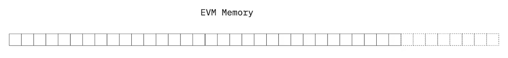*

*当你与 EVM 内存交互时，你读取或写入(我称之为)*32 字节长的“内存块”。**

**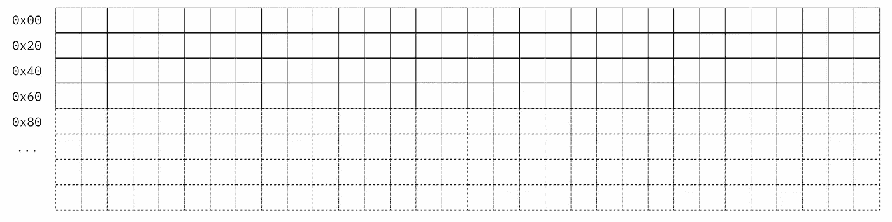**

## **保留空间**

**存储器中的前 4 x 32 字节字是出于不同目的而保留的空间:**

*   **前 2 个字(**偏移量** `0x00`和`0x20`):散列函数的暂存空间**
*   ****偏移量** `0x40`和`0x50`:第 3 个字:**空闲内存指针****
*   ****偏移量** `0x60`:永久为零，用作空动态内存数组的初始值**

**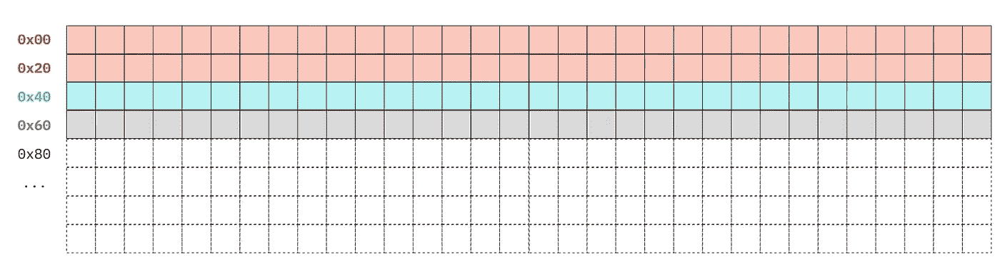**

**空闲内存指针(位于偏移量 0x40)是*EVM 内存中最重要的部分。必须小心处理，尤其是在组装/Yul 时。我们将在单独的章节中介绍它。***

> **更多信息参见 Solidity 文档中的[](https://docs.soliditylang.org/en/v0.8.13/internals/layout_in_memory.html)***章节。*****

## *****最大内存限制*****

*****我们看到，EVM 存储器是一个线性阵列，可通过字节索引(称为偏移量)寻址。它最多可以包含多少字节？*****

> *****这个数组有多大？EVM 记忆有多大？*****

*****这个问题的答案就在 geth 源代码里(下面截图)。看一下使用的转换类型。*****

*****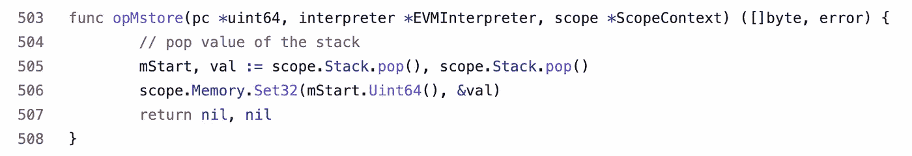*****

*****[source:instructions . go(geth 客户端源代码)。](https://github.com/ethereum/go-ethereum/blob/master/core/vm/instructions.go#L506)*****

*****从 geth 客户端的截图中我们可以看到，`mStart.Uint64()`将内存偏移量转换为一个`uint64`值。这意味着您可以放入内存的最大数据量是一个`uint64`数的最大值。*****

*****如果指定的偏移量大于该值，它将恢复原状。*****

# *****记忆基础*****

*****您只能在内部函数中指定`memory`,而不能在契约级别指定外部函数。*****

*****默认情况下，以下数据和值始终位于内存中:*****

*   *****复杂类型的函数参数。*****
*   *****复杂类型的局部变量(在函数体内)。*****
*   *****从函数返回的值，不管它们是什么类型(这是通过 **return** 操作码完成的)。*****
*   *****函数返回的任何复杂值类型都必须指定关键字`memory`*****

*****对于复杂类型的变量/值，我们指的是`struct`、数组、`bytes`和`strings`等变量。*****

*****一旦函数调用结束，这些用关键字`memory`定义的变量就会消失。这就是我们之前所说的“不坚持”。*****

*****原因是`memory`告诉 Solidity 在运行时为变量创建一块空间，保证它的大小和结构，以便在函数执行期间在该函数中使用。*****

## *****与内存交互—概述*****

*****在 EVM 的记忆中,“可靠性文件”指出:*****

> *****…读取限于 256 位宽，而写入可以是 8 位宽或 256 位宽。*****

*****如果我们看看黄皮书，我们可以看到一个操作码被定义为从内存中读取(`MLOAD`)，两个操作码被定义为写入内存:`MSTORE`和`MSTORE8`。*****

**********

*****资料来源: [Ethreum 黄皮书，第 34 页](https://ethereum.github.io/yellowpaper/paper.pdf)*****

# *****凭记忆阅读*****

*****您可以使用`MLOAD`操作码从内存中读取。*****

## *******黄纸配方*******

*****以下是黄皮书对`MLOAD`操作码规范的描述。*****

*****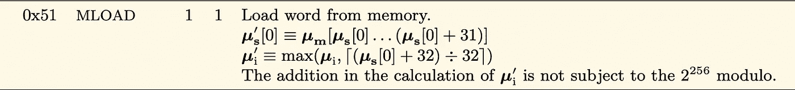*****

*****让我们揭开这个非常正式的公式的神秘面纱！*****

*****黄皮书中的公式可以解释如下:*****

*   *****`Us[0]` =栈顶项目。*****
*   *****`Us'[0]` =放在堆栈顶部的结果项目。*****
*   *****`Um` =存储器中从特定偏移量开始的内容。*****

*****公式`Um[Us[0]...Us[0] + 31]]`可以用简单的英语翻译如下:*****

1.  ******取栈顶最后一个项目* `*Us[0]*` *。******
2.  ******使用该值作为起始指针读入内存* `*Um*` *(= offset)******
3.  ******从该内存指针* `*Us[0]*` *中读取接下来的 31 个字节(* `*Us[0] + 31*` *)。******

*****从内存中读取一次只能读取 32 字节的字。这意味着用`mload`操作码一次只能从内存中取出 32 个字节。*****

*****这些操作码可用于 Solidity 内嵌汇编或独立的 Yul 代码。*****

## *****例如:ENS 合同中的 SHA1 图书馆*****

**********

*****图片来源:[ens-domains.com](https://ens.domains/static/twitter-49d4bb2b55c07c5f5900e95860401fd0.png)*****

*****让我们来看看 ENS 合同中的一个例子:SHA1.sol 。*****

*****在下面的代码片段中，`mload`操作码被使用了两次。*****

*   *****首先检索**空闲内存指针。**暂存变量随后被用作内存中的指针，数据的 sha1 散列将被计算和写入。*****
*   *****第二次检索数据变量的长度(=字节数)。*****

*****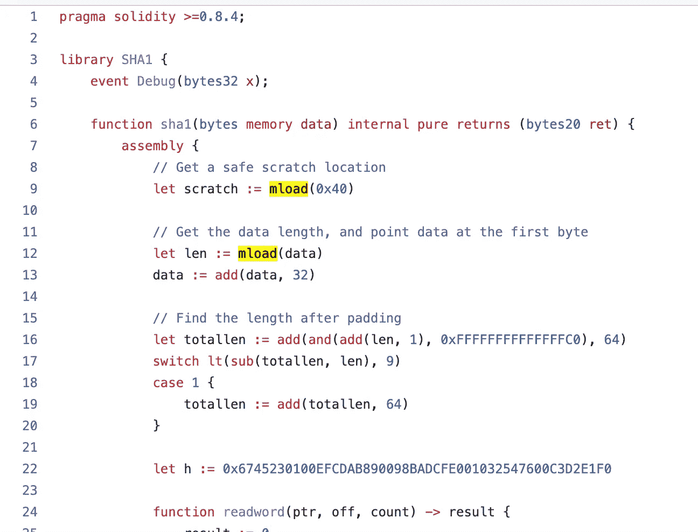*****

*****[来源:Github 上的 ENS 源代码，SHA1.sol 库](https://github.com/ensdomains/ens-contracts/blob/8a2423829a28852297ee208357d148987e8dce0f/contracts/dnssec-oracle/SHA1.sol)*****

# *****写入内存*****

*****您可以使用以下两种操作码之一写入存储器:*****

*   *****`MSTORE` →在内存中写一个字(= 32 字节)。*****
*   *****`MSTORE8` →在存储器中写入一个字节*****

*****这条推文展示了 geth 客户端中的 EVM 实例如何将参数从堆栈中取出作为`MSTORE`的输入。*****

*****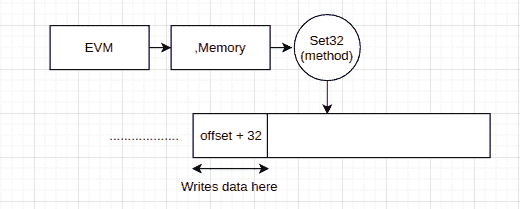*****

*****[来源:法希尔在推特上](https://twitter.com/721Orbit/status/1511961771879370753?s=20&t=KDGCQ4OwQ47e2NACgQ8WWg)*****

*******坚固性*******

*****在 Solidity 中，每当你用`memory`关键字实例化一个变量并赋值(一个文字字节/字符串，或者一个函数的返回值)时，EVM 就会执行一个`mstore`指令。*****

*****这里有一个来自 ENS 的`DNSRegistar.sol`合同的例子。*****

*****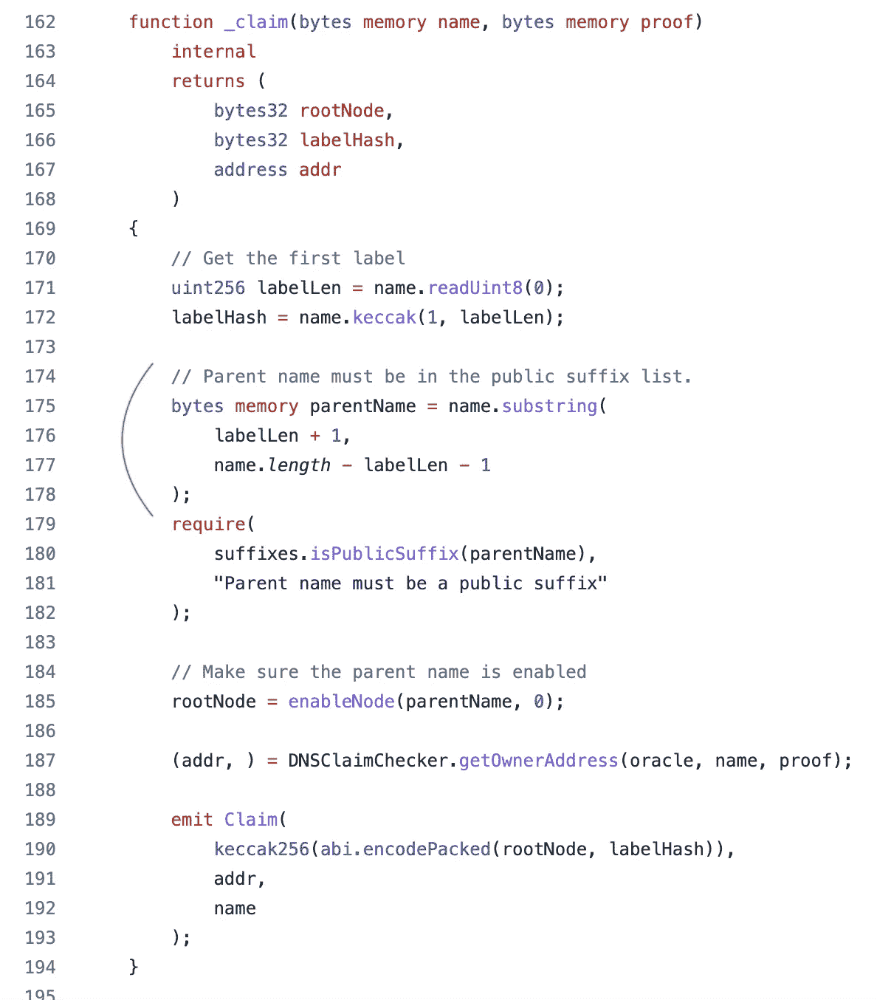*****

*****[来源:Github 上的 ENS 源代码，DNSRegistar.sol](https://github.com/ensdomains/ens-contracts/blob/3445b94a187cac1016ec6e3fb69b885227565d8e/contracts/dnsregistrar/DNSRegistrar.sol#L175-L178)*****

*******组装中*******

*****`mstore`操作码可以在内嵌汇编中使用。它接受两个参数:*****

*   *****要写入的内存偏移量。*****
*   *****要写入内存的数据*****

*****查看`mstore`如何在同一个 ENS 合同`SHA1.sol.`中用于装配*****

*****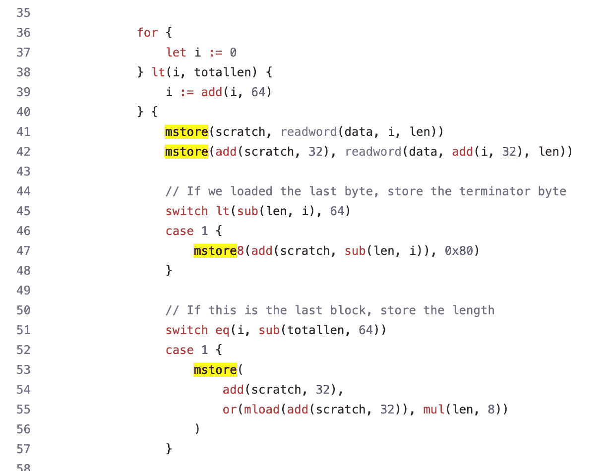*****

*****[来源:Github 上的 ENS 源代码，SHA1.sol 库。](https://github.com/ensdomains/ens-contracts/blob/8a2423829a28852297ee208357d148987e8dce0f/contracts/dnssec-oracle/SHA1.sol#L41-L56)*****

# *****知道内存大小*****

> *****有关`MSIZE`操作码的更多详细信息，请参见 [evm.codes](https://www.evm.codes/) 中的操作码说明*****

*****乍一看，EVM 操作码`MSIZE`顾名思义，它将返回内存中存储了多少数据。或者换句话说，当前有多少字节被写入存储器。*****

*****`MSIZE`操作码有点复杂。Solidity 编译器的 C++源代码提供了更多的信息来理解它。见下文。*****

*****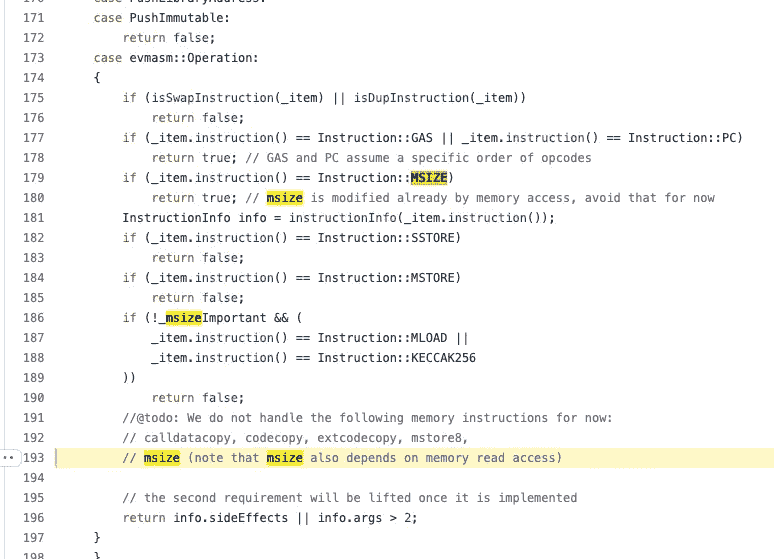*****

*****来源:Solidity Github 仓库上的 SemanticInformation.cpp*****

*****`MSIZE`操作码返回当前执行环境中在内存中访问的最高字节偏移量。大小将始终是字的倍数(32 字节)。*****

*****但是在坚固性上，*“内存中存储多少字节”*和*“内存中访问的最大索引/偏移量”有什么区别？******

*****我们将用一个使用 Solidity 本身的实际例子来说明！请看下面的代码片段。*****

*****这里发生了什么事？*****

*******第一步:** `freeMemBefore`首先返回空闲内存指针:`0x80 (= 128)`*****

*******第二步:**然后我们将`data`写入内存(64 字节)。空闲内存指针得到更新。(`freeMemAfter`)变成`0xc0 (= 192)`。*****

> *******注意:**在上面的例子中，空闲内存指针自动更新只是因为我们在汇编块之外。如果您通过`mstore`或类似的操作码(如`calldatacopy`)写入汇编中的内存，空闲内存指针不会自动更新。你有责任自己手动完成。*****
> 
> *****请记住 Solidity 文档中提到的规则:“内联汇编可能有一个非常高级的外观，但它是非常低级的”。*****

*****此时，从技术上讲，内存中总共分配了 192 个字节。*****

```
 *****32 bytes 
x 4             (the first 4 reserved spaces in memory)
---------------------
= 128 
+ 64 bytes      (the variable `data`)  
---------------------  
= 192           (total)*****
```

*****现在注意第 28 行。我们试着从偏移量`0x0c (192)`读入内存*****

*******第三步:**当我们做`msize`(第 31 行)时，我们获得了数字`224 (= 0xe0)`。刚刚发生了什么？总共只有 192 字节存储/分配在内存中。这 224 从何而来？*****

*****`224 = 192 + 32`。所以`msize`返回的值就是内存中存储的总字节数(`192` ) + 32。我们刚刚触发并见证了一场记忆膨胀。内存总是一次扩展 32 字节字。*****

*****对于`msize`操作码，没有比来自 [evm.codes](https://www.evm.codes/) 的解释更好的了。*****

> *****msize tracks 是当前执行中访问过的最高偏移量。对更大偏移量的首次写入或读取将触发[存储器扩展](https://www.evm.codes/about)*****

# *****空闲内存指针*****

*****在他们的热门文章系列“解构智能合约”中，OpenZeppelin 揭示了每个智能合约的前 5 个字节背后的操作码的含义。*****

```
*****0x6080604052...*****
```

*****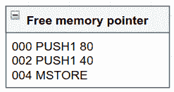*****

*****[资料来源:OpenZeppelin，解构智能合同(第一部分)](https://blog.openzeppelin.com/deconstructing-a-solidity-contract-part-ii-creation-vs-runtime-6b9d60ecb44c/)*****

*****在一个 nutschell 中，这个操作码序列将数字`0x80`(十进制 128)存储到内存的位置`0x40`(十进制 64)。为什么*****

*****如前一节*“存储器布局”*所述，存储器中的前 4 个字是为特定目的而保留的。第三个字——位于内存中的位置`0x40`——被称为**自由内存指针。*******

*****Open Zeppelin 将自由内存指针描述为*“对内存中第一个未使用的字的引用”*。它能够知道内存中的哪个位置(在哪个偏移量)有空闲空间可以写入数据。这是为了避免覆盖内存中已经存在的数据。*****

*****空闲内存指针是 EVM 最重要和最关键的东西之一。*****

## *****Solidity 中的空闲内存指针*****

*****在 Solidity 中，做`bytes memory myVariable`这样的代码片段时会自动取+更新空闲内存指针。*****

*****让我们看一个例子。对于坚固性代码:*****

*****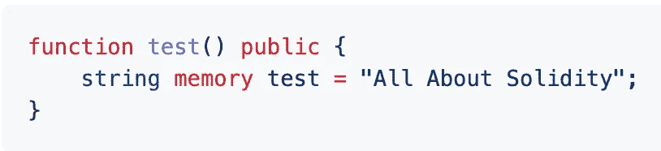*****

*****这些是由 Solidity 编译器生成的操作码。我们感兴趣的是如何获取和更新空闲内存指针，从指令`056`到指令`065`。*****

*****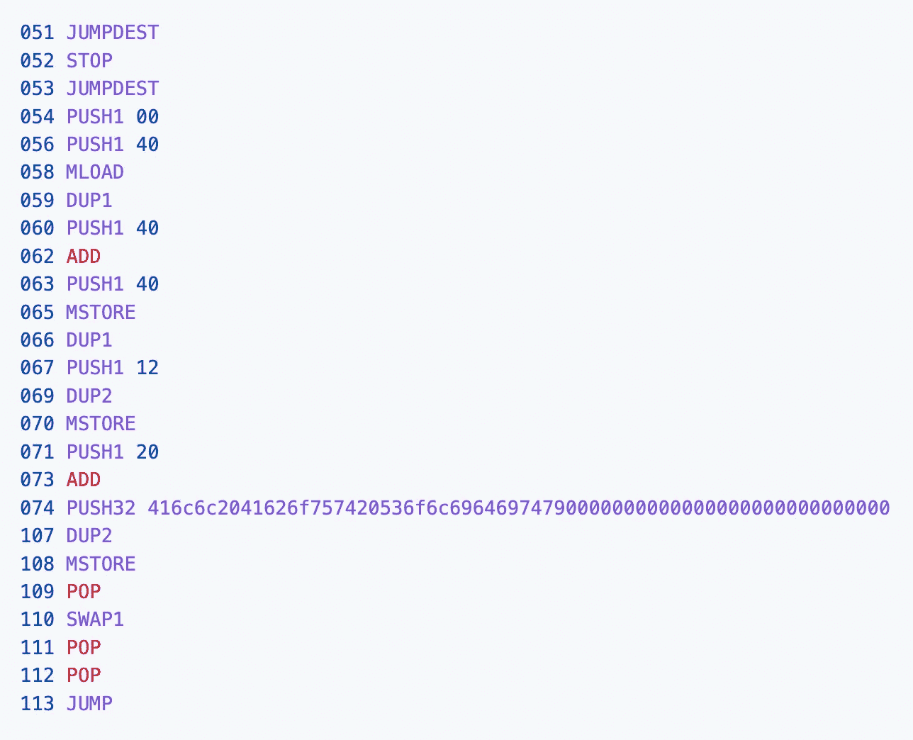*****

*****写字符串存储器的基本操作码序列。*****

*****当一个字符串或一些数据被写入 Solidity 的内存中时，EVM 总是执行以下最初的两个步骤:*****

*******第一步:获取空闲内存指针。*******

*****EVM 首先从内存位置`0x40`加载空闲内存指针。`mload`返回的值是`0x80`。我们的空闲内存指针告诉我们，内存中第一个有空闲空间可写的地方是在偏移量`0x80`。这是我们栈顶最后的东西。*****

*****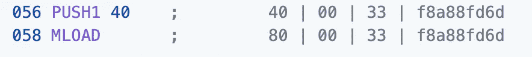*****

*******第二步:分配内存+用新的空闲内存指针更新。*******

*****EVM 现在将在内存中为`string test`保留该位置。它将空闲内存指针返回的值保存在本地堆栈上。*****

*****但是 Solidity 编译器既聪明又安全！在分配之后，在向内存中写入任何值之前，它总是更新空闲内存指针。这是指内存中下一个空闲空间。*****

*****根据 ABI 规范，`string`由两部分组成:长度+字符串本身。下一步是更新空闲内存指针。EVM 在这里说的是*“我要在内存中写 2×32 字节的字。因此，新的空闲内存指针将比当前指针“*多 64 个字节。*****

*****下面的操作码做的事情很简单。它:*****

1.  *****复制空闲内存指针的当前值= `0x80`*****
2.  *****给它加上`0x40`*****
3.  *****将`0x40`(再次=空闲内存指针的位置)压入堆栈*****
4.  *****通过`MSTORE`用新值更新空闲内存指针*****

*****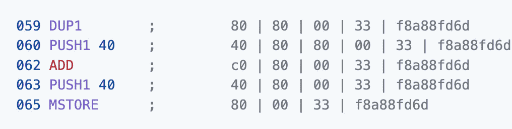*****

## *****程序集中的空闲内存指针*****

*****在内联汇编中，必须小心处理空闲内存指针！*****

*****不仅要手动获取，还要手动更新！*****

*****因此，在汇编中处理内存时必须小心。如果您不想最终覆盖内存中已经有一些内容的内容，那么您必须确保总是首先获取汇编中的空闲内存，并写入空闲内存指针所指向的内存位置。*****

*****一旦写入内存，必须确保用新的空闲内存偏移量更新空闲内存指针。*****

*****总之，当谈到空闲内存指针时，永远记住 OpenZeppelin 的建议:*****

> ******“在汇编级操作内存时，必须非常小心。否则，您可能会覆盖保留的空间。******

> *******注意:在检查空闲内存指针指向的内存位置实际存储了什么之前，先写入空闲内存指针可能不是一个好的做法。*******

*******示例:来自**[来源:Github 上的 GBSPS/solidity-bytes-utils，BytesLib.sol](https://medium.com/u/3e5dfef854b6#L245-L247)*****

# *****作为函数参数的内存引用*****

*****每次在 Solidity 中，当我们必须将一个动态或复杂类型的参数传递给一个函数时，我们都会使用这个语句。*****

*****例如，在 ENS 契约中，`DNSRegistar.sol`的`claim(...)`函数接受两个参数:a `name`和`proof`，两者都是`memory`引用。*****

*****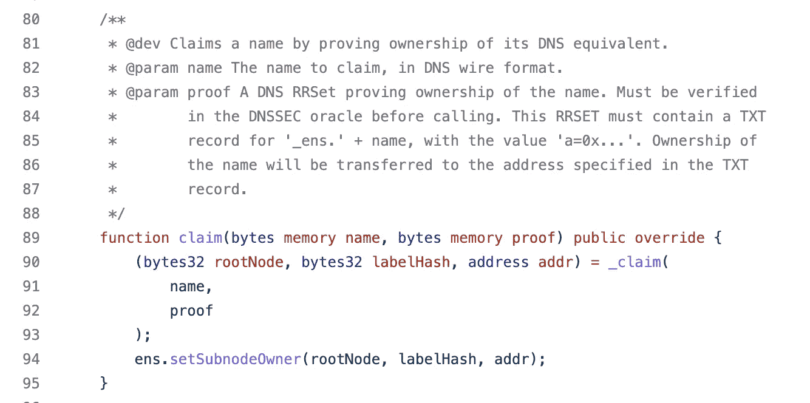*****

*****但是对于 EVM 来说，`memory`引用作为函数参数意味着什么呢？让我们用一个基本的坚实度的例子。*****

```
*****function test(string memory input) public {
    // ...
}*****
```

*****当一个`memory`引用作为参数传递给一个函数时，该函数的 EVM 字节码依次执行 4 个主要步骤:*****

1.  *******从** `**calldata**` **加载字符串偏移量到堆栈:**知道字符串在`calldata`里面的起始位置。*****
2.  *******将字符串长度加载到堆栈中:**将用于知道从`calldata`中复制多少数据。*****
3.  *******分配一些内存空间**将字符串从`calldata`移至`memory`:这与“空闲内存指针”中描述的相同。*****
4.  *******使用操作码`calldatacopy`将字符串从** `**calldata**` **转移到** `**memory**` 。*****

*****我把详细的操作码放在下面了。你也可以查看我的 Github 库来了解更多细节。*****

*****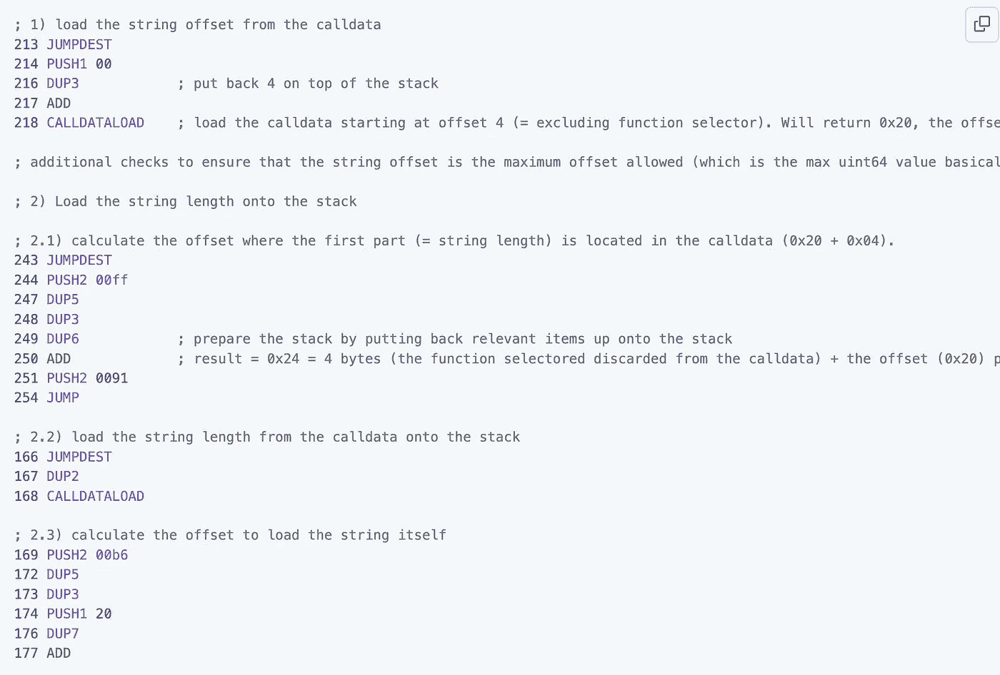**********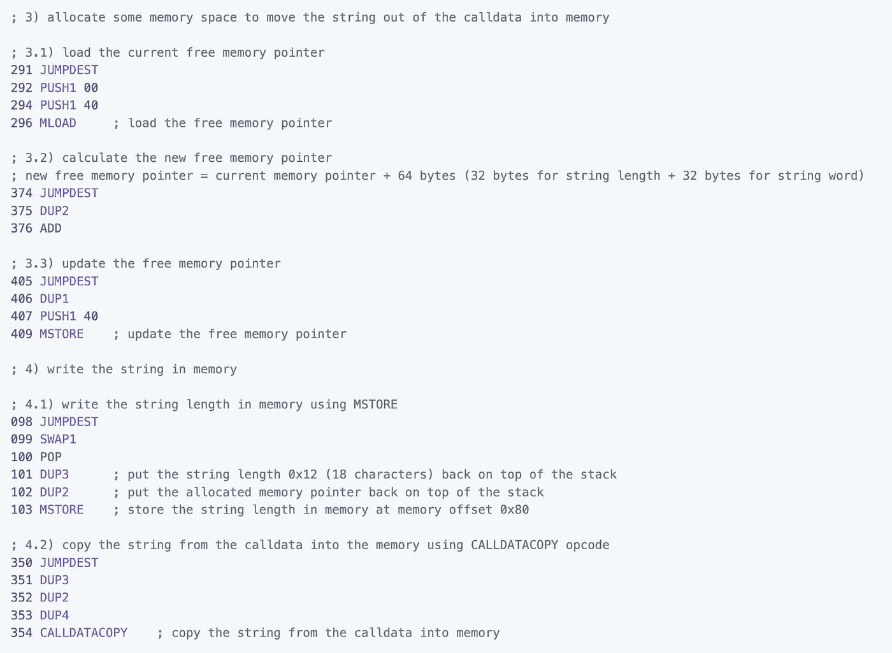*****

*****[来源:关于坚固性的一切——记忆(Github 库)](https://github.com/CJ42/All-About-Solidity/blob/master/articles/data-locations/Memory.md#a-string-passed-as-a-function-argument)*****

# *****函数体内的内存引用*****

*****让我们看看下面的准系统例子。*****

```
*****function test() public { uint256[] memory data;}*****
```

*****要问的问题是*变量* `*data*` *包含什么？******

*****回答*`*uint256*`*号的空数组*可能会很有诱惑力。但是不要被语法所迷惑或误导。这是 Solidity，不是 Javascript 或者 Typescript！******

******在 Typescript 中，声明一个具有`uint256[]`类型的变量而不初始化它会导致该变量首先保存一个空数组。******

******然而，关键字`memory`在这里改变了这一切！******

******让我们来刷新一下我们的大脑，在介绍文章《关于数据位置的一切》中，我们描述了带有关键字`storage`、`memory`或`calldata`的变量称为**引用类型变量。********

******所以当你在一个带有关键字`memory`的实性函数中看到一个变量时，你是在处理一个对内存中某个位置的引用。******

******因此，上面的变量`data`不保存数组，而是保存**一个指向内存中某个位置的指针。**Solidity 文档对此做了很好的描述:******

> ******引用内存的局部变量计算内存中变量的地址，而不是值本身。******

******而坚固性在解释上更进一步！******

> ******这样的变量也可以赋值给，但是注意赋值只会改变指针而不会改变数据******

******让我们看另一个例子来更好地理解。******

```
******function test() public pure returns (bytes memory) { bytes memory data;
    bytes memory greetings = hex"cafecafe"; data = greetings;
    data[0] = 0x00;
    data[1] = 0x00; return greetings;}******
```

******有人可能会认为变量`greetings`在这里是安全的，这个函数将返回`0xcafecafe`。但是这里的假设是错误的，如果你运行这个函数，它会返回如下结果。******

************

******内存引用给人的惊奇和错误的假设。******

******实际上，我们创建了两个指向内存的指针，分别用变量`data`和`greetings`命名。******

******当我们做`data = greetings`时，我们认为我们在给变量`data`赋值`cafecafe`。但是**我们在这里根本没有分配任何东西**！我们向 EVM 发出以下指令:******

> ******"变量`data`，我命令你指向内存中变量`greetings`指向的相同位置！"*🫡*🪖******

## ******在内存中分配新元素******

******在上一节中我们看到，我们可以在内存中为变量分配一些空间，并通过给变量赋值来直接写入。******

******我们也可以在内存中分配一些空间，但不立即写入内存，方法是使用`new`关键字。******

******这主要是在实例化复杂类型(如函数中的数组)时。******

******当用`new`关键字创建数组时，数组长度必须在括号中指定。在函数体内的内存中只允许固定大小的数组。******

```
******uint[] memory data = new uint[](3);******
```

******对于结构，new 关键字不是必需的。******

## ******从存储参考变量复制******

******让我们继续下面的坚实度的例子。******

```
******// SPDX-License-Identifier: UNLICENSED
pragma solidity ^0.8.0;contract Playground { bytes storageData = hex"C0C0A0C0DE"; function test() public { bytes memory data = storageData; }}******
```

******在这个场景中，我们将一个`storage`引用(=在`=`符号的右边)复制到一个`memory`引用(=在`=`符号的左边)。这里发生了两件事:******

1.  ******新的内存被分配，变量`data`将指向内存中的一个新位置。******
2.  ******十六进制十进制值`0xC0C0A0C0DE`从存储器中加载并复制到内存中`data`所指的存储位置。******

# ******内存扩展成本******

> ******有关内存扩展成本的更多详细信息，请阅读 [evm.codes](https://www.evm.codes/about#memoryexpansion)******

******坚固性文件陈述如下:******

> ******当访问(读取或写入)先前未接触的存储器字(即，字内的任何偏移)时，存储器被一个字(256 位)扩展。******
> 
> ******在扩建时，必须支付燃气费用。内存越大，成本就越高(它以平方的方式扩展)。******

******事实上，每当我们在内存中写入一个以前没有使用过(其中有一些数据)或访问过(通过`mload`)的新单词时，内存就会“扩展”。******

******为什么内存扩展很重要？因为内存越大，每次与它交互时消耗的气体就越多。******

******当你通过`mstore`(或`mstore8`)写入内存时，这两个操作码会用到一些 gas。但是，写入内存的开销不仅仅取决于您向内存写入了多少数据。它还取决于实际的内存大小，也就是 EVM 影子开发者社区所说的*“内存扩展成本”。*******

******除了写入内存的成本之外，还有一个与内存扩展量相关的额外成本。******

******内存扩展成本以下列方式增加:******

*   ******前 724 个字节是线性的。******
*   ******之后是二次*(解释“二次”*的意思)******

******当通过`mload`操作码在内存中访问更高的偏移量时，简单的内存读取操作也会增加内存扩展成本。******

# ******合约调用之间的内存******

******关于 EVM 记忆和智能合约，有一个重要的概念需要注意。可靠性文件很好地说明了这一点:******

> ******…契约为每个消息调用获得一个新清除的(内存)实例。******

******这有助于我们理解 EVM 记忆的一个主要特征:**一个清晰的记忆实例是在外部调用之间获得的。********

******事实上，EVM 内存的一个实例是特定于每个契约和当前执行上下文的。这意味着在每次新约定交互时，获得新清除的空内存。******

******让我们在实践中检查如何在每个新的外部调用中获得一个清晰的内存实例。我们将以这两份合同为例:******

******使用这两个基本契约，我们可以使用`Source`契约与`Target`契约进行交互。让我们在 Remix 中部署和调试它们。******

1.  ******打开 [Remix IDE](https://remix-project.org/) ，创建一个新文件复制上面的 Solidity 代码。******
2.  ******在不启用优化器或不运行任何次数的情况下编译文件。******
3.  ******首先部署`Target`合同。******
4.  ******其次部署`Source`契约，给出之前部署的`Target`契约的地址作为构造函数参数。******
5.  ******在`Source`合同上，运行功能`callTarget()`******
6.  ******在控制台上，点击**“Debug”**，调试事务的各个操作码。******

******当您调试并检查每个操作码时，您应该看到 EVM 内存中充满了各种偏移量的数据。其中一个在偏移量`0x80`处显示了值`0x826926790000000000000000...`。这是目标契约上功能`doSomething()`的功能选择器。******

******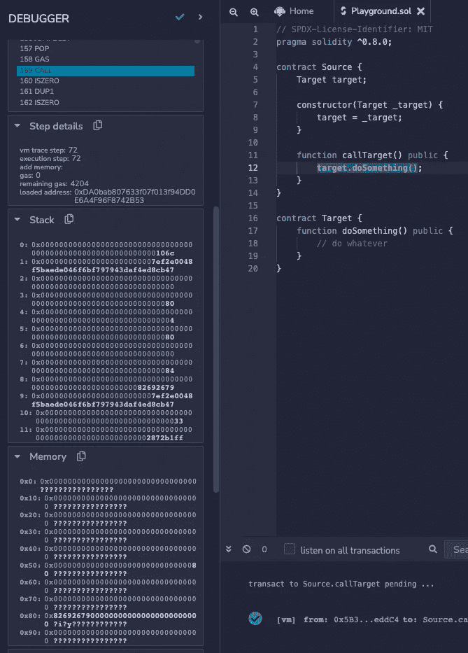******

******我们在这里可以看到，在外部契约调用之前，内存中充满了数据******

******我们可以在上面的截图中看到执行上下文。调试器突出显示了代码行 nb 12，外部调用`target.doSomething()`。******

******现在注意下一步！如果你点击蓝色箭头按钮跳转到下一个操作码进行调试，就像变魔术一样，内存被清空，变成空的！******

******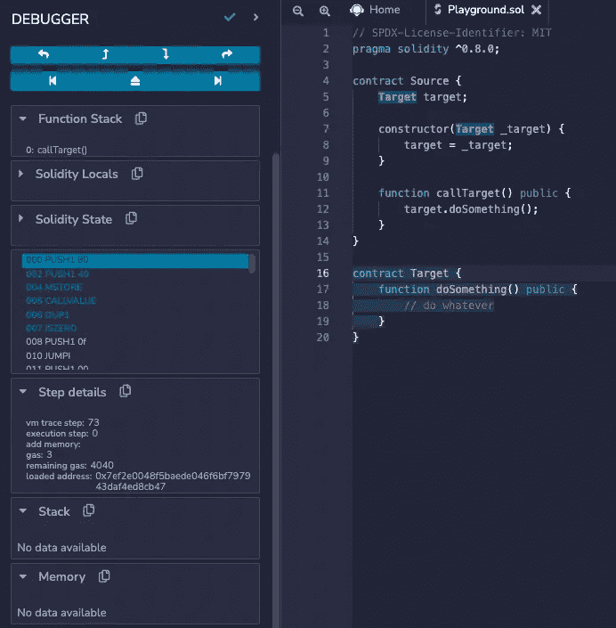******

******查看内存切换状态“无数据可用”******

******从上面的截图可以看出，左边栏的“内存”栏现在显示“无数据可用”。刚刚发生了什么？******

******`CALL`操作码使 EVM 改变了执行环境。我们现在在一个新的执行上下文中运行 EVM:`Target`契约的上下文。从上面可以看到，函数`doSomething()`现在被突出显示，为这个新的执行上下文切换提供了额外的线索。******

******下面是 Solidity 中这个外部调用的操作码摘要。为了简洁起见，我省略了一些操作码，并以注释的形式解释了发生的情况。******

******简单解释一下，EVM 会生成 calldata 字节，将`doSomething()`(为`0x82692679`)的函数选择器推到堆栈上，并将其左移以准备 calldata，这样就有这 4 个字节作为 calldata 中的函数选择器。******

******然后，要发送的 calldata 有效负载存储在内存中由空闲内存指针检索的位置。******

******最后，`CALL`操作码将调用外部契约地址，该地址最初从契约存储器(在指令编号`057`处)获取，并且将通过从存储器(其先前被写入的位置)获取来发送 calldata。******

> ******你可以在 github 的[“All About Solidity”库中查看这个外部调用的 EVM 操作码的完整片段。](https://github.com/CJ42/All-About-Solidity/blob/master/articles/data-locations/Memory.md#memory-between-function-calls)******

# ******结论******

******在 EVM，记忆是一个重要的学习领域。它使 EVM 能够执行消息呼叫，例如标准的`call`、`staticcall`和`delegatecall`。与消息调用一起发送的 calldata 和 payload 是从内存中存储和检索的。******

******因此，EVM 内存允许更好的可组合性，从而能够在智能合约中创建灵活的内部函数和子例程。此外，定义为`memory`的参数使契约能够接收来自各种来源的调用和参数，包括 EOAs 和外部契约调用(从`calldata`到`memory`加载有效负载)，还能够直接从内部函数中组合输入。******

******最后，在低级汇编中使用内存时要小心处理。这是为了确保您不会覆盖一些已经包含一些数据的保留内存空间。因此，尊重[可靠性内存管理](https://docs.soliditylang.org/en/v0.8.16/assembly.html#memory-management)是你的责任。******

******Solidity 语言还提供了关键字 [*【内存安全】*](https://docs.soliditylang.org/en/v0.8.16/assembly.html#memory-safety) 来更安全地使用内联汇编，并尊重 Solidity 内存模型。******

> ******更多详情请参见实体文档中的[惯例](https://docs.soliditylang.org/en/v0.8.14/assembly.html?highlight=storage#conventions-in-solidity)部分。******

# ******参考******

******[](https://blog.openzeppelin.com/ethereum-in-depth-part-2-6339cf6bddb9/) [## 以太坊深度，第 2 部分- OpenZeppelin 博客

### 感谢你对这篇文章感兴趣！我们正在进行品牌重塑，所以如果有些名字…

blog.openzeppelin.com](https://blog.openzeppelin.com/ethereum-in-depth-part-2-6339cf6bddb9/) [](https://www.evm.codes/) [## EVM 电码

### 以太坊虚拟机操作码的交互式参考

www.evm.codes](https://www.evm.codes/) [](https://github.com/ethereum/solidity) [## GitHub -以太坊/solidity: Solidity，智能契约编程语言

### 您可以在 Gitter 和 Matrix 上与我们交流，在 Twitter 上向我们发推文，或者在 Solidity 论坛上创建一个新主题。问题…

github.com](https://github.com/ethereum/solidity) [](https://www.evm.codes/about#memoryexpansion) [## EVM 电码

### 以太坊虚拟机(或 EVM)是一种基于堆栈的计算机。这意味着所有指令都带参数…

www.evm.codes](https://www.evm.codes/about#memoryexpansion) [](https://ethereum.stackexchange.com/questions/9537/how-to-return-dynamic-sized-arrays-original-address-on-the-memory-of-solidity/28457#28457) [## 如何返回动态大小数组在 Solidity 内存中的原始地址？

### 修改为以前的答案不完全正确，因为它在内存中是可能的，但它只能在汇编和…

ethereum.stackexchange.com](https://ethereum.stackexchange.com/questions/9537/how-to-return-dynamic-sized-arrays-original-address-on-the-memory-of-solidity/28457#28457)  [## 固体中的数据表示

### 适用于代码调试器和其他调试相关实用程序的编写人员。作者哈里·奥特曼[@haltman-at]发表…

ethdebug.github.io](https://ethdebug.github.io/solidity-data-representation/)  [## 在线装配-坚固性 0.8.14 文件

### 你可以在一种接近以太坊虚拟语言的语言中用内联汇编来交错 Solidity 语句

docs.soliditylang.org](https://docs.soliditylang.org/en/v0.8.14/assembly.html?highlight=storage#memory-management) [](https://stackoverflow.com/a/33839164/8245387) [## 以太坊坚固中，“记忆”关键字的用途是什么？

### 当人们谈论 Solidity 中的存储和内存时，他们实际上可能指的是这些东西的两种不同用途…

stackoverflow.com](https://stackoverflow.com/a/33839164/8245387) [](https://ethereum.stackexchange.com/questions/9603/understanding-mload-assembly-function/9610) [## 了解 mload 汇编函数

### mload(0xAB)加载位于存储器地址 0xAB 的字(32 字节)。例如，mload(0x60)加载位于 0x60 的字…

ethereum.stackexchange.com](https://ethereum.stackexchange.com/questions/9603/understanding-mload-assembly-function/9610)  [## 内存布局- Solidity 0.8.15 文档

### Solidity 中有一些操作需要大于 64 字节的临时存储区，因此不适合…

docs.soliditylang.org](https://docs.soliditylang.org/en/v0.8.15/internals/layout_in_memory.html)  [## 在线装配-坚固性 0.8.16 文件

### 你可以在一种接近以太坊虚拟语言的语言中用内联汇编来交错 Solidity 语句

docs.soliditylang.org](https://docs.soliditylang.org/en/v0.8.16/assembly.html#memory-management) [](https://github.com/CJ42/All-About-Solidity/blob/master/articles/data-locations/Memory.md) [## 主 CJ42 上的全可靠性/memory . MD/全可靠性

### MSIZE 操作码可能会让您认为它返回存储在内存中的数据的实际大小(以字节为单位)。它不…

github.com](https://github.com/CJ42/All-About-Solidity/blob/master/articles/data-locations/Memory.md)******