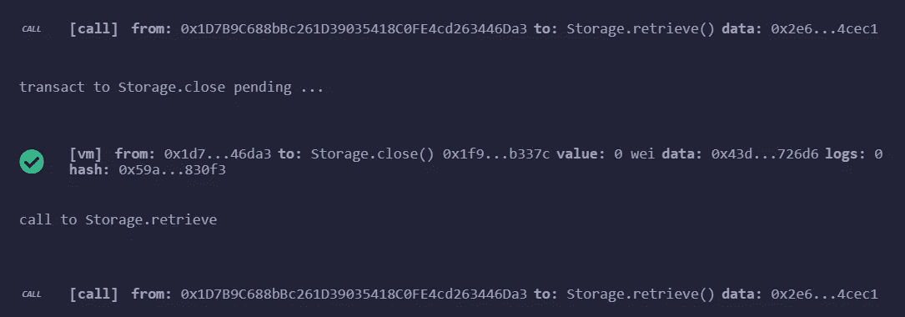

# 坚固性:自毁操作的一个小测试

> 原文：<https://betterprogramming.pub/solidity-what-happens-with-selfdestruct-f337fcaa58a7>

## “自毁”在 Solidity 中如何工作，以及它如何影响刚刚自毁的智能合约的寿命


照片由[哈里森·库格勒](https://unsplash.com/@harrisonkugler?utm_source=unsplash&utm_medium=referral&utm_content=creditCopyText)在 [Unsplash](https://unsplash.com/s/photos/crypto?utm_source=unsplash&utm_medium=referral&utm_content=creditCopyText) 上拍摄

出于本文的目的，我阅读了一些好的资料，从“[为什么智能合约会自毁？调查以太坊](https://arxiv.org/pdf/2005.07908.pdf)上的自毁功能，”这是一个真正深入自毁机制的最新出版物。在区块链的一般不变性中，`selfdestruct`命令很突出:`selfdestruct`使智能合同不可操作。一个激励人心的例子说明了为什么不变的区块链需要如此强大的命令:

> “DAO 攻击持续了几天，该组织当时甚至注意到他们的合同受到了攻击。然而，由于智能合约的不变性，他们无法停止攻击或转移以太网。如果契约包含自毁功能，道组织可以轻松地转移所有醚，并减少财务损失。”

如果您想了解更多关于 DAO 攻击及其后果的信息，可以参考本文末尾的参考文献[2]和[3]。

关于编译`selfdestruct`方法时生成的操作码，以太坊社区有一个很好的感性故事:最初操作码被命名为`SUICIDE`，但他们决定将其重命名为`SELFDESTRUCT`，因为

> “自杀是一个沉重的话题，我们应该尽一切可能不影响我们发展社区中那些患有抑郁症或最近因自杀而失去亲人的人。”— [EIP6](https://eips.ethereum.org/EIPS/eip-6)

下面你会发现一个小的玩具例子，它包含了最少的逻辑来做一些测试。使用 [Remix](https://remix.ethereum.org/) 可以很容易地执行它，所以即使没有安装开发环境也可以尝试。

```
pragma solidity >0.6.0;contract Storage {
 address payable private owner;
 uint256 number; constructor() {
  owner = msg.sender;
 } function store(uint256 num) public {
  number = num;
 } function retrieve() public view returns (uint256){
  return number;
 }

 function close() public { 
  selfdestruct(owner); 
 }
}
```

下面是部署合同后发生的情况。在 Remix 中，智能合约的每个方法都可以在左侧窗格中轻松访问。


部署后智能合约的方法

第一个要测试的方法是`store`，它只是将作为参数传递的整数值存储在智能契约的内部状态中。下一个要测试的方法是`retrieve`，正如你们中最聪明的人可能已经知道的，它检索预先存储在内部状态中的值。在实际存储任何东西之前调用这个方法只会返回`0`，因为默认情况下[变量被归零](https://solidity.readthedocs.io/en/v0.6.0/control-structures.html?highlight=default#scoping-and-declarations)。

调用`close`方法将只执行`selfdestruct`,除了下图中报告的以外，没有任何进一步的通知，一个正确执行的事务:


从现在开始，与智能合约的每次交互都将成功，但仍不会执行任何操作。

在某种程度上，这是不一致的:调用智能契约的客户端不知道智能契约已经被销毁的事实。例如，在这个特定的智能契约中，在`selfdestruct`之前和之后调用`retrieve`方法将不会返回错误，并且在内部变量包含`0`的特定情况下，这两个调用是不可区分的(参见下图)。



在自毁之前(第一次调用)和之后(第二次调用)调用的检索方法

总结是，`selfdestruct`被设计为故障合约的*极值比率*。这是一个紧急按钮，智能合约的[急停](https://en.wikipedia.org/wiki/Scram)。不过，在调用它之前，请考虑添加额外的逻辑，例如，将控制权传递给另一个智能合约。

作为进一步的阅读，我强烈建议参考文献[1]，如下。

# 参考

1.  迟佳·陈，，卢大伟和约翰·格伦迪。2016."[智能合约为什么会自毁？调查以太坊上的自毁功能](https://deepai.org/publication/why-do-smart-contracts-self-destruct-investigating-the-selfdestruct-function-on-ethereum)(2016 年 1 月)，27 页
2.  [https://en . Wikipedia . org/wiki/The _ DAO _(organization)](https://en.wikipedia.org/wiki/The_DAO_(organization))
3.  [https://www.coindesk.com/understanding-dao-hack-journalists](https://www.coindesk.com/understanding-dao-hack-journalists)