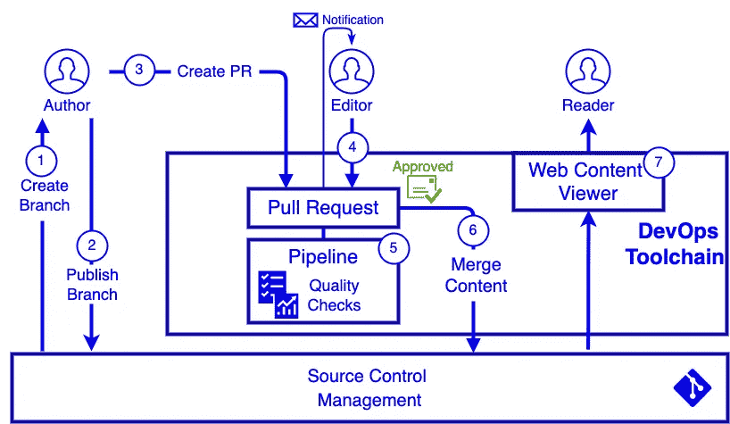

# 解决方案架构:文档即代码

> 原文：<https://betterprogramming.pub/solution-architecture-docs-as-code-366a7b40f9e5>

## 利用您的 DevOps 工具链将文档转化为有价值的信息源

[Redd](https://unsplash.com/@reddalec?utm_source=medium&utm_medium=referral) 在 [Unsplash](https://unsplash.com?utm_source=medium&utm_medium=referral) 上的照片

您有多经常处理很快就过时的文档？一旦设计或文档被基线化，文档通常会偏离它所描述的系统，认为它是你不再信任的信息来源。

在系统和技术快速发展的时代，我们的设计和文档方法仍然停滞不前。

记录现状架构很困难…但并非不可能。

> 它始于人和过程，**而不是**工具和技术。

采用一个新的闪亮的工具而不处理人和过程元素，不可能产生任何改进。

# 人员和流程:先决条件

*   团队凝聚力:团队必须与共同的目标保持一致，并且能够有效地沟通。最初，谨慎的做法可能是安排定期的 cadence 电话会议，以确保计划按计划进行。
*   确定每个信息领域的内容编辑器——例如:开发人员入职、API 目录、数据。
*   定义并同意一个轻量级流程；避免孤立地这样做，以确保团队适应新的工作方式
*   定义模板、指南和简单的分类法。
*   整合或(如果可能)改变现有流程。许多企业抵制改变，所以如果你不能说服现任者放弃旧式的 TOGAF 模板，你可能需要变得有创造性。

# 采用软件工程思维方式

在进入市场寻找新的知识管理工具之前，为什么不评估一下你已经做的投资呢？DevOps 工具链*可能*提供您需要的一切:使用 markdown 的内容创作，使用 GIT pull-requests 的审批工作流，使用管道和开箱即用的内容查看器的质量控制。

您甚至可以将内容发布到静态站点。许多产品供应商为他们的外部文档这样做。例如，我知道微软的大部分文档都是在 GitHub 中创作和管理的。

**来源**:[github.com/MicrosoftDocs](https://github.com/MicrosoftDocs)→**目标**:docs.microsoft.com

下图描述了一个利用 DevOps 工具链的简单内容创作工作流。

## 概观

1.  作者为他们的新内容变更创建了一个本地分支。他们使用自己选择的 IDE(例如 VSCode)来创建 markdown 文件。VSCode 还包括 DrawIO 等图表工具的扩展，因此您甚至可以对您的图表进行版本控制！
2.  作者将分支发布到源代码控制管理系统中。从技术上讲，他们不需要一直这样做，但是这是一个很好的实践，因为它提供了一个备份。
3.  一旦作者准备好提交他们的内容更改以供批准，他们就创建一个拉请求(PR)。
4.  内容编辑将收到一个通知，告知他们有新的 PR。编辑将审查内容并决定批准或拒绝提交；他们可以对新的/更改的内容添加评论，这样作者就知道审批需要什么了。
5.  一旦 PR 被创建/更新(根据反馈)，一个自动化的管道将对内容执行各种质量检查。
6.  一旦编辑批准了 PR，就可以将内容合并到主分支中。
7.  使用 DevOps 平台，例如 Azure DevOps WIKI，可以将主分支的内容呈现给用户。

# 最后的想法

创建和管理质量文档并非不可行。最大的挑战是处理人员和流程元素。

大多数人看不到文档的价值，所以你需要推销好处，让团队参与进来。

定义并在可能的情况下自动化该过程——这可能包括批准门；自动质量检查，如拼写和语法；以及外部内容发布，如 WIKIs 和开发人员门户。

与任何系统一样，从简单开始，随着时间的推移添加/更改功能。

我希望你觉得这很有趣。

山药山药建筑师。

如果你喜欢阅读这样的故事，并想支持我成为一名作家，可以考虑[注册成为一名媒体会员](https://medium.com/@yam-yam-architect/membership)。每月 5 美元，你可以无限制地阅读媒体上的故事。如果你[用我的链接](https://medium.com/@yam-yam-architect/membership)注册，我会赚一小笔佣金。

 [## 通过我的推荐链接加入 Medium-yam yam architect

### 阅读 yam yam architect(以及媒体上成千上万的其他作者)的每一个故事。您的会员费直接…

medium.com](https://medium.com/@yam-yam-architect/membership)