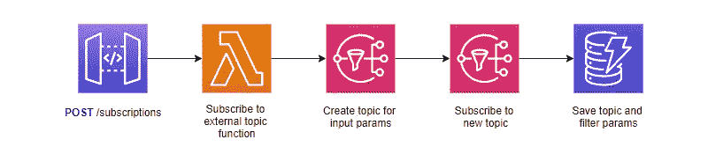
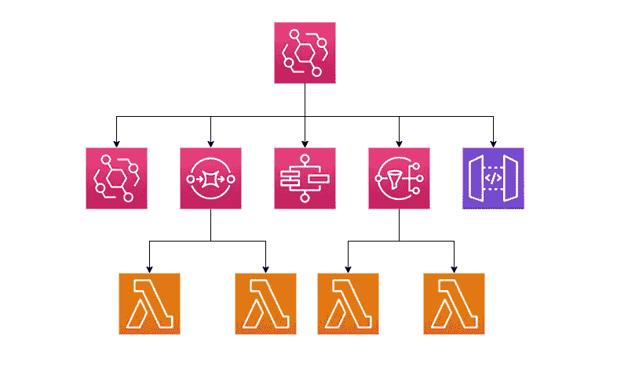

# 解决方案架构师提示:如何围绕无服务器服务限制进行设计

> 原文：<https://betterprogramming.pub/solutions-architect-tips-how-to-design-around-serverless-service-limits-15e12b5c4235>

## 当使用托管服务设计应用程序时，您必须知道服务限制，这样您就不会在生产中遇到任何意外

尼古拉斯·酷(Nicolas Cool)在 [Unsplash](https://unsplash.com/s/photos/caution?utm_source=unsplash&utm_medium=referral&utm_content=creditCopyText) 上的照片

作为一名解决方案架构师，我经常参加项目设计会议。

在这些会议中，我经常听到的一句话是“我们不能使用服务 X，因为服务限制太低了。”

信不信由你，我经常听到这样的话。

我敢肯定，跳入你脑海的明显答案是请求增加服务限制。虽然有时这是解决问题的办法，但并不是每个配额都能增加。如果可以增加，也可能达不到你需要的规模。

*服务限制的存在是有原因的。*

在你跑去要求增加服务限制之前，问问你自己“为什么这个限制首先存在？”AWS 不希望你这样做是有原因的，试图绕过限制听起来是个坏主意。

让我们举几个例子，看看我们如何以不同的方式处理问题，以确保我们设计的解决方案按照预期使用服务。

# 社交网络过滤策略

[亚马逊社交网站](https://aws.amazon.com/sns)的默认限制是每个账户 100，000 个话题(或 1000 个先进先出话题)。但是，每个帐户只能有 200 个订阅过滤器策略。

这似乎是一个奇怪的分布。如果两个限制都达到最大值，这意味着只有 0.2%的主题可以有订阅过滤器(假设每个主题有一个订阅)。

我不知道为什么服务限制变化如此之大，但是在设计您的应用程序时需要考虑到这一点。

让我们举一个真实世界的例子。

> 您有一个允许集成商订阅事件的多租户应用程序。随着开发的继续，应用程序有越来越多的可订阅事件。

当我第一次实现一个架构来满足这个场景时，我并不知道订阅过滤器的限制。我想出了一个计划，所有的订阅都在同一个主题上。每个主题都添加了一个过滤器策略，以包括租户、事件和其他过滤器。

*使用过滤器实现通用订阅端点的简单方法*

这很有效…直到它不起作用。一旦我达到了 SNS 的订阅过滤服务配额，我不得不迅速重新考虑解决方案。

我没有创建一个所有订阅都要通过的主题，而是创建了许多没有过滤器的动态主题。

*动态构建主题而不是使用过滤器的模式*

这种模式允许您充分利用您可以在一个帐户中创建的大量主题。缺点是您现在必须管理何时发布特定主题。这听起来可能是一项艰巨的任务，但是没有什么是[一对多 DynamoDB 数据模型](https://www.alexdebrie.com/posts/dynamodb-one-to-many/)不能处理的。

如果我在第一次设计之前就知道服务配额，我就可以为公司节省大量的开发时间，而不需要返工解决方案。

# Lambda 授权者结果大小

[Lambda 授权器](https://docs.aws.amazon.com/apigateway/latest/developerguide/apigateway-use-lambda-authorizer.html)是位于 API 网关之上的 Lambda 函数，用于执行定制授权。授权者验证用户的身份，并返回一个 IAM 策略，其中包括调用者可以访问的端点的 ARNs。此策略大小的大小限制为 8KB。

不久前，我提出了在你的整个生态系统中共享一个 Lambda 授权器的想法。构建一次授权机制，并将其集中到您的应用程序中。一次调用将返回一个策略，该策略包括用户有权访问的应用程序中的所有端点。这对于缓存来说非常好，但是同样，当我们谈到规模时，我们会遇到问题。

我构建的应用程序有几十个微服务，每个微服务包含一个有几十个端点的 API。我们正在构建一个具有系统定义角色的应用程序，因此在策略中使用通配符不是一个选项。每个端点都需要在策略中明确列出。

除了为每个角色管理跨服务的复杂负担之外，它还产生了最终超过 8KB 限制的庞大策略。再一次，我们不得不回溯并以不同的方式实现我们的解决方案来处理大小限制。

我们选择在每个微服务中包含 Lambda 授权者，而不是拥有一个知道所有微服务的授权者(这是不允许的)。这不仅减少了结果中返回的策略的大小，还使我们能够更加灵活地丰富[授权者上下文](https://docs.aws.amazon.com/apigateway/latest/developerguide/api-gateway-lambda-authorizer-output.html)。

授权者上下文是丰富的数据，通常是关于调用者的，可以传递给下游服务。

在这种情况下，当我们最初设计解决方案时，我们认为不可能达到 8KB 的限制。但是我们没有考虑未来的自己。在你的设计中，永远要考虑不久的将来的规模。这种规模会超过服务配额吗？对我来说，是的。

# EventBridge 规则目标

EventBridge 通过规则将事件路由到各个目的地[。这些规则定义了 EventBridge 查找的内容，并定义了由事件触发的目标或目的地。每条规则最多有五个目标。](https://docs.aws.amazon.com/eventbridge/latest/userguide/eb-rules.html)

我参加了一个架构审查会议，会上有人说由于这个限制，EventBridge 不是他们项目的可行选项。他们认为一旦一个活动有超过五个订阅者，他们就不能再使用这个规则。

如果您有一个事件需要通知五个以上的订户，那么您很幸运。你可以用 SNS 将[扇出到多个目标](https://docs.aws.amazon.com/sns/latest/dg/sns-common-scenarios.html)。只要把 SNS 话题作为你的目标之一，你就可以开始了。

EventBridge 目标实际上是关于不同的流程。出于审计目的，您可能需要跟踪所有事件。或者您需要转换事件并将其传递给另一个应用程序。或者您只需要通知订阅者事件。其中每一个都是一个独特的过程，应该有自己的目标。

*利用 SNS 扇出多种功能*

请记住，限制是有原因的。有时以“巧妙”的方式解决服务限制可能会给你带来麻烦。在设计中使用这些工具。聪明可能会完成工作，但是它会使你的代码更难维护。

与 EventBridge 目标限制类似，在 DynamoDB 流上与消费者一起工作时，有一些[最佳实践。处理流时，建议您最多使用两个处理程序来防止限制。](https://docs.aws.amazon.com/amazondynamodb/latest/developerguide/ServiceQuotas.html#limits-dynamodb-streams)

如果您有多个进程需要作为一个 [DynamoDB 流](https://docs.aws.amazon.com/amazondynamodb/latest/developerguide/Streams.html)的结果运行，那么您可以使用与我们为 EventBridge 规则目标所做的相同的方法:使用 SNS 进行扇出。无论是将内容保存到 S3 并在 SNS 消息中发布对象密钥，还是直接在消息中传递内容，都将允许您根据需要获得尽可能多的流记录消费者。

请记住，对同一数据并发运行的进程越多，在进行转换时就需要越小心。

当考虑异步流程的消费者时，将他们想象成不同的工作流。每个独立操作一个消费者。带着“每个用户都应该用基础设施来处理”的心态来进行设计只是自找麻烦。

# DynamoDB 查询大小限制

从较低的层面来看，DynamoDB 有一个你需要考虑的[查询大小限制](https://docs.aws.amazon.com/amazondynamodb/latest/APIReference/API_Query.html)。对 DynamoDB 表执行扫描或查询操作时，它可以返回的最大结果大小是 1MB。如果您的查询匹配超过 1MB 的数据，DynamoDB 将在响应中返回一个`LastEvaluatedKey`属性，让您知道还有更多结果要处理。

在[的上一篇文章](/the-importance-of-proper-serverless-api-design-878dfc3d3fcf)中，我详细介绍了我们如何在没有这个限制的情况下设计我们的应用程序。当实体在我们的应用程序中达到一定的规模时，数据开始在我们的 API 响应中“丢失”。

这是因为我们没有考虑最大查询大小限制。响应正确地返回了数据和`LastEvaluatedKey`属性的子集，但是我们忽略了它，因为我们在最初的设计中没有考虑到这一点。

为了减轻这种情况，您有几个不同的选择。

*   设计您的数据模型，使查询不能达到 1MB
*   构建应用程序时要考虑分页

当遵循[单表设计](https://aws.amazon.com/blogs/compute/creating-a-single-table-design-with-amazon-dynamodb/)时，您可以用一种简单的查询检索实体和相关实体的方式来构建您的数据模型。通常，这是以重载组合键的形式出现的，它结合了实体的分区键和排序键，并对它们进行了变异以表示不同类型的实体。

如果您有意在设计前期投入精力，您也许能够逃脱 1MB 的查询限制。

但是你不能总是这样设计。如果你必须有无限的数据或者你的对象特别大，那就不可能逃脱这个限制。因此，将 [DynamoDB 分页](https://dynobase.dev/dynamodb-pagination/)构建到您的应用程序中是下一个最好的步骤。

你不希望意外的数据丢失，所以预先考虑设计([尤其是当 API 优先](/are-you-really-api-first-or-do-you-just-think-it-24ffc47ec7ea)时)，而不是对关键问题做出响应。

# 结论

服务限制是为了在构建基础设施时起到护栏的作用。如果你的应用遇到了另一个层面的配额问题，重新思考你的设计可能是正确的答案。就像你需要 10，000 个社交网络订阅过滤器，而不是 200 个。

在某些情况下，增加[配额](https://docs.aws.amazon.com/servicequotas/latest/userguide/request-quota-increase.html)可能会更好，比如当您需要运行 1200 个并发 Lambda 函数而不是 1000 个时。

无论你决定走哪条路，确保你不是在和基础设施作斗争。限制是为了防止你做傻事。别傻了。

设计是一项艰苦的工作，而了解您消费的所有服务的服务配额更是难上加难。提出设计方案时，请务必参考 AWS 控制台中的[服务配额页面](https://us-east-1.console.aws.amazon.com/servicequotas/home/services)，查看特定服务的所有限制列表。

服务限制是您在应用程序的生命周期中需要监控的东西。这不仅仅是设计时的考虑。您需要监控限制，以确保随着您的增长，您不会超出基础架构的规模。即使是无服务器也有限制。

大多数服务限制都可以提高，但是对于那些不能提高的服务限制，您将面临一个设计决策。如果你退一步问自己“为什么会这么低？”你可能会意识到并更好地理解生态系统。

祝你好运，我希望你下次构建系统的时候考虑到这一点。

编码快乐！