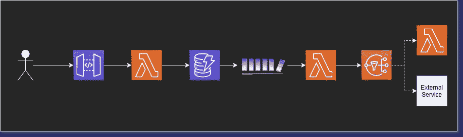
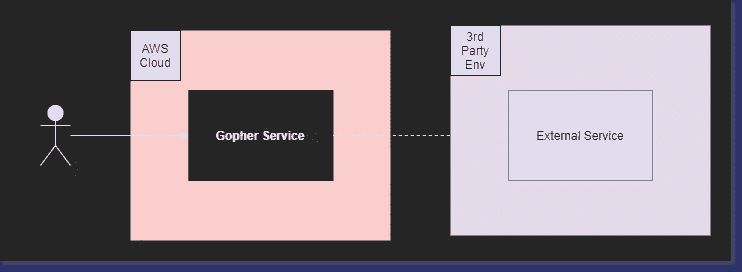
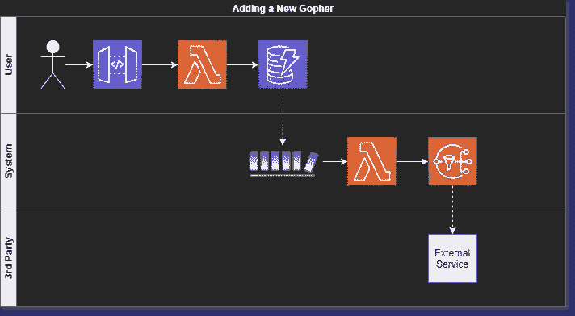
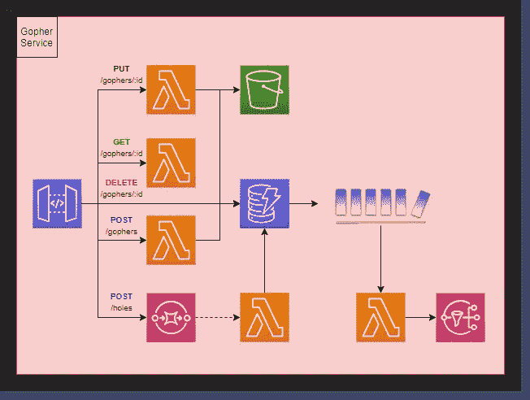
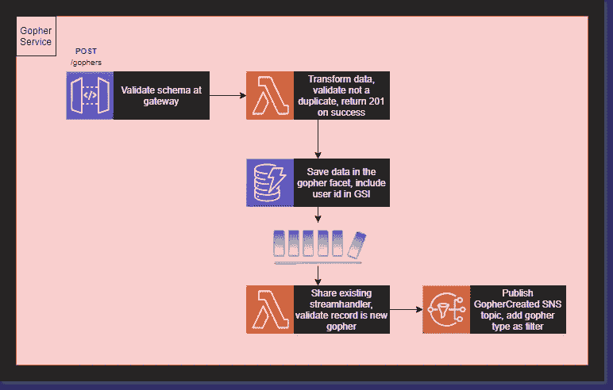

# 解决方案架构师提示—架构图的 5 种类型

> 原文：<https://betterprogramming.pub/solutions-architect-tips-the-5-types-of-architecture-diagrams-eb0c11996f9e>

## 流程、服务、角色、基础设施和开发人员图表

凯利·西克玛在 [Unsplash](/s/photos/draw?utm_source=unsplash&utm_medium=referral&utm_content=creditCopyText) 上的照片。

你曾经参加过有人试图解释软件系统如何工作的会议吗？

我与一位相对较新的解决方案架构师进行了交谈，他试图描述他们提出的一个系统。它有大约八个不同的组成部分，它们都以多种方式相互作用。

他们用手势解释解决方案，并说了很多“这件作品通过……与这件作品交流”

我听得懂他们说的话，但串在一起就没意义了。

当解释复杂的概念架构时，词语会丢失。我试图在遵循思路的同时建立一个心智模型。我需要一个视觉。

我需要*一张图表*。

但不是任何图表。架构图不是“一刀切”的解决方案。

我们最近讨论过，作为解决方案架构师[的一个重要部分](/how-to-switch-from-software-developer-to-solutions-architect-5e0c12bdc4b1)是有效地向技术和非技术受众传达您的想法。

你的图表必须考虑到这一点。如果你想让不同的人理解你的想法，你必须制作多个版本的图表。

今天，我们将讨论你应该根据五种不同的受众制作的五种不同类型的图表。

我们将从我的假业务但真实的 API[Gopher Holes Unlimited](https://github.com/allenheltondev/gopher-holes-unlimited)中取一个例子，其中我们将一个新的 Gopher 添加到要跟踪的系统中。

# 1.流程图

流程图是你能做出的最通用、最广泛的图表。这是一个显示工作流所有部分的中级到高级图表。

此图说明了业务流程中的活动部分。

作者照片。

## **观众**

这类图表的受众通常是技术人员。它可以用来向架构委员会提出一个想法，或者向开发人员描述一个业务流程是如何工作的。

## **注意事项**

*架构流程图*的主要组成部分是包含所有移动部分。在我们的[无服务器 AWS 环境](/serverless-you-keep-using-that-word-i-do-not-think-it-means-what-you-think-it-means-c7d5516a5ecc)中，我们标记了每个托管服务以及哪些服务相互通信。

没有描述各部分如何相互作用的细节，但是图表显示了连接。它显示了数据如何在系统中流动。

# 2.服务图

服务图从较高的层面说明了连通性。它没有显示工作流或服务如何工作的任何细节，而是显示了起作用的主要部分。这是一个旨在显示应用程序中使用的内部服务和外部服务的图表。

## **观众**

IT 和网络工程师往往对此类图表最感兴趣。他们关心你与外界服务的任何联系。此外，他们需要知道是否需要监控任何内部连接。

我经常用这个图表向主管们描述系统是如何工作的。他们想知道主要应用程序之间的连接，没有比服务图更好的方法来表示这些连接了。

## **注意事项**

在构建*架构服务图*的时候，最好列出所有组成你的应用或者生态系统的微服务。标记哪些服务相互通信，并确保区分您公司拥有的服务和外部服务。

对于这个高级图表，服务如何工作的细节不是必需的。这都是关于使应用程序运行的服务。

# 3.人物角色图

展示你的架构解决了业务问题是很重要的。角色图描述了按时间顺序排列的视图和特定工作流中的参与者。这是证明您在开发解决方案时考虑了业务的最佳工具。

## **观众**

面向业务的个人和产品所有者是这类图表的目标受众。他们关注人物角色以及他们如何与系统交互。向他们展示一个图，显示谁做了什么，什么时候做了什么。

## **注意事项**

*架构角色图*稍微融入了 [BPMN 模型](https://www.bpmn.org/)。利用泳道展示工作流程中的不同参与者。这种类型的图表倾向于较低层次，因为它比其他图表包含更多的细节。确保标记人物角色、工作流和任何关于业务流程如何从一个步骤进入另一个步骤的假设。

这些图也可以帮助那些刚接触某个领域的开发人员，并为他们将要构建的内容提供深刻的背景。

# 4.基础结构图

基础结构图是一个“所见即所得”的模型。它代表了已经实现的一切。本质上是一个低级图表，它意味着包含服务/应用程序/生态系统中存在的一切。

此图的目的是显示已经建立了什么以及系统当前如何工作。将此视为您构建的应用程序的*蓝图*。

## **观众**

基础结构图的受众各不相同。它可以用来向开发人员展示他们必须在特定的微服务中使用什么。它也可以用来向客户展示你的公司用来完成一项任务的所有资源。

技术人员将是基础结构图的主要消费者。因为您提供的是清单，而不是传达想法或业务流程，所以此图的预期用途仅限于提供信息。这是给喜欢“本质”细节的人看的。

## **注意事项**

构建*架构基础架构图*时，不要遗漏任何部分。这种图表的目的是展示应用程序中的所有内容以及它们之间的联系。你不需要太详细地说明*和*是如何工作的，而是要专注于让你的应用程序的所有部分都包含在图表中。

这些图表通常需要大量的工作来维护，但是在您的 CI 管道中自动生成它们是可能的。

# 5.开发人员图表

当你需要触及实质时，开发人员图表将是你的最佳选择。它包括开发人员构建解决方案所需的一切。

目标是回答通过查看*流程图*可能出现的任何问题，并将它们包含在设计中。这是这一系列图表中最底层的图表，目的是在没有你在场的情况下传达这个想法。

有人应该能够阅读这个图表，并确切地知道该怎么做。

## **观众**

实现解决方案的开发人员是这里的受众。对于团队以外的人来说，图表中包含的详细程度是不必要的。有时候，对于不需要细节的观众来说，太多的细节可能是件坏事。

向开发团队之外的人提供实现细节是过多细节的完美例子。这会分散你的注意力，从你试图传达的其他信息中转移。

## **注意事项**

*架构开发者图*本质上是添加了细节的*流程图*。用您能想到的任何具体实现细节来标记每一部分，并确保标记重要的转换。

这种类型的图表不会取代用户故事，但是它确实有助于增强用户故事，并增加整个开发团队的理解。尽可能使用它们，因为当实现完成时，您将有一个有用的工件供将来参考。

# 结论

架构图有很多种类型。每一个服务于一个独特的目的，许多服务于不同的观众。作为一名解决方案架构师，在推销您的想法时，您必须能够向正确的人提供正确类型的图表。

通常，一个版本的图表是不够的。当我开始一项新的设计时，我总是从*流程图*开始。我把我所有的想法都记下来，并把它推销给其他 sa。一旦我们就一个解决方案达成一致，我就拿着那个图表，把它变成一个*人物角色图*，并把它带给业务人员。

当我得到业务部门的认可后，我就可以自由地制作*开发人员图*和*服务图*。将服务图交给高管，以确保他们从高层次了解我们正在做的事情。开发人员图表被提供给将要实现解决方案的工程师。

一旦构建了解决方案，我们就可以更新*基础架构图*来包含新的工作。

一张图片胜过千言万语，但是对于架构图来说，它们可能价值五千。能够让人们快速简单地理解你的想法是成为一名优秀的解决方案架构师的关键。

有了为不同受众构建不同类型的图表的能力，您就为自己的成功做好了准备。

我总是用[*draw . io*](https://draw.io/)*来构建我的图。这是一个免费的工具，它提供了制作漂亮、全面的图表、模型和图示所需的一切。*