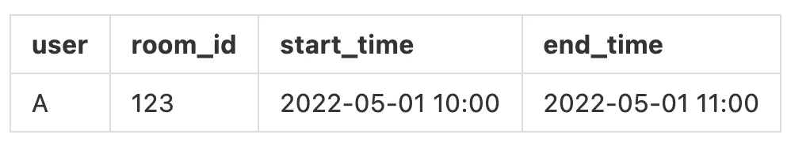
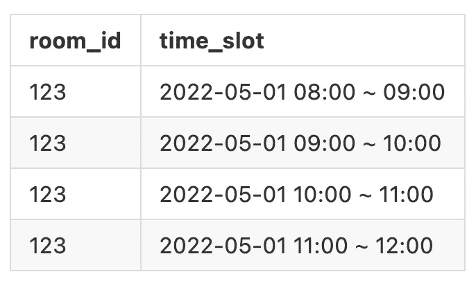

# 解决 MySQL 中的幻影读取

> 原文：<https://betterprogramming.pub/solve-phantom-read-in-mysql-a1c85f9a8c56>

## “创建”数据时写入偏斜的解决方案


Tobias Fischer 在 [Unsplash](https://unsplash.com/photos/PkbZahEG2Ng) 上拍摄的照片

MySQL 和它的存储引擎 InnoDB 的组合几乎是现在使用最广泛的关系数据库， *Repeatable Read* 是隔离级别最常见的。

然而，与 PostgreSQL 相比，InnoDB 有几个问题无法在*可重复读取*级别得到很好的解决。

1.  丢失的更新
2.  幻像读取

PostgreSQL 中丢失的更新可以完全解决，无需额外的黑客攻击。至于幻影读取，有一些小技巧可以用，比如`range types`等机制。

尽管如此，MySQL 仍然必须小心地识别陷阱，并由开发人员正确地处理它们来解决此类问题。在我之前的文章中，我们介绍了三种解决更新丢失的方法。这些方法为丢失更新提供了更灵活的解决方案，适用于各种场景。

在本文中，我们将进一步探讨如何正确解决由幻像读取导致的写入偏斜。

有许多类型的场景会导致幻像读取，但一般来说，它们都有以下模式。

1.  搜索特定范围。
2.  根据范围的结果做一些事情(创建、更新、删除)。
3.  该操作将直接影响原始范围结果。

假设只是更新或删除，避免写入偏斜的最直接方法是使用排他锁。如果在`SELECT`的开头使用`FOR UPDATE`，那么两个并发事务将被强制一个接一个地进行，从而有效地避免了竞争条件下的写偏斜。

然而，在创建的情况下，解决方案并不那么直观。因为在`SELECT`中没有相应的行可以锁定，所以该行是稍后创建的。那么如何解决呢？

# 会议室预订系统

在介绍解决方案之前，我们先用一个实际的例子来描述一下幻影读取带来的问题。

有一个会议室系统，提供用户预定会议室，当用户成功预定会议室后，表格中会增加一个新的对应数据，如下。



预订

上表记录了用户`A`在 5 月 1 日上午 10 点预订了一个小时的会议室`123`。

这个系统的行为将类似于下面的伪代码。

```
count = `SELECT COUNT(*) FROM booking 
         WHERE room_id = 123 AND 
         start_time < '2022-05-01 11:00' AND 
         end_time > '2022-05-01 10:00'`

if count == 0:
    `INSERT INTO booking (user, room_id, start_time, end_time)
     VALUES ('A', 123, '2022-05-01 10:00', '2022-05-01 11:00')`
```

当用户确定会议室在相应的时间段没有人时，用户可以插入一个条目作为预约，下一个用户将不会有时间冲突。这不是很好吗？

当两个用户想要同时占用同一个会议室的同一个时间段，并且他们都可以通过第一个`SELECT`验证，因此他们都可以插入一个预订时，就会发生冲突。而这样的情况不是加一个锁就能解决的，因为一开始就没有要锁的行。

# 按唯一性求解(不完全解)

由于没有办法通过锁将同时操作转变为顺序操作，所以我们让其中一个操作失败。为此，我们需要向表中添加一些约束，例如唯一约束。

一种方法是在 room_id、start_time 列上创建一个唯一的约束索引，这样第二个试图预订同一时间段的人就会失败。

> 如果我们限制每个房间最多使用一小时，问题就解决了。

但如果会议室能订一个多小时，另一个问题就出现了。

1.  用户 A 预订了 5 月 1 日上午 10 点到下午 12 点的时段
2.  用户 B 预订了 5/1 从 11:00 到 12:00

当用户 A 和 B 都在同时操作时，这种唯一的约束显然不能有效，于是会议室周围的冲突仍然存在。

# 具体化冲突(正确的解决方案)

为了解决这种幻影读取，开发人员必须使用一些技巧来揭示隐藏在同一个表下的冲突。

一种方法是创建一个新表，并用数据预先填充它，作为同时操作的协调器。在这个会议室系统的例子中，我们可以创建一个表`time_slots`,预先列出所有的时间段，如下所示。



时间段

当要预订会议室时，我们不仅在原来的`booking`上执行`SELECT`，而且在`time_slots`上执行`SELECT`，并且我们可以添加`FOR UPDATE`，因为数据已经存在。值得注意的是，新的`SELECT FOR UPDATE`在原来的`SELECT`之前执行。

在那种情况下，当两个并发用户的期望时隙重叠时，会被独占锁阻塞，变成一个接一个，后者会因为看到了前一个完成的结果而直接失败。

# 结论

我不得不说这样的解决方案很难，也不直观。然而，为了在使用 MySQL 时不牺牲性能，隔离级别没有配置为*可序列化*，这意味着在执行过程中必须用复杂性来换取性能。

这是复杂性和性能之间的权衡。事实上，在这样的场景中使用`FOR UPDATE`来处理同步确实会影响性能，如果`booking`是一个可能在所有上下文中都有幻像读取的表，那么单独使`booking`*可序列化*是一个可行的解决方案。

在使用数据库的时候，一定要知道数据库的能力，了解数据库所有不可解的情况，这样在设计开发的时候才能知道什么样的行为是潜在的风险。

此外，如何妥善处理风险也是一个重要的课题。虽然每个人的用例不完全相同，但模式是相似的，学习如何解决每个模式将有助于您在未来快速处理类似的情况。

本文为“创建”数据时的写偏斜提供了一个解决方案，而前一篇文章是关于解决“更新”数据时的写偏斜。这些应该涵盖了你可能遇到的大多数情况。如果有人遇到了其他类型的 MySQL 竞争条件，也请随时与我讨论。