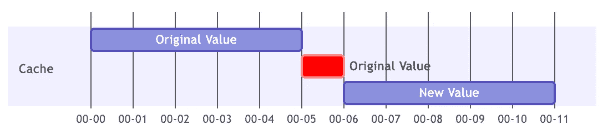
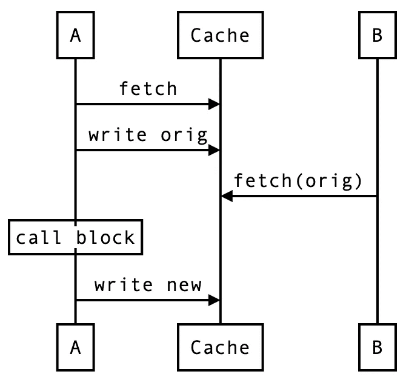
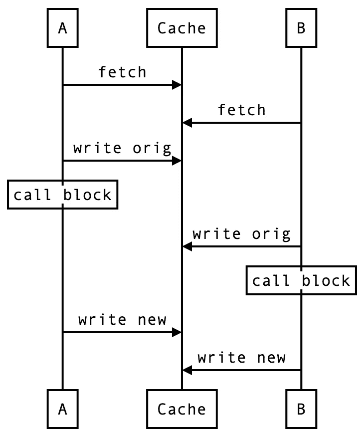

# 解决狗堆效应

> 原文：<https://betterprogramming.pub/solving-dogpile-effect-9d869174d302>

## 如何在高容量情况下缓存

照片由[朱迪·纽迈耶](https://unsplash.com/@jneumeyer)在 [Unsplash](https://unsplash.com/photos/ECjHeJtRznQ) 上拍摄

我们之前讨论过缓存一致性，当时我们提到，如果我们正确地实现了旁读缓存，就有可能实现良好的一致性。为了进一步提高一致性，必须使用更复杂的解决方案，例如通过缓存写入或缓存后写入。

*   [缓存和数据库之间的一致性，第 1 部分](https://medium.com/starbugs/consistency-between-cache-and-database-part-1-f64f4a76720)
*   [缓存和数据库之间的一致性，第 2 部分](https://medium.com/starbugs/consistency-between-cache-and-database-part-2-e28fc7f8a7c3)

今天，我们将讨论另一个常见的缓存场景，狗堆效应。

狗桩效应意味着当系统处于高流量下时，无论何时缓存失效，无论是清理还是超时，都会产生巨大的影响。

比如一个缓存条目同时被 100 个请求访问，一旦条目过期，100 个请求就会直接命中后端系统，这对后端系统是一个严峻的挑战。

因此，让我们看看有什么方法可以处理狗堆效应。有以下三种常见的方法。

1.  预热缓存
2.  延长缓存时间
3.  互锁

这三种选择各有利弊，事实上，它们已经被广泛使用。

> *问题，你知道* Ruby on Rails *中的* `*race_condition_ttl*` *是哪个吗？*

# 预热缓存

在讨论这种方法之前，让我们先来回顾一下旁读缓存的读取路径。

1.  首先，所有读取请求都是从缓存中读取的。
2.  如果缓存读取失败。
3.  然后从数据库中读取，并写回缓存。

当缓存未命中时，会出现问题。

当高容量系统下有大量读请求时，会导致大量的数据库访问。如果我们无论如何都可以保持缓存活动，难道不能解决狗堆效应吗？

因此，该方法是用周期性更新所有高速缓存的后台线程来替换高速缓存 TTL，例如，如果高速缓存 TTL 是 5 分钟，则每 5 分钟更新所有高速缓存，使得不再遇到高速缓存无效。

但是这种方法有其缺点。

1.  如果应用于所有缓存条目，它的空间效率非常低。
2.  在某些极端情况下，缓存仍然会失效，比如由缓存本身触发的驱逐。

虽然这是一个简单而残酷的方法，但我不得不说它在某些情况下非常有效。如果我们有一个必须处理大量流量的关键缓存，并且更新的成本很高，那么保持缓存新鲜是最有效的方法。

只要我们避免更新所有缓存条目，它就不会占用太多空间，也不太可能触发极限情况。

# 延长缓存时间

预热缓存可以在特定的关键缓存上很好地工作，但是如果根本没有定义关键缓存，那么预热的好处就不能有效地应用。

因此，第二种方法适用于一般用途。

读取缓存时，如果发现缓存超时，则稍微延长缓存时间并开始更新缓存。如果有并发读取请求，后面的读取请求将使用延长的时间读取缓存，以避免同时访问后端数据库。

假设缓存 TTL 为 5 分钟，我们将每个缓存设置为一分钟的扩展时间，如下图甘特图所示。

在时间间隔 0–5，读取缓存将获得原始值。如果有人在时间间隔 5–6 期间读取，尽管缓存过期，但缓存将被扩展，因此原始值仍然可用。但同时，第一个在区间 5–6 读取的人必须负责更新缓存，所以在时间点 6 之后，缓存会更新为新值。

让我们用一个序列图来表示这两个并发请求场景。

假设缓存已经超时。当`A`取值时，发现缓存已经超时，于是先将原始值写回缓存并执行常规的读操作从数据库中取值，最后将新值写回缓存。

但是`B`在读取的时候发现缓存并没有过期，因为缓存是扩展的，所以可以得到原来的值。

使用这种方法，只有一个`N`并发请求需要访问后端，其余的`N - 1`请求仍然可以从缓存中获取值。

 [## 位于 e5f3d 692030 b41ed 5 AC 671 fedc 9 cc 268 b 13 EBD 40 rails/rails 的 rails/cache.rb

### 此文件包含双向 Unicode 文本，其解释或编译可能与下面显示的不同…

github.com](https://github.com/rails/rails/blob/e5f3d692030b41ed5ac671fedc9cc268b13ebd40/activesupport/lib/active_support/cache.rb#L849) 

实际上， *Ruby on Rails* 的`race_condition_ttl`就是这个实现。上面链接中的 855 和 856 行是延长缓存时间的操作。

这种方法看起来是处理高流量的有效方法，只需要一个访问后端的请求，对吗？

答案是，不，不尽然。

当面对高并发场景时，这显然是无用的。让我们继续用顺序图来描述这个问题。

和之前一样的`A`和`B`，但是这次`A`和`B`发生的距离非常近。从时序图中可以看出，`A`试图将原值写回缓存时，`B`已经发生了，所以`B`也觉得自己是第一个。

当`N`请求完全同时到达时，这样的实现仍然不能解决 Dogpile 效应。

# 互锁

延长缓存时间似乎已经解决了大多数问题，但在高并发系统中仍然不够好。因此，我们需要一种方法来序列化高并发场景。之前，我们介绍了独占锁的概念。

 [## 雷迪斯锁定了！你确定吗？

### 你说的锁是专属锁还是壁垒？

better 编程. pub](/redis-as-a-lock-are-you-sure-a870c9f22ad8) 

在这种方法中，我们试图通过排他锁来避免多个并发请求通过缓存。

首先，在更新缓存之前，必须获得一个排他锁。只有那些可以获得锁的人才有资格更新缓存，即访问数据库，而其余没有获得锁的人必须等待以下两个条件之一。

1.  缓存是否已更新
2.  锁是否可以被获取

等待获取锁还必须验证缓存是否已经更新，以进一步避免重复的数据库访问。

当然，这种方法有一个明显的缺点。使并发进程可序列化将显著降低并发性。此外，等待是额外的开销，不仅消耗资源，还会影响性能。

值得一提的是，我们常说 Redis 不可靠，那么在这种场景下，是否有必要使用 Redlock 进一步提高可靠性？

看情况。

一般来说，不会，即使 Redis 不够可靠，不能准确地使用一次，在这种情况下很少发生泄漏也不是问题。这种场景不需要很强的一致性，最多只需要对数据库进行几次访问。

# 结论

为了解决缓存的一个常见问题——狗堆效应，我们回顾了三种常见的方法。

预热缓存适用的场景是“关键缓存”。一旦我们可以缩小缓存的范围，那么保持它的新鲜对我们来说就是最直观最简单的方法。

延长缓存时间是一种通用的方法，可以有效地处理各种高容量的情况。通过提供时间缓冲，允许缓存长时间服务，直到缓存被“某人”更新。

排他锁是一种高并发专门化方法。为了避免并发请求冲击后端系统，并发请求通过一个可序列化的机制被转化为顺序请求。

这三种方法各有各的优点和好处，但事实上，延长缓存时间和排他锁可以组合成一个整体解决方案。我将在下一篇文章中用代码解释其实现细节。

今天到此为止吧。