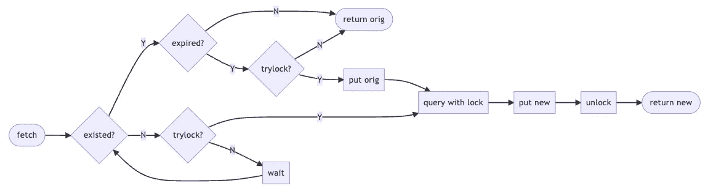

# 用 Python 解决狗堆效应

> 原文：<https://betterprogramming.pub/solving-dogpile-effect-completely-in-code-8ae23025866f>

## 可行的代码解决方案


朱迪·纽迈耶在 [Unsplash](https://unsplash.com/photos/ECjHeJtRznQ) 上的照片

上次，我们谈到了如何解决[堆效应](/solving-dogpile-effect-9d869174d302)。

提到的三种方法如下:

1.  预热缓存
2.  延长缓存时间
3.  互锁

然而，我们也提到了三种方法中的每一种都有其适用的场景和相应的潜在风险。那么有没有办法提取各自的优点，构造一个更完整的解决方案呢？

本文将提供一个例子，并解释我的想法。

# 解决方案概念

延长缓存时间有效地提高了缓存的可用性。当缓存无效并且同时被请求时，只有一个请求可以通过缓存进入后端系统。随着缓存时间的延长，其余的请求将获得原来的结果。

然而，当并发请求同时发生时(这通常是不常见的)，仍然存在多个请求进入后端系统的可能性，因此采用了排他锁方法。

尽管如此，一直使用排他锁的成本太高了，如果可能的话，我们应该尽量减少排他锁的使用。然后，只有当缓存不存在并且需要访问后端系统时，才使用排他锁，否则就使用扩展缓存时间。

整个过程如下。



首先，确定缓存是否存在，如果缓存存在我们还是要确定缓存是否过期。如果一切正常，我们可以只取缓存的原值，但是如果缓存过期，就必须进入更新缓存的过程。

为了避免高并发请求的影响，所有更新缓存进程都应该尝试获取一个锁。

另一方面，如果缓存从一开始就不存在，那么更新缓存的过程将是相同的。只是过程和上面说的不一样，因为没有原值，所以没有获得锁的人必须等待锁，才能得到结果。

# 解决方案概述

在我们进入实现的细节之前，让我们看看实际的做法。

```
def read_aside_cached(ttl, lock_period, race_period):
  def decorator(func):
    def wrap(*args, **kw):
      key = f"{func.__name__}_{args}_{kw}"
      return cache_factory(key, ttl, lock_period, race_period).handle(func, *args, **kw)

    return wrap
  return decorator

@read_aside_cached(60 * 5, 30, 60)
def foo(a, b=1, c=2):
  return db.query(a, b, c)
```

这是 Python 中的一个例子，我们使用装饰器来封装实际的数据库操作。

这个装饰器需要几个参数。

1.  ttl，这个很好理解，就是这个缓存的到期时间。
2.  lock_period，因为我们需要获取锁，所以这个参数决定了我们要锁多久。
3.  race_period，这个参数用于确定我们想要将缓存扩展多长时间。

在上面的示例中，`foo`的缓存过期时间为 5 分钟，并保留 1 分钟的缓冲时间。锁定时间是 30 秒，这与数据库操作的预期时间有关。

# 解决方案详细信息

接下来，让我们分解流程图的实际细节。

```
def cache_factory(key, ttl, lock_period, race_period):
  value, expired_at = Store.get(key)

  if expired_at is not None:
    handler = ExistedCacheHandler(key, ttl, lock_period, race_period)
  else:
    handler = NonExistedCacheHandler(key, ttl, lock_period, race_period)

  handler.set_meta(value, expired_at)
  return handler
```

在流程图的开始，我们需要首先尝试获取一个缓存，并使用结果来查看是否需要延长缓存时间。

流程图的顶部和底部路径由每个类封装。我们先来看一下`ExistedCacheHandler`的实现。

```
class ExistedCacheHandler(BaseCacheHandler):
  def handle(self, func, *args, **kw):
    if self.now > self.expired_at and Store.try_lock(self.key, self.lock_period):
      result = func(*args, **kw)
      Store.set(self.key, result, self.ttl + self.race_period)
      Store.unlock(self.key)
      return result

    return self.orig_val
```

如果缓存过期并成功获得锁，它将负责更新缓存。

[在上一篇文章](/solving-dogpile-effect-9d869174d302)中，我们介绍了 Rails 方法，其中 Rails 将原始值再次写回缓存，并稍微延长了有效时间。但是这里我们直接让缓存时间为`(ttl + race_period)`，所以不需要手动延长缓存时间。

相反，如果高速缓存未过期或未被锁定，则使用高速缓存中的原始结果。

另一方面，缓存不存在的逻辑更加复杂。

```
class NonExistedCacheHandler(BaseCacheHandler):
  def handle(self, func, *args, **kw):
    while self.expired_at is None:
      if Store.try_lock(self.key, self.lock_period):
        result = func(*args, **kw)
        Store.set(self.key, result, self.ttl + self.race_period)
        Store.unlock(self.key)
        return result
      else:
        while not Store.try_lock(self.key, self.lock_period):
          time.sleep(0.01)
          self.orig_val, self.expired_at = Store.get(self.key)

        Store.unlock(self.key)
    else:
      return self.orig_val
```

当发现缓存不存在时，我们仍然需要获取锁来更新缓存。但是如果没有成功获得锁，我们必须等待，要么等待锁，要么等待缓存更新。

为什么要等这两个条件中的任何一个呢？

原因是获得锁的人可能出于“某种原因”没有释放锁。我们的最终目标是获得缓存结果，所以即使我们没有获得锁，我们仍然可以获得结果。当然，如果锁被成功获取，更新缓存的责任将被承担。

最后，让我们看看两个常见的组件。

```
class Store:
  @staticmethod
  def get(k):
    value = redis.get(k)
    expired_at = redis.pttl(k) / 1000 + time.time() if value is not None else None
    return value, expired_at

  @staticmethod
  def set(k, v, ttl):
    return redis.set(k, v, "EX", ttl)

  @staticmethod
  def try_lock(k, lock_period):
    r = redis.set(k, 1, "NX", "EX", lock_period)
    return r == "OK"
  @staticmethod
  def unlock(k):
    redis.del(k)

class BaseCacheHandler:
  def __init__(self, key, ttl, lock_period, race_period):
    self.key = key
    self.ttl = ttl
    self.lock_period = lock_period
    self.race_period = race_period

  def set_meta(self, value, expired_at):
    self.orig_val = value
    self.expired_at = expired_at
```

`BaseCacheHandler`定义了构造函数和一个帮助函数。

`Store`是整个实现的核心，我用 Redis 作为示范。

*   `get()`:除了获取缓存值，我们还需要获取缓存的到期时间。
*   `set()`:写入数值，同时设置到期时间。
*   `try_lock()`:使用 Redis 的原子更新锁定`NX`。
*   `unlock()`:简单的移除钥匙。

通过组装所有这些部分，高速缓存装饰器就完成了，不仅具有延长高速缓存时间的能力，还具有独占锁支持。

# 结论

这是一个可行的例子，为了更容易理解，我们用更直观的方式进行了排列。然而，有些事情是可以改进的。

比如目前很多地方都是用单一命令直接操作 Redis，写在 [Redis 管道](https://redis.io/docs/manual/pipelining/)里会更好。此外，用 Lua 编写一些简单的逻辑作为脚本也是一个好主意。

我不得不说这样的实现实际上非常复杂，但是旁读缓存真的需要这样做吗？

这取决于应用程序的负载和我们对应用程序的期望。

如果后端系统很强大，能够处理突然的峰值，那么常规的延长缓存时间是可行的。但如果后端薄弱，就要考虑更扎实的办法了。

增强缓存机制是一种选择，但是增强后端系统也是一种选择。有几种常见的方法可以增强后端系统的可用性。

1.  断路器模式
2.  服务质量下降
3.  多层缓存

本文提供了一个增强缓存的选项，不需要部署新的组件，只需要修改逻辑，在我看来还是值得的。