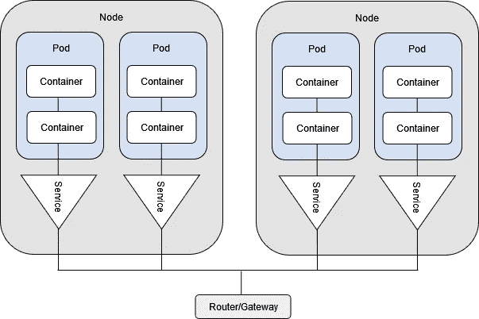

# 解决四个 Kubernetes 网络挑战

> 原文：<https://betterprogramming.pub/solving-four-kubernetes-networking-challenges-a5fb034db8bd>

## 应对云原生系统的动态性和复杂性

Kubernetes 的主要职责之一是在应用程序之间共享节点。联网是一项基本要求，因为这些应用程序需要相互通信以及与外界通信。

来自 Kubernetes 集群外部的请求通常通过路由器或负责将它们代理给适当服务的 [API 网关](https://konghq.com/learning-center/api-gateway/?utm_source=guest&utm_medium=devspotlight&utm_campaign=community)。Kubernetes 网络的职责是提供底层通信层，使请求能够到达它们的目的地。

分布式应用程序分布在许多节点上。当每个应用程序有多个副本时，Kubernetes 处理[服务发现](https://thenewstack.io/how-does-service-discovery-work-in-kubernetes/#:~:text=The%20services%20model%20in%20Kubernetes,%2C%20aspect%20of%20microservices%3A%20discovery.&text=Kubernetes%20refers%20to%20these%20key,with%20a%20set%20of%20pods.)和[服务](https://kubernetes.io/docs/concepts/services-networking/service/)与 Pods 之间的通信。在 Pod 内部，容器可以轻松透明地进行通信。在一个集群中，pod 可以连接到其他 pod，这是通过虚拟网络接口、网桥和路由规则的组合，通过[覆盖网络](https://en.wikipedia.org/wiki/Overlay_network)实现的。

尽管处理是透明的，但是，Kubernetes 网络比看起来更复杂。跨多个云部署、维护多个环境以及确保可靠和可扩展的网络策略是巨大的挑战。Kubernetes 本身并没有解决所有这些复杂问题。在本文中，我们将探讨如何应对这些挑战。

# Kubernetes 网络的基础知识

在 Kubernetes 中，[pod](https://kubernetes.io/docs/concepts/workloads/pods/)负责处理容器到容器的通信。Pods 通过自己的网络资源(接口和路由表)利用网络名称空间。在 Pod 中，容器共享这些资源，允许它们通过本地主机进行通信。

Pod-to-Pod 通信必须满足以下 Kubernetes 要求:

*   pod 需要在没有[网络地址转换(NAT)](https://en.wikipedia.org/wiki/Network_address_translation) 的情况下进行通信。
*   节点需要能够在没有 NAT 的情况下与 pod 通信。
*   Pod 可以看到的分配给自己的 IP 地址必须与其他 Pod 看到的 IP 地址相匹配。

[容器网络接口(CNI)](https://github.com/containernetworking/cni) 包括编写网络插件来配置网络接口的规范。这允许你创建[覆盖网络](https://en.wikipedia.org/wiki/Overlay_network)来满足吊舱对吊舱的通信需求。

一个[服务](https://kubernetes.io/docs/concepts/services-networking/service/)是一个 Kubernetes 抽象，它允许 Pods 公开和接收请求。它通过 Pod 标签和基本的负载平衡功能提供服务发现机制。在 Pods 中运行的应用程序可以很容易地使用服务连接到集群中运行的其他应用程序。来自集群外部的请求可以通过[入口控制器](https://kubernetes.io/docs/concepts/services-networking/ingress-controllers/)进行路由。这些控制器将使用[入口](https://kubernetes.io/docs/concepts/services-networking/ingress/)资源来配置路由规则，通常利用[服务](https://kubernetes.io/docs/concepts/services-networking/service/)来促进路由到正确的应用。

# 重大挑战

虽然这些网络功能为 Kubernetes 托管工作负载提供了基础构建模块，但[云原生](https://konghq.com/blog/cloud-native-infrastructure/?utm_source=guest&utm_medium=devspotlight&utm_campaign=community)系统的动态和复杂特性带来了一些挑战。

## 服务对服务的通信可靠性

在分布式系统中，业务功能被划分为多个自治的服务，这些服务在一个节点、单元和容器集群上运行。微服务架构引入了通过网络进行通信的服务需求。

云的易变性和弹性要求持续监控 Kubernetes 集群，并在出现故障时进行重新路由。有了短暂的 pod 和持续的资源重新路由，可靠的服务对服务的通信就不是必然的了。

高效的负载平衡算法需要将流量分配给可用的副本，并隔离过载的副本。类似地，服务失败意味着客户端请求需要重试并正常超时。复杂的场景可能需要[断路器](https://en.wikipedia.org/wiki/Circuit_breaker)和减载技术来应对需求激增和故障。

## 精心设计的多云部署

复杂的大规模系统通常被划分为多个环境，不同的部分被部署到不同的云平台。这些异构环境需要相互通信。

即使在同一个云租户或内部，相同的工作负载也可以在不同的环境中运行(开发、试运行和生产)。虽然是分离的，但这些环境有时需要相互通信。例如，试运行环境可能需要模拟生产工作负载，并在应用程序投入使用之前对其进行严格测试。随着测试的成功，代码和数据可能都需要从中迁移。

在这种情况下，无缝迁移可能具有挑战性。此外，可能会有团队同时支持 VM 和 Kubernetes 托管的服务的情况。或者，也许一个团队设计了支持多云(或者至少是多区域)部署的系统以获得可靠性，指定了复杂的网络配置和详细的入口和出口规则。

## 服务发现

当在云原生环境中运行 Kubernetes 时，可以通过在多个节点上生成多个副本来轻松扩展服务。这些应用程序副本是短暂的——在 Kubernetes 认为必要时被实例化和销毁。对于应用程序中的[微服务](https://konghq.com/learning-center/microservices/)来说，跟踪所有这些 IP 地址和端口的变化非常重要。尽管如此，这些微服务需要一种有效的方法来找到服务副本。

## 网络规则可扩展性

安全最佳实践和行业法规，如[支付卡行业数据安全标准(PCI DSS)](https://en.wikipedia.org/wiki/Payment_Card_Industry_Data_Security_Standard) 执行严格的网络规则。这些规则规定了服务之间严格的通信约束。

Kubernetes 有[网络政策](https://kubernetes.io/docs/concepts/services-networking/network-policies/)的概念。这些允许您在 IP 地址或端口级别控制流量。您可以指定使用标签和选择器使 Pod 与其他服务进行通信的规则。

随着您的微服务系统数量的增长，达到数百或数千个服务，网络策略管理成为一个复杂、乏味且容易出错的过程。

# Kong Ingress 控制器如何提供帮助

孔的 [Kubernetes Ingress 控制器(KIC)](https://konghq.com/solutions/kubernetes-ingress/?utm_source=guest&utm_medium=devspotlight&utm_campaign=community) 是 Kubernetes 的 [Ingress](https://kubernetes.io/docs/concepts/services-networking/ingress/) 实现。这个入口控制器由 [Kong Gateway](https://konghq.com/kong/?utm_source=guest&utm_medium=devspotlight&utm_campaign=community) 提供支持，充当云原生的、平台无关的、可扩展的 API 网关。它专为混合和多云环境而构建，并针对微服务和分布式架构进行了优化。

KIC 允许创建路由规则、健康检查和负载平衡的配置，它支持各种提供高级功能的[插件](https://docs.konghq.com/hub/)。这种广泛的功能有助于解决我们已经讨论过的挑战。

## 可靠的服务对服务通信

Kubernetes [服务](https://kubernetes.io/docs/concepts/services-networking/service/)提供简单的负载平衡能力(循环)。KIC 的核心特性之一是在同一应用程序的副本之间实现负载平衡。它可以使用加权连接或最小连接等算法，甚至是复杂的自定义实现。这些算法利用 KIC 的服务注册中心来提供高效的路由。

使用 KIC，您可以轻松地配置服务关闭时的重试、合理的超时、将请求重新路由到健康的服务实例或错误处理。您还可以实现故障模式，如断路和减载，以平滑和抑制流量。

## 更简单的多云环境部署

多环境和异构基础架构部署需要复杂的网络策略和路由配置。建在的孔闸解决了许多这样的挑战。

Kong Gateway 允许[服务注册](https://docs.konghq.com/gateway/2.6.x/get-started/quickstart/configuring-a-service/#main)独立于服务部署的位置。有了注册的服务，你将能够[添加路线](https://docs.konghq.com/gateway/2.6.x/get-started/quickstart/configuring-a-service/#2-add-a-route-for-the-service)，KIC 将准备好代理对你的服务的请求。此外，虽然复杂的系统有时可以使用不同的协议进行通信(REST 和 gRPC)，但是您可以轻松地配置 KIC 来支持多种协议。

[插件系统](https://docs.konghq.com/hub/plugins/overview/)允许你为更复杂的场景扩展 KIC 的功能。 [Kong Plugin Hub](https://docs.konghq.com/hub/) 包含了一个强大的有用且久经考验的插件集合，[也能让你开发](https://docs.konghq.com/gateway/2.6.x/plugin-development/)并使用任何最适合你需求的插件。

## 增强的服务发现

如前所述，KIC 通过其服务注册来跟踪可用的实例。随着服务与 KIC 集成，他们可以自助注册并报告其可用性。这种注册也可以通过第三方注册服务来完成。通过利用服务注册中心，KIC 可以随时将客户端请求代理到适当的后端。

## 可扩展的网络规则

尽管通过[网络策略](https://kubernetes.io/docs/concepts/services-networking/network-policies/)执行网络规则可能会很复杂，但 KIC 可以[轻松地将](https://docs.konghq.com/kubernetes-ingress-controller/2.0.x/guides/getting-started-istio/#main)与[服务网格](https://konghq.com/learning-center/service-mesh/what-is-a-service-mesh/?utm_source=guest&utm_medium=devspotlight&utm_campaign=community)集成，就像 CNCF 的[库马](https://kuma.io/)或 [Istio](https://istio.io/) 与 [Kong Istio 网关](https://konghq.com/blog/istio-gateway/?utm_source=guest&utm_medium=devspotlight&utm_campaign=community)集成一样，扩展[网络策略](https://kubernetes.io/docs/concepts/services-networking/network-policies/)的功能并保证额外的安全性。

借助[认证和授权](https://kuma.io/docs/1.4.1/security/certificates/)策略，您将能够以安全、一致和自动化的方式增强网络安全性。此外，您可以结合使用[网络策略和服务网格策略](https://kuma.io/docs/1.4.1/policies/general-notes-about-kuma-policies/)来提供更好的安全态势。

服务网格集成的另一个好处是，它允许金丝雀部署和蓝/绿部署这样的部署模式。它还通过可靠的度量和跟踪增强了可观察性。

# 结论

Kubernetes 可以处理常见的网络任务，使开发者和运营商更容易获得服务。然而，对于大型复杂的云原生系统，网络问题很少是简单的。组织想要将[单片](https://konghq.com/learning-center/microservices/monolith-vs-microservices/?utm_source=guest&utm_medium=devspotlight&utm_campaign=community)分割成微服务，但是他们需要解决一些独特的问题，比如高效的负载平衡或者容错。同样，实现不同环境之间的无缝服务迁移和转换也不容易。Kubernetes 的网络功能需要扩展以支持更广泛的场景。

KIC 可以有效地应对这些挑战。它提供了广泛的功能，包括高级路由和负载平衡规则、复杂的入口和出口规则以及容错措施。您可以使用 KIC 的服务注册中心大大改进服务发现，它可以跟踪每个服务的所有可用实例。与 KIC 和服务网格的轻松集成有助于建立强大的网络安全策略，并利用不同的部署模式。