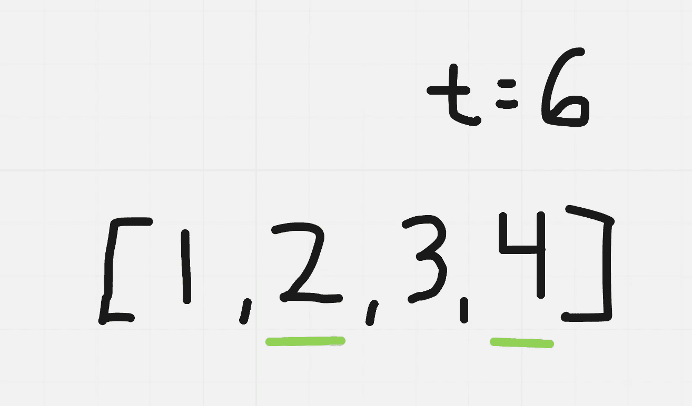
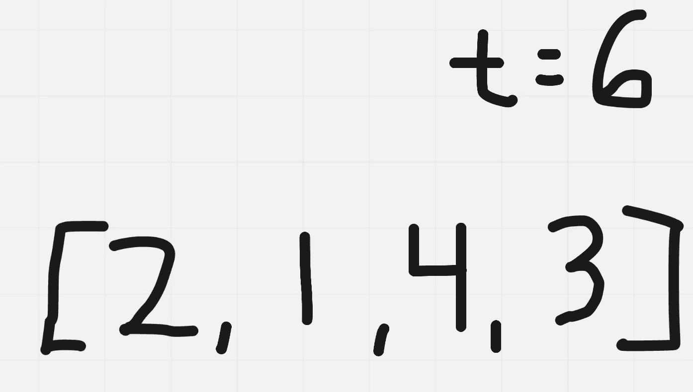
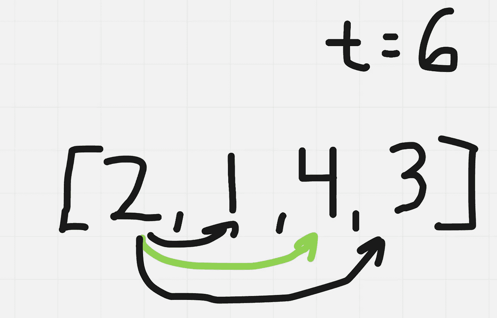
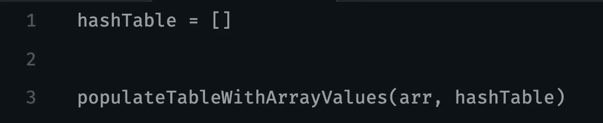
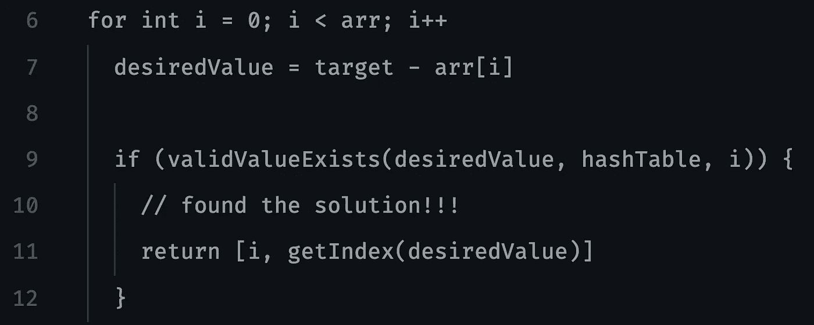

# 解决谷歌 2020 年最常问的白板问题

> 原文：<https://betterprogramming.pub/solving-googles-most-frequently-asked-whiteboarding-question-1c2eacaf1523>

## 深入了解最常被问到的谷歌编码问题

如果你的新年目标之一是在一家大型科技公司获得一份工作，而你没有回答算法问题的经验，那么你很幸运。如果你不知道技术面试是如何进行的，你通常会在一个小时内被问及 1-2 个以算法为中心的问题，特别是谷歌的 45 分钟。

在申请和面试这些科技公司之前，我强烈建议你看看我正在建设的社区——[cscareers . dev](https://cscareers.dev/)。我们旨在为我们的 Discord 社区成员提供免费的公司特定面试问题，以及由顶级技术公司的工程师进行的模拟面试和简历审查，以帮助您获得并赢得面试。

今天，我们将利用裁判法来看看 2020 年最常被问到的谷歌白板问题，我在[之前的帖子](https://medium.com/better-programming/how-to-stop-being-afraid-of-technical-interviews-b60b064ff003)中解释过。让我们开始吧。


# 问题陈述

> 给定一个整数数组，返回两个数的索引**和**,这样它们加起来就是一个特定的目标。
> 
> 你可以假设每个输入都有 ***恰好*** 一个解，并且你不能两次使用*相同的*元素。

**示例:**

```
Given nums = [2, 7, 11, 15], target = 9,Because nums[**0**] + nums[**1**] = 2 + 7 = 9,
return [**0**, **1**].
```

演职员表:[https://leetcode.com/problems/two-sum/](https://leetcode.com/problems/two-sum/)

# 理解问题

问题陈述似乎非常清楚。通俗地说，我们希望在数组中找到两个元素，这两个元素加起来就是给定的`target`；但是，我们不能重用同一个元素(两个索引需要彼此不同)。在裁判这一步，我会创造自己的例子，并思考如何接近答案:



以我们所举的例子来看，这个例子似乎还可以；然而，我们正在做一些大胆的假设。我们应该注意到两个数组都是有序的(升序),但是假设数组总是有序的。我们不能假设这永远是对的。这是一个我会立即向我的面试官澄清的问题，因为它可以极大地改变我们算法的复杂性。在这个问题中，面试官让我们知道我们不能保证数组是有序的。让我们修改现有的例子。



我在给定示例中注意到的另一个特性是数组中的每个元素都是唯一的。在给定的数组中，这是否总是成立？换句话说，数组`[1,1,3,3]`是有效的输入数组吗？我们知道我们不能在返回类型中重用相同的索引，但是这个问题没有指定元素是否可以重复。在这种情况下，我们的面试官会让我们知道所有的元素都是独一无二的。酷毙了。让我们去绘图板，想出一些方法。

对我来说，最直观的方法是获取第 I 个索引，并检查数组中的所有其他索引，以检查是否存在这样的元素，`arr[i] + arr[other_index]= target`

使用这种方法，对于索引 0，它看起来像下面这样:



这个解决方案确实有效。对于每个指数，我们只是简单地检查是否存在其他补充，以达到我们的目标。问题是，我们必须假设算法中的数组是任意大的。在每个索引处，如果我们检查整个数组，我们在每个索引处做 O(N)工作。

这将转化为一个运行在 O(N*N)或 O(N)上的算法。让我们想想如何做得更好。

# 匹配问题

在我们以前的方法中，我们没有使用数据结构，我们的算法运行得比我们希望的要慢——这是为什么呢？我们正在重新访问在以前的迭代中已经看到的索引，这意味着我们在做不必要的计算。

由于数组是未排序的，我们必须至少访问一次数组的每个索引*,以便知道数组中实际包含的内容。我们需要使用不同的数据结构来表示数组中的内容。理想情况下，我们希望有一个数据结构能够快速告诉我们一个元素是否存在。为了检查一个数组是否包含一个特定的元素，我们必须遍历整个数组(因为它已经被排序了)，这对于每次迭代来说都会降低我们的速度。为了让算法运行得更快，我立刻想到了使用哈希表。*

*哈希表是一种键值对数据结构。在一般情况下，我们能够在恒定时间内检查一个密钥是否存在。在问题语句中，我们希望返回组成我们的`target`的索引，因此我们可以将值映射为我们所说的键所在的索引。*

# *规划解决方案*

*这是我们想要用简单的英语写出，我们想要我们的算法做什么的时候。这将包括我们想要利用的必要的助手功能——确保您利用这种模块化的编码方法来节省您手头实际任务的时间。*

*我们要做的第一件事是用数组中的值填充哈希表，它们各自的值是我们看到它们的索引。*

**

*所以在我们上面创建的例子中，我们期望`hashTable`包含:*

```
*{ 
  ‘1’: 1,
  ‘2’: 0,
  ‘3’: 3,
  ‘4’: 2
}*
```

*初始化之后，我们还想做什么？我们实际需要做的只是再次遍历数组，检查哈希表中是否存在`target`的补码。换句话说，`target — arr[i]`存在于我们的哈希表中吗？如果是的话，很好，我们找到了解决方案；否则，我们需要继续遍历数组，继续进行检查。*

**

*通过这一步，您应该尽可能地关注您的方法，并使您编写的内容尽可能易于阅读，以便您在开始编写可编译代码时可以参考它。我们可能不需要`validValueExists()`或`getIndex()`方法，但是为了可读性，我们只是希望它在这一点上尽可能的可读。在我自己的采访中，我会尽可能地模块化我的代码。因为我们在面试中有时间限制，所以我们总是能注意到每种方法的效果，如果时间不够了(这种情况会发生)，面试官知道我们的意图。*

*让我们把它转换成可编译的代码。*

# *实施您的解决方案*

*考虑到前面的步骤，这应该是最微不足道的一步，因为我们已经有了我们想要的蓝图。*

# *查看您的解决方案*

*在访谈的这一点上，您希望使用您在上一步中创建的示例，并逐行跟踪您的代码。这将向你的面试官展示你拥有很强的追踪和逻辑能力。作为一个练习，我建议你在你的电脑上运行之前，先浏览一下我/你自己对这个问题的解决方案。一些公司，如谷歌和脸书，不会在电脑上运行你的代码，所以这种技能对开发来说是 100%至关重要的，而其他公司如优步和 Airbnb 也希望你的代码能够针对测试用例正确编译和运行。*

# *评估您的解决方案*

*虽然我们已经评估了初始解决方案的复杂性，认识到它是低效的，但在实现您的最佳解决方案后，重申您的解决方案的空间和运行时复杂性并无大碍。让我们定义 N 为输入数组的长度。因为我们在所有情况下都用 N 个元素填充哈希表，所以我们可以说我们的空间复杂度是 O(N)。我们也至少遍历数组一次，所以对于运行时，我们可以表示为 O(N ),一般情况下。检查一个元素是否存在于一个哈希表中平均需要 O(1)。实际上，我们的运行时将类似于 O(N+(N*1))，但这简化为 O(N)。*

# *外卖食品*

*你解决问题的方式极其重要。永远，永远，永远不要通过立即编码你认为是解决方案的东西来开始一个问题。*

*面试问题看起来似乎很简单。还应该注意的是，我们需要知道我们可以访问哪些数据结构，以及我们如何利用它们来解决手头的问题。例如，如果我们不知道哈希表是什么，我们将很难找到比简单的 O(n)方法更好的解决方案。*