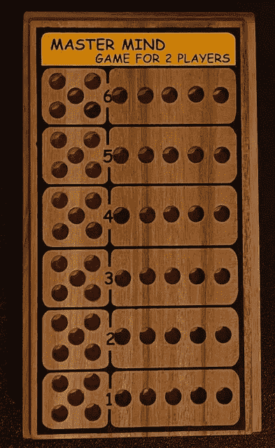
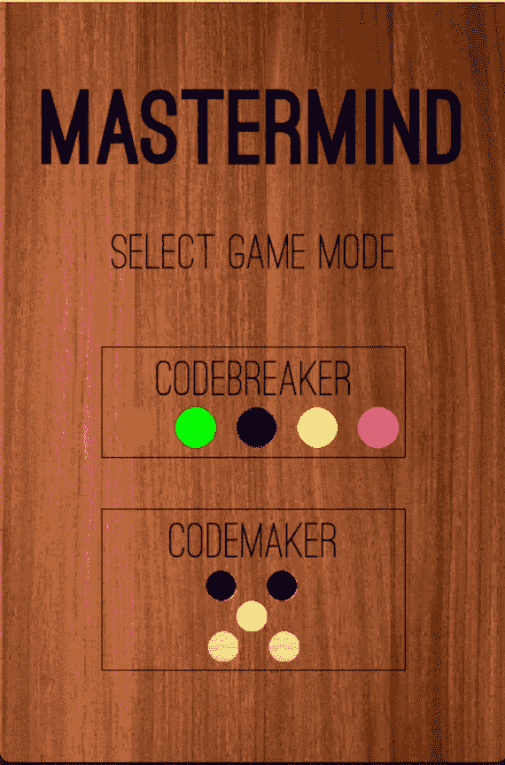
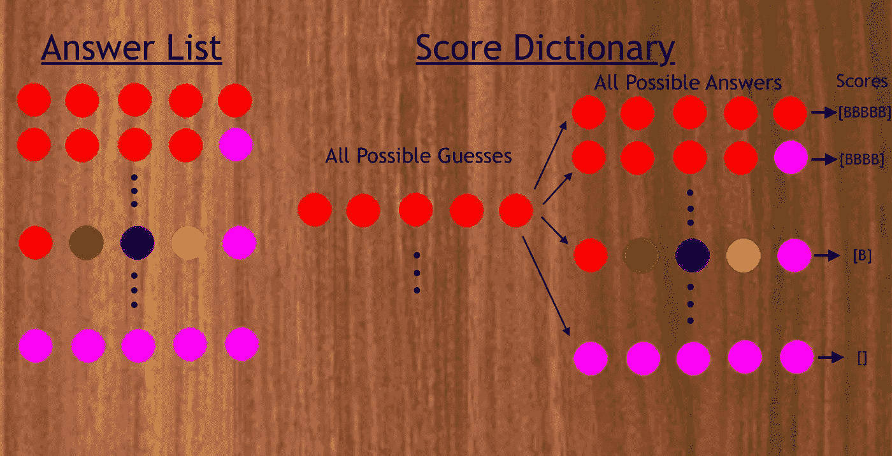
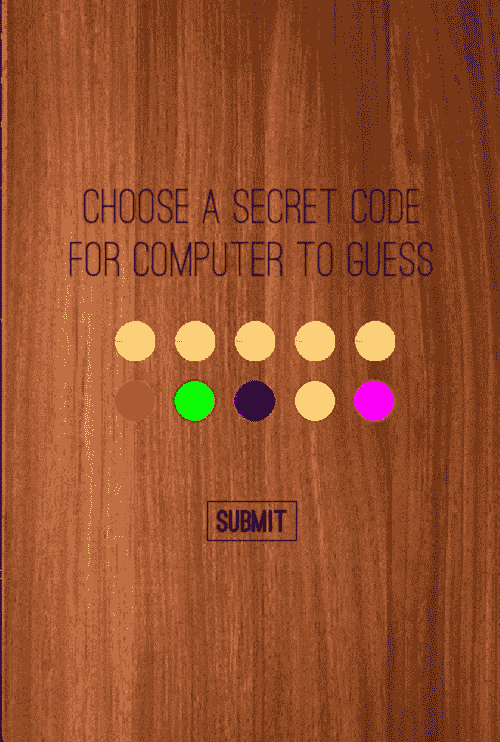
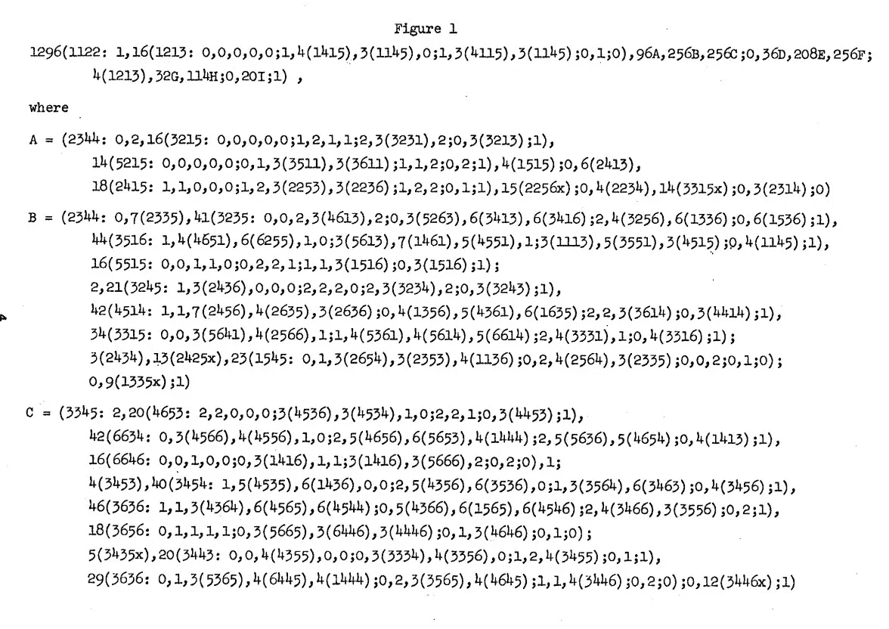

# 用 Python 解决智多星

> 原文：<https://betterprogramming.pub/solving-mastermind-641411708d01>

## 破解一个极其困难的棋盘游戏



我是天才的策划委员会(作者图片)

去年圣诞节，我收到了一个神秘的游戏作为礼物。它没有说明书，只有一块木板和几十个彩色木钉。

我查了一下与板子相关的唯一的识别词:大师思维。通过搜索，我发现了一个具有挑战性的双人密码破解游戏。

在《智多星》中，一个玩家(密码破解者)试图通过反复猜测和接收提示来揭开对方玩家(密码制造者)制定的秘密模式。

我还发现我的《摄魂师》版本比原版要难多了！原件有 4 个槽和 6 种颜色，给出 6666 = 1296 个可能的代码。这也给了密码破译者 10 次猜测答案的机会。我的版本有 5 个插槽和 5 种颜色，给出 55555 = 3125 个可能的代码。它也只给了破译者六次机会。我收到的版本的玩家需要处理两倍多的潜在代码，少猜四次！

在输了很多次之后，我决定用我的编程知识来摧毁这个游戏。我开始做一些研究，发现计算机科学的传奇人物 Donald Knuth 实际上已经写了一个算法来解决摄魂师问题。

也许这是出于我对这个游戏同样的挫败感。我决定实现 Knuth 的论文:“[计算机作为主脑](https://www.cs.uni.edu/~wallingf/teaching/cs3530/resources/knuth-mastermind.pdf)”。如果我不能打败游戏，我至少会得到为我写一个征服游戏的程序的满足感。

# 规则



使用 Python 和 Pygame 编写的策划的开始屏幕(图片由作者提供)

我觉得这个游戏的规则有点混乱，直到你玩过几次，但我会在这里尽力解释。如果你想先玩一些游戏，你可以在你的浏览器[这里](https://www.archimedes-lab.org/mastermind.html)玩原版。我的实现可以在 [Github](https://github.com/aydinschwa/Mastermind-Solver) 上找到。如果你已经知道如何玩摄魂师，可以跳过这一节。

在游戏开始时，编码者构建了一个由 5 个不同颜色的钉子组成的秘密图案。颜色的使用次数没有限制。例如，编码员可以选择红色、红色、红色、红色(所有颜色，弱编码)或红色、绿色、蓝色、黄色、粉色(所有颜色，更好的编码)。编码者隐藏了这个图案，而破解者有 6 次尝试来正确地猜测这个隐藏的图案。

为了进行猜测，密码破译者构建他们自己的模式，并将其放在板上的解码槽中。然后，代码制作者使用以下逻辑在提示槽上放置黑钉或白钉:

*   黑色:放置在正确颜色和正确位置的每个猜测钉上。如果猜测是红色、红色、红色、红色、蓝色，而隐藏的答案是红色、绿色、绿色、绿色、蓝色，编码者将为正确放置的红色和蓝色钉放置两个黑色钉。
*   白色:放置在正确颜色的猜测钉上，但位置不正确。如果猜测是红色、红色、红色、红色、蓝色，而隐藏的答案是蓝色、绿色、绿色、绿色、红色，编码者将为错误放置的红色和蓝色钉放置两个白色钉。

密码破译员利用从先前猜测中获得的信息来锁定唯一可能的答案。如果他们能在 6 圈或更少的时间内完成，他们就赢了。

到目前为止，这听起来很像流行的游戏 Wordle。真正加大难度的是提示是随机的。在第一个洞得到一个黑色的木栓并不一定意味着第一个洞的木栓是正确的，它只是意味着密码破译员放置的五个木栓中的一个在正确的位置。

Wordle 的等价类比是，当你猜一个单词时，游戏只是给你一个空白的绿色方块，让你去找出哪个字母实际上在正确的位置。

如果我在智多星中赢了，我通常会认为自己是幸运的，但电脑的基线是 5 次猜测或更少。让我们来看看它是如何持续获胜的！

# 该算法

为了解决这个问题，我们将维护两个独立的数据结构。第一个是这个游戏所有可能答案的列表。这个列表正好有 3125 个答案，因为我们有五种可能的颜色和五个钉子来放置这些颜色。我们称之为答案列表。第二个是一个巨大的字典，列举了所有可能的猜测答案组合的分数。我们称之为乐谱词典。



答案列表和分数字典数据结构的可视化(图片由作者提供)

Knuth 的算法就是尽可能减少每次猜测的潜在答案数量。在第一次猜测时，算法被硬编码为总是选择(红色、红色、绿色、绿色、蓝色)。如果只是随机选择，我们不能保证算法总是在五次或更少的猜测中终止。选择所有的红色木钉并不能提供如前面所说的猜测那么多的信息。初始猜测后，算法会根据编码者给出的提示反馈，选择不同的后续猜测。

例如，让我们想象在第一次猜测之后，算法接收到一个提示(黑，白，黑)。这告诉我们，两个钉子在正确的位置，一个在错误的位置。此外，答案中*是*的两个桩在猜测中丢失了。使用这些信息，我们可以获取答案列表，并删除任何符合以下条件的答案:

```
*Score((Red, Red, Green, Green, Blue), answer) != (Black, White, Black)*
```

该伪代码对应于下面 Python 代码的第 11–12 行。

在修剪了所有不可能答案的答案列表后，我们可以继续看分数词典。对于分数字典中的每个猜测，如果答案不在新的答案列表中，我们将删除该答案及其相关分数。我们基本上缩小了答案列表和得分字典，只保留给定我们从上次猜测中获得的信息的可能值。

既然我们已经缩小了答案列表和得分字典，我们需要找出下一个要猜的组合。Knuth 的算法使用最坏情况分析来决定最佳组合。对于分数字典中的每个猜测，我们查看所有可能的答案以及与该猜测-答案组合相关联的相应分数。

然后我们根据分数将这些答案分组，并计算每组答案的数量。最大组代表猜测的最坏情况:如果我们选择一个猜测，而正确答案在最大组中，那么我们将收到最少的信息量。

我们对乐谱字典中的每一个可能的猜测进行分析，建立一个最坏情况数字的列表。在遍历了每个猜测之后，我们取这个列表中的最小值。这给了我们最好的最坏情况。换句话说，正如 Donald Knuth 所写的，我们正在“*最小化剩余可能性的最大数量*”。奇怪的是，完成这个任务的猜测可能是一个无效的答案。虽然该算法优先考虑可以实际解决游戏的猜测，但它可能偶尔会猜测已知不可能的组合，以获得更多信息。



运行中的猜测算法(GIF 作者)

使用这种算法，可以保证计算机在**的六步**或更少步内猜出正确答案，这意味着它永远不会输。不像 Knuth 的五次猜测那么好，但是我们还有 1829 个潜在的答案要处理。平均而言，计算机在 4.44 步中猜出正确答案。

# 最佳化

虽然我上面描述的算法是我的实现如何解决摄魂师，它可以相当慢。分数字典尤其需要花费相当长的时间来创建，因为对于 3，125 个可能的猜测中的每一个，它针对 3，125 个可能的答案中的每一个来计算分数。这将生成一个包含 31253125 或 9765625 个条目的字典。每当我想玩一个游戏时，这大约需要一分钟来产生。那是非常不可接受的。为了解决这个问题，我决定只创建一次乐谱字典，并将其存储为一个二进制文件，每当我想要解决一个新的组合时，就重新加载它。这使得求解时间缩短到了大约三秒钟。

但是，我也意识到算法是完全确定的。对于任何给定的密码，该算法将总是播放相同的猜测序列。所以我决定将它与所有 3125 个可能的答案进行比对，并将猜测序列保存到字典中。现在对于任何答案，计算机只需查找它需要做出的猜测的顺序。

这种方法有点不太灵活，不允许我改变计算机对手的“难度”级别。用最初的方法，如果我想制造一个更差的计算机对手，我可以给它一个启发，这个启发并不总是最小化剩余可能性的最大数量。这种方法是不可能的，因为该算法只是一个静态的查找表，其中有一组最佳的移动。这种权衡对我来说是可以接受的，因为解决时间已经变成了瞬间的事情。

# 最后的想法

我想提到唐纳德·克纳特的论文有时有点难以理解。为了理解我的意思，请看下面:



唐纳德·克努特的《作为主脑的计算机》第 4 页。乍一看，这很吓人。

每当我对 Knuth 的论文感到困惑时，我就会求助于 Adam Forsyth 的精彩演讲，用我容易理解的术语解释如何实现算法。如果我没有遇到这个资源，这个项目会花费我更长的时间。如果我说的算法有什么不清楚的地方，我肯定会鼓励你去看看 Adam 的演示。

此外，如果你想自己玩这个算法或者只是检查一下底层逻辑，我所有的代码都可以在 [Github](https://github.com/aydinschwa/Mastermind-Solver) 上公开获得。感谢阅读！