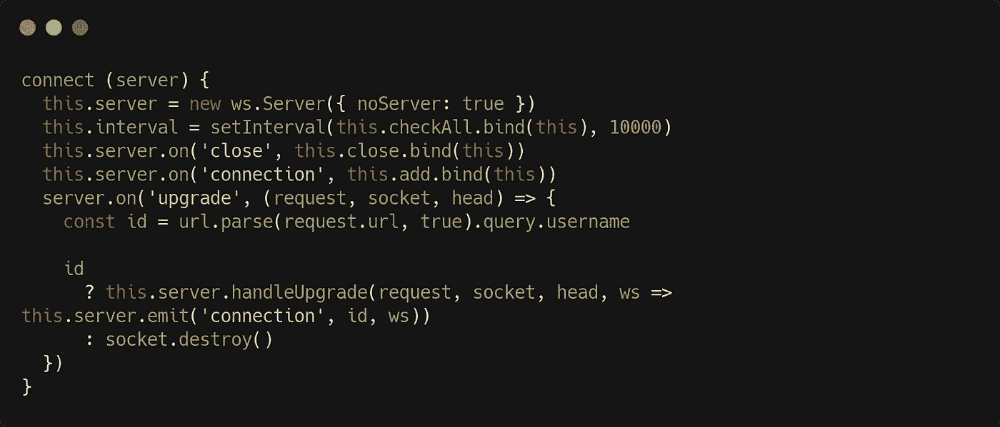
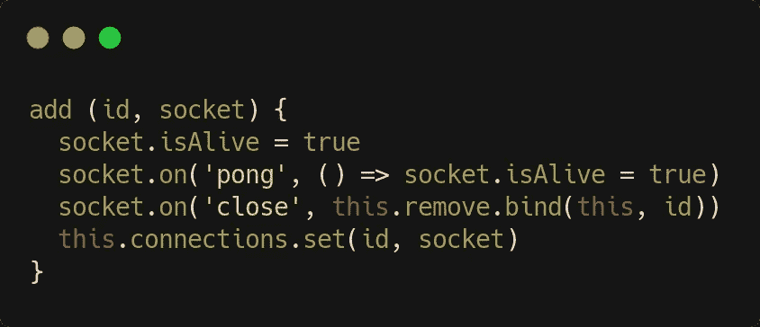
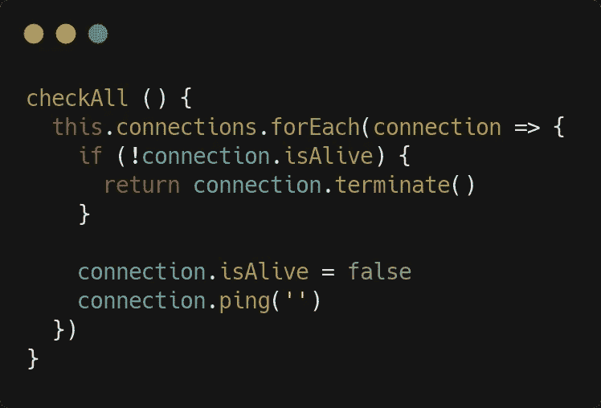
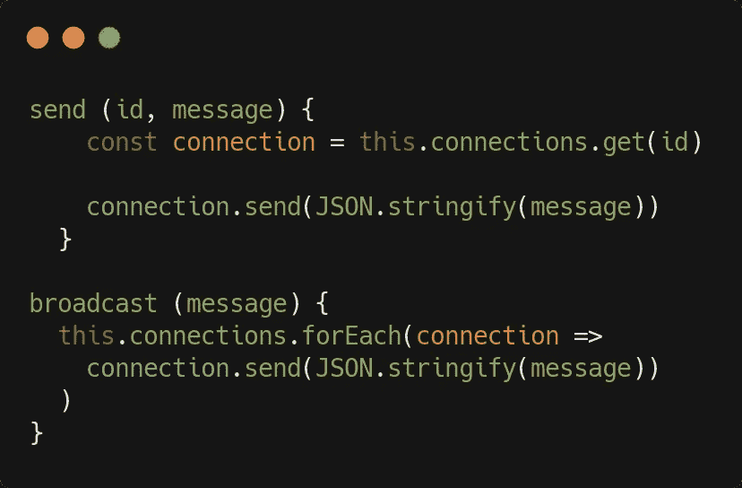
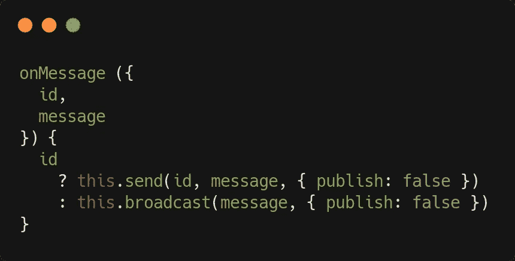
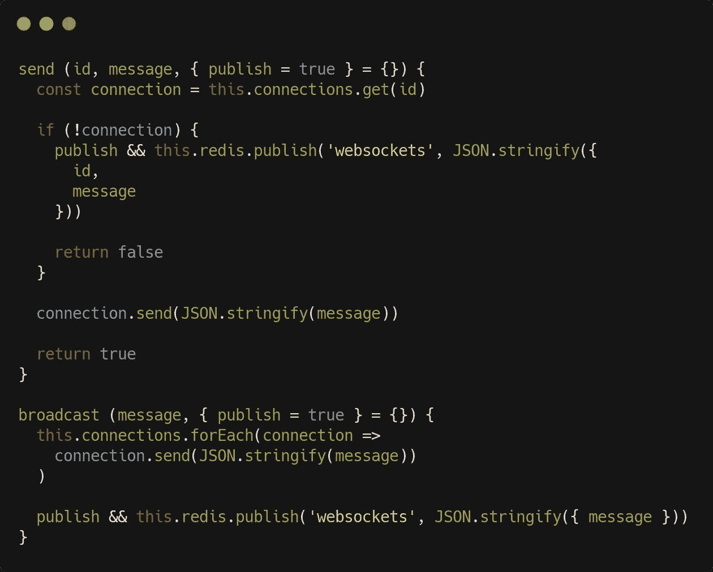
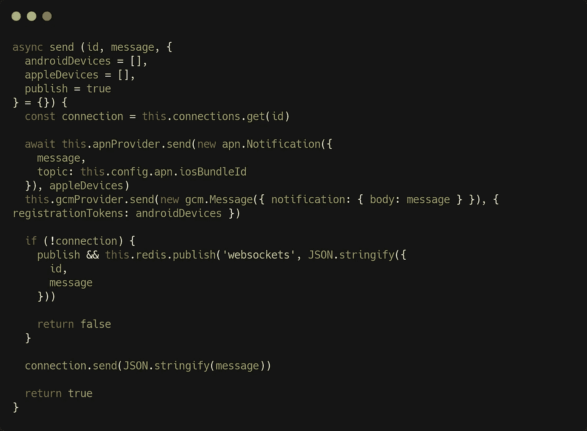

# 如何用 JavaScript 通过 WebSockets 发送服务器端通知

> 原文：<https://betterprogramming.pub/solving-real-life-problems-in-javascript-sending-server-side-notifications-through-websockets-a3bdb2cc065>

## 以及如何将解决方案扩展到 Android 和 iOS


照片由[普拉蒂克·卡蒂亚尔](https://unsplash.com/@prateekkatyal?utm_source=medium&utm_medium=referral)在 [Unsplash](https://unsplash.com?utm_source=medium&utm_medium=referral) 拍摄

因此，你有一个与后端通信的前端应用程序，你需要向用户发送通知:我们将在 [Node.js](https://nodejs.org/en/) 下看到你如何在没有开销的情况下做到这一点。

我们将介绍如何通过 WebSockets 发送常规通知，将集群考虑在内，我们还将展示 iOS 和 Android 上的移动通知作为额外的奖励。

# 背景

我们将使用 [ws](https://github.com/websockets/ws) 库，而不是更流行的 [Socket.io](https://socket.io/) 。这主要是因为我们认为不需要 Socket.io，ws 就足够了，但也因为 ws 将允许我们更深入地了解 WebSockets 机制，从长远来看，这可能更有指导意义和实用价值。

我们的用例将涉及向特定用户发送通知。这意味着我们的应用程序的用户将被识别，比如说通过他们的用户名。大部分复杂性由此而来，因为向所有连接的客户端广播通知要容易得多。哦，别担心，我们也会广播的！

我们还将解决 WebSocket 在服务器端或客户端被关闭的问题，以及如何正确处理这些情况。

出于演示的目的，让我们假设我们的应用程序是一个游戏。JavaScript 前端将在后端使用 API，而后端将使用通知服务。让我们建立后者！

哦，我们假设你知道 WebSockets 背后的基本理论，但是如果你不知道，你会在 Medium 上找到许多关于这个的文章。

# 设置通知程序服务

下面是我们的服务器端`connect`方法:



这将使用 ws 库创建服务器，`noServer` 选项允许 WebSocket 服务器与 HTTP(s)服务器分离(后者作为参数传递给我们的方法，所以不要混淆`server` *、*和`this.server`，前者是 HTTP 服务器，后者是我们的 WebSocket 服务器)。

我们将使用来自 HTTP 请求的升级头，通过发出一个连接事件路由到我们的 WebSockets 服务器，该事件将在一个`add`方法中处理。ws 库为我们提供了一个`handleUpgrade` 助手来完成这项工作。您可以浏览 ws 文档以获得更多信息。

**我们希望 WebSocket 绑定到一个特定的用户**。有许多方法可以做到这一点；这里我们选择使用用户名作为唯一标识符。该用户名只是客户端发出的 WebSocket 请求的一个查询参数(见下文)。注意，我们在这里使用 Node.js `url`模块来解析请求。如果没有提供用户名，那么套接字就在这里被销毁。

`connect`方法还做了两件事:如果 WebSocket 服务器关闭，它会设置一个监听器，并设置一个时间间隔(这里是 10 秒)来检查(通过一个`checkAll` 方法)连接是否仍然存在(稍后将详细介绍)。我们的`close`方法会简单的清除这个区间。

我们不会在这里展示如何启动通知程序，但基本上，一旦应用程序启动时，您的应用程序 HTTP 服务器启动并运行，只需调用通知程序服务的`connect`方法，并将 HTTP 服务器实例作为参数，您就可以开始了。

# 通知和广播

假设我们正在为我们的通知服务使用一个类。在我们的构造函数中，我们将如下设置连接池:

```
this.connections = new Map()
```

JavaScript `Map`对象是在内存中存储键/值对的好方法。当然，如果需要的话，我们很快就会看到如何使用持久层(例如，如果您有一个集群化的 Node.js 应用程序，就会使用持久层)。

那么我们的`add`方法就是:



我们将连接设置为“活动的”，并使用 ws `pong` 事件，在每次成功的 ping 之后发出，以确认这一点(稍后将再次详细介绍)。

我们还监听 web socket*`close`*事件，以防连接被关闭。我们的`remove`方法将从连接池中删除该连接，如下所示:**

```
***this*.connections.delete(id)**
```

**最后，我们设置连接，键是`id`(这里是用户名)，值是 WebSocket。**

# **保持联系**

**如上所述，每隔十秒钟，我们将检查与 WebSocket 服务器的连接是否仍然存在。下面是我们的`checkAll`方法:**

****

**逻辑非常简单:在 ping 之前，每个连接的`isAlive`属性都被设置为`false`(有关 ping/pong 机制的更多信息，请参见 ws 文档)。如果 ping 成功，`isAlive`属性将被设置回`true`(参见我们的`add`方法和`pong`事件监听器)。如果连接一开始就不存在，那么它就会被终止。**

# **发送和广播**

**将使用两个非常简短的方法，它们旨在供您的应用程序在需要时从其他服务中调用:**

****

**请记住，我们在示例中选择的 WebSocket `id`是用户名，但是它可以是您真正想要的任何东西，只要它对于连接的用户是唯一的。**

**你可以在这个[要点](https://gist.github.com/iperiago/8fba72dc5f3b8e2a7b2ddc3dfd9816a5#file-notifier1-js)中找到完整的(基本的)通知器类代码。**

# ****客户端设置****

**为了与我们的通知服务器进行通信，一切都归结为通过设置客户端通知程序来使用 WebSocket 对象:**

```
**let notifier = new WebSocket(`${server}/?username=${username}`)**
```

**其中`server` 是您的服务器域(通常，如果您的 HTTP 服务器是 https://myapp.com，那么您的 WebSocket 服务器将是 wss://myapp.com)，而`username` 当然是当前认证用户的用户名。**

**然后，您必须为客户端通知程序附加一个处理程序。**

```
**notifier.onmessage = message => {
  const notification = JSON.parse(message) // do stuff
}**
```

**您可以通过确保如果通告程序服务器以某种方式关闭，则客户端通告程序会继续尝试重新连接，直到服务器再次响应，从而对此进行优化。但我会让你来决定。**

# ****考虑到聚类****

**通常，您将利用 Node.js 处理多个内核的能力，并使用集群(例如，通过像 [pm2](https://pm2.keymetrics.io) 这样的工具)。在这种情况下，上述方法将不起作用，因为您的应用程序将有多个实例，每个实例都使用自己的通知程序和通知程序池。因此，如果一个实例处理给定用户的 WebSocket 连接，而另一个实例处理通知服务`send` 方法调用，那么后者不会找到正确的连接 id，也不会发生任何事情。**

**为了解决这个问题，一个解决方案是使用 Redis 和[发布/订阅](https://redis.io/topics/pubsub)机制。这里我们不会展示如何设置 Redis 服务(但是如果您感兴趣，我们将在以后的文章中介绍)，但是总体方法依赖于 Redis 服务中的三个方法:**

```
**subscribe (channel, callback) { … }unsubscribe () { … }publish (channel, message) { … }**
```

**现在假设我们称这项服务为“redis”。如果你使用依赖注入(正如我推荐的)，你必须将这个服务注入到你的通知构造器中。然后它将作为`this.redis`可用。**

**现在，当添加连接时，只需在我们的`Map`对象中设置连接后，向我们的`add`方法添加以下代码行:**

```
**this.redis.subscribe(‘websockets’, this.onMessage.bind(this))**
```

**`websockets` 是我们这里的频道名称，但是可以是你想要的任何东西。新的`onMessage`方法将是这样的:**

****

**好了，我们已经为我们的`send` 和`broadcast`方法引入了一个新的参数。事实上，下面是更新后的`send`和`broadcast`方法:**

****

**现在应该都说得通了吧？`publish`参数是一种停止任何发布循环的方法。我们发布一次，然后当我们的 Redis 服务发送消息时，没有必要再发布一次；否则，我们将陷入无限循环。**

**最后，在我们的通知服务`close`方法中，我们应该添加下面一行代码，以便正确清理:**

```
**this.redis.unsubscribe()**
```

# **处理移动通知**

**相同的通知服务可以用于发送移动(iOS 或 Android)通知。为此，您需要依靠适当的助手服务(或自己制作)。这里我们将使用 [node-gcm](https://github.com/ToothlessGear/node-gcm) 发送 Android 通知，使用 [node-apn](https://github.com/parse-community/node-apn) 发送 iOS 通知。**

**您应该参考这两个库的文档，在您的通告程序构造函数中设置它们。不应该超过这个:**

```
***this*.apnProvider = new apn.Provider({ token: config.apn })*this*.gcmProvider = new gcm.Sender(config.gcm.key)**
```

**例如，这里的`config`对象被注入到通知器的构造函数中，并被适当地格式化。**

**一旦你做到了这一点，你的通知器`send`方法看起来就像这样，例如:**

****

**新增了选项参数`androidDevices`和`appleDevices`，包含用户设备上的必要信息，它们仅用于发送消息。(如何获取它们并在您的用户实体中持久化它们是一个全新的任务，我们不在这里讨论。)**

**当然，我们的通知程序可以在许多方面得到很大的改进(例如，添加日志记录)，此外，我们有意忽略了 Redis 服务实现的细节，以及在将实际通知发送给设备 id 已知并持久化的用户之前的整个移动通知过程。但是这应该足以让您构建并创建自己的通知程序。**

**你可以在这个[要点](https://gist.github.com/iperiago/8fba72dc5f3b8e2a7b2ddc3dfd9816a5#file-notifier2-js)中找到改进的通知服务。编码快乐！**