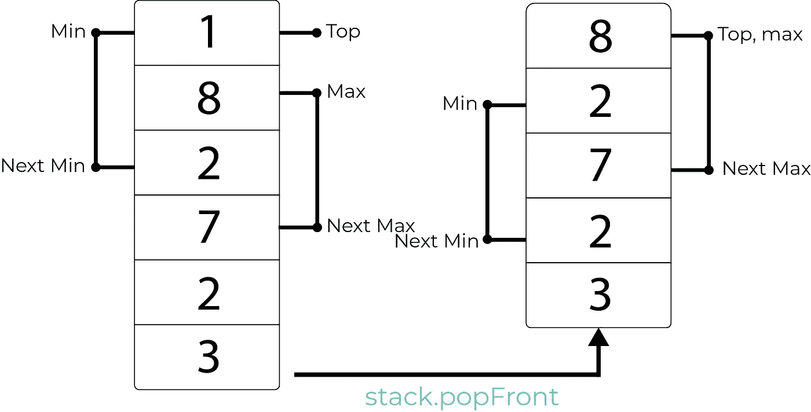

# O(1)时间内求解最小堆栈问题

> 原文：<https://betterprogramming.pub/solving-the-min-stack-problem-in-o-1-time-using-a-single-stack-in-ruby-626f65142927>

## 在 Ruby 中使用单个堆栈返回最小元素

贝基尔·登梅兹在 [Unsplash](https://unsplash.com/search/photos/balance?utm_source=unsplash&utm_medium=referral&utm_content=creditCopyText) 上拍摄的照片

各位编码员好！我已经决定写更多关于抽象数据结构的文章，并用每种结构解决至少一个编程面试问题，所以请继续关注更多精彩内容。

今天，我们将堆积一些金钱或现金，无论你喜欢如何称呼它。

在本教程中，我将在 O(1)时间内解决最小堆栈问题，并加入一个额外的功能来跟踪堆栈中的最大元素。

很快，我将解释什么是堆栈，为那些没有遇到过一个堆栈的人。如果你有，继续读下去，因为我发现你不可能知道任何事情的一切。我可能会说一些你不知道的事情。

在我简短的解释之后，我将向您展示问题陈述和简单的解决方案。

学习成果:

*   什么是堆栈
*   为什么堆栈很重要
*   如何实现堆栈
*   如何跟踪堆栈中的最小和最大元素，并在 O(1)时间内返回它们

# **什么是栈？**

堆栈是一种抽象的数据结构。这就像双端队列或队列一样。唯一的区别是你只能从数据结构的顶端添加元素。

为了形象化这意味着什么，我喜欢把它想象成一大堆书。你只能把一本书放在另一本书的上面。你不能把一本书放在一堆书的最下面，在中间或其他任何地方放一本可能都不是最聪明的主意。从一堆东西的底部拿出一个也是一样。你可能真的会被一些知识打脸——不要这样做！

换句话说，堆栈是一种后进先出的数据结构。放在书架上的最后一本书必须是最先拿下来的，否则你可能会毁掉你的书城堡。

# 栈为什么有用？

它们非常有用，因为在数据结构的前端插入或删除数据时，它们为您提供了恒定的时间操作。堆栈的一个常见用途是在编译器中，在编译器中，堆栈可用于确保代码文件中的括号和圆括号都是平衡的，即，有一个开始和结束对应项。你可以查看这篇关于平衡支架的教程，看看它是如何工作的。堆栈在评估数学表达式时也非常有用。(稍后我会试着为此写一篇问题解决教程。)

注意:就像 deques 一样，栈也是基于节点的。我们使用堆栈中的节点和指针来跟踪顺序。(如果你想了解更多，请查看这篇关于用 Ruby 实现 deques 的教程[。)](https://medium.com/@oluwadamilareo_/implementing-a-deque-in-ruby-cf6e9bfd9c3c)

继续前进。

# **问题陈述和解决方案**

创建一个包含标准 push 和 pop 方法的堆栈。它还应该包含另一个方法 min，该方法返回堆栈中的最小数字。额外学分:所有操作都需要 O(1)时间。

我们开始吧。

首先，我们像这样定义我们的节点类:

这个节点类是这个数据结构最基本的部分——要小心使用。

接下来，我们设置 stack 类。终于！

注意，与 deque 不同，我们只初始化第一个节点(栈顶)。

接下来，我们设置我们的`pushFront`方法。注意这个方法和我们在里面写的东西。我会稍微分解一下。

在第一行中，我们创建了一个新节点，它的值为 *number* ，它的下一个节点是我们之前的第一个节点。然后，我们将这个节点指定为新的第一个节点。

接下来，我们将第一个节点赋给`@min`变量，对`@max`变量也是如此(但前提是这些变量以前不存在)。

接下来，如果最小值和最大值之前存在，意味着堆栈不为空，我们将该数字与`min?`和`max?`的返回值进行比较。如果数字小于`@min`，我们将 min 变量更新为一个新的节点，其值是较小的数字，其下一个节点是带有前一个最小值的前一个节点。如果数量大于之前的最大值，我们对`@max`做同样的处理。

接下来，让我们看看我们的`min?`和`max?`方法在做什么:

我们看到`min?`方法简单地返回最小值变量的值，如果它存在的话。

`max?`方法返回存储在最大变量中的值。注意，两个操作都是常数时间:O(1)。

我相信你会奇怪为什么我们没有讨论从堆栈中移除数据，但是在我们处理更技术性的`popFront.`之前，让我们先解决两个更简单的方法

接下来，我们可能要问我们的堆栈是否为空。我们可以通过检查第一个元素是否有值来做到这一点:

接下来，我们可能想要查看堆栈顶部的值，因为它基本上是我们所能看到的全部内容:

最后，我们期待已久的方法！`popFront`。在常规堆栈中，所有需要做的就是更新`@first`。但是现在，我们需要多考虑一点，因为我们还需要跟踪最大值和最小值。我把它简化了一点。请看这幅插图:

我们看到，当我们弹出左边堆栈的顶部时，我们也弹出了最小值。但是我们看到，在右边的堆栈中，最小值放弃了它的船，并更新为堆栈中的下一个最小值。因为它们是通过节点连接的，所以更新指针很容易。我不确定，但我打赌这就是《加勒比海盗》中杰克·斯派洛船长多次逃脱死亡的原因。

实现如下:

我们检查`@min`或`@max`是否即将被驱逐。如果是，我们在弹出它们以前的形式之前，很快允许它们进入下一个可用的容器，然后我们返回刚刚删除的节点的值。

注意:我们只更新最小值或最大值，如果它们被逐出，也就是说，它们是将要从顶部弹出的节点。他们只是跳船，直到无处可逃，无处可藏，就像杰克斯派洛一样！

# 结论

今天就到这里吧！要了解堆栈如何给编译器带来有用的超能力，请阅读我上面提到的关于使用堆栈平衡括号的教程。

敬请关注更多内容！

你可以在 [GitHub](https://github.com/Oluwadamilareolusakin/min-max-stack) 上找到这个教程的代码。