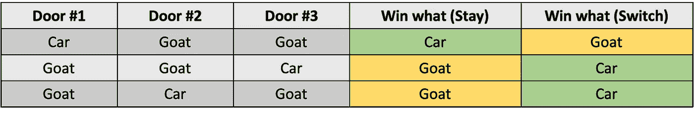

# 用 Python 解决 Monty Hall 问题

> 原文：<https://betterprogramming.pub/solving-the-monty-hall-problem-with-python-46d3f63eadc3>

## 通过考虑是否转换来增加你在三门问题上的获胜机会


特里·维里斯迪斯在 [Unsplash](https://unsplash.com?utm_source=medium&utm_medium=referral) 上的照片

# 蒙蒂·霍尔问题

蒙蒂霍尔问题是最著名的概率谜题之一。它是以美国电视游戏节目主持人蒙蒂·霍尔的名字命名的，该节目涉及以下问题。下面的描述是游戏最典型的设置，只是为了说明——实际的奖励可能会有所不同。

假设你可以选择打开一扇门，门后会有一个奖项。总共有三扇门:一扇门后是一辆汽车，另外两扇门后是山羊。在你从剩下的两扇门中选择一扇门后，主人会为你打开一扇门，门后有一只山羊。此时，系统会询问您是否要将初始选择切换到剩余的关闭的门。假设你的目标是最大化赢得汽车的机会。

# 令人困惑的部分和简单的解决方案

此时，你只剩下两扇门:一扇门有汽车，另一扇门有山羊。所以看起来这并不重要，你切换你的选择与否，因为当你从两个中选择一个时，有 50%的机会。然而，事实是，如果你切换到剩下的关闭的门，对你是有利的。为了说明这一点，让我们考虑下面的解决方案。首先，我们知道奖项的设置只有三种可能，如下所示。


位置的可能性

因为不同门之间的选择/切换场景是相同的，所以我们可以假设您总是选择 1 号门作为开始。有了这个固定的选择，我们就可以知道你是选择保持你的选择还是选择剩下的封闭选择。下图总结了可能的情况:



停留与转换的可能场景

如上图所示，如果你选择保持原来的选择，只有 1/3 的机会可以赢得汽车。相比之下，如果你改变选择，你有三分之二的机会赢得这辆车。因此，如果你真的在玩这个游戏，你肯定应该切换到关闭的车门，以增加你赢得汽车的机会。

# Python 代码模拟

上面的插图或多或少是一个直观的解决方案，列出了所有可能的场景。还有许多其他更数学的解决方案，你可以通过简单地在网上搜索蒙蒂霍尔问题找到它们。出于学习 Python 的目的，我们可以运行一个模拟实验，找出留/换车的赢车概率。因为这篇文章是关于教初学者学习 Python 的，所以我将重点讨论各个组件和最终工作版本的步骤。

请注意，我将包括额外的解释，这些解释是在我解决问题的过程中产生的，所以你可以看到我是如何处理这个问题的。另一件要注意的事情是，代码并不打算产生最简洁的解决方案。相反，我正试图使用可读的代码来解决这个我们大多数人都能理解的问题。

# **数据模型**

对于这个问题，关键数据包括门牌号、想要的奖励(汽车)、不想要的奖励(山羊)以及门后的奖励(汽车、山羊、山羊)。因此，我们从以下变量开始:

```
from random import shuffle, choicedoor_numbers = [1, 2, 3]
wanted_award = **"car"** unwanted_award = **"goat"** awards = [wanted_award, unwanted_award, unwanted_award]
```

*   来自`random`模块的`shuffle`和`choice`功能将用于游戏，这将在后面说明。
*   我使用一个`list`对象来存储奖励，因为我打算改变奖励的顺序(使用`shuffle`方法，你会看到)，这将允许我们在每次玩游戏时有一个随机的奖励顺序。
*   我使用两个变量来分别表示想要的和不想要的奖励，因为我们将在后面的代码中频繁使用它们，并且我们不希望多次直接编写字符串——使用变量不仅可以消除任何拼写错误，而且如果以后我们决定使用不同的奖励，还可以更容易地进行重构。

# **单人游戏**

为了使用模拟来计算概率，我们将不得不多次重复这个游戏，所以我们将首先建立我们如何玩这个游戏一次。以下功能是工作版本，有一些重要亮点:

天魔单人游戏

*   在一个游戏中，有两个因素会发生变化。第一，你会先挑哪扇门？第二，在主持人以不合意的奖项摔门之后，你会切换最初的选择吗？因此，我们的`monty_hall_trial`函数为这两个因素取两个参数。
*   第 2 行用于随机排列`awards`的顺序。洗牌后，我们将使用奖励和门编号来创建一个`dict`对象(即`doors`)来存储门奖励信息。
*   第 4-10 行用于删除没有所需奖励的门，并确定您可以切换到的门。因为我们想要操作这些项目，所以出于可变性的考虑，我们使用了一个`list`对象。
*   根据开关的决定，最终选择的门将是最初选择的门或保留的门(第 11 行)。
*   `monty_hall_trial`函数返回您是否赢得想要的奖励。此信息非常重要，因为我们将根据交换决策来计算获胜的次数。

# **模拟总结**

我们需要把这个游戏玩上千次，才能找出大概的概率。因此，我们将有以下函数:

*   `simulate_monty_hall`函数有两个参数:`trial_number`(试验次数)和`should_switch`(是否使用开关)。
*   `choice`功能从列表中随机选择一个门号码。
*   `won_car`是一个布尔值，通过指定`initial_pick`和`should_switch`来表示我们是否会赢得游戏。
*   在第 6 行中，`int`函数将把一个布尔值转换成一个整数。`True`被评估为 1，而`False`被评估为 0。因此，我们可以不断更新`winning_counts`来记录中奖次数。
*   在第 7 行，我们用获胜次数除以总尝试次数，计算出使用`should_switch`策略的游戏获胜概率。
*   第 8–10 行只是打印关键信息，告诉我们指定参数发生了什么。

如下图，你可以看到，当你一致切换我们的选择时，模拟显示你的中奖概率约为 67.55%，而如果你坚持最初的选择，你的中奖概率约为 33.08%。这些模拟结果与我们在上一节中的计算一致。

```
>>> simulate_monty_hall(10000, True)
Trial Times: 10000 times
Switching: True
Probability: 67.55%
>>> simulate_monty_hall(10000, False)
Trial Times: 10000 times
Switching: False
Probability: 33.08%
```

# 结论

在本文中，我们介绍了蒙蒂霍尔问题的背景及其简单的解决方法。然后，我们使用 Python 通过切换我们的初始选择或不切换来进行获胜概率的模拟分析。具体来说，我们首先回顾了所需的数据模型，并分析了运行单个试验(`monty_hall_trial`函数)和整个实验(`simulate_monty_hall`函数)所需的两个基本函数。

就像那句老话，罗马不是一天建成的——学习编码也是一个漫长的过程。通过解决这个看似微不足道的项目，你逐渐变得更擅长编码。

感谢你阅读这篇文章。