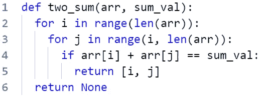
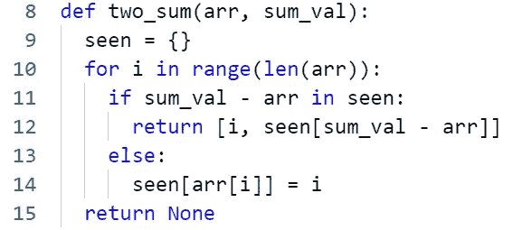
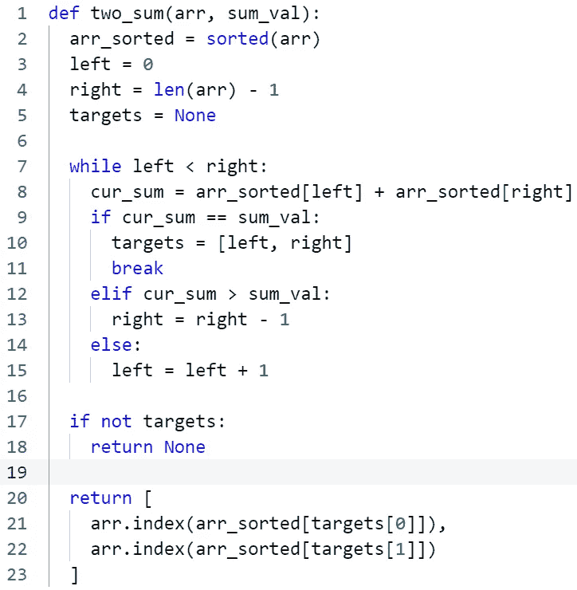

# 解决最常见的技术面试问题

> 原文：<https://betterprogramming.pub/solving-the-most-common-tech-interview-question-798a2e3d1db7>

## 示例 Python 代码的三种算法方法

查尔斯·🇵🇭在 [Unsplash](https://unsplash.com?utm_source=medium&utm_medium=referral) 上的照片

如果你在做技术面试，那么在某些时候你肯定会遇到[两个总和](https://leetcode.com/problems/two-sum/)的问题。

这是技术面试中最常见的算法问题之一。

# 问题陈述

给定一个整数数组，返回两个数的索引，使这两个数相加成为一个特定的目标数。

尽管这是一个看似简单的问题，但有多种方法可供选择，每种方法都有各自的优缺点。

理解这些方法并能够解释它们的不同之处向你的面试官表明你已经很好地掌握了 CS 的基础知识。

# 方法 1:简单的方法

第一种方法是最简单的，这可能是您最初解决问题的方法，而不需要花时间考虑优化。

您只需遍历所有可能的数字对，并返回第一对相加得到您想要的总和的数字。

这种方法在 O(n)时间和 O(1)空间中运行，其中 n 是`arr`的长度。

# 方法 2:时间优化

下一种方法通过使用额外的空间来改善时间复杂度。

首先初始化一个空 map，它将用于存储以前看到的元素及其索引。

然后，对于列表中的每个元素，您首先通过检查它是否在您的 map 的键集中来检查您以前是否见过`sum_val - current_element`。如果是这样，那么你已经找到了你想要的一对，因为`current_element + (sum_val - current_element) == sum_val`。

否则，将`current_element`添加到地图中，并继续下一个元素。

这种方法在 O(n)时间和 O(n)空间中运行。在映射是散列映射的情况下，我们假设映射查找是 O(1)运算。

这里，我们只访问每个数组元素一次，因为我们缓存了之前在地图中看到的元素及其索引。

# 方法 3:优化空间

最后一种方法在不使用额外空间的情况下改善了时间复杂度，但是仍然比方法 2 使用更多的时间。

在这个方法中，我们将首先对数组进行排序，并使用排序后的数组的属性来提高我们的时间复杂度，而不需要使用辅助空间。

为此，我们将使用双指针方法。我们在第一个元素开始一个指针，在最后一个元素开始第二个指针。然后我们检查由这些指针指向的两个元素的总和。

如果总和太高，则我们递减第二个指针，这减少总和，如果总和太低，则我们递增第一个指针，这增加总和。

我们只能使用这种方法，因为数组是排序的，所以我们可以保证数组是非递减的。

该方法在 O(n * log(n))时间和 O(1)空间中运行。这里假设我们使用一种运行时间为 O(n * log(n))时间，空间为 O(1)的排序方法，比如 heapsort。

注意，该方法运行时的主要因素来自于`sort`操作。之后只进行 O(n)次比较，因为指针每次移动 1，并且只移动到它们重叠为止。

这里，我们改进了简单解决方案的时间复杂度，而不需要像方法 2 那样使用额外的存储。我们能够利用数组被排序的事实来最小化我们必须进行的比较的数量。