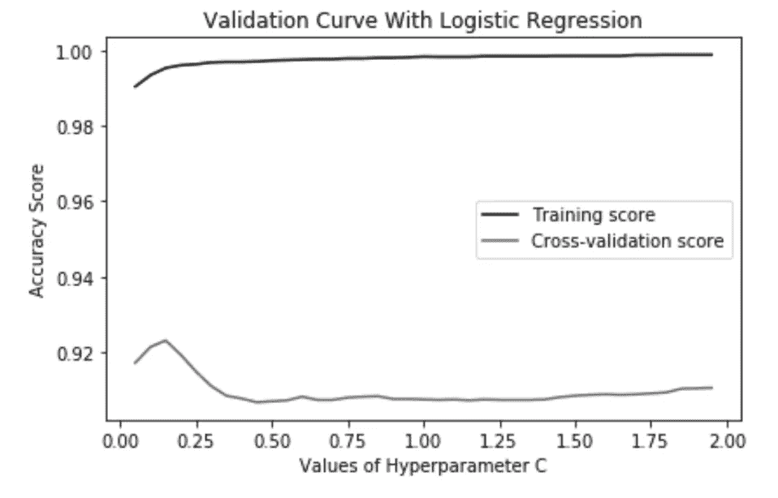
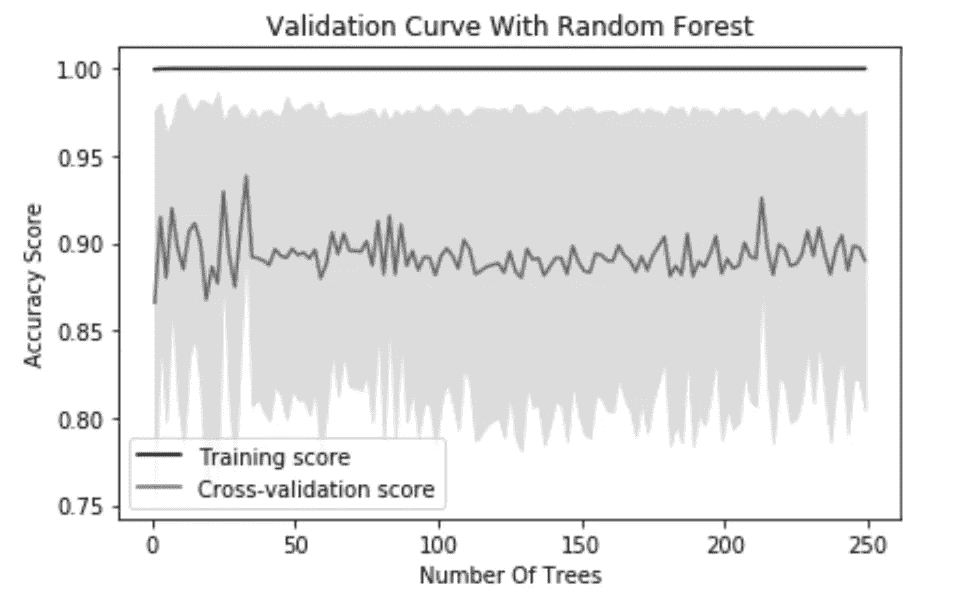
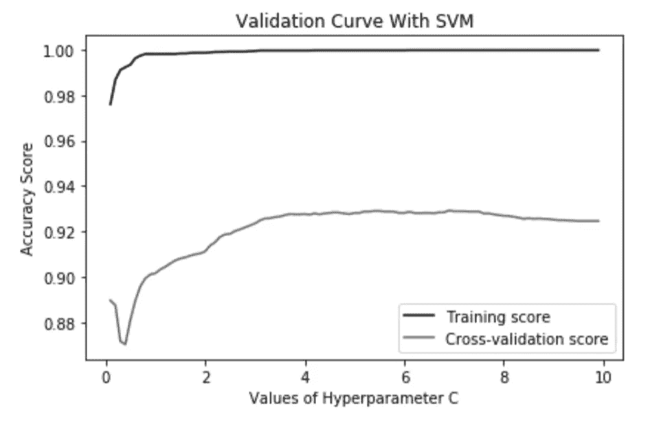

# 解开建模之谜

> 原文：<https://betterprogramming.pub/solving-the-mystery-of-modeling-a3279f50f7e>

## 使用 scikit-learn 选择分类模型


我是你的蜜蜂叶！

# 介绍

什么是选型，为什么要关心选型？假设你的老板要求你根据鲜花的特点将它们分为两类。你将这些数据放入一个基本的逻辑回归中，然后得出一个模型，这个模型对花卉的分类准确率为 70%。很好，对吧？至少比猜好？不对。想象一下，如果你把信用卡交易归类为欺诈或非欺诈，而不是花。或者一项测试是否能诊断出癌症。您可以看到，在这种情况下，70%的准确率肯定不够好，因为信用卡欺诈或癌症诊断可能未被发现。

这就是模型选择的作用。你不仅可以选择不同的分类方法(逻辑回归、随机森林、支持向量机、K 近邻等。)，这些方法中的每一种都有超参数，可以调整这些超参数来提高整体准确性并降低模型的误差。这篇文章解释了如何使用网格搜索、随机搜索和来自 scikit-learn in Python 的管道来轻松地比较和找到最适合您的数据的模型。系好安全带，准备好！

# **目标**

重申一下，这是我将在这篇文章中涉及的内容:

*   预处理数据
*   分类模型:逻辑回归，随机森林，kNN，SVM
*   超参数
*   网格搜索、随机搜索和管道
*   例子
*   关键术语

所有这些都将通过 Python 中的 [scikit-learn](https://scikit-learn.org/stable/) (sklearn)包来解释，它是您在任何类型的建模中最好的朋友。

# **预处理数据**

模型的好坏取决于传递给它的数据。如果有大量的缺失值，或者有大量的特性，那么很难轻松地构建一个模型。任何缺少的值都应该用 [**估算**](https://towardsdatascience.com/6-different-ways-to-compensate-for-missing-values-data-imputation-with-examples-6022d9ca0779) ，或者删除包含它们的行，这取决于您的目标。此外，执行**特征选择**也很重要，因为正确的特征选择对模型性能的影响比超参数调整要大得多。你可以在这里阅读我关于特性选择[的文章。](https://medium.com/@madelinemccombe/intro-to-feature-selection-methods-for-data-science-4cae2178a00a)

除了这两个概念之外，为了使用某些类型的模型，还必须进行一定的预处理。如果分类是基于特征之间的空间，那么必须对这些特征中的每一个进行缩放，以允许在特征之间进行相等的比较。特别地，支持向量机(SVM)和 k-最近邻(kNN)都是基于每个实例(行/示例)相对于其他实例的距离来分组或分类的。一个简单的方法是使用一个名为 [**标准缩放器**](https://scikit-learn.org/stable/modules/generated/sklearn.preprocessing.StandardScaler.html) 的函数，它会自动为你完成这项工作。

# **车型**

一旦数据准备就绪，下一步就是看你想尝试使用什么样的模型进行分类。我将在这篇文章中探讨的是**逻辑回归、随机森林、k-最近邻和支持向量机**。其他可能有用的类型有决策树、朴素贝叶斯和神经网络。在我今天将要介绍的四个模型中，每个模型都有一组独特的超参数，您必须定义这些参数，以便调整您的模型，使其最适合数据集。在下一节中，我将探讨每个模型都有哪些类型的超参数，它们是什么，以及对每个模型检查哪些类型的值是好的。

# **超参数**

**超参数**是为模型指定的调整措施。例如，在进行逻辑回归时，您可以在运行模型之前指定惩罚(L1 或 L2)以及该惩罚的相关值*。模型**参数**是*模型* *根据给定的超参数使*符合数据的值。比如，这是线性回归中的贝塔系数。本质上，超参数是您定义的东西，而参数是模型定义的东西。每种类型的模型都有自己独特的超参数集，并且通常基础函数都有这些超参数的默认值，因此检查文档(链接)非常重要。我们将在下一节讨论如何调优这些超参数。*

对于每个超参数，列出了您可能想要迭代的潜在值，以及什么是超参数的简要概述。在下一节中，我只列出了我的示例中使用的超参数，但是链接到每个模型类型的文档都有完整的列表。

[**逻辑回归**](https://scikit-learn.org/stable/modules/generated/sklearn.linear_model.LogisticRegression.html) **:**

*   *判罚* : ['L1 '，' L2']，L1 判罚指拉索，L2 判罚指山脊(默认' L2 ')
*   *C* : [0.001，0.1，…，10，100]，正则项的逆(默认为 1)
*   *解算器* : ['newton-cg '，' saga '，' sag '，' liblinear']，用于完成回归的不同类型的解算器，列出的四个*不使用*L1 惩罚，所以只有在不包括 L1 惩罚的情况下才使用它们(默认为' liblinear ')



基于 C 值的蘑菇数据对训练和交叉验证分数的影响

[**随机森林**](https://scikit-learn.org/stable/modules/generated/sklearn.ensemble.RandomForestClassifier.html) **:**

*   *n_estimators* : [100，120，300，500，800，1200]，要在林中使用的决策树数量(默认为 100)
*   *max_depth* : [5，8，15，25，30，无]，设置树的最大深度，以防止过度拟合(默认为无)
*   *min_samples_leaf* : [1，2，5，10，15，100]，在内部节点中进行拆分之前所需的最小样本数(默认为 2)
*   *max_leaf_nodes* : [1，2，5，10]，创建叶节点所需的最小样本数(默认为 1)



基于树数的蘑菇数据对训练和交叉验证分数的影响

[**【支持向量机(SVM)**](https://scikit-learn.org/stable/modules/generated/sklearn.svm.SVC.html) **:**

*   *C* : [0.001，0.01，10，100，1000…]，惩罚参数，较高的值降低误分类但增加过拟合(默认为 1)
*   *内核* : ['线性'，'多边形'，' rbf '，' sigmoid']，指定算法中使用的内核类型(默认为' rbf ')



基于 C 值的蘑菇数据对训练和交叉验证分数的影响

[**【kNN】**](https://scikit-learn.org/stable/modules/generated/sklearn.neighbors.KNeighborsClassifier.html)**:**

*   *n_neighbors* : [2，4，8，16]，创建算法时使用的邻居数量(默认为 5)
*   *p* : [1，2]，计算闵可夫斯基度规时的幂度规；1 是曼哈顿距离，2 是欧几里德距离(默认)
*   *算法* : ['auto '，' ball_tree '，' kd_tree '，' brute']，定义用于确定邻居的算法(默认为' auto ')

# **型号选择**

现在您已经了解了所有不同的模型及其对应的超参数，您可能想知道如何检查每种组合，以了解哪种组合最适合您的数据。别担心，使用 scikit 中的三个函数有一个超级简单的方法来做到这一点——学习:`[**GridSearchCV**](https://scikit-learn.org/stable/modules/generated/sklearn.model_selection.GridSearchCV.html)` **、** `[**RandomizedSearchCV**](https://scikit-learn.org/stable/modules/generated/sklearn.model_selection.RandomizedSearchCV.html)`和`[**Pipeline**](https://scikit-learn.org/stable/modules/generated/sklearn.pipeline.Pipeline.html)` **。**搜索函数中的 CV 代表**交叉验证**，在此详细解释[。在我的例子中，我将使用 5 重交叉验证来最小化计算时间，但是如果必要的话，可以调整到 10 重左右。](https://towardsdatascience.com/cross-validation-a-beginners-guide-5b8ca04962cd)

**网格搜索**将搜索模型内指定的超参数的所有可能组合，以找到最佳组合，而随机搜索将随机选择组合，并选择超参数的最佳随机组合。**随机搜索**将为您节省大量计算时间，因为它不会遍历每个组合，并且被证明仍然可以找到最佳模型。**管道**是一个将不同模型及其各自超参数的列表提供给网格或随机搜索的功能。通常，当您比较两种或多种不同的建模技术(例如逻辑、SVM 和随机森林)以及每个模型的不同超参数组合。可以指定这些函数的[评分标准](https://scikit-learn.org/stable/modules/model_evaluation.html#scoring-parameter),以便根据特定的标准选择超参数的组合，但不必定义来运行该函数。

# **例题**

下面是一些代码示例，使用了到目前为止涵盖的所有主题。我使用了一个蘑菇数据集，将不同的蘑菇分为有毒:1 或可食用:0，可以在 Kaggle 上找到[这里](https://www.kaggle.com/uciml/mushroom-classification/downloads/mushroom-classification.zip/1)。我做了初步的数据清理，你可以在这里找到，但主要要注意的是，我在模型中使用的最终特征包含在`features`变量中，每一行的分类在`target`变量中。

## 基本网格搜索

上面定义的函数展示了如何执行超参数网格搜索的基本格式(在本例中为**罚值**和 **C** )。一般来说，您确定要应用于数据的模型，创建一个参数字典，然后将这两个东西插入到`GridSearchCV`中。这为模型创建了超参数的所有组合的网格(在这种情况下，20 个超参数的组合有 5 个折叠，等于要运行的总共 100 个模型)。当您调用`gridsearch.fit(features, target)`时，组合网格将应用于数据，并选择具有最佳结果的模型。为了找到被确定为最佳的参数，您可以运行下面的代码:

```
# hyperparameter values for the best model
print(best_model.best_estimator_.get_params()) 
```

这个输出:*{****' C ':1.0****，' class_weight': None，' dual': False，' fit_intercept': True，' intercept_scaling': 1，' l1_ratio': None，' max_iter': 100，' multi_class': 'warn '，' n_jobs': None，****【penalty ':' L1 '****，' random_state': None，' solver': 'warn '，' tol ':' tol '请注意，打印输出中的超参数比函数中定义的要多得多。这是因为 scikit-learn 中的所有默认值都是特定于逻辑回归的。要获得 **C** 或**罚值**的值，可以在打印语句的末尾添加一个`['C']`或`['penalty']`。*

```
# mean accuracy of model
print(best_model.score(features, target))
```

您还可以使用上面的代码打印出最佳模型的精确度。在这种情况下，精确度为 0.9988921713441654。

## 基本随机搜索

上面的代码和前面的例子做了同样的事情，除了有一个`RandomizedSearchCV`。同样的代码可以用来打印出最好的模型参数和精度，我将在下面展示。在这种情况下，最佳模型有*‘C’= 0.9183088549193021*和*‘penalty’=‘L1’。*精度同上，为 0.9988921713441654。即使 C 稍作调整，精度仍然保持不变，这表明偶尔调整模型的超参数不会改变太多。

```
# print hyperparameter values
print(best_model.best_estimator_.get_params()['C'])
print(best_model.best_estimator_.get_params()['penalty'])
# accuracy
print(best_model.score(features, target))
```

## 管道网格搜索

下面是一个使用`GridSearchCV`中的管道比较多个模型的例子。因为我使用 SVM 作为我要考虑的模型之一，所以有一些额外的预处理步骤可以构建到管道中。这个过程有很多步骤，所以我将把代码分成几个部分。

首先，我定义函数并从它们各自的包中加载我需要的所有函数:

然后我做预处理步骤(缩放和 PCA)并创建一个管道:

然后我创建了一个`search_space`,这是一个包含所有模型及其超参数的字典列表:

最后，我在`pipe`和`search_space`上调用`GridSearchCV`，返回最佳模型:

这可能看起来很多，但一旦你理解了这一点，所有需要做的就是将这种方法应用到你想要比较的任何其他模型子集。获取最佳模型信息的方式与基本网格搜索和基本随机搜索完全相同(代码如下)。对于这个特定的集合，SVM 模型的表现最好，它具有*‘C’= 10*和*‘kernel’=*’*线性*。这给出了 1.0 的精度，这是非常高的，并且可能过拟合。

```
print(big.best_estimator_['classifier'])
print(big.score(features_final, target))
```

这种方法的一个缺点是需要大量的计算时间，但好处是它比单独运行每个模型需要更少的计算时间。

# **现在怎么办？**

下次你的老板说，‘这里有一些数据，给我找一个好的分类模型’，你知道从哪里开始！创建一个由两个模型技术和超参数组成的管道，把它插入到一个搜索函数中，让算法告诉你下一步去哪里找。不要忘记从预处理和特征选择开始。祝你好运！

# **关键术语**

**模型选择** —根据模型对训练数据的表现来选择模型

**模型评估** —根据模型对未来数据的表现(预测能力)选择模型

**输入** —填充数据中缺失的值

**特征选择** —选择特征子集以减少维度，并允许模型仅关注重要特征

**缩放** —对于 kNN 和 SVM 是强制性的；将要素缩放至 0 到 1 之间的值

**超参数** —数据科学家定义为模型的一部分(惩罚、正则化、估计量等)。)

**参数** —算法产生的代表模型的值(截距、系数、分割等)。)

**网格搜索** —搜索超参数和模型的每个组合，以找到最佳集合

**随机搜索** —搜索超参数和模型的一些组合，以找到最佳集合

**交叉验证** —将数据分成不同的测试和训练集 n 次，以在模型之间进行比较并模拟真实世界的数据。

**Pipeline** —不同模型和各自超参数的顺序列表，用于与搜索算法进行比较

我用于可视化和示例的代码可以在 GitHub 的[中找到；你可以随意使用和修改它！](https://github.com/madelinemccombe/LaunchDS/blob/master/Model_Selection_Medium.ipynb)