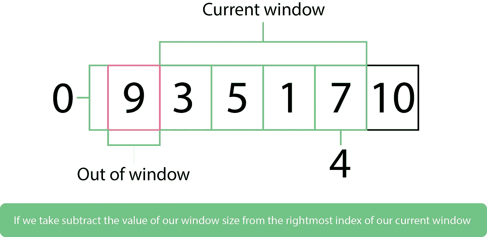

# O(n)时间内求解滑动最大窗口问题

> 原文：<https://betterprogramming.pub/solving-the-sliding-maximum-window-problem-with-o-n-b43ea3dd871f>

## 滑动最大窗口面试问题的最优解

由[瑞安·昆塔尔](https://unsplash.com/@ryanquintal?utm_source=unsplash&utm_medium=referral&utm_content=creditCopyText)在 [Unsplash](https://unsplash.com/search/photos/computer-queue?utm_source=unsplash&utm_medium=referral&utm_content=creditCopyText) 上拍摄的照片

你好，咖啡迷们！今天，我将带你解决我最喜欢的问题之一:滑动最大化窗口。

从表面上看，这可能看起来是一个相当简单的问题，事实上，使用暴力方法，你可以在几分钟内完成，或者如果你像我一样有很好的大脑和手指速度协调能力，几秒钟就可以完成。

一会儿我会给你看问题陈述——暂停阅读，如果你愿意，试着自己解决。提示:*A*[*Deque*](https://medium.com/@oluwadamilareo_/implementing-a-deque-in-ruby-cf6e9bfd9c3c)*是你的最佳赌注*。

如果您需要复习或帮助实现，请查看这个关于 Deques 的教程。

# 问题陈述

对于数组中的每 k 个连续数字，打印最大的数字。这个挑战很容易蛮干，但是要努力找到最优解。

*   简单的解决方案:O(nk)
*   更好的解决方案:O(n log k)
*   最优解:O(n)

# 例子

以下是您可以针对您的解决方案运行的一些示例测试案例:

`sliding_maximum(3, [1, 3, 5, 7, 9, 2])`
# # =>【5，7，9，9】

`sliding_maximum(4, [9, 3, 5, 1, 7, 10])`
# # # =>【9，7，10】

很简单，对吧？这里有一个大多数人在几秒钟内就能找到解决方案的例子:

强力解决方案

如果您有一个小的数据集，并且不太关心时间复杂性，这可能看起来没问题。事实上，就时间复杂性而言，这个解决方案是蝙蝠侠中的小丑:让它走，它会回来咬你的屁股，因为它给你 O(nk)。

关于这篇文章的原因。

这个问题花了我将近 12 个小时来解决，但这 12 个小时是值得的，因为我获得的新知识为我如何看待这些天的问题打开了许多精神之门。

首先，我们把问题分解一下，想想第一块。我们需要找到一种方法来跟踪特定窗口中的最大值，同时跟踪当前窗口中下一个窗口的潜在最大值。没关系——如果你感到困惑，可以再读一遍。

考虑到这一点，我们开始明白为什么需要 deque 了——可以在数据集的后面或前面执行 O(1)运算。

让我们通过将我们的功能分成三个部分来解决基本问题:

*   初始化队列和结果向量
*   遍历数组的循环
*   返回结果

将滑动最大值函数分为三个主要部分:

*如果你需要帮助设置你的 deques 类，请看看我之前的关于 deques 的教程***。**

*接下来，我们需要一个循环来遍历数组。在这种情况下，for 循环是我最喜欢的，但是一定要尝试你最喜欢的循环。*

*现在真正的乐趣开始了！*

*除了我称为外部声明的函数定义之外，我们从这一点开始写的所有东西都应该放在循环的内部。*

*我们要考虑的第一件事是在我们的 deque 中添加一个元素(如果它是空的),这样我们就可以与第一个窗口中的元素进行比较。我们将数组中的第一个元素添加到队列中，因为队列是空的:*

*这只是一个简单的一行程序，用于在我们第一次进入循环时将第一个元素推入 deque。*

*注意:`is_empty?`是 deque 类中的一个方法。查看本[教程](https://medium.com/@oluwadamilareo_/implementing-a-deque-in-ruby-cf6e9bfd9c3c)了解更多信息。*

*接下来，我们希望将当前最大值与给定窗口中的所有其他数字进行比较，因此我们首先需要获得最大值。*

*我还声明了一个外部的`get_max`函数。让我们看看它能做什么。*

*它返回队列前面的元素(前面的元素总是给定窗口的最大值)。*

*现在，对于窗口中的后续数字，我们将它们与当前的最大数字(存储在 max 变量中的数字)进行比较。如果当前的最大值小于我们得到的值，我们删除旧的最大值并将当前值设置为最大值。*

*让我们细分一下`set_max`的方法:*

*它将双队列和最大值作为参数，并将最大值推到双队列的前面。*

*我们来看看`remove_max`是做什么的。它将 deque 作为参数，并弹出前端(*删除第一个元素，这是我们的 max* ):*

*我们可能还需要考虑其他一些事情。如果当前窗口中的下一个窗口有潜在的最大数量，会发生什么？目前，如果它小于我们当前窗口中的最大值，我们的算法将跳过它，但我们不能让它溜走-这可能是我们的下一个赢家！*

*让我们把这些潜在的赢家放在队列的后面:*

*最后，我们可能想问“如果我们把一个窗口的最大值带到下一个窗口会怎么样？”我们的算法可以将我们结转的值计算为下一个最大值，我们真的不能责怪它，因为算法的智能取决于编写它的人。*

*我们希望防止这种情况，并使我们的算法更加智能。第一件事是决定如何发现一个元素是否在窗口之外。请看下图对此的解释:*

**

*我们已经确定了超出界限的元素，下一步是将它从我们的队列的最大位置中移除。我们的方法是这项工作的极客。*

**注意:记得在检查潜在最大值的代码块之前添加这个代码片段**

*现在，我们可以得到新的最大值。如果我们的索引大于或等于当前窗口，我们可以说这是给定窗口的最大值，然后将其附加到结果向量中。*

## *感谢你的到来！*

*这里有一个[链接指向本教程](https://github.com/Oluwadamilareolusakin/sliding-maximum-window-with-deque)的代码。*