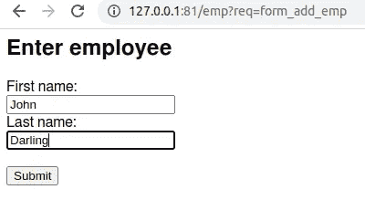
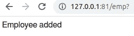
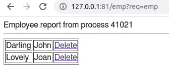

# 如何使用 C 解决 Web 应用程序问题

> 原文：<https://betterprogramming.pub/solving-web-application-issues-in-c-the-greenest-programming-language-be395851a9f1>

## 利用最环保的编程语言的力量


封面图片版权 2022 Sergio Mijatovic(作者)

尽管世界上大量的 web 基础设施都是用 C 语言编写的，但大多数人并不认为 C 语言可以编写 web 应用程序。这是可以理解的，因为 C 缺乏易于使用的 web 和数据库结构，不能直接连接到 web 服务器，还有安全问题，等等。

然而，c 是[世界上最绿色的编程语言](https://medium.com/codex/what-are-the-greenest-programming-languages-e738774b1957?ref=hackernoon.com)，如果我们想[帮助环境](https://medium.com/@velydev/writing-green-software-is-our-code-unfriendly-to-environment-3cd1b4249cf5)，这是很重要的。如果你想要最好的性能，使用 C 语言当然没有坏处。

本文将展示如何利用 C 的强大功能并解决上述问题。

# 什么是 vly？

vly 是一个面向 C 开发人员的通用框架。使用 vly 创建的应用程序是本地的，没有解释器或字节码方案。更多信息见`vely.dev`。

# 我们将构建的应用程序

您将编写一个维护员工列表的人力资源(HR) web 应用程序。它很简单，没有太多花哨的东西，但足以让您开始使用。你也不希望一个旨在学习的教程充斥着各种你可以轻松添加的东西。这里的目的是学习基础知识。

为此，有三个部分。首先是增加员工。第二个是显示雇员名单。第三个是能够从列表中删除员工。

开始之前:

1.  安装 vly。你可以使用像 apt，dnf，zypper 或者 pacman 这样的标准打包程序。前往[https://vely.dev/pkg/](https://vely.dev/pkg/)安装 vly。您总是可以用同一个打包程序将其删除，
2.  为您的项目创建一个目录，您可以随意命名。这里所做的一切都应该在那个目录中完成，
3.  确保您已经安装了 MariaDB 和 Nginx，因为这里使用了它们。

# 应用程序截图

以下是应用程序的快照。这是最终的结果。

添加员工的 Web 表单:



添加员工的结果:



列出员工:



你也可以删除一个员工，之后它将不再出现在列表中。

# 它是如何工作的

在本文中，您将为应用程序创建源代码文件。这些文件的扩展名为`.vely`。

这些文件中的源代码是 C 语言，其中包含 Vely 语句。每条语句都会生成一定的 C 代码，所以最终结果总是 C，这就是 Vely 的工作方式。

构成框架的一部分是请求处理——一个简单的调度程序为全面的标准 HTTP 请求处理提供了基础。还有一个自动内存垃圾收集器，这对于长时间运行的进程(如 web 应用程序守护进程)很有用。

底线是，vly 代码将把自己变成纯 C 语言，然后编译成本地应用程序。

# SQL 使用简介

首先，我将谈谈数据库的使用，因为它是数据库驱动的 web 应用程序的基础。

vly 目前支持 MariaDB/MySQL、PostgreSQL 和 SQLite 数据库。它们的界面都是一样的。例如，要查询 employee 表并显示找到的姓名列表，下面是 vly 代码:

```
run-query @db = \
    "select firstName, lastName from employee where employeeID='%s'" \
    output firstName, lastName \
    : empid

    @Employee is <<query-result  firstName>> <<query-result  lastName>>
end-query
```

在编写 vly 代码时，需要记住以下几点:

*   **行延续—** 注意反斜杠(`\`)的用法，它和 C 中一样，表示行延续。所以前 3 行代码是一条语句。
*   **输出数据—** 要向 web 客户端(如浏览器)或标准输出显示数据，使用 output 语句，即行首的`@`。
*   **数据库配置—** 数据库用`@`子句指定，这里是`@db`。这是保存本机数据库连接信息的文件。每个数据库都有自己的；在这种情况下，您使用的是 MariaDB(或 MySQL)，因此文件`db`可能包含以下内容:

```
[client]  
user=user_name 
password=password     
database=database_name     
socket=/run/mysqld/mysqld.sock
```

你可以阅读更多关于为 MariaDB/MySQL 编写连接字符串信息的[细节](https://mariadb.com/kb/en/configuring-mariadb-connectorc-with-option-files/?ref=hackernoon.com#options)。Vely 使用本地数据库连接来提高性能，连接细节也是本地的。这涵盖了你在 C 语言中使用 vly 查询数据库所需的大部分内容。

*   **数据库查询—** 要运行查询，使用`run-query`语句。通常，它陈述所使用的数据库(使用`@`子句)、查询本身以及输出列的列表(使用`output`子句)。您在`:`子句后为 SQL 语句提供输入参数。
*   **查询结果—** 要显示查询结果集中的列数据，使用`query-result`语句。当在输出中使用时，就像这里的情况一样，您可以将它放在`<<`和`>>`中——这是内联代码。
*   **查询循环—** 如果您想要循环查询的结果集，请使用`end-query`语句标记该循环的结束，如上所示。

# 步骤 1:入门—数据库

首先，您将创建这里使用的数据库和雇员表。这个例子中的 SQL 很简单，所以您可以使用任何您想要的数据库供应商。不过这里使用的是 MariaDB。创建 employee 表的 SQL 如下。将此保存到`setup.sql`文件:

```
create table if not exists employee (
    firstName varchar(50),
    lastName varchar(50),
    employeeID integer primary key auto_increment);
```

以 root 用户(数据库管理员)的身份登录 mysql 实用程序，并执行以下操作来创建数据库、用户和员工表:

```
create database if not exists emp;
create user if not exists appuser identified by 'my_password';
grant create,alter,drop,select,insert,delete,update 
    on emp.* to appuser;
use emp;
source setup.sql;
exit
```

最后，vly 需要知道你的数据库在哪里。创建数据库配置文件`db`(这是在`run-query`语句中使用的名称)。将此复制到文件`db`:

```
[client]
user=appuser
password=my_password
database=emp
protocol=TCP
host=127.0.0.1
port=3306
```

注意`appuser`和`emp`数据库(以及密码)与您在 mysql 实用程序中执行的创建 sql 相同。

# 第二步:源代码

这是源代码。按照说明将代码复制并粘贴到文件中。

## **列出员工(查询一张表)**

这将显示雇员表中的雇员列表。只是为了说明任何 C 代码的用法，(因为这里的大部分代码都是 Vely 语句)，我添加了 C 代码来找出进程 ID (PID)并显示它。将此保存到`emp.vely`文件:

```
#include "vely.h"

void emp()
{
    out-header default
    @<!DOCTYPE html>
    @<html>
    @<head><title>Vely example</title></head>
    @<body>
    pid_t pid = getpid(); // get current process ID

    @Employee report from process <<pf-out "%d", pid>>
    @<hr/>
    @<table border="1">
    run-query @db = \
        "select firstName, lastName, employeeID from employee" \
        output firstName, lastName, employeeID
        @<tr>
            @<td> <<query-result lastName>> </td>
            @<td> <<query-result firstName>> </td>
            @<td> \
                <a href="?req=del_emp\
                    &employee_id=<<query-result employeeID>>">\
                    Delete\
                </a> </td>
        @</tr>
    end-query
    @</table>
    @</body>
    @</html>
 }
```

如您所见，输出语句`@`被大量使用。它输出同一行后面的任何文本。由于同一个 Vely 程序可以作为 web 应用程序和命令行程序，因此输出的目的地取决于您如何使用它。如果是一个 web 应用程序，则输出到 web 客户端，即浏览器。如果它是一个命令行程序，输出将转到标准输出，即`stdout`。

输出数据时，内联代码通常用作输出的一部分。内联代码写在`<<`和`>>`之间，通常调用一个输出某些东西的 Vely 语句。在这个例子中，`query-result`输出查询结果集的列值。

请注意，您可以通过单击“删除”链接来删除员工记录。该链接回调您的应用程序，并根据嵌入在删除链接中的`employeeID`指定要删除的员工记录。

所有的 vly 请求必须有一个`req`输入参数，指定哪个`.vely`文件将处理该请求。所以当用户点击链接时，`del_emp.vely`中的代码将会运行。这就来了。

## **添加一名员工(插入到表中)**

为了将数据插入到雇员表中，将提供雇员的名字和姓氏作为输入参数。在 Vely 框架中，使用`input-param`语句很容易获得这些信息。然后，INSERT SQL 将使用`run-query`插入数据，它使用`no-loop`子句说明没有结果集循环(即这不是一个选择查询)，并使用`affected-rows`获得实际插入的行数。最后，您将检查是否按预期插入了一行，并通知用户。将此代码保存到`add_emp.vely`文件中:

```
#include "vely.h"

void add_emp() {
    out-header default
    input-param first_name
    input-param last_name
    run-query @db = \
        "insert into employee (firstName, lastName) \
            values ('%s', '%s')" \
        : first_name, last_name \
        no-loop \
        affected-rows define aff_rows
    if (aff_rows != 1) {
        @Could not add employee!
        exit-request
    }
    @Employee added
}
```

**添加员工的 Web 表单**

为了添加员工，您需要一个 web 表单来输入他们，然后作为输入参数发送给`add_emp.vely`进行处理。下面是一个简单的表单——注意在`<form>`元素中使用`?`作为动作属性。这意味着:使用与这里相同的 URL 路径，然后从表单的输入字段添加 URL 查询字符串。请注意隐藏字段`req`，这是一个强制字段，Vely 需要它来路由 HTTP 请求——不出所料，它包含了`add_emp`。将此保存到`form_add_emp.vely`文件:

```
#include "vely.h"

void form_add_emp() {
    out-header default
    @<h2>Enter employee</h2>
    @<form action="?" method="POST">
    @    <input type="hidden" name="req" value="add_emp">
    @    <label for="first_name">First name:</label><br>
    @    <input type="text" name="first_name" value=""><br>
    @    <label for="last_name">Last name:</label><br>
    @    <input type="text" name="last_name" value=""><br><br>
    @    <input type="submit" value="Submit">
    @ </form>
}
```

## **删除一个员工(从表中删除)**

删除员工记录将获得员工 ID，并发出 DELETE SQL 语句。注意`:`子句的使用，它允许您指定 SQL 输入参数，在本例中`employee_id`将被删除。将此保存到`del_emp.vely`文件:

```
#include "vely.h"

void del_emp() {
    out-header default
    input-param employee_id
    run-query @db = \
        "delete from employee where employeeID='%s'" : employee_id \
        no-loop \
        affected-rows define aff_rows
    if (aff_rows == 1) {
        @Employee record deleted.
    } else {
        @Could not delete an employee record.
    }
}
```

# 步骤 3:创建应用程序

要创建 Vely 应用程序，请执行以下操作:

```
sudo vf -i -u $(whoami) emp
```

`-i`表示创建一个虚拟应用程序，`-u`表示它的所有者将是当前用户，`emp`是应用程序名称。

这将创建目录`/var/lib/vv/emp`，这是您的项目的应用程序目录(参见[如何工作](https://vely.dev/how_vely_works.html))。您已经对它进行了初始化并设置了权限，允许当前用户使用该目录，而其他用户不能访问它。

# 第四步:申请

您的项目中现在有以下文件:`emp.vely`、`form_add_emp.vely`、`add_emp.vely`、`del_emp.vely`和`db`。Vely 的 [vv 实用程序](https://vely.dev/vv.html)会把它们做成一个应用程序——它会自动找到这些文件，为你生成一个合适的 Makefile，并链接到必要的库中。

您可以使用`vv`进行申请:

```
vv -q --db=mariadb:db
```

表示您正在申请。`--db`表示您正在使用 MariaDB 数据库，数据库配置文件在文件`db`中。

注意，您可以在您的应用程序中使用多个数据库，也可以使用来自不同供应商的数据库。

# 步骤 5:运行应用程序

您将把应用程序作为 FastCGI 应用服务器运行。您的应用服务器运行在 web 服务器(在本例中是 Nginx)的后面，它充当一个`reverse-proxy`。许多持久和并发的服务器进程将为传入的请求提供服务。这些进程并不退出，而是并行工作。此外，最终用户无法直接访问它们。

要启动您的应用程序:

```
vf -w 5 emp
```

这将启动 5 个并发进程。阅读关于 [vf — Vely 的 FastCGI 进程管理器](https://vely.dev/vf.html)的更多信息，了解如何微调性能，包括设置一个动态进程加载器，根据实际运行时负载改变运行的进程数量。

# 步骤 6:为 FastCGI 设置 Nginx

最后一步是设置一个 web 服务器，在本例中是 Nginx。编辑 Nginx 配置文件——对于 Ubuntu 和类似的 Linux 发行版:

```
sudo vi /etc/nginx/sites-enabled/default
```

对于 Fedora，像 RedHat 一样:

```
sudo vi /etc/nginx/nginx.conf
```

在`server {}`部分增加以下内容:

```
location /emp { include /etc/nginx/fastcgi_params; fastcgi_pass unix:///var/lib/vv/emp/sock/sock; }
```

重新启动 Nginx 以使更改生效:

```
sudo systemctl restart nginx
```

您在这里所做的是将 URL 路径`/emp`与 Nginx 和您的应用服务器之间的超快速 Unix 套接字连接连接起来。这种方式的 URL 类似于:

```
http://<your web server>/emp?req=add_emp&first_name=Joe&last_name=Darling
```

将调用文件`add_emp.vely`中的函数`add_emp()`，并将名字和姓氏作为输入参数。

现在，您已经有了一个可以使用的功能应用程序。下面描述了使用它的各种方法。

# 使用 web 浏览器中的应用程序

以下 URL 是应用程序的接口。使用两者来运行它。首先是添加一名员工:

```
http://<your web server>/emp?req=form_add_emp
```

这个是列出员工

```
http://<your web server>/emp?req=emp
```

当然，用“127.0.0.1”回送地址(如果您在本地测试)或 web 服务器的完全限定名称或 IP 地址替换“<your web="" server="">”。</your>

请注意以下事实:

1.  URL 路径是您的应用程序的名称— `/emp`在本例中，因为这是您用 Nginx 设置它的方式，
2.  `req`参数总是处理它的请求源文件的基本名称。例如，URL 中的`req=form_add_emp`意味着`form_add_emp.vely`中的代码将处理请求，
3.  其他任何参数你都可以自由选择。

请注意，如果您没有 web 服务器，并且仍然希望使用您的应用程序服务器，那么您可以使用 vey 安装中包含的 FastCGI 客户端在命令行上直接联系它(从而绕过 web 服务器)。在这种情况下，您会要求您的应用程序服务器列出雇员记录:

```
export REQUEST_METHOD=GET
export SCRIPT_NAME="/emp"
export PATH_INFO=""
export QUERY_STRING='req=emp'
cgi-fcgi -connect /var/lib/vv/emp/sock/sock /
```

# 命令行用法

每个虚拟应用程序都可以作为 web 应用程序或命令行程序运行。它们都使用 HTTP 作为协议，使得以各种不同的方式开发、测试、维护和使用应用程序变得容易。

请注意，如果您计划从命令行单独运行您的应用程序，您不需要应用程序服务器，因此在这种情况下，您不需要 web 服务器设置，也不需要使用 vf process manager 启动应用程序服务器。简单多了。

要从命令行运行应用程序，请在命令行上提供输入参数并运行程序。例如添加一个员工，提供`REQUEST_METHOD`环境变量(如`GET`)和`QUERY_STRING`(设置为 URL 来添加一个员工)，调用程序:

```
export REQUEST_METHOD=GET
export SCRIPT_NAME="/emp"
export PATH_INFO=""
export QUERY_STRING='req=add_emp&first_name=Joe&last_name=Darling'
/var/lib/vv/bld/emp/emp
```

结果是:

```
Content-type: text/html;charset=utf-8
Cache-Control: max-age=0, no-cache
Pragma: no-cache
Status: 200 OK

Employee added
```

如果您计划将结果保存在一个文件中(例如缓存应用程序输出)，您可以通过以下方式从输出中省略 HTTP 头:

```
export VV_SILENT_HEADER=yes
```

# 结论

在本教程中，您学习了如何使用 vly 创建一个全功能的数据库驱动的 web 应用程序，它使用 MariaDB/MySQL 作为数据库，使用 Nginx 作为反向代理 web 服务器。

例如，您可以使用 PostgreSQL 和 Apache，这将非常相似。

您还学习了如何以不同的方式运行您的应用程序:作为应用程序服务器或从命令行运行。输出和行为完全相同，这对部署和自动化应用程序测试都很有用。