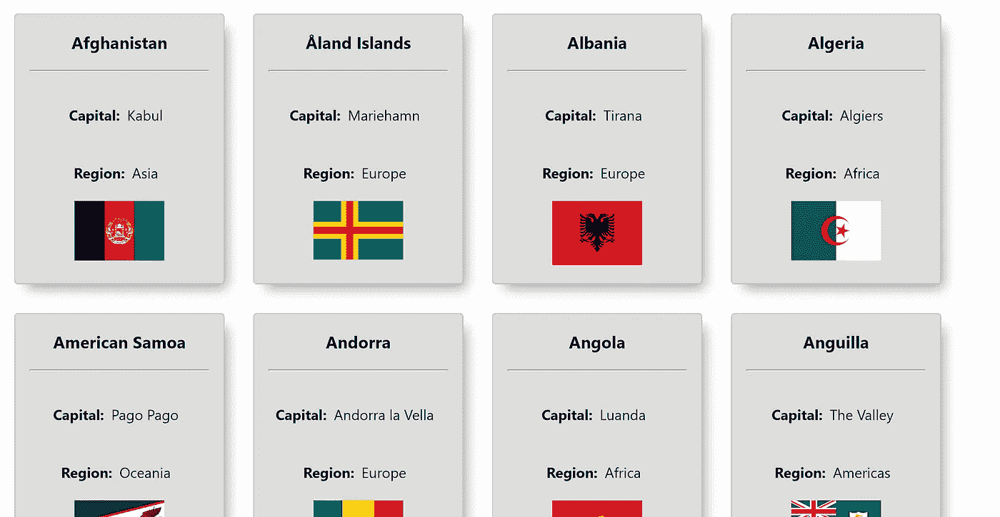

# 用钩子构建 React 应用程序的一些最佳实践

> 原文：<https://betterprogramming.pub/some-best-practices-for-building-a-react-app-with-hooks-d6157494f5c1>

## 从头开始构建应用程序时，要记住一些方便的提示


照片由[hello queue](https://unsplash.com/@helloquence?utm_source=medium&utm_medium=referral)在 [Unsplash](https://unsplash.com?utm_source=medium&utm_medium=referral) 上拍摄

对于开发人员来说，没有什么比使用 create-react-app 构建一个简单的 React 应用程序更容易的了。所以为什么要把宝贵的时间投入到这一块呢？

嗯，因为很多时候不是关于*构建什么*而是*如何*以正确的方式构建它。你可以有一个突破性的想法来吸引人群，但是如果你搞砸了项目的基础，就很难挽救它。

# 最佳实践

我想向您展示在 2020 年使用 React 版本 16.8 及更高版本构建应用程序时您应该遵守的几个最佳实践。这个版本的出名主要是因为钩子，它是 web 开发中真正的游戏规则改变者，在社区中被广泛讨论。

在这一部分中，我们将构建一个简单的应用程序，展示世界上每个国家的特征。我们将使用 [REST 国家 API](https://restcountries.eu/) 来展示良好实践，包括:

*   正确的文件夹结构
*   带 async/await 的异步代码
*   try/catch 块的基本错误处理
*   React 挂钩的使用

**注**:我不打算把重点放在造型上，因为这不重要。但是你可以自由地自己设计和探索 CSS。

这里有一个完整的 GitHub 回购你可以马上看一下或者叉一下。

好的。说够了。让我们进入正题。

# 初始设置

我将把我们的项目命名为`react-tips`。首先，打开您的终端，使用 create-react-app 和以下命令安装启动包:

```
npx create-react-app react-tips
```

注意，我用的是`npx`而不是`npm`。

这两个命令的区别在于`npx`将安装最新的可用包。为了正确安装它，你应该用`npm uninstall -g create-react-app`卸载你之前版本的 create-react-app(如果你有的话)。

## 关于文件夹结构的决定

你应该在每个项目的开始都考虑这个话题。相信我——在项目的高级阶段，移动、重命名和对文件夹结构的一般重构是一场噩梦。尤其是当你在一个为项目的其他部分做出贡献的团队中工作的时候。

首先在`src`中新建两个文件夹，命名为`components`和`calls`。我们需要将文件分离到适当的文件夹中，以便保留逻辑结构和主要原则之一— *关注点分离*。

这个原则基本上是指将应用程序分成不同的部分，每个部分处理一组对代码有影响的特定信息。

花更多时间在文件夹结构上的另一个原因是项目可能会扩展，或者将来可能会有新的团队成员加入。然而，这个项目管理起来会容易得多。

在`components`文件夹中，我们将保存我们将要创建的所有 React 组件。然而，`calls`文件夹服务于我们对 API 的所有异步请求。

我们的结构看起来是这样的:

```
> /public
> /src
  -> /calls
  -> /components
  -> App.js
  -> App.css
  -> index.js
> package.json
> package-lock.json
```

您还可以创建另一个名为`stylesheets`的文件夹来保存 CSS 文件，以便分别设计每个组件的样式。

不过，我更喜欢的方法是将 CSS 文件存储在与相关组件相同的文件夹中。这个决定只取决于你或你的开发团队。

# 编码时间

首先，我们将创建一个对 API 的请求。在`calls`文件夹中新建一个文件，命名为`countries.js`。

在这个文件中，让我们创建一个函数来获取所有国家的必要数据:

这里有一些你应该注意的亮点:

*   我们实现了 ES 2017 (ES8)中引入的 [async/await、](https://javascript.info/async-await)，而不是使用 promises 的传统方法，我认为这是一种更具可读性的方法。请记住，这种方法也是基于承诺。
*   我们使用 [try/catch](https://developer.mozilla.org/en-US/docs/Web/JavaScript/Reference/Statements/try...catch) 块来更好地处理错误。这意味着如果在`try` 块中抛出异常，剩余的代码被跳过，控制权立即转移到`catch` 块。另一方面，如果`try` 块被无任何异常地执行，则`catch` 块被跳过。
*   我决定使用 [Fetch API](https://developer.mozilla.org/en-US/docs/Web/API/Fetch_API/Using_Fetch) 来请求数据，尽管您也可以考虑其他一些替代方法( [AJAX](https://www.w3schools.com/js/js_ajax_http_send.asp) *、* [axios、](https://github.com/axios/axios)等)。).

# 反应组分

既然我们已经调用了 API，我们现在可以开始处理 React 组件了。准备我们的`App.js`是很常见的，它位于组件树的顶部(也称为*主父组件*)。

这是它在我们的应用程序中的样子:

如上图所示，它目前只包装了一个组件— `<CountriesContainer />`。理论上，如果我们想要实现广泛使用的 [React Router](https://reacttraining.com/react-router/web/guides/quick-start) ，所有的路由都将在这个组件中传递，我们的文件夹结构也将相应地进行调整。

现在，让我们在`components`文件夹中创建我们的`CountriesContainer`。

## CountriesContainer 组件

有几件事你应该注意:

*   对于功能组件中的状态管理，我们使用了`useState`钩子。这个钩子替代了基于类的组件中的`setState`。请随意阅读关于状态挂钩的[文档。](https://reactjs.org/docs/hooks-state.html)
*   我们使用`Array.map()`从 state 返回一个国家列表
*   每个物品(国家)都作为道具传递给`<CountryCard />`(我们还没有创建它)
*   每个项目都有一个关键道具，必须是唯一的。不建议使用索引作为关键字。
*   为了正确定位卡片，我使用 flexbox(查看 [CountriesContainer.css](https://github.com/Dromediansk/countries-app-blog/blob/master/src/components/CountriesContainer.css) )

## 使用效果挂钩

在这个组件中，我们仍然缺少的惟一东西是对 API 的请求和将数据传递给`countries`。

取数据建议在 [useEffect](https://reactjs.org/docs/hooks-effect.html) 钩子中执行。

*   为了正确地写它，我们还需要检查组件是否仍然被安装。因此，我们首先声明一个新变量`componentIsMounted`(第 2 行)。它使用 [useRef 钩子](https://reactjs.org/docs/hooks-reference.html#useref)，返回一个可变的引用对象，其`.current`属性被初始化为传递的参数(`initialValue`)。
*   在`useEffect`中，我们调用我们之前创建的`getAllCountries`函数
*   因为这是一个异步操作，我们需要检查组件是否仍然被挂载。否则，它可能会抛出一个错误，即您不能在卸载的组件上设置状态。
*   如果它被装载，我们将得到一个带有数据的响应，然后我们将使用`setCountries`把它传递到`countries`状态
*   如果错误发生在异步调用期间，也有必要处理这些错误。在我们的例子中，我们只将错误记录到控制台，但是向用户显示出错的消息是一个好习惯。
*   `useEffect`有一个你应该知道的特殊语法。在第 14 行，我们有一个清理函数，在这个函数中，我们将这个组件设置为卸载。这相当于基于类的组件中的`componentWillUnmount`。
*   还要注意第 17 行，这里我们有一个空数组作为第二个参数——这意味着这个`useEffect`将在呈现组件后只执行一次。它相当于基于类的组件中的`componentDidMount`。

## 国家卡组件

现在，当我们有了包装器组件，我们将在`<CountryCard />`中构建我们的子组件。

这个组件是一个虚拟组件，它显示内容——这是它唯一的目的。请记住，所有逻辑操作都是在包装器组件中完成的。

*   该组件显示国家的名称、首都、地区和国旗。
*   随意复制 CountryCard.css 中的[样式。](https://github.com/Dromediansk/countries-app-blog/blob/master/src/components/CountryCard.css)

# 决赛成绩

现在你知道了！我们已经使用我相信你在日常实践中可能遇到的良好实践完成了我们的应用程序。

以下是我们应用外观的概述:



这里有一个完整的 GitHub repo 你可以下载。

最棒的是，这个应用程序有许多方法来扩展它(例如，过滤器，惰性加载，颜色主题等)。)，而且可以作为一个不错的训练场。

你可以继续阅读本续集的第二部分:

[](https://medium.com/better-programming/best-practices-for-handling-a-form-with-multiple-inputs-using-react-hooks-a0abf9207284) [## 使用 React 钩子处理多输入表单的最佳实践

### 用优雅的解决方案构建高级滤波器

medium.com](https://medium.com/better-programming/best-practices-for-handling-a-form-with-multiple-inputs-using-react-hooks-a0abf9207284) 

还是想建立自己的博客网站？你可以很容易地对盖茨比做到这一点:

[](https://levelup.gitconnected.com/learn-gatsby-by-building-your-own-blog-website-ff5aaa8e90b8) [## 通过建立自己的博客网站来学习盖茨比

### 静态渲染方法介绍。

levelup.gitconnected.com](https://levelup.gitconnected.com/learn-gatsby-by-building-your-own-blog-website-ff5aaa8e90b8) 

感谢阅读！